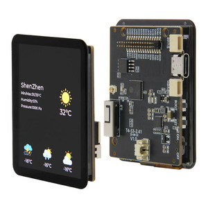

cst226 Touch Screen Controller
===============================

.. seo::
    :description: Instructions for setting up cst226 touch screen controller with ESPHome
    :image: t4-s3.jpg
    :keywords: cst226, T4-S3

The ``cst226`` touchscreen platform allows using the touch screen controllers based on the cst226 chip with ESPHome.
The :ref:`I²C <i2c>` is required to be set up in your configuration for this touchscreen to work.

This controller is used in the Lilygo T4-S3 AMOLED Display.

    cst226 touchscreen on Lilygo T4-S3 AMOLED Display

Base Touchscreen Configuration
------------------------------

.. code-block:: yaml

    # Example configuration entry
    touchscreen:
      platform: cst226
      id: my_touchscreen
      interrupt_pin: GPIOXX

Configuration variables:
************************

- **id** (*Optional*, :ref:`config-id`): Manually set the ID of this touchscreen.
- **interrupt_pin** (*Optional*, :ref:`Pin Schema <config-pin_schema>`): The touch detection pin.
- **reset_pin** (*Optional*, :ref:`Pin Schema <config-pin_schema>`): The chip reset pin.

- All other options from :ref:`Touchscreen <config-touchscreen>`.

Sample config for the T4-S3
***************************

.. code-block:: yaml

    i2c:
      sda: GPIO6
      scl: GPIO7
    
    touchscreen:
      - platform: cst226
        id: my_touchscreen
        interrupt_pin: GPIO8
        reset_pin: GPIO17

See Also
--------

- :apiref:`cst226/touchscreen/cst226_touchscreen.h`
- :ghedit:`Edit`
