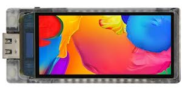

cst816 Touch Screen Controller
===============================

.. seo::
    :description: Instructions for setting up cst816 touch screen controller with ESPHome
    :image: cst816.jpg
    :keywords: CST816, T-DISPLAY, AMOLED

The ``cst816`` touchscreen platform allows using the touch screen controllers based on the CST816 series of chips with ESPHome.
The :ref:`I²C <i2c>` is required to be set up in your configuration for this touchscreen to work.

This controller is used in the Lilygo T-Display S3 AMOLED. The component should work with CST816T, CST816S, CST820 and CST716
controller chips.

    cst816t touchscreen on T-Display S3 AMOLED

Base Touchscreen Configuration
------------------------------

.. code-block:: yaml

    # Example configuration entry
    touchscreen:
      platform: cst816
      id: my_touchscreen
      interrupt_pin: GPIOXX
      reset_pin: GPIOXX

Configuration variables:
************************

- **id** (*Optional*, :ref:`config-id`): Manually set the ID of this touchscreen.
- **interrupt_pin** (*Optional*, :ref:`Pin Schema <config-pin_schema>`): The touch detection pin.
- **reset_pin** (*Optional*, :ref:`Pin Schema <config-pin_schema>`): The chip reset pin.

- All other options from :ref:`Touchscreen <config-touchscreen>`.

Binary Sensor
-------------

In addition to touch areas on the screen configured through the :ref:`Touchscreen <config-touchscreen>` component,
the cst816 will report touches on a button outside the screen area.
A binary sensor can be configured to react to touching this button.

.. code-block:: yaml

    # Example configuration entry
    binary_sensor:
      - platform: cst816
        name: "Home"

Configuration variables:
************************

- **cst816_id** (*Optional*, :ref:`config-id`): Manually specify the ID of the touchscreen.

- All other options from :ref:`Binary Sensor <config-binary_sensor>`.

Sample config for the T-Display S3 AMOLED
*****************************************

.. code-block:: yaml

    i2c:
      sda: GPIO3
      scl: GPIO2

    touchscreen:
      - platform: cst816
        id: my_touchscreen
        interrupt_pin: GPIO21

See Also
--------

- :apiref:`cst816/touchscreen/cst816_touchscreen.h`
- :ghedit:`Edit`
