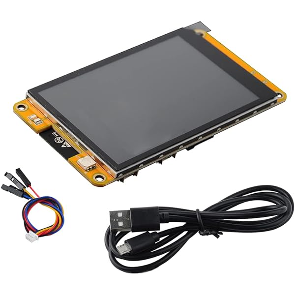

CST820 Touch Screen Controller
===============================

.. seo::
    :description: Instructions for setting up CST820 touch screen controller with ESPHome
    :image: ESP32-2432S024C.jpeg
    :keywords: CST820, ESP32-2432S024C, 2432S024C

The ``cst820`` touchscreen platform allows using the touch screen controllers based on the cst820 chip with ESPHome.
The :ref:`I²C <i2c>` is required to be set up in your configuration for this touchscreen to work.

This controller is, for example, used in the Guition ESP32-2432S024C devices. 

    ESP32-2432S024C with the CST820 chip as touchscreen controller

Base Touchscreen Configuration
------------------------------

.. code-block:: yaml

    # Example configuration entry
    touchscreen:
      platform: cst820
      id: my_touchscreen

Configuration variables:
************************

- **id** (*Optional*, :ref:`config-id`): Manually set the ID of this touchscreen.

- All other options from :ref:`Touchscreen <config-touchscreen>`.

.. warning::

    The chip supports a interrupt pin, but this is not implemented.

See Also
--------

- :ref:`Binary Sensor Filters <binary_sensor-filters>`
- :apiref:`cst820/touchscreen/cst820.h`
- :ghedit:`Edit`
