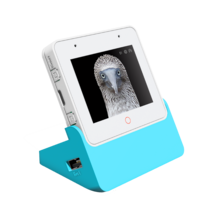

gt911 Touch Screen Controller
===============================

.. seo::
    :description: Instructions for setting up gt911 touch screen controller with ESPHome
    :image: esp32_s3_box_3.png
    :keywords: GT911, ESP32-S3-BOX-3

The ``gt911`` touchscreen platform allows using the touch screen controllers based on the gt911 chip with ESPHome.
The :ref:`I²C <i2c>` is required to be set up in your configuration for this touchscreen to work.

This controller is used in the Espressif ESP32-S3-BOX-3 and the m5paper;

    gt911 touchscreen on ESP32-S3-BOX-3

Base Touchscreen Configuration
------------------------------

.. code-block:: yaml

    # Example configuration entry
    touchscreen:
      platform: gt911
      id: my_touchscreen
      interrupt_pin: GPIOXX

Configuration variables:
************************

- **id** (*Optional*, :ref:`config-id`): Manually set the ID of this touchscreen.
- **interrupt_pin** (*Optional*, :ref:`Pin Schema <config-pin_schema>`): The touch detection pin.

- All other options from :ref:`Touchscreen <config-touchscreen>`.

Binary Sensor
-------------

In addition to touch areas on the screen configured through the :ref:`Touchscreen <config-touchscreen>` component,
the gt911 supports up to four buttons located outside of the normal touchscreen area.
On the ESP32-S3-BOX-3 the red circle below the display is such a button.
A binary sensor can be configured to react to touching these buttons.

.. code-block:: yaml

    # Example configuration entry
    binary_sensor:
      - platform: gt911
        name: "Home"
        index: 0

Configuration variables:
************************

- **gt911_id** (*Optional*, :ref:`config-id`): Manually specify the ID of the touchscreen.
- **index** (*Optional*, int): Internal index of the touch button, between 0 and 3. The default is 0.

- All other options from :ref:`Binary Sensor <config-binary_sensor>`.

See Also
--------

- :ref:`Binary Sensor Filters <binary_sensor-filters>`
- :apiref:`gt911/touchscreen/gt911.h`
- :apiref:`gt911/binary_sensor/gt911_button.h`
- :ghedit:`Edit`
