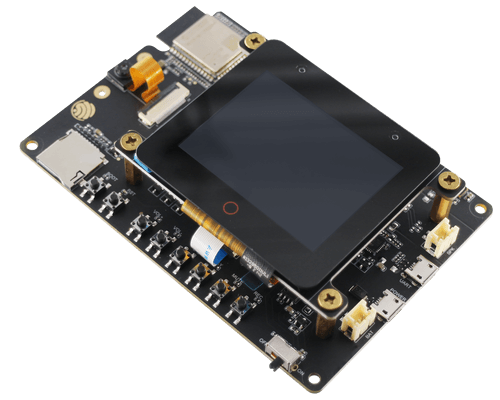

TT21100 Touch Screen Controller
===============================

.. seo::
    :description: Instructions for setting up TT21100 touch screen controller with ESPHome
    :image: esp32-s3-korvo-2-lcd.png
    :keywords: TT21100, ESP32-S3-BOX, ESP32-S3-Korvo-2-LCD

The ``tt21100`` touchscreen platform allows using the touch screen controllers based on the TT21100 chip with ESPHome.
The :ref:`I²C <i2c>` is required to be set up in your configuration for this touchscreen to work.

This controller is used in the Espressif ESP32-S3-BOX and the ESP32-S3-Korvo-2-LCD extension board for the ESP32-S3-Korvo-2.

.. figure:: images/esp32-s3-box.png
    :align: center
    :width: 50.0%

    TT21100 touchscreen on ESP32-S3-BOX

    TT21100 touchscreen on ESP32-S3-Korvo-2

Base Touchscreen Configuration
------------------------------

.. code-block:: yaml

    # Example configuration entry
    touchscreen:
      platform: tt21100
      id: my_touchscreen
      interrupt_pin: GPIOXX
      reset_pin: GPIOXX

Configuration variables:
************************

- **id** (*Optional*, :ref:`config-id`): Manually set the ID of this touchscreen.
- **interrupt_pin** (**Required**, :ref:`Pin Schema <config-pin_schema>`): The touch detection pin.
- **reset_pin** (*Optional*, :ref:`Pin Schema <config-pin_schema>`): The reset pin of the controller.

- All other options from :ref:`Touchscreen <config-touchscreen>`.

.. warning::

    If the reset pin is shared between the display and TT21100 touchscreen
    (as is the case for the ESP32-S3-BOX and the ESP32-S3-Korvo-2-LCD),
    only configure the reset pin for the display and remove the **reset_pin** variable for the TT21100 touchscreen.
    The display component should be initialized before the touchscreen component, which has then already performed the reset.

Binary Sensor
-------------

In addition to touch areas on the screen configured through the :ref:`Touchscreen <config-touchscreen>` component,
the TT21100 supports up to four buttons located outside of the normal touchscreen area.
On the ESP32-S3-BOX and the ESP32-S3-Korvo-2-LCD, the red circle below the display is such a button.
A binary sensor can be configured to react to touching these buttons.

.. code-block:: yaml

    # Example configuration entry
    binary_sensor:
      - platform: tt21100
        name: "Home"
        index: 0

Configuration variables:
************************

- **tt21100_id** (*Optional*, :ref:`config-id`): Manually specify the ID of the touchscreen.
- **index** (**Required**, int): Internal index of the touch button, between 0 and 3.

- All other options from :ref:`Binary Sensor <config-binary_sensor>`.

See Also
--------

- :ref:`Binary Sensor Filters <binary_sensor-filters>`
- :apiref:`tt21100/touchscreen/tt21100.h`
- :apiref:`tt21100/binary_sensor/tt21100_button.h`
- :ghedit:`Edit`
