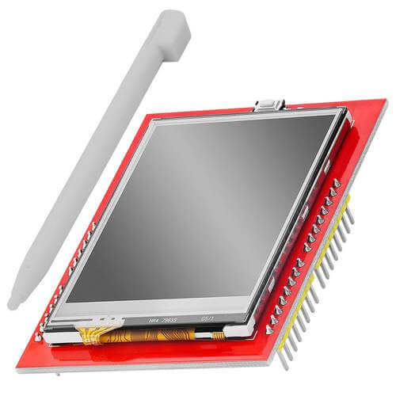

XPT2046 Touch Screen Controller (Updated version)
==================================================

.. seo::
    :description: Instructions for setting up XPT2046 touch screen controller with ESPHome
    :image: xpt2046.jpg
    :keywords: XPT2046

.. _xpt2046-component:

The ``xpt2046`` touchscreen platform allows using the touch screen controllers
based on the XPT2046 chip
(`datasheet <https://datasheetspdf.com/pdf-file/746665/XPTEK/XPT2046/1>`__,
`AZ-Delivery`_) with ESPHome. Many cheap LCD displays contain this controller.
The :ref:`SPI <spi>` is required to be set up in your configuration for this sensor to work.

    XPT2046 Touch Screen Controller

.. _AZ-Delivery: https://www.az-delivery.de/en/products/2-4-tft-lcd-touch-display

.. code-block:: yaml

    # Example configuration entry
    touchscreen:
      platform: xpt2046
      id: my_touchscreen
      cs_pin: GPIOXX
      interrupt_pin: GPIOXX
      update_interval: 50ms
      threshold: 400
      calibration:
        x_min: 3860
        x_max: 280
        y_min: 340
        y_max: 3860

Configuration variables:
------------------------
The configuration is made up of two parts: The touch screen component, and optional individual binary sensors.

Base Configuration:

- **id** (*Optional*, :ref:`config-id`): Set the ID of this sensor.

- **cs_pin** (*Optional*, :ref:`Pin Schema <config-pin_schema>`): The chip select pin.
  Often marked ``T_CS`` on the board.

- **interrupt_pin** (*Optional*, :ref:`Pin Schema <config-pin_schema>`): The touch detection pin.
  Often marked ``T_IRQ`` on the board. If not specified the component will use polling
  via SPI. This key is renamed from **irq_pin**

- **update_interval** (*Optional*, :ref:`config-time`): The interval to check the
  sensor. If ``interrupt_pin`` is specified the touch will be detected nearly instantaneously and this setting
  will be used only for the release detection. Defaults to ``50ms``.

- **threshold** (*Optional*, int): The value to detect the touch or release. Defaults to ``400``.

- **calibration_x_min** (*Deprecated*): This value is moved to the ``calibration`` values

- **calibration_x_max** (*Deprecated*): This value is moved to the ``calibration`` values.

- **calibration_y_min** (*Deprecated*): This value is moved to the ``calibration`` values.

- **calibration_y_max** (*Deprecated*): This value is moved to the ``calibration`` values.

- **swap_x_y** (*Deprecated*): This value is moved to the ``transform`` values as ``swap_xy`` see :ref:`config-touchscreen`.

- **report_interval** (*Deprecated*): This interval is removed in favor of the ``update_interval``.

- All other options from :ref:`config-touchscreen`.

See Also
--------

- :ref:`Binary Sensor Filters <binary_sensor-filters>`
- :apiref:`xpt2046/xpt2046.h`
- `XPT2046 Library <https://platformio.org/lib/show/542/XPT2046_Touchscreen>`__ by `Paul Stoffregen <https://github.com/PaulStoffregen>`__
- :ghedit:`Edit`
