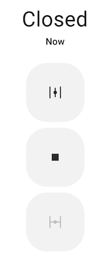

Valve Component
===============

.. seo::
    :description: Instructions for setting up base valves in ESPHome.
    :image: folder-open.svg

The ``valve`` component is a generic representation of valves in ESPHome. A valve can (currently) either be *closed* or
*open* and supports three commands: *open*, *close* and *stop*.

.. note::

    To use a valve in Home Assistant requires Home Assistant 2024.5 or later.

.. _config-valve:

Base Valve Configuration
------------------------

All valve config schemas inherit from this schema - you can set these keys for valves.

.. code-block:: yaml

    valve:
      - platform: ...
        device_class: water

Configuration variables:

- **name** (**Required**, string): The name for the valve.

  .. note::

      If you have a :ref:`friendly_name <esphome-configuration_variables>` set for your device and you want the valve
      to use that name, you can set ``name: None``.

- **device_class** (*Optional*, string): The device class for the sensor. See
  https://www.home-assistant.io/components/valve/ for a list of available options.
- **icon** (*Optional*, icon): Manually set the icon to use for the valve in the frontend.

Advanced options:

- **internal** (*Optional*, boolean): Mark this component as internal. Internal components will not be exposed to the
  frontend (like Home Assistant). Only specifying an ``id`` without a ``name`` will implicitly set this to true.
- **disabled_by_default** (*Optional*, boolean): If true, this entity should not be added to any client's frontend,
  (usually Home Assistant) without the user manually enabling it (via the Home Assistant UI). Defaults to ``false``.
- **entity_category** (*Optional*, string): The category of the entity. See
  https://developers.home-assistant.io/docs/core/entity/#generic-properties for a list of available options. Set to ``""`` to remove the default entity category.

MQTT options:

- **position_state_topic** (*Optional*, string): The topic to publish valve position changes to.
- **position_command_topic** (*Optional*, string): The topic to receive valve position commands on.
- All other options from :ref:`MQTT Component <config-mqtt-component>`.

.. _valve-open_action:

``valve.open`` Action
---------------------

This :ref:`action <config-action>` opens the valve with the given ID when executed.

.. code-block:: yaml

    on_...:
      then:
        - valve.open: valve_1

.. note::

    This action can also be expressed in :ref:`lambdas <config-lambda>`:

    .. code-block:: cpp

        auto call = id(valve_1).make_call();
        call.set_command_open();
        call.perform();

.. _valve-close_action:

``valve.close`` Action
----------------------

This :ref:`action <config-action>` closes the valve with the given ID when executed.

.. code-block:: yaml

    on_...:
      then:
        - valve.close: valve_1

.. note::

    This action can also be expressed in :ref:`lambdas <config-lambda>`:

    .. code-block:: cpp

        auto call = id(valve_1).make_call();
        call.set_command_close();
        call.perform();

.. _valve-stop_action:

``valve.stop`` Action
---------------------

This :ref:`action <config-action>` stops the valve with the given ID when executed.

.. code-block:: yaml

    on_...:
      then:
        - valve.stop: valve_1

.. note::

    This action can also be expressed in :ref:`lambdas <config-lambda>`:

    .. code-block:: cpp

        auto call = id(valve_1).make_call();
        call.set_command_stop();
        call.perform();

.. _valve-toggle_action:

``valve.toggle`` Action
-----------------------

This :ref:`action <config-action>` toggles the valve with the given ID when executed, cycling through the states
close/stop/open/stop... This allows the valve to be controlled by a single push button.

.. code-block:: yaml

    on_...:
      then:
        - valve.toggle: valve_1

.. note::

    This action can also be expressed in :ref:`lambdas <config-lambda>`:

    .. code-block:: cpp

        auto call = id(valve_1).make_call();
        call.set_command_toggle();
        call.perform();

.. _valve-control_action:

``valve.control`` Action
------------------------

This :ref:`action <config-action>` is a more generic version of the other valve actions and allows all valve attributes
to be set.

.. code-block:: yaml

    on_...:
      then:
        - valve.control:
            id: valve_1
            position: 50%

Configuration variables:

- **id** (**Required**, :ref:`config-id`): The valve to control.
- **stop** (*Optional*, boolean): Whether to stop the valve.
- **state** (*Optional*, string): The state to set the valve to - one of ``OPEN`` or ``CLOSE``.
- **position** (*Optional*, float): The valve position to set.

  - ``0.0`` = ``0%`` = ``CLOSED``
  - ``1.0`` = ``100%`` = ``OPEN``

.. note::

    This action can also be expressed in :ref:`lambdas <config-lambda>`:

    .. code-block:: cpp

        auto call = id(valve_1).make_call();
        // set attributes
        call.set_position(0.5);
        call.perform();

.. _valve-lambda_calls:

Lambdas
-------

From :ref:`lambdas <config-lambda>`, you can access the current state of the valve (note that these fields are
read-only, if you want to act on the valve, use the ``make_call()`` method as shown above).

- ``position``: Retrieve the current position of the valve, as a value between ``0.0`` (closed) and ``1.0`` (open).

    .. code-block:: cpp

        if (id(my_valve).position == VALVE_OPEN) {
          // Valve is open
        } else if (id(my_valve).position == VALVE_CLOSED) {
          // Valve is closed
        } else {
          // Valve is in-between open and closed
        }

- ``current_operation``: The operation the valve is currently performing:

    .. code-block:: cpp

        if (id(my_valve).current_operation == ValveOperation::VALVE_OPERATION_IDLE) {
          // Valve is idle
        } else if (id(my_valve).current_operation == ValveOperation::VALVE_OPERATION_OPENING) {
          // Valve is currently opening
        } else if (id(my_valve).current_operation == ValveOperation::VALVE_OPERATION_CLOSING) {
          // Valve is currently closing
        }

.. _valve-on_open_trigger:

``valve.on_open`` Trigger
*************************

This trigger is activated each time the valve reaches a fully open state.

.. code-block:: yaml

    valve:
      - platform: template  # or any other platform
        # ...
        on_open:
          - logger.log: "Valve is Open!"

.. _valve-on_closed_trigger:

``valve.on_closed`` Trigger
***************************

This trigger is activated each time the valve reaches a fully closed state.

.. code-block:: yaml

    valve:
      - platform: template  # or any other platform
        # ...
        on_closed:
          - logger.log: "Valve is Closed!"

See Also
--------

- :apiref:`valve/valve.h`
- :ghedit:`Edit`

.. toctree::
    :maxdepth: 1
    :glob:

    *
