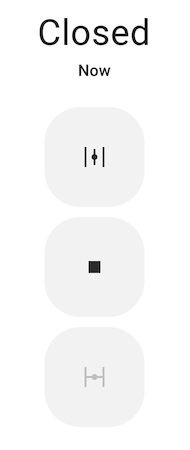

Template Valve
==============

.. seo::
    :description: Instructions for setting up template valves in ESPHome.
    :image: description.svg

The ``template`` valve platform allows you to create simple valves out of just a few actions and a value lambda. Once
defined, it will automatically appear in Home Assistant as a valve and can be controlled through the frontend.

.. code-block:: yaml

    # Example configuration entry
    valve:
      - platform: template
        name: "Template Valve"
        lambda: |-
          if (id(top_end_stop).state) {
            return VALVE_OPEN;
          } else {
            return VALVE_CLOSED;
          }
        open_action:
          - switch.turn_on: open_valve_switch
        close_action:
          - switch.turn_on: close_valve_switch
        stop_action:
          - switch.turn_on: stop_valve_switch
        optimistic: true

Possible return values for the optional lambda:

 - ``return VALVE_OPEN;`` if the valve should be reported as OPEN.
 - ``return VALVE_CLOSED;`` if the valve should be reported as CLOSED.
 - ``return {};`` if the last state should be repeated.

Configuration variables:
------------------------

- **name** (**Required**, string): The name of the valve.
- **lambda** (*Optional*, :ref:`lambda <config-lambda>`):
  Lambda to be evaluated repeatedly to get the current state of the valve.
- **open_action** (*Optional*, :ref:`Action <config-action>`): The action that should be performed when the remote
  (like Home Assistant's frontend) requests the valve to be opened.
- **close_action** (*Optional*, :ref:`Action <config-action>`): The action that should be performed when the remote
  requests the valve to be closed.
- **stop_action** (*Optional*, :ref:`Action <config-action>`): The action that should be performed when the remote
  requests the valve to be stopped.
- **optimistic** (*Optional*, boolean): Whether to operate in optimistic mode - when in this mode, any command sent to
  the template valve will immediately update the reported state and no lambda needs to be used. Defaults to ``false``.
- **assumed_state** (*Optional*, boolean): Whether the true state of the valve is not known. This will make the Home
  Assistant frontend show buttons for both OPEN and CLOSE actions, instead of hiding one of them. Defaults to ``false``.
- **has_position** (*Optional*, boolean): Whether this valve will publish its position as a floating point number.
  By default (``false``), the valve only publishes OPEN/CLOSED position.
- **position_action** (*Optional*, :ref:`Action <config-action>`): The action that should be performed when the remote
  (like Home Assistant's frontend) requests the valve be set to a specific position. The desired position is available
  in the lambda in the ``pos`` variable. Requires ``has_position`` (above) to be set to ``true``.
- **id** (*Optional*, :ref:`config-id`): Manually specify the ID used for code generation.
- All other options from :ref:`Valve <config-valve>`.

.. _valve-template-publish_action:

``valve.template.publish`` Action
---------------------------------

You can also publish a state to a template valve from elsewhere in your YAML filewith the ``valve.template.publish`` action.

.. code-block:: yaml

    # Example configuration entry
    valve:
      - platform: template
        name: "Template Valve"
        id: my_template_valve

    # in some trigger
    on_...:
      - valve.template.publish:
          id: my_template_valve
          state: OPEN

      # Templated
      - valve.template.publish:
          id: my_template_valve
          state: !lambda 'return VALVE_OPEN;'

Configuration options:

- **id** (**Required**, :ref:`config-id`): The ID of the template valve.
- **state** (*Optional*, :ref:`templatable <config-templatable>`):
  The state to publish. One of ``OPEN``, ``CLOSED``. If using a lambda, use ``VALVE_OPEN`` or ``VALVE_CLOSED``.
- **position** (*Optional*, :ref:`templatable <config-templatable>`, float):
  The position to publish, from 0 (CLOSED) to 1.0 (OPEN)
- **current_operation** (*Optional*, :ref:`templatable <config-templatable>`, string):
  The current operation mode to publish. One of ``IDLE``, ``OPENING`` and ``CLOSING``. If using a lambda, use
  ``VALVE_OPERATION_IDLE``, ``VALVE_OPERATION_OPENING``, and ``VALVE_OPERATION_CLOSING``.

.. note::

    This action can also be written in lambdas:

    .. code-block:: cpp

        id(my_template_valve).position = VALVE_OPEN;
        id(my_template_valve).publish_state();

See Also
--------

- :doc:`/components/valve/index`
- :ref:`automation`
- :doc:`/cookbook/garage-door`
- :apiref:`template/valve/template_valve.h`
- :ghedit:`Edit`
