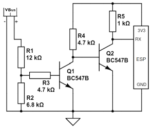
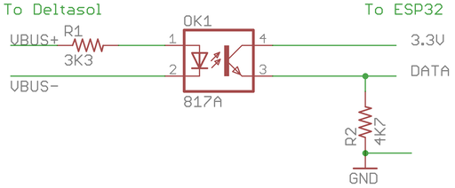

VBus Component
==============

.. seo::
    :description: Instructions for integrating a solar energy collector controller using VBus protocol in ESPHome.
    :image: resol_deltasol_bs_plus.jpg
    :keywords: VBUS RESOL SOLAR

The ``VBus`` Component provides status reading connectivity to solar heat energy collector controllers using VBus
protocol. These devices are mainly produced by Resol, often also found under different brand names like Viessmann,
Kioto, Wagner etc. The component currently supports natively the models in the table below
but any device can be added via lambda by knowing `its packet structure <https://danielwippermann.github.io/resol-vbus>`__.

Supported Models
----------------

The following table shows the currently supported models of Vbus devices.

.. csv-table:: Supported Models
    :header: "Name", "Config Value", "Hex Address", "Notes"

    "DeltaSol BS Plus","deltasol_bs_plus","4221"
    "DeltaSol BS 2009","deltasol_bs_2009","427B","DeltaSol BS Plus V2"
    "Dux H3214","deltasol_bs_2009","427B", "Pump 2 unsupported"
    "DeltaSol C","deltasol_c","4212"
    "DeltaSol CS2","deltasol_cs2","1121"
    "DeltaSol CS2 Plus","deltasol_cs2_plus","2211"

The ``Config Value`` should be used for the ``model`` parameter in your ``sensor`` and ``binary_sensor`` entries.

The ``Hex Address`` field is the value sent by a device in the ``from`` field of a message. To identify an unknown
model, set the logger level to ``VERBOSE`` and look for lines like this in the log output:

``[10:53:48][V][vbus:068]: P1 C0500 427b->0000: 0000 0000 (0)``

The value before the ``->`` symbol is the device source address. If it matches one of the entries in the table above
then that model should work with your unit.

Hardware Connection
-------------------

The device must be connected via a :doc:`UART bus </components/uart>` supporting the receiving line only. The UART bus
must be configured at the same speed of the module which is by default 9600bps. The controller outputs data every second.

To connect to this and read data from the bus a level shifting is needed as the voltage is around 8V (direct connection
would damage the MCU). For our read-only purposes it's
sufficient to adapt the level appropriately to 3.3V using a circuit like below:

An electrically isolated version using an opto-coupler:

Another approach, with PCB design ready to be manufactured `can be found here <https://github.com/FatBeard/vbus-arduino-library/tree/master/pcb>`__.

.. warning::

    Do not connect the GND pin of your module with the ground of Resol unit as that may damage the output port of it.
    The output of the device is symmetric, meaning that the signal is not referenced to the ground, but rather it's a
    differential signal between the two wires. However, the MCU references the signal against the ground, so the two
    grounds are not supposed to be connected to each other as can be seen in the circuit depicted above.

Component
---------

.. code-block:: yaml

    # Example configuration entry
    vbus:
      uart_id: resol

.. warning::

    If you are using the :doc:`logger` make sure you are not using the same pins for it or otherwise disable the UART
    logging with the ``baud_rate: 0`` option.

Configuration variables:

- **uart_id** (*Optional*, :ref:`config-id`): Manually specify the ID of the UART hub used to connect to the device.

.. note::

    Functionality of the sensors depends on the type of the device and the scheme arrangement of the hydraulic
    system it controls. The actual arrangement number set up can be determined from the settings of the device. Please
    check the user manual and assess your arrangement to determine the functionality of each sensor and name them
    accordingly.

Sensor
------

.. code-block:: yaml

    # Example configuration entry
    sensor:
      - platform: vbus
        model: deltasol_bs_plus
        temperature_1:
          name: Temperature 1
        temperature_2:
          name: Temperature 2
        temperature_3:
          name: Temperature 3
        temperature_4:
          name: Temperature 4
        pump_speed_1:
          name: Pump Speed 1
        pump_speed_2:
          name: Pump Speed 2
        operating_hours_1:
          name: Operating Hours 1
        operating_hours_2:
          name: Operating Hours 2
        heat_quantity:
          name: Heat Quantity
        time:
          name: Device Time
        version:
          name: Device firmware version

Configuration variables:

- **model** (**Required**): Specify the model of the connected controller. Choose one of the config values listed in the table of supported models above.

Supported sensors:

- for **deltasol_bs_plus** and **deltasol_bs_2009**: ``temperature_1``,  ``temperature_2``, ``temperature_3``, ``temperature_4``, ``pump_speed_1``, ``pump_speed_2``, ``operating_hours_1``, ``operating_hours_2``, ``heat_quantity``, ``time``, ``version``.
- for **deltasol_c**: ``temperature_1``,  ``temperature_2``, ``temperature_3``, ``temperature_4``, ``pump_speed_1``, ``pump_speed_2``, ``operating_hours_1``, ``operating_hours_2``, ``heat_quantity``, ``time``.
- for **deltasol_cs2**: ``temperature_1``,  ``temperature_2``, ``temperature_3``, ``temperature_4``,  ``pump_speed``, ``operating_hours``, ``heat_quantity``, ``version``.
- for **deltasol_cs_plus**: ``temperature_1``,  ``temperature_2``, ``temperature_3``, ``temperature_4``, ``temperature_5``, ``pump_speed_1``, ``pump_speed_2``, ``operating_hours_1``, ``operating_hours_2``, ``heat_quantity``, ``time``, ``version``, ``flow_rate``.

All sensors are *Optional* and support all other options from :ref:`Sensor <config-sensor>`.

.. note::

    Sensors are updated every time a data packet is sent by the device. Some models send data very often, possibly every second. If you are
    concerned about the load on the receiving database, you can add a ``throttle`` filter to the sensors.

Binary Sensor
-------------

.. code-block:: yaml

    # Example configuration entry
    binary_sensor:
      - platform: vbus
        model: deltasol_bs_plus
        relay1:
          name: Relay 1 On
        relay2:
          name: Relay 2 On
        sensor1_error:
          name: Sensor 1 Fault
        sensor2_error:
          name: Sensor 2 Fault
        sensor3_error:
          name: Sensor 3 Fault
        sensor4_error:
          name: Sensor 4 Fault
        collector_max:
          name: Option Collector Max
        collector_min:
          name: Option Collector Min
        collector_frost:
          name: Option Collector Frost
        tube_collector:
          name: Option Tube Collector
        recooling:
          name: Option Recooling
        hqm:
          name: Option Heat Quantity Measurement

Configuration variables:

- **model** (**Required**): Specify the model of the connected controller. Choose one of the config values listed in the table of supported models above.

  Supported models:

  - **``deltasol_bs_plus``**: ``relay1``,  ``relay2``, ``sensor1_error``, ``sensor2_error``, ``sensor3_error``, ``sensor4_error``, ``collector_max``, ``collector_min``, ``collector_frost``, ``tube_collector``, ``recooling``, ``hqm``.
  - **``deltasol_bs_2009``**: ``sensor1_error``, ``sensor2_error``, ``sensor3_error``, ``sensor4_error``, ``frost_protection_active``.
  - **``deltasol_c``**: ``sensor1_error``, ``sensor2_error``, ``sensor3_error``, ``sensor4_error``.
  - **``deltasol_cs2``**: ``sensor1_error``, ``sensor2_error``, ``sensor3_error``, ``sensor4_error``.
  - **``deltasol_cs_plus``**: ``sensor1_error``, ``sensor2_error``, ``sensor3_error``, ``sensor4_error``.
  - **``custom``**: See below.

All binary sensors are *Optional* and support all other options from :ref:`Binary Sensor <config-binary_sensor>`.

``custom`` VBus sensors
-----------------------

Devices on a VBus are identified with a source address. There can be multiple devices on the same bus,
each device type has a different address.

.. code-block:: yaml

    sensor:
      - platform: vbus
        model: custom
        dest: 0x10
        source: 0x1234
        command: 0x100
        sensors:
          - id: temp1
            name: Temp 1
            lambda: return ((x[1] << 8) + x[0]) / 10.0;

Configuration variables:

- **dest** (**Required**): The ``DFA`` value corresponding to your device (see below).
- **source** (**Required**): The address corresponding to ``your device model`` (see below).
- **command** (**Required**): The ``command`` corresponding to your device (see below).
- **sensors** (**Required**): A list of :ref:`Sensor <config-sensor>` definitions that include a ``lambda`` to do the decoding and return a ``float`` value.

- **lambda** (**Required**, :ref:`lambda <config-lambda>`): Code to parse a value from the incoming data packets and return it.
  The data packet is in a ``std::vector<uint8_t>`` called ``x``.

``custom`` VBus binary sensors
------------------------------

Configuration variables:

- **dest** (**Required**): The ``DFA`` value corresponding to your device (see below).
- **source** (**Required**): The address corresponding to ``your device model`` (see below).
- **command** (**Required**): The ``command`` corresponding to your device (see below).
- **binary_sensors** (**Required**): A list of :ref:`Binary Sensor <config-binary_sensor>` definitions that include a ``lambda`` to do the decoding and return a ``bool`` value.

- **lambda** (**Required**, :ref:`lambda <config-lambda>`): Code to parse a value from the incoming data packets and return it.
  The data packet is in a ``std::vector<uint8_t>`` called ``x``.

To determine the correct values for the parameters above, visit `packet definitions list <http://danielwippermann.github.io/resol-vbus/#/vsf>`__. In the search field of the **Packets** table, enter the name of your device.

To extract the values with a :ref:`lambda <config-lambda>`, look in the packet structure by clicking the **Bytes** link in the table. Each value is placed at an ``offset`` within the packet.
For ``float`` values, let's look at the temperature example: the value is stored as a ``16``-bit value in ``2`` bytes little-endian format. Since it's always the second byte containing the upper byte, it needs to be shifted by ``8`` bits (multiplied by ``256``) (e.g. ``0x34, 0x12 -> 0x1234``). The result needs to be multiplied by the factor, which is ``0.1``, to obtain the correct values: ``((x[1] << 8) + x[0]) * 0.1f)``. The number within the square brackets is the ``[offset]``.
For ``binary`` values, multiple binary values are stored within a single numeric value encoded with a bitmask. To extract the binary value all you have to do is to apply *bitwise AND* operator ``&`` between the value at the corresponding offset and the ``mask`` shown in the table.

For example to decode some sensors of `DeltaSol BS Plus` via lambdas:

.. code-block:: yaml

    # Example configuration entry
    sensor:
      - platform: vbus
        model: custom
        dest: 0x10
        source: 0x4221
        command: 0x100
        sensors:
          - id: scheme
            name: Arrangement scheme
            icon: mdi:pipe-wrench
            accuracy_decimals: 0
            entity_category: diagnostic
            lambda: return x[14];  // Configured arrangement scheme
          - id: temp2
            name: Temperature DHW
            state_class: measurement
            unit_of_measurement: "°C"
            lambda: return ((x[3] << 8) + x[2]) * 0.1f;  // Temperature 2

    binary_sensor:
      - platform: vbus
        model: custom
        dest: 0x10
        source: 0x4221
        command: 0x100
        binary_sensors:
          - name: Heat Quantity Measurement On
            id: bin_hqm
            icon: mdi:counter
            lambda: return x[15] & 0x20; // Option Heat Quantity Measurement enabled

See Also
--------

- :doc:`/components/uart`
- :doc:`/components/binary_sensor/index`
- :doc:`/components/sensor/index`
- `Resol manuals <https://www.resol.de/en/dokumente>`__
- `VBus protocol <https://danielwippermann.github.io/resol-vbus>`__
- :ghedit:`Edit`
