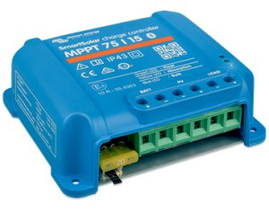
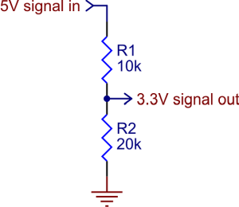

Victron energy devices
======================

.. seo::
    :description: Instructions for setting up various Victron energy devices in ESPHome.
    :image: victron_mppt.jpg

The ``victron`` component allows you to integrate sensors from various Victron energy devices 
in ESPHome. It uses :ref:`UART <uart>` for communication. Some of the supported devices are
BlueSolar, SmartSolar, BMV-7xx, Phoenix Inverter 12/24/48V, SmartShunt.

Once configured you can use sensors as described below for your projects.

    Victron energy SmartSolar PV charger

Overview
--------

Victron devices have an RS232 output which can have levels at 5V or 3.3V. ESP mdules are not
5V tolerant thus special care must be taken when connecting an ESP module to a Victron device.

If you have a 5V device you have to use a resistor divider. If you have a 3V device you can 
connect the VE.Direct TX from the Victron device directly to the input pin of the ESP.

    5V to 3.3V divider schematic

Please see the Victron papers for the pinout of the JST connector on your Victron device.

.. note::

    Accordinng to Victron docs (2022.11):
    - BMV-700: 3v3   
    - MPPT all models: 5v   
    - Newer MPPTs (as now under development) will remain 5V   

Component
---------

.. code-block:: yaml

    # Example configuration entry
    victron:
      uart_id: the_uart

Configuration variables:

- **uart_id** (*Optional*): A configured UART to read data from. If not specified, takes the first one.

Sensor
------

.. code-block:: yaml

    # Example configuration entry
    sensor:
      - platform: victron
        panel_voltage:
          id: pv
        battery_voltage:
          id: bv

Configuration variables:

- **max_power_yesterday**: Max Power Yesterday
- **max_power_today**: Max Power Today
- **yield_total**: Yield Total
- **yield_yesterday**: Yield Yesterday
- **yield_today**: Yield Today
- **panel_voltage**: Panel Voltage
- **panel_power**: Panel Power
- **battery_voltage**: Battery Voltage
- **battery_current**: Battery Current
- **day_number**: Day Number
- **charger_status**: Charger Status
- **error_code**: Error Code
- **tracker_operation**: Tracker Operation

All sensors are *Optional* and support all other options from :ref:`Sensor <config-sensor>`.

Text Sensor
------

.. code-block:: yaml

    # Example configuration entry
    text_sensor:
      - platform: victron
        charger_text:
          id: ctx
        error_text:
          id: etx

Configuration variables:

- **charger_text**: Charger Text
- **error_text**: Error Text
- **tracker_text**: Tracker Text
- **pid**: Pid
- **fw_version**: Firmare Version

All text sensors are *Optional* and support all other options from :ref:`Text Sensor <config-text_sensor>`.

See Also
--------

- :ref:`uart`
- :doc:`logger`
- :ref:`Sensor <config-sensor>`
- :ref:`Text Sensor <config-text_sensor>`
- `Communication protocol <https://www.victronenergy.com/live/vedirect_protocol:faq>`__
- :ghedit:`Edit`
