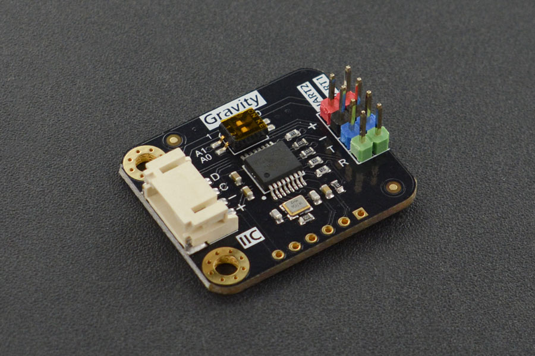

WeiKai SPI/I²C UART/IO Expander
===============================

.. seo::
    :description: Instructions for setting up WeiKai SPI/I²C to UART Expanders in ESPHome.
    :image: wk2168.jpg
    :keywords: UART, SPI, I²C, WK2132, WK2168, WK2204, WK2212, wk2124

**WeiKai Microelectronics** provides a family of UART & GPIO expansion chips
that interfaces to a micro-controller through SPI or I²C bus.

The ESPHome ``WeiKai`` component supports the following WeiKai chips:

- `WK2168-IQPG <https://jlcpcb.com/partdetail/WEIKAI-WK2168IQPG/C401041>`__
- `WK2132-ISSG <https://jlcpcb.com/partdetail/WeiKai-WK2132ISSG/C401039>`__
- `WK2124-ISSG <https://jlcpcb.com/partdetail/WeiKai-WK2124ISSG/C86332>`__
- `WK2204-IQNG <https://jlcpcb.com/partdetail/WeiKai-WK2204IQNG/C401040>`__
- `WK2212-IQNG <https://jlcpcb.com/partdetail/WeiKai-WK2212IQNG/C2987671>`__

It can also be used with evaluation board equipped with these chips, such as:

- `WK2168 Chip Development Board <https://fr.aliexpress.com/item/1005002198759633.html>`__
- `WK2132 Chip Development Board <https://www.aliexpress.com/item/1005002018579265.html>`__
- `DFROBOT Gravity: I²C to Dual UART Module <https://www.dfrobot.com/product-2001.html>`__

The features provided by the different WeiKai chips are described in the following table:

..  list-table:: WeiKai chip's features
    :header-rows: 1
    :width: 450px
    :align: center

    * - Chip
      - Bus
      - UART
      - GPIO
    * - WK2132-ISSG
      - S/I
      - 2
      -
    * - WK2212-IQNG
      - S/I
      - 2
      - 8
    * - WK2124-ISSG
      - S
      - 4
      -
    * - WK2204-IQNG
      - S/I
      - 4
      -
    * - WK2168-IQPG
      - S/I
      - 4
      - 8

As you can see most of the components can interface either through an I²C bus or a SPI bus,
they provide either 2 or 4 serial channels, and some provide 8 input/output pins.

Each UART channel has two independent 256-byte FIFO hardware buffers to transmit and
receive and support data transmission rates up to 1 Mbps.
The baud rate and parity format of each UART channel can be configured independently.
However, the data bit length is fixed at 8.

Utilizing the UART channels enables you to connect your UART devices, with each channel functioning
as a virtual UART bus for the connected component.

The I/O pins of the WeiKai chips can be use as any of the other GPIO pins.
Any option accepting a :ref:`Pin Schema <config-pin_schema>` can theoretically
be used, but some more complicated components that do communication through
this I/O expander might not work.

Connecting via an SPI bus
-------------------------

The ``wk2132_spi``, ``wk2212_spi``, ``wk2204_spi``, ``wk2168_spi`` components allows
you to connect the WeiKai chip with ESPHome via a :ref:`SPI <spi>` bus.

You can connect several of these modules to a single SPI controller circuit effectively expanding
the number of hardware serial ports available. Each WeiKai chip needs to be selected
with a individual CS.

Here is an example of configuration entry for a wk2168_spi component. For the other components
in the list just replace the name of the component and make sure you do not use more channels that the chip
can support (an error message will be generated otherwise). Note that for the ``WK2124-ISSG`` chip
you need to use ``wk2204_spi`` as the two chips are similar.

.. code-block:: yaml

    wk2168_spi:
      - id: wk2168_bridge_spi
        cs_pin: 5
        uart:
          - id: spi_uart_0
            channel: 0
            baud_rate: 128200
            parity: even
          - id: spi_uart_1
            channel: 1
            baud_rate: 19200
          - id: spi_uart_2
            channel: 2
            baud_rate: 9600
          - id: spi_uart_3
            channel: 3
            baud_rate: 19200

Configuration variables:
************************

- **id** (**Required**, :ref:`config-id`): The id to use for this WeiKai component.
- **spi_id** (*Optional*, :ref:`config-id`): Manually specify the ID of the :ref:`SPI Component <spi>` if you want
  to use multiple SPI buses.
- **cs_pin** (**Required**, :ref:`Pin Schema <config-pin_schema>`): The pin on the ESP that the chip select line
  of the chip is connected to.
- **data_rate** (*Optional*): Set the data rate of the controller. One of ``80MHz``, ``40MHz``, ``20MHz``, ``10MHz``,
  ``5MHz``, ``4MHz``, ``2MHz``, ``1MHz`` (default), ``200kHz``, ``75kHz`` or ``1kHz``. A numeric value in Hz can
  alternatively be specified.
- **crystal** (*Optional*): The frequency in Hz of the crystal connected to the chip.
  The default value is 14745600 Hz.
- **uart** (**Required**): The UART channels.

  - **id** (**Required**, :ref:`config-id`): The id to use for this UART channel.
  - **channel** (**Required**): Unique channel number of this virtual UART.
    Options: ``0`` to ``1`` or ``0`` to ``3`` depending on the model.
  - **baud_rate** (**Required**): The baud rate of the UART channel.
  - **parity** (*Optional*): The parity used on the UART channel. Options: ``NONE``, ``EVEN``,
    ``ODD``. Defaults to ``NONE``.
  - **stop_bits** (*Optional*): The number of stop bits to send. Options: ``1``, ``2``.
    Defaults to ``1``.

Connecting via an I²C bus
-------------------------

The ``wk2132_i2c`` ``wk2212_i2c`` ``wk2204_i2c`` ``wk2168_i2c`` components allows you
to connect the WeiKai chip with ESPHome via an :ref:`I²C <i2c>` bus.
Up to four WeiKai chips can be connected to an I²C controller board, effectively expanding the
available hardware serial ports. The base addresses of these boards are defined by the
positions of two switches, A0 and A1, on the board.

..  list-table:: WeiKai address selection
    :header-rows: 1
    :width: 350px
    :align: center

    * - I²C address
      - A1
      - A0
    * - 0x10 - 0x17
      - 0
      - 0
    * - 0x30 - 0x37
      - 0
      - 1
    * - 0x50 - 0x57
      - 1
      - 0
    * - 0x70 - 0x77
      - 1
      - 1

.. important::

    Note that the address is given as a **range** a not a number as you usually find on other I²C component.
    Indeed due to a peculiar way of addressing the different internal registers each component actually occupy
    8 consecutive addresses. For example if the component base address is 0x10, it will occupy the addresses ranging from
    0x10 to 0x17 on the I²C bus.

    This is important to know if you want to connect other devices on the same I²C bus.

Here is an example of configuration entry for a ``wk2168_i2c`` component. For the other components
just replace the name of the component and do not use more channels that the chip can
support (an error message will be generated in this case).

.. code-block:: yaml

    wk2168_i2c:
      - address: 0x70
        id: wk2168_bridge_i2c
        uart:
          - id: i2c_uart_0
            channel: 0
            baud_rate: 9600
            parity: even
          - id: i2c_uart_1
            channel: 1
            baud_rate: 19200
          - id: i2c_uart_2
            channel: 2
            baud_rate: 9600
          - id: i2c_uart_3
            channel: 3
            baud_rate: 19200

Configuration variables:
************************

- **id** (**Required**, :ref:`config-id`): The id to use for this WeiKai component.
- **address** (*Optional*): The I²C address of this component. Defaults to ``0x10``.
- **i2c_id** (*Optional*): The I²C Bus ID. Defaults to the default i²c bus.
- **crystal** (*Optional*): The frequency in Hz of the crystal connected to the chip.
  The default value is 14745600 Hz.
- **uart** (*Required*): The UART channels.

  - **id** (**Required**, :ref:`config-id`): The id to use for this UART channel.
  - **channel** (**Required**): Unique channel number of this virtual UART.
    Options: ``0`` to ``1`` or ``0`` to ``3`` depending on the model.
  - **baud_rate** (**Required**): The baud rate of the UART channel.
  - **parity** (*Optional*): The parity used on the UART channel. Options: ``NONE``, ``EVEN``,
    ``ODD``. Defaults to ``NONE``.
  - **stop_bits** (*Optional*): The number of stop bits to send. Options: ``1``, ``2``.
    Defaults to ``1``.

Using the GPIO pins
-------------------

For the ``WK2212``, and ``WK2168`` it is possible to use the chip I/O pins as any of the other GPIO pins.
For example for a wk2168_spi chip:

.. code-block:: yaml

    # individual binary_sensor inputs
    binary_sensor:
      - platform: gpio
        name: "pin_0"
        pin:
          wk2168_spi: wk2168_bridge_spi
          number: 0
          mode:
            input: true
      - platform: gpio
        name: "pin_1"
        pin:
          wk2168_spi: wk2168_bridge_spi
          number: 1
          mode:
            input: true
          inverted: true

    # Individual binary outputs
    switch:
      - platform: gpio
        name: "pin_2"
        pin:
          wk2168_spi: wk2168_bridge_spi
          number: 2
          mode:
            output: true
      - platform: gpio
        name: "pin_3"
        pin:
          wk2168_spi: wk2168_bridge_spi
          number: 3
          mode:
            output: true
          inverted: true

Pin configuration variables:
****************************

- **wkxxxx_xxx** (**Required**, :ref:`config-id`): The id of the ``wkxxxx_xxx`` component for the pin. For
  example ``wk2212_i2c: wk2168_bridge_spi``
- **number** (**Required**): The pin number (``0`` to ``7``)
- **inverted** (*Optional*): If all read and written values should be treated as inverted. Defaults to ``false``.
- **mode** (*Optional*): A pin mode to set for the pin at. One of ``INPUT`` or ``OUTPUT``. Default to ``INPUT``

Performance considerations:
---------------------------

Bus speed
*********

Please be aware that the communication between the WeiKai chips and the processor occurs on an external bus,
with a relatively low operating frequency. Therefore tasks such as checking the status of the chip's
registers or transferring bytes from the internal FIFOs to the processor may take time.

To improve this situation, it is strongly recommended to increase the default bus frequency.

- With a SPI bus this can be done on the WeiKai component by specifying ``data_rate``. For example:

.. code-block:: yaml

    wk2168_spi:
      - id: wk2168_bridge_spi
        spi_id: spi_bus_id
        cs_pin: 5
        data_rate: 4MHz

- With an I²C bus this needs to be done on the ``i2c`` declaration and therefore this frequency will
  apply to all components connected to this bus.

.. code-block:: yaml

    i2c:
      sda: 21
      scl: 22
      scan: true
      id: bus_i2c
      frequency: 800kHz

Maximum Baud rate
*****************

The maximum baud_rate is proportional to the crystal frequency. The following table
gives the maximum baud_rate at usual system clock:

..  list-table:: maximum baud rate
    :header-rows: 1
    :width: 300px
    :align: center

    * - Clock
      - Max Bd
    * - 14,745,600 Hz
      - 921,600 Bd
    * - 11,059,200 Hz
      - 691,200 Bd
    * - 7,372,800 Hz
      - 460,800 Bd
    * - 3,686,400 Hz
      - 230,400 Bd
    * - 1,843,200 Hz
      - 115,200 Bd

If you try to use a baud  rate superior to the maximum baud_rate an error will be displayed in the
log file and the baud rate will automatically be decreased.

See Also
--------

- :ref:`i2c`
- :ref:`spi`
- :doc:`switch/gpio`
- :doc:`binary_sensor/gpio`
- :apiref:`weika/weika.h`
- :ghedit:`Edit`
