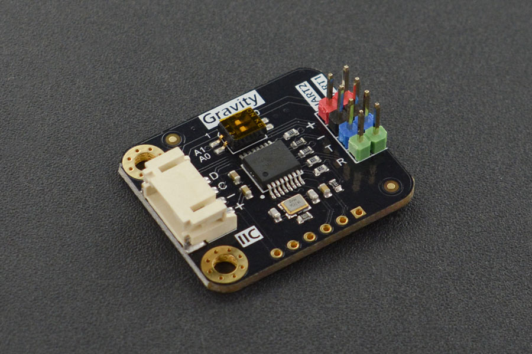

WK2132 I²C UART Expander
========================

.. seo::
    :description: Instructions for setting up WK2132 I²C Component in ESPHome.
    :image: wk2132.jpg

.. role:: raw-html-m2r(raw)
   :format: html

The WK2132 I²C component allows you to use the 
`Weika WK2332-ISSG <https://jlcpcb.com/partdetail/Weikai-WK2132ISSG/C401039>`__
chip or the DFROBOT `Gravity: I²C to Dual UART Module <https://www.dfrobot.com/product-2001.html>`__
module directly in ESPHome. 

The WK2132 chip/module serves as an I²C to Dual UART converter, supporting data transmission rates 
of up to 1 Mbps. While the chip can interface with an SPI bus, this functionality is supported by 
a separate ESPHome component. Each UART channel features two independent 256-byte FIFO hardware 
buffers for both transmission and reception.

It's worth noting that the baud rate and parity format of each UART channel can be configured independently. 
However, the data bit length is fixed at 8 and cannot be altered. The module supports a maximum communication 
rate of 2 Mbps.
Documentation about the DFRobot module can be found at the
`DFROBOT Wiki <https://wiki.dfrobot.com/Gravity%3A%20IIC%20to%20Dual%20UART%20Module%20SKU%3A%20DFR0627>`__

Up to four such modules can be connected to an I²C controller board, effectively expanding the 
available hardware serial ports to 8. The base addresses of these boards are contingent on the 
positions of two switches, A0 and A1, on the board.

Utilizing the UART channels enables you to connect your UART devices, with each channel functioning 
as a virtual UART bus for the connected component.

..  list-table:: wk2132 address selection
    :header-rows: 1
    :width: 350px
    :align: center

    * - I²C address
      - A1
      - A0
    * - 0x10
      - 0
      - 0
    * - 0x30
      - 0
      - 1
    * - 0x50
      - 1
      - 0
    * - 0x70
      - 1
      - 1

.. important:: 

    The above addresses are referred to as the component's base address. In practice the component
    uses 8 consecutive addresses starting at the base address. \ :raw-html-m2r:` `
    For example if the component base address is 0x10, it will occupy the addresses ranging from 
    0x10 to 0x17 on the I²C bus. \ :raw-html-m2r:` `
    This is important to know if you want to connect other devices on the I²C bus.

.. code-block:: yaml

    # Example configuration entry
    uart:
      id: dummy_uart_required_see_explanation_below
      tx_pin: 3
      baud_rate: 9600
    
    i2c:
      id: i2c_bus
      scan: true
      sda: 21
      scl: 22
      frequency: 800kHz

    wk2132:
      - address: 0x70
        id: bridge_0
        i2c_id: i2c_bus
        uart:
          - uart_id: uart_0
            channel: 0
            baud_rate: 9600
            parity: even
          - uart_id: uart_1
            channel: 1
            baud_rate: 19200

    # Device using one of the wk2132 Uart channel
    sensor: 
      - platform: sds011
        pm_2_5:
          name: test_2_5µm_concentration
          id: test_2_5um_concentration
        pm_10_0:
          name: test_10_0µm_concentration
          id: test_10_0um_concentration
        update_interval: 1min
        uart_id: uart_0

.. caution:: 

    Currently, due to some internal limitations, it is necessary to declare a ``uart:`` component in
    your configuration **even if you do not need one**. See the example above. This requirement 
    might disappear in future release.

Performance considerations:
***************************

Please be mindful that the communication between the Wk2132 chip and the processor occurs on an I²C bus, 
with a default operating frequency of 50kHz. At this rate, tasks such as checking the status of the chip's 
registers or transferring bytes from the internal FIFOs to the processor may experience delays. 
Despite the 256-byte capacity of the FIFOs, there is a risk of overflow due to the processing time.

To mitigate this, it is strongly recommended to consider increasing the I²C bus frequency. Depending on 
the compatibility with other components on the bus, it should be feasible to elevate the speed to 800kHz, 
or at the very least, 600kHz. It's important to note that, to minimize bus transactions, the component 
internally employs a fast ring buffer.

Component configuration variables:
**********************************

- **id** (**Required**, :ref:`config-id`): The id to use for this WK2312 component.
- **address** (*Optional*): The I²C address of this component. Defaults to ``0x10``.
- **i2c_id** (*Optional*): The I²C Bus ID. Defaults to the default i²c bus.
- **crystal** (*Optional*): The frequency in Hz of the crystal connected to the chip.
  If you are using DFROBOT modules, the frequency of the crystal does not need to be specified
  as the default value is 14745600 Hz (the value of the crystal used by this board).
- **uart** (*Required*): The UART channels.

  - **uart_id** (**Required**, :ref:`config-id`): The id to use for this UART channel.
  - **channel** (*Optional*): The channel number to use for this virtual UART. Options: 
    ``0``, ``1``. Default to ``0``. Obviously if you are using both channels they must 
    use different channel number (i.e. ``0`` and ``1``)
  - **baud_rate** (**Required**): The baud rate of the UART channel.
  - **parity** (*Optional*): The parity used on the UART channel. Options: ``NONE``, ``EVEN``, 
    ``ODD``. Defaults to ``NONE``.
  - **stop_bits** (*Optional*): The number of stop bits to send. Options: ``1``, ``2``. 
    Defaults to ``1``.

.. note::

    For the wk2132 the number of data bits used on the UART channel is set to 8 and cannot be changed

See Also
********

- :ref:`i2c`
- :ghedit:`Edit`
