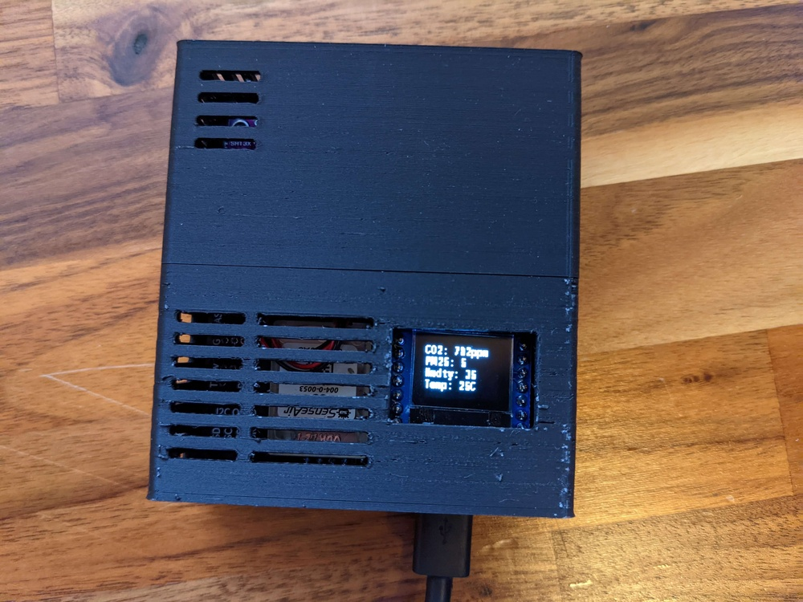

.. seo::
    :description: AirGradient DIY Air Quality Sensor 
    :image: air_gradient_diy_air_quality_sensor.jpg
    :keywords: Air Quality Sensor DIY 

AirGradient DIY Air Quality Sensor 
==================================

AirGradient has created a DIY Air Quality sensor.
They offer a PCB, PCB + components kit, etc.
A pretty neat package.
To use this you have to run their software but you can use the kit with ESPHome as well!

Here is what it can measure:

- **Temperature**
- **Humidity**
- **Air particles PM2.5**
- **Carbon Dioxide**

Additionally:

- There is a display so show off your data or whatever you desire from Home Assistant
- You can download a 3D printeable case inkluding a wall mount bracket

ESPHome Configuration
---------------------
Documentation:

- `Blog Article: Measuring Air Quality in your Home Office <https://www.ajfriesen.com/measuring-air-quality-in-your-home-office/>`__
- `ESPHome code with a setup guide for Home Assistant <https://github.com/ajfriesen/ESPHome-AirGradient>`__
- `AirGradient Shop for the PCB or PCB plus components <https://www.airgradient.com/diyshop/>`__
- `AirGradient Setup Guide (3D printeable case, setup guide, etc.) <https://www.airgradient.com/diy/>`__

`YAML configuration <https://github.com/ajfriesen/ESPHome-AirGradient/blob/main/air-gradient.yaml>`__

Soldering and setup video:

.. raw:: html

    <iframe width="560" height="315" src="https://www.youtube.com/embed/Cmr5VNALRAg" frameborder="0" allow="accelerometer; autoplay; clipboard-write; encrypted-media; gyroscope; picture-in-picture" allowfullscreen></iframe>

See Also
--------

- :doc:`/devices/nodemcu_esp8266`
- :doc:`/components/display/ssd1306`
- :doc:`/components/i2c`
- :doc:`/components/uart`
- :doc:`/components/sensor/sht3xd`
- :doc:`/components/sensor/pmsx003`
- :doc:`/components/sensor/senseair`
- :doc:`/components/wifi`
- :doc:`/components/api`
- :doc:`/components/logger`
- :doc:`/components/ota`
- :doc:`/components/switch/safe_mode`
- :ghedit:`Edit`
