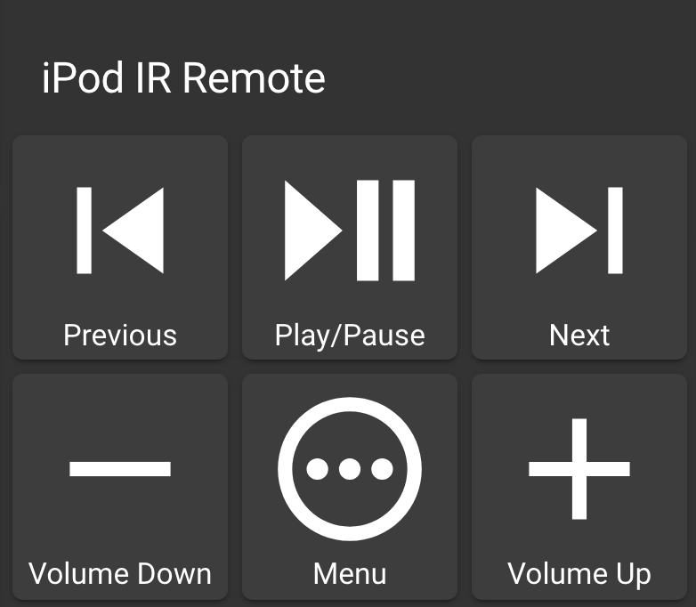

Apple IR Remote (A1156) to control an iPod Dock
===============================================

.. seo::
    :description: Instructions for setting up an infrared transmitter with ESPhome to control an iPod dock with Home Assistant
    :image: apple_ir_remote_ipod_dock.jpg
    :keywords: infrared IR remote

.. figure:: images/apple_ir_remote_ipod_dock.jpg
    :align: left
    :width: 75.0%

In this example I have used a Wemos D1 Mini and an infrared sheild to control an iPod dock from Home Assistant. 

I enjoy listening to `Soulection Radio <https://soundcloud.com/soulection>`__ on my iPod as background music while I work. 
Each show is two hours, so it's nice to not think about what songs to play next like on spotify and also automate things with Home Assistant that don't have an internet connection, like an iPod.

I've added this to the cookbook because the iPod remote codes were getting hard to find and wanted to document this use-case for others to enjoy.

This is the Apple White Remote model A1156 that we are replacing:
-------------------------------------------------------------------

.. figure:: images/apple_ir_remote.jpg
    :align: left
    :width: 75.0%

Hardware configuration
----------------------

Hardware is easy! Just solder the sheild or wire up a IR transmitter LED using the Wemos D1 mini pins below:

Only four connections are needed:

- ``VCC`` - Power
- ``GND`` - Ground
- ``D3`` - GPIO for Receiver
- ``D4`` - GPIO for Transmitter

Hardware Procurement
********************
I bought the Wemos D1 Mini IR Shield by searching on Aliexpress and eBay for <$4 USD. I couldn't find any links on Amazon but I'm sure it's always changing. 

Software configuration
----------------------

We are emulating a 6 button remote so the configuration is simple:

Dumping Other IR Codes 
***********************

This is only required if you want to add other codes for other remotes.

.. code-block:: yaml

    ### This is only needed to dump other remote codes.
     remote_receiver:
       pin: D4
       dump: all

The Configuration
******************

.. code-block:: yaml

    remote_transmitter:
      pin: D3
      # Infrared remotes use a 50% carrier signal
      carrier_duty_percent: 50%
      
    switch:
      - platform: template
        name: Apple Remote Volume Up Button
        turn_on_action:
          - remote_transmitter.transmit_nec:
              address: 0x77E1
              command: 0xD04E
      - platform: template
        name: Apple Remote Volume Down Button
        turn_on_action:
          - remote_transmitter.transmit_nec:
              address: 0x77E1
              command: 0xB04E
      - platform: template
        name: Apple Remote Previous Button
        turn_on_action:
          - remote_transmitter.transmit_nec:
              address: 0x77E1
              command: 0x104E
      - platform: template
        name: Apple Remote Next Button
        turn_on_action:
          - remote_transmitter.transmit_nec:
              address: 0x77E1
              command: 0xE04E
      - platform: template
        name: Apple Remote Play/Pause Button
        turn_on_action:
          - remote_transmitter.transmit_nec:
              address: 0x77E1
              command: 0x2000
      - platform: template
        name: Apple Remote Menu Button
        turn_on_action:
          - remote_transmitter.transmit_nec:
              address: 0x77E1
              command: 0x404E

Fast Forward and Rewind
-----------------------
Fast Forward and Rewind (by holding the Next/Previous buttons on the remote) aren't available in this configuration yet but maybe someone can add it by adding in a button press duration.

Lovelace Button Card Configuration
----------------------------------

.. code-block:: yaml

    cards:
      - cards:
          - action: toggle
            color: 'rgb(253,216,53)'
            color_off: 'rgb(68,115,158)'
            entity: switch.apple_remote_previous_button
            icon: 'mdi:skip-previous'
            name: Previous
            show_state: false
            size: 80%
            type: 'custom:button-card'
          - action: toggle
            color: 'rgb(253,216,53)'
            color_off: 'rgb(68,115,158)'
            entity: switch.apple_remote_play_pause_button
            icon: 'mdi:play-pause'
            name: Play/Pause
            show_state: false
            size: 80%
            type: 'custom:button-card'
          - action: toggle
            color: 'rgb(253,216,53)'
            color_off: 'rgb(68,115,158)'
            entity: switch.apple_remote_next_button
            icon: 'mdi:skip-next'
            name: Next
            show_state: false
            size: 80%
            type: 'custom:button-card'
        type: horizontal-stack
      - cards:
          - action: toggle
            color: 'rgb(253,216,53)'
            color_off: 'rgb(68,115,158)'
            entity: switch.apple_remote_volume_down_button
            icon: 'mdi:minus'
            name: Volume Down
            show_state: false
            size: 80%
            type: 'custom:button-card'
          - action: toggle
            color: 'rgb(253,216,53)'
            color_off: 'rgb(68,115,158)'
            entity: switch.apple_remote_menu_button
            icon: 'mdi:dots-horizontal-circle-outline'
            name: Menu
            show_state: false
            size: 80%
            type: 'custom:button-card'
          - action: toggle
            color: 'rgb(253,216,53)'
            color_off: 'rgb(68,115,158)'
            entity: switch.apple_remote_volume_up_button
            icon: 'mdi:plus'
            name: Volume Up
            show_state: false
            size: 80%
            type: 'custom:button-card'
        type: horizontal-stack
    type: vertical-stack
    title: iPod IR Remote

Sources of IR Codes
-------------------

https://github.com/brackendawson/Appleceiver/blob/master/Appleceiver.ino

https://github.com/anton-semeniak/Esphome-TTGO-T-Display-Remote/blob/master/ttgo_menu.yaml

See Also
--------
- :ghedit:`Edit`
