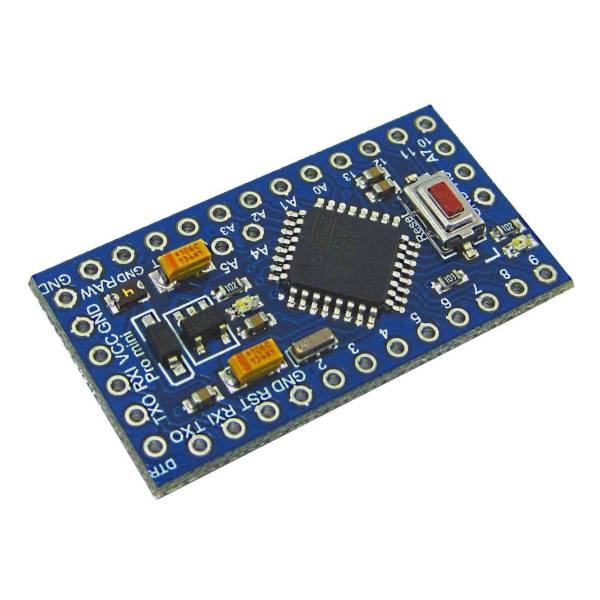

Arduino Port Expander
=====================

.. seo::
    :description: Instructions on using an Arduino board, like the Pro Mini for expanding ports of an ESPHome node
    :image: arduino_logo.svg
    :keywords: Arduino port expander extender ESPHome

With this sketch you can control pins of a remote Arduino board through ESPHome. The Arduino acts as a port
expander, allowing you to use more pins than a standard ESP8266/ESP32 has.

The Arduino is connected to the ESP via I²C. Most Arduinos use the ``A4`` and ``A5`` pins for the I²C bus
so those pins are not available to read from ESPHome.
It is recommended to use a 3.3V I/O level Arduino, however using 5V Arduinos seems to work too. In the latter
case you should power your 5V Arduino with 3.3V otherwise you will need a level converter for the
I²C bus.

Currently it is supported:

    - reading digital inputs
    - reading analog inputs
    - writing digital outputs

The Arduino sketch can be retrieved from `here <https://gist.github.com/glmnet/49ca3d6a9742fc3649f4fbdeaa4cdf5d#file-arduino_port_expander_sketch-ino>`__
you can rename it to ``.ino`` and use the Arduino IDE to program it.

You need to download `arduino_port_expander.h <https://gist.github.com/glmnet/49ca3d6a9742fc3649f4fbdeaa4cdf5d#file-arduino_port_expander-h>`__
and include the arduino_port_expander.h in the ESPHome configuration.

.. code-block:: yaml

    esphome:
      # ...
      includes:
          - arduino_port_expander.h

Setup your :ref:`I²C Bus <i2c>` and assign it an ``id``:

.. code-block:: yaml

    i2c:
      id: i2c_component

By default ESP8266 uses ``SDA`` pin ``GPIO4`` which you need to connect to Arduino's ``A4`` and the ``SCL``
is ``GPIO5`` which goes to Arduino's ``A5``.

Then create a ``custom_component``, this will be the main component we will be referencing later when creating
individual IOs.

.. code-block:: yaml

    custom_component:
      - id: ape
        lambda: |-
          auto ape_component = new ArduinoPortExpander(i2c_component, 0x08);
          return {ape_component};

By default the I²C address is ``0x08`` but you can change it on the Arduino sketch so you can have more devices
on the same bus.

Now it is time to add the ports.

Binary_Sensor
-------------

When adding binary sensors the pins are configured as INPUT_PULLUP, you can use any PIN from 0 to 13 or
``A0`` to ``A3`` (``A4`` and ``A5`` are used for I²C and ``A6`` and ``A7`` do not support internal pull up)

.. note::

    Arduino PIN 13 usually has a LED connected to it and using it as digital input with the built in internal
    pull up might be problematic, using it as an output is preferred.

To setup binary sensors, create a custom platform as below, list in braces all the sensors you want,
in the example below two binary sensors are declared on pin 9 and A0 (number 14)

Then declare the ESPHome reference of the binary sensor in the same order as declared in the lambda:

.. code-block:: yaml

    binary_sensor:
      - platform: custom
        lambda: |-
          return {ape_binary_sensor(ape, 9),
                  ape_binary_sensor(ape, 14) // 14 = A0
                  };

        binary_sensors:
          - id: binary_sensor_pin2
            name: Binary sensor pin 2
          - id: binary_sensor_pin3
            name: Binary sensor pin 3
            on_press:
              ...

The listed ``binary_sensors`` supports all options from :ref:`Binary Sensor <config-binary_sensor>` like
automations and filters.

Sensor
------

Sensors allows for reading the analog value of an analog pin, those are from ``A0`` to ``A7`` except for
``A4`` and ``A5``. The value returned goes from 0 to 1023 (the value returned by the Arduino ``analogRead``
function).

Arduino analog inputs measures voltage. By default the sketch is configured to use the Arduino internal VREF
comparer setup to 1 volt, so voltages bigger are read as 1023. You can configure Arduino to compare the
voltage to VIN voltage, this voltage might be 5 volts or 3.3 volts, depending on how you are powering it. To
do so, pass an additional true value to the hub constructor:

.. code-block:: cpp

    auto ape_component = new ArduinoPortExpander(i2c_component, 0x08, true);

To setup sensors, create a custom platform as below, list in braces all the sensors you want,
in the example below two sensors are declared on pin ``A1`` and ``A2``

Then declare the ESPHome reference of the sensor in the same order as declared in the lambda:

.. code-block:: yaml

    sensor:
      - platform: custom
        lambda: |-
          return {ape_analog_input(ape, 1),  // 1 = A1
                  ape_analog_input(ape, 2)};
        sensors:
          - name: Analog A1
            id: analog_a1
            filters:
              - throttle: 1s
          - name: Analog A2
            id: analog_a2
            filters:
              - throttle: 2s

The listed ``sensors`` supports all options from :ref:`Sensor <config-sensor>` like
automations and filters.

.. note::

    Sensors are polled by default every loop cycle so it is recommended to use the ``throttle`` filter
    to not flood the network.

Output
------

Arduinos binary outputs are supported in pins from 0 to 13.

To setup outputs, create a custom platform as below, list in braces all the outputs you want,
in the example below two outputs are declared on pin ``3`` and ``4``

.. code-block:: yaml

    output:
    - platform: custom
      type: binary
      lambda: |-
        return {ape_binary_output(ape, 3),
                ape_binary_output(ape, 4)};
      outputs:
        - id: output_pin_3
          inverted: true
        - id: output_pin_4
          inverted: true

    switch:
      - platform: output
        name: Switch pin 3
        output: output_pin_3

    light:
      - platform: binary
        name: Switch pin 4
        output: output_pin_4

Full Example
------------

Let's connect a 4 channel relay board and 2 push buttons to toggle the relays, a PIR sensor, a window and a door
a LM35 temperature sensor and a voltage sensor. Seems a bit too much for an ESP8266? You'll still have some
spares I/Os.

.. code-block:: yaml

    esphome:
      name: test_arduino
      includes:
        - arduino_port_expander.h

    esp8266:
      board: nodemcu

    wifi:
      ssid: !secret wifi_ssid
      password: !secret wifi_password

    api:

    ota:

    # define i2c device
    # for an ESP8266 SDA is D2 and goes to Arduino's A4
    #                SCL is D1 and goes to Arduino's A5
    i2c:
      id: i2c_component

    logger:
      level: DEBUG

    # define the port expander hub, here we define one with id 'expander1',
    # but you can define many
    custom_component:
      - id: expander1
        lambda: |-
          auto expander = new ArduinoPortExpander(i2c_component, 0x08, true);
          return {expander};

    # define binary outputs, here we have 4, as the relays are inverse logic
    # (a path to ground turns the relay ON), we defined the inverted: true
    # option of ESPHome outputs.
    output:
    - platform: custom
      type: binary
      lambda: |-
        return {ape_binary_output(expander1, 2),
                ape_binary_output(expander1, 3),
                ape_binary_output(expander1, 4),
                ape_binary_output(expander1, 5)};

      outputs:
        - id: relay_1
          inverted: true
        - id: relay_2
          inverted: true
        - id: relay_3
          inverted: true
        - id: relay_4
          inverted: true

    # connect lights to the first 2 relays
    light:
      - platform: binary
        id: ceiling_light
        name: Ceiling light
        output: relay_1
      - platform: binary
        id: room_light
        name: Living room light
        output: relay_2

    # connect a fan to the third relay
    fan:
    - platform: binary
      id: ceiling_fan
      output: relay_3
      name: Ceiling fan

    # connect a pump to the 4th relay
    switch:
      - platform: output
        name: Tank pump
        id: tank_pump
        output: relay_4

    # define binary sensors, use the Arduino PIN number for digital pins and
    # for analog use 14 for A0, 15 for A1 and so on...
    binary_sensor:
      - platform: custom
        lambda: |-
          return {ape_binary_sensor(expander1, 7),
                  ape_binary_sensor(expander1, 8),
                  ape_binary_sensor(expander1, 9),
                  ape_binary_sensor(expander1, 10),
                  ape_binary_sensor(expander1, 14) // 14 = A0
                  };

        binary_sensors:
          - id: push_button1
            internal: true # don't show on HA
            on_press:
              - light.toggle: ceiling_light
          - id: push_button2
            internal: true # don't show on HA
            on_press:
              - light.toggle: room_light
          - id: pir_sensor
            name: Living PIR
            device_class: motion
          - id: window_reed_switch
            name: Living Window
            device_class: window
          - id: garage_door
            name: Garage garage
            device_class: garage_door

    # define analog sensors
    sensor:
      - platform: custom
        lambda: |-
          return {ape_analog_input(expander1, 1),  // 1 = A1
                  ape_analog_input(expander1, 2)};
        sensors:
          - name: LM35 Living room temperature
            id: lm35_temp
            filters:
              # update every 60s
              - throttle: 60s
              # LM35 outputs 0.01v per ºC, and 1023 means 3.3 volts
              - lambda: return x * 330.0 / 1023.0;
          - name: Analog A2
            id: analog_a2
            filters:
              - throttle: 2s

See Also
--------

- :ghedit:`Edit`
