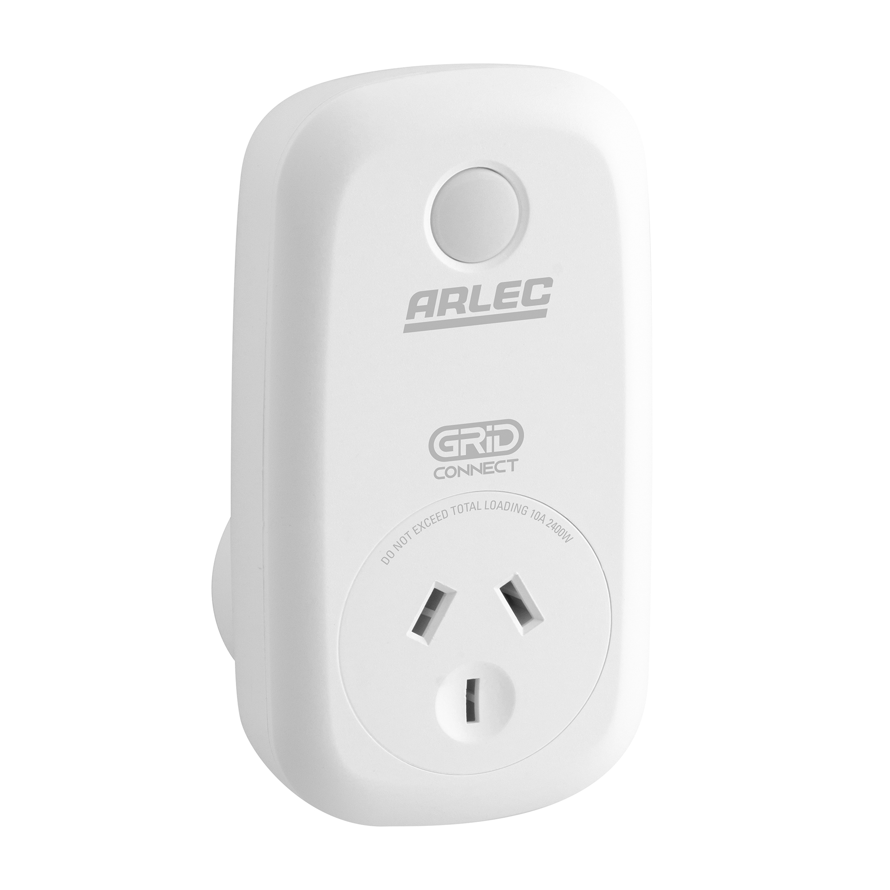
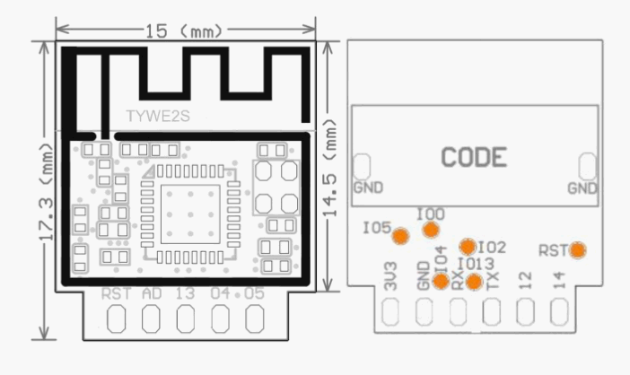
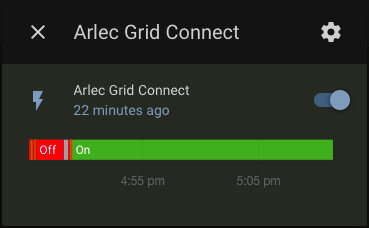

Arlec Grid Connect Smart Plug
=============================

Arlec Grid Connect Smart Plugs are a tuya based smart plugs sold in Australia. 

These plugs can be flashed with a bit of work.

Flashing
--------

Prerequisites
*************

#. Before you begin you'll need:

#. Computer running Windows, Mac or Linux.
#. Serial to FTDI adapter. (Arduino can also be used.) 
#. Jumper wires.
#. Soldering iron. (can be done without but may be harder.)

Take a look at :doc:`/guides/getting_started_command_line` or :doc:`/guides/getting_started_hassio` to get ESPHome installed.

Configuration
-------------

Copy the code below and paste it into your ``name_of_esphome_configuration.yaml`` file. Be sure to add your own SSID and Password where marked. Compile the firmware in the dashboard interface by clicking COMPILE with the ESPHome code below. Download the Binary and use the .bin file that is generated when uploading.

.. code-block:: yaml

    esphome:
      name: arlec_grid_connect
      platform: ESP8266
      board: esp8285

    # Add your own SSID and password below
    wifi:
      ssid: "SSID" 
      password: "PASSWORD"

    # Enable logging
    logger:

    # Enable Home Assistant API
    api:

    ota:

    status_led:
      pin:
        number: GPIO13
        inverted: true

    binary_sensor:
      - platform: gpio
        pin:
          number: GPIO14
          mode: INPUT_PULLUP
          inverted: true
        id: button
        on_press:
          - switch.toggle: relay

    switch:
      - platform: gpio
        id: led
        pin:
          number: GPIO4
          inverted: true
      - platform: gpio
        id: relay
        name: "Arlec Grid Connect"
        pin: GPIO12
        on_turn_on:
          - switch.turn_on: led
        on_turn_off:
          - switch.turn_off: led

Connections
***********

The Arlec Grid Connect uses the TYWE2S Tuya module, which can easily be flashed with these connections.

Here is the pinout:

RX -- TX

TX -- RX

3.3v -- 3.3v

GND -- GND

IO0 -- GND (Only needs to be done at boot to enter flashing mode.)

If you are using an Arduino, connect the RST pin to GND to disable the microcontroller and only use as a flashing device.

More information on uploading to the TYWE2S can be found here: `TYWE2S <https://github.com/arendst/Sonoff-Tasmota/wiki/CE-Smart-Home---LA-WF3-Wifi-Plug-(TYWE2S)>`_

Uploading
*********

Use ESPHome-flasher to flash the firmware as it is pre-made for ESPHome.

Set the mode to DOUT as DIO and QIO will not work for the ESP8265 chip this device uses.

Make sure erase flash is on.
          
4. Adding to Home Assistant
---------------------------

You can now add your Arlec Grid Connect to Home Assistant via the configurations page, look for 'ESPHome' under the Integrations option and click 'Configure'. Now follow the on-screen instructions to get it set up and working with Home Assistant

See Also
--------

- :doc:`/components/switch/index`
- :doc:`/components/binary_sensor/index`
- :doc:`/components/output/index`
- :doc:`/guides/automations`
- :ghedit:`Edit`
