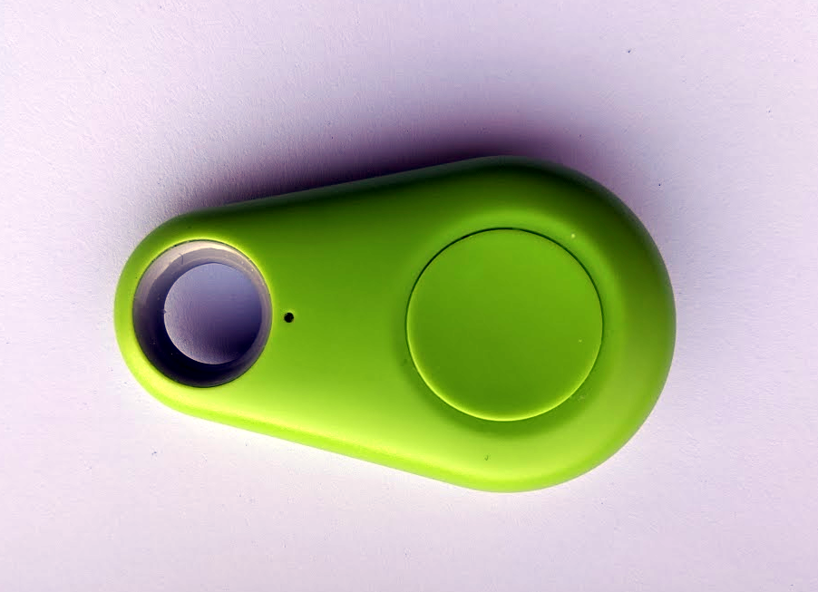

BLE iTag Button
===============

.. seo::
    :description: Receive events from a cheap BLE keyring button.
    :image: bluetooth.svg

This example shows how to use a cheap BLE keyring tag to trigger arbitrary
events. An ESP32 is used, which provides a BLE peripheral.

These tags can be had for a couple of dollars each and run for several months
on a coin cell. Using the BLE features of ESPHome, you can use these as small
and cheap remotes to control any automation.

Quickstart
----------

Use the configuration block below for a basic setup which will provide a
binary_sensor that is momentarily turned on when the button is pressed.

You will need to find the MAC address of your tag. See the documentation
for :doc:`/components/ble_client` for how to find this out. You may also
wish to change the name and id fields where appropriate to suit your
device(s).

Note that a maximum of three devices are supported due to limitations in
the ESP32's BLE stack.

Configuration example:
------------------------

.. code-block:: yaml

    esp32_ble_tracker:

    ble_client:
      # Replace with the MAC address of your device.
      - mac_address: FF:FF:20:00:0F:15
        id: itag_black

    binary_sensor:
      - platform: template
        id: black_button
        name: "Black iTag Button"
        filters:
          delayed_off: 200ms

    sensor:
    # This entry registers and awaits notifications for the
    # characteristic that signals button presses. Each time
    # a notification is received, the corresponding binary_sensor
    # is briefly toggled.
      - platform: ble_client
        type: characteristic
        ble_client_id: itag_black
        name: "Black iTag btn"
        service_uuid: 'ffe0'
        characteristic_uuid: 'ffe1'
        notify: true
        update_interval: never
        on_notify:
          then:
            - binary_sensor.template.publish:
                id: black_button
                state: ON
            - binary_sensor.template.publish:
                id: black_button
                state: OFF
    # This entry queries the battery level. Some tags may not
    # support this characteristic, you will see 'Unknown' in the
    # HA frontend.
      - platform: ble_client
        type: characteristic
        ble_client_id: itag_black
        name: "Black iTag Battery"
        service_uuid: '180f'
        characteristic_uuid: '2a19'
        icon: 'mdi:battery'
        unit_of_measurement: '%'
    # This entry queries polls the RSSI when the tag is connected.
      - platform: ble_client
        type: rssi
        ble_client_id: itag_black
        name: "Black iTag RSSI"

Explanation
-----------

The first thing enabled is the ``esp32_ble_tracker`` component. This sets up
the BLE stack on the device and listens for available devices.

Next, the ``ble_client`` component will listen to devices discovered by
the tracker, and establish a connection to the given device when it is
available.

The ``binary_sensor`` provides a template sensor which will export to the
HA frontend the sensor that's switched by the BLE tag's button.

The first entry in the ``sensor`` component is used to configure the specific
Service and Characteristic UUIDs for an iTag's button. It also enables BLE
notifications and sets up an automation to toggle the ``binary_sensor`` when
a notification is received from the tag. Automatic updates are disabled, there
is no point querying the tag for the device state, as we will be immediately
notified when the button is pressed.

The next ``sensor`` entry listens for a well-known Service and Chacteristic
that is used by many BLE devices to give battery level information. This sensor
will be exposed in the HA frontend to determine the state of the tag's battery.
Note that many tags will not provide this service, so you will not see a valid
value. If not, you can remove this from the config.

See Also
--------

- :doc:`/components/ble_client`
- :doc:`/components/sensor/ble_client`
- :ghedit:`Edit`
