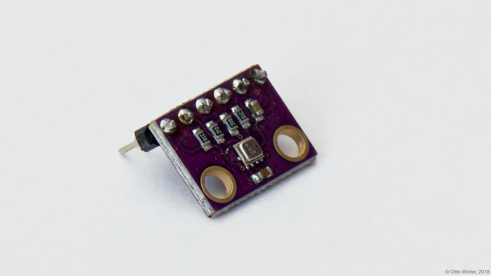

BME280 Environment
==================

.. seo::
    :description: Instructions for setting up BME280 sensors in ESPHome and calculate altitude, absolute humidity, and sea level pressure.
    :image: bme280.jpg
    :keywords: BME280

The :doc:`/components/sensor/bme280` is a simple temperature, humidity, and pressure sensor with communication over :ref:`I²C <i2c>` or :ref:`SPI <spi>`.
With some simple math it is possible to either determine the height of the sensor, or the current pressure at sea level.
This guide can be applied to any sensor measuring temperature and pressure at the same time, like the
:doc:`/components/sensor/bmp280`, or :doc:`/components/sensor/bme680`.

The first step is to connect the sensor as described :doc:`here </components/sensor/bme280>`.
After validating the sensor is working, we can proceed and add some formulas.
In the example below, modify ``platform: bme280`` as appropriate for your hardware (either ``bme280_i2c`` or ``bme280_spi``). See :doc:`/components/sensor/bme280` for specific details.

.. code-block:: yaml

    sensor:
      - platform: bme280_i2c
        temperature:
          name: "BME280 Temperature"
          id: bme280_temperature
        pressure:
          name: "BME280 Pressure"
          id: bme280_pressure
        humidity:
          name: "BME280 Relative Humidity"
          id: bme280_humidity
        address: 0x77
        update_interval: 15s
      - platform: template
        name: "Altitude"
        lambda: |-
          const float STANDARD_SEA_LEVEL_PRESSURE = 1013.25; //in hPa, see note
          return ((id(bme280_temperature).state + 273.15) / 0.0065) *
            (powf((STANDARD_SEA_LEVEL_PRESSURE / id(bme280_pressure).state), 0.190234) - 1); // in meter
        update_interval: 15s
        icon: 'mdi:signal'
        unit_of_measurement: 'm'
      - platform: absolute_humidity
        name: "Absolute Humidity"
        temperature: bme280_temperature
        humidity: bme280_humidity
      - platform: template
        name: "Dew Point"
        lambda: |-
          return (243.5*(log(id(bme280_humidity).state/100)+((17.67*id(bme280_temperature).state)/
          (243.5+id(bme280_temperature).state)))/(17.67-log(id(bme280_humidity).state/100)-
          ((17.67*id(bme280_temperature).state)/(243.5+id(bme280_temperature).state))));
        unit_of_measurement: °C
        icon: 'mdi:thermometer-alert'

Altitude and absolute humidity:
-------------------------------

The first block ``sensor`` starts with the normal bme280 sensor components ``temperature``, ``pressure``,
and ``humidity`` with each their own id.
After the bme280 sensor, a :doc:`/components/sensor/template` is defined to calculate the altitude in a lambda.
The variable ``STANDARD_SEA_LEVEL_PRESSURE`` (in hPa), should be filled in for your location.
The formula derived from `here <https://github.com/finitespace/BME280/blob/master/src/EnvironmentCalculations.cpp>`__,
converts the currently measured pressure to the altitudes in meters including temperature compensation.

The second block uses the :doc:`/components/sensor/absolute_humidity` component which
converts the currently measured temperature and relative humidity to absolute humidity (grams/m^3).

.. note::

    Calculating the altitude with the BME280 sensor accurately requires this value to be known at sea level for your location and day.

    This can be achieved by replacing the global constant ``STANDARD_SEA_LEVEL_PRESSURE`` by for example
    pulling this value live from the internet or a stationary sensor via MQTT.

Equivalent sea level pressure:
------------------------------

Calculating the sea level pressure with a statically mounted sensor can be used as reference for moving sensors as mentioned in the note above.

.. code-block:: yaml

    sensor:
      - platform: bme280
        temperature:
          name: "BME280 Temperature"
          id: bme280_temperature
        pressure:
          name: "BME280 Pressure"
          id: bme280_pressure
        humidity:
          name: "BME280 Relative Humidity"
          id: bme280_humidity
        address: 0x77
        update_interval: 15s
      - platform: template
        name: "Equivalent sea level pressure"
        lambda: |-
          const float STANDARD_ALTITUDE = 0.6; // in meters, see note
          return id(bme280_pressure).state / powf(1 - ((0.0065 * STANDARD_ALTITUDE) /
            (id(bme280_temperature).state + (0.0065 * STANDARD_ALTITUDE) + 273.15)), 5.257); // in hPa
        update_interval: 15s
        unit_of_measurement: 'hPa'

.. note::

    For calculating the equivalent sea level pressure, the sensor needs to be mounted at a fixed altitude.
    Therefore it is not possible to calculate altitude at the same time, and vice versa!

Formula explanation
-------------------

- `Altitude calculation <https://en.wikipedia.org/wiki/Atmospheric_pressure#Altitude_variation>`__
- `Dew Point calculation <https://carnotcycle.wordpress.com/2017/08/01/compute-dewpoint-temperature-from-rh-t/>`__

See Also
--------

- :doc:`/components/sensor/absolute_humidity`
- :doc:`/components/sensor/template`
- :doc:`/components/sensor/bme280`
- :ghedit:`Edit`
