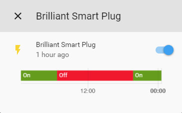

Brilliant / Mirabella Genio Smart Plugs
=======================================

Brilliant / Mirabella Genio Smart Plugs are a Tuya-based smart plugs sold by Bunnings and Kmart respectively in Australia.

Originally intended to be used with their companion apps once flashed using `tuya-convert <https://github.com/ct-Open-Source/tuya-convert>`__ ESPHome generated
firmware can be uploaded allowing you to control the smart plugs via Home Assistant.

1. Create the ESPHome Firmware
------------------------------

#. Refer to either :doc:`/guides/getting_started_command_line` or :doc:`/guides/getting_started_hassio` before moving onto the next step.
#. Select a plug configuration below based on the plug/s you have and copy all of the text in the code block and paste into your
   ``name_of_esphome_configuration.yaml`` file.
#. Compile the firmware, again depending on your chosen setup refer to the guides in the first point.

2. Flashing
-----------

2.1 Prerequisites
*****************

#. Before you begin you'll need one of the following Linux machines running the latest copy of `Raspbian Stretch Lite
   <https://www.raspberrypi.org/downloads/raspbian/>`__

  a. Raspberry Pi 2B/B+ with `USB WiFi Dongle <https://www.raspberrypi.org/products/raspberry-pi-usb-wifi-dongle/>`__.
  b. Raspberry Pi 3B/B+.

.. note::

    As per the `tuya-convert documentation <https://github.com/ct-Open-Source/tuya-convert/blob/master/README.md#requirements>`__:

    Any Linux with a Wifi adapter which can act as an Access Point should also work. Please note that we have tested the Raspberry Pi with clean installations
    only. If you use your Raspberry Pi for anything else, we recommend using another SD card with a clean installation.

#. A microSD card (minimum 2GB, 8GB+ recommended).
#. Any WiFi device which can connect to the SSID generated by the Raspberry Pi and eventually the flashed Tuya device. **This cannot be an iOS / Apple device.
   Android devices will work.**

2.2 Installing the OS
*********************

#. It's recommended to read the documentation provided by the Raspberry Pi Foundation on the best way to flash the OS to the microSD card depending on your
   platform - `Installing operating system images <https://www.raspberrypi.org/documentation/installation/installing-images/>`__.
#. After you've flashed the microSD card browse to the "boot" partition and add a blank file called "ssh" **(without any extension)** which will enable the
   SSH server upon first boot, extended information on this step can be found `here
   <https://www.raspberrypi.org/documentation/remote-access/ssh/README.md#3-enable-ssh-on-a-headless-raspberry-pi-add-file-to-sd-card-on-another-machine>`__.
#. Plug the microSD card into the Raspberry Pi, connect network cable and power, the Raspberry Pi will start to boot.

2.3 Connecting to the Pi via SSH
********************************

#. Download and install `Putty <https://www.chiark.greenend.org.uk/~sgtatham/putty/latest.html>`__.
#. Open Putty.
#. Enter the IP of Raspberry Pi in the box that says "Host Name", leaving the port set to 22 (default for SSH). A list of recommended ways can be found `here
   <https://www.raspberrypi.org/documentation/remote-access/ip-address.md>`__, but the easiest is to download and use `Fing <https://www.fing.com/>`__
   (`Android <https://play.google.com/store/apps/details?id=com.overlook.android.fing&hl=en_GB>`__ / `iOS
   <https://itunes.apple.com/us/app/fing-network-scanner/id430921107?mt=8>`__).
#. In the "Saved Sessions" input box, name the Raspberry Pi connection and then press "Save".
#. Select your new saved session from the list.
#. Press "Open".

2.4 Configuring the Pi
**********************

#. In the putty window login with the **pi** as the user and **raspberry** for the password.
#. Type ``sudo apt-get update && sudo apt-get dist-upgrade -y`` and wait for the upgrades to install.
#. Type ``sudo apt-get install git`` and wait for it to install.

2.5 Setup and Install tuya-convert
**********************************

#. In the putty window type ``git clone https://github.com/ct-Open-Source/tuya-convert`` press enter and wait while the repository is cloned.
#. Type ``cd tuya-convert`` and press enter.
#. Type ``./install_prereq.sh`` press enter and wait as the script gathers all the required components needed to function.

2.6 Upload ESPHome Firmware using SFTP
**************************************

#. Download `FileZilla <https://filezilla-project.org/download.php?type=client>`__ or `WinSCP <https://winscp.net/eng/index.php>`__ or use your preferred FTP
   client.
#. Depending on the program you need to connect to the Pi using the IP address as the hostname and the username and password the same as you used to connect
   via SSH and ensure your connection type is set to **SFTP**
#. Browse to ``/root/tuya-convert/files``.
#. Upload your compiled ``firmware.bin`` file to this directory. For command line based installs you can access the file under
   ``<CONFIG_DIR>/<NODE_NAME>/.pioenvs/<NODE_NAME>/firmware.bin`` alternatively Hass.io users can download the file directly from the web ui.

2.7 Use tuya-convert to install ESPHome Firmware
************************************************

#. Type ``./start_flash.sh``
#. Type ``yes`` to accept the warning.
#. Connect your alternative WiFi device (non iOS / Apple based) to the ``vtrust-flash`` SSID using ``flashmeifyoucan`` as the password. This is the network
   being broadcast by the Pi from the tuya flash script.
#. If you haven't already connect your smart plug and turn it on. It should automatically enter pairing mode, if it doesn't follow the instructions below:

   * Brilliant `(PDF Manual) <https://www.brilliantsmart.com.au/wp-content/uploads/2019/02/03.-How-to-setup-the-Smart-plug.pdf>`__

    * To connect the Smart WiFi Plug to your WiFi press and hold the manual control button for about 5 seconds until you hear a click. Let go of the button
      as soon as you hear the **click**. Then press button once again to activate blinking. **The red indicator light should now blink rapidly (2 times per
      second)**.

   * Mirabella `(PDF Manual) <https://img1.wsimg.com/blobby/go/67cdd3b9-3600-4104-b097-603c05201237/downloads/1cq5h6nt7_336441.pdf>`__

    * To do this, ensure your plug is on (the indicator light should be blue), hold the power button down for 5 seconds until you hear a click, let go of the
      power button and then press the button once to activate.

#. Press enter on your putty window to start the flash process and wait. If the connection is successful you should see a large amount of scrolling text, this
   is the script backing up the factory shipped firmware.
#. Once the process is complete you can type ``curl http://10.42.42.42/flashURL?url=http://10.42.42.1/files/firmware.bin``
#. The plug will restart and if everything is working correctly after a few seconds you should be able to press the button triggering the relay and turning the
   blue led on.

3. Smart Plug Configurations
----------------------------

Thanks to the existing work by `@ideasman69 <https://github.com/ct-Open-Source/tuya-convert/issues/66>`__ and
`afalzon <https://github.com/arendst/Sonoff-Tasmota/wiki/Mirabella-Genio-Smart-Plug>`__
which these adaptions created by `@cryptelli <https://community.home-assistant.io/u/cryptelli>`__ are based on.

3.1 Brilliant Smart Plug
************************

.. code-block:: yaml

    esphome:
      name: brilliant_smart_plug
      platform: ESP8266
      board: esp01_1m

    wifi:
      ssid: 'WIFI'
      password: 'WIFIPASS'

    logger:

    api:

    ota:

    binary_sensor:
      - platform: gpio
        pin:
          number: 14
          mode: INPUT_PULLUP
          inverted: true
        name: "Power Button"
        on_press:
          - switch.toggle: relay

      - platform: status
        name: "Status"

    switch:
      - platform: gpio
        id: red_led
        pin:
          number: GPIO12
          inverted: true

      - platform: gpio
        name: "Brilliant Smart Plug"
        pin: GPIO5
        id: relay

        # Turn off red LED to show blue when turned on
        on_turn_on:
          - switch.turn_off: red_led

        # Turns on the red LED once the plug is turned off. Stock plug doesn't do this, to restore normal behavior remove the on_turn_on and on_turn_off
        # blocks.
        on_turn_off:
          - switch.turn_on: red_led

3.2 Mirabella Genio Wi-Fi 1 USB Adaptor
***************************************

.. code-block:: yaml

    esphome:
      name: mirabella_genio_smart_plug
      platform: ESP8266
      board: esp01_1m

    wifi:
      ssid: 'WIFI'
      password: 'WIFIPASS'

    logger:

    api:

    ota:

    binary_sensor:
      - platform: gpio
        pin:
          number: GPIO13
          mode: INPUT_PULLUP
          inverted: true
        name: "Power Button"
        on_press:
          - switch.toggle: relay
      - platform: status
        name: Status

    switch:
      - platform: gpio
        id: red_led
        pin:
          number: GPIO4
          inverted: true

      - platform: gpio
        name: "Mirabella Genio Smart Plug"
        pin: GPIO12
        id: relay

        # Turn on red LED
        on_turn_on:
          - switch.turn_on: red_led

        # Turns off red LED
        on_turn_off:
          - switch.turn_off: red_led

3.3 Gosund SP1
**************

.. code-block:: yaml

    esphome:
      name: gosund_sp1_smart_plug
      platform: ESP8266
      board: esp8285

    wifi:
      ssid: 'WIFI'
      password: 'WIFIPASS'

    logger:

    api:

    ota:

    binary_sensor:
      - platform: gpio
        pin:
          number: GPIO3
          inverted: True
        name: "Power Button"
        on_press:
          - switch.toggle: relay

    switch:
      - platform: gpio
        id: led
        pin: GPIO1

      - platform: gpio
        name: "Gosund SP1 Smart Plug"
        pin: GPIO14
        id: relay
        on_turn_on:
          - switch.turn_on: led
        on_turn_off:
          - switch.turn_off: led

    sensor:
      - platform: hlw8012
        sel_pin:
          number: GPIO12
          inverted: True
        cf_pin: GPIO04
        cf1_pin: GPIO05
        current_resistor: 0.00221
        voltage_divider: 871
        current:
          name: "Gosund SP1 Smart Plug current"
          unit_of_measurement: A
        voltage:
          name: "Gosund SP1 Smart Plug Voltage"
          unit_of_measurement: V
        power:
          name: "Gosund SP1 Smart Plug Wattage"
          unit_of_measurement: W
          id: "energy_temp_Wattage"
        change_mode_every: 8
        update_interval: 10s

Check the following page for calibrating the measurements: :ref:`sensor-filter-calibrate_linear`.

3.4 Topersun WL-SC01 Smart Plug
*******************************

.. code-block:: yaml

    esphome:
      name: topersun_smart_plug
      platform: ESP8266
      board: esp01_1m

    wifi:
      ssid: 'WIFI'
      password: 'WIFIPASS'

    logger:

    api:

    ota:

    binary_sensor:
      - platform: gpio
        pin:
          number: 14
          mode: INPUT_PULLUP
          inverted: true
        name: "Power Button"
        on_press:
          - switch.toggle: relay

      - platform: status
        name: "Status"

    switch:
      - platform: gpio
        id: green_led
        pin:
          number: GPIO4
          inverted: true

      - platform: gpio
        name: "Brilliant Smart Plug"
        pin: GPIO12
        id: relay

        # Turn off green LED to show red when turned on.
        on_turn_on:
          - switch.turn_off: green_led

        # Turns on the green LED once the plug is turned off.
        on_turn_off:
          - switch.turn_on: green_led

3.5 NEO Coolcam wifi smart plug
*******************************

.. code-block:: yaml

    substitutions:
      plug_name: coolcam_plug1
      # Higher value gives lower watt readout
      current_res: "0.00221"
      # Lower value gives lower voltage readout
      voltage_div: "800"

    esphome:
      name: ${plug_name}
      platform: ESP8266
      board: esp8285

    wifi:
      ssid: 'WIFI'
      password: 'WIFIPASS'

    logger:

    api:

    ota:

    binary_sensor:
      - platform: gpio
        pin:
          number: GPIO0
          inverted: True
        name: "${plug_name}_button"
        on_press:
          - switch.toggle: relay

    switch:
      - platform: gpio
        name: "${plug_name}_LED_Red"
        pin: GPIO13
        inverted: True
        restore_mode: ALWAYS_OFF
        id: red_led

      - platform: gpio
        name: "${plug_name}_Relay"
        pin: GPIO14
        restore_mode: ALWAYS_ON
        id: relay    

        on_turn_on:
          - switch.turn_on: red_led    

        on_turn_off:
          - switch.turn_off: red_led      

    sensor:
      - platform: hlw8012
        sel_pin:
          number: GPIO12
          inverted: True
        cf_pin: GPIO04
        cf1_pin: GPIO05
        current_resistor: ${current_res}
        voltage_divider: ${voltage_div}
        current:
          name: "${plug_name}_Amperage"
          unit_of_measurement: A
        voltage:
          name: "${plug_name}_Voltage"
          unit_of_measurement: V
        power:
          name: "${plug_name}_Wattage"
          unit_of_measurement: W
          id: "${plug_name}_Wattage"
        change_mode_every: 8
        update_interval: 10s
      - platform: total_daily_energy
        name: "${plug_name}_Total Daily Energy"
        power_id: "${plug_name}_Wattage"
        filters:
            # Multiplication factor from W to kW is 0.001
            - multiply: 0.001
        unit_of_measurement: kWh

    # Extra sensor to keep track of plug uptime
      - platform: uptime
        name: ${plug_name}_Uptime SensorPreformatted text

3.6 Arlec Grid Connect Smart Plug In Socket With 2.1A USB Charger
*****************************************************************

.. code-block:: yaml

    substitutions:
      item_name: "arlec_pc389ha_001"

    esphome:
      name: ${item_name}
      platform: ESP8266
      board: esp01_1m

    wifi:
      ssid: 'WIFI'
      password: 'WIFIPASS'

      # Enable fallback hotspot (captive portal) in case wifi connection fails
      ap:
        ssid: ${item_name}

    captive_portal:

    # Enable logging
    logger:

    # Enable Home Assistant API
    api:

    ota:

    binary_sensor:
      - platform: gpio
        pin:
          number: 14
          mode: INPUT_PULLUP
          inverted: true
        name: "${item_name}_button"
        on_press:
          - switch.toggle: relay

      - platform: status
        name: "${item_name}_status"

    switch:
      - platform: gpio
        id: blue_led
        pin:
          number: GPIO4
          inverted: true

      - platform: gpio
        id: red_led
        pin:
          number: GPIO13
          inverted: true

      - platform: gpio
        name: "${item_name}_power"
        pin: GPIO12
        id: relay
        on_turn_on:
          # Turn off blue LED to show blue when turned on
          - switch.turn_off: red_led
          - switch.turn_on: blue_led
        on_turn_off:
          # Turns on the blue LED once the plug is turned off
          - switch.turn_off: blue_led
          - switch.turn_on: red_led

    sensor:
      - platform: wifi_signal
        name: "${item_name}_wifi_signal"
        update_interval: 60s
        

4. Adding to Home Assistant
---------------------------

You can now add your smart plug to home assistant via the configurations page, look for 'ESPHome' under the Integrations option and click 'Configure'.

See Also
--------

- :doc:`/components/switch/index`
- :doc:`/components/binary_sensor/index`
- :doc:`/components/light/index`
- :doc:`/components/light/monochromatic`
- :doc:`/components/output/index`
- :doc:`/components/output/esp8266_pwm`
- :doc:`/guides/automations`
- :ghedit:`Edit`
