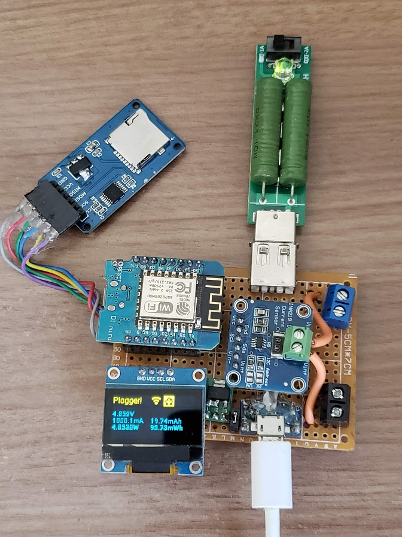
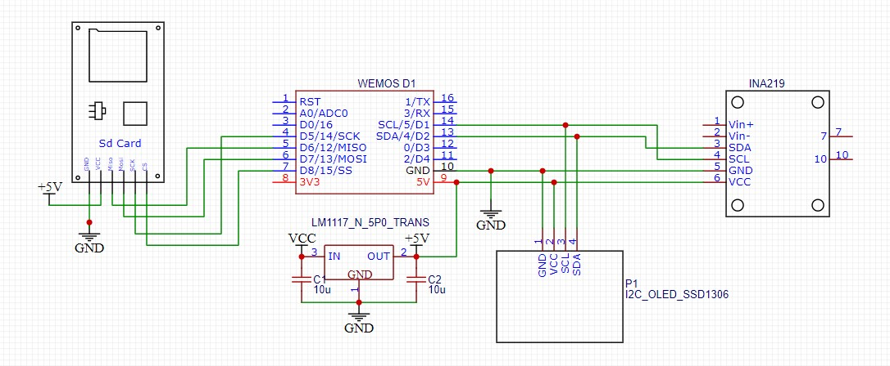
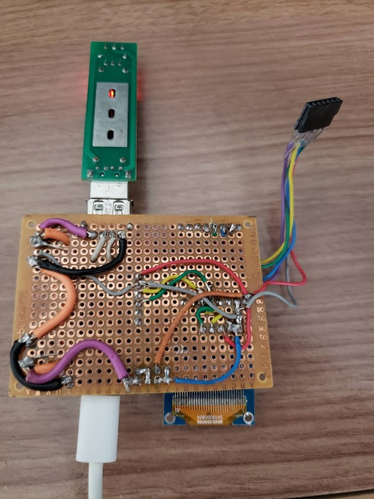

DC Power Logger
===============

.. seo::
    :description: Instructions on how to build a connected power logger with ESPHome
    :image: plogger-complete.jpg
    :keywords: power logger sdcard usb consumption meter

There are lots of awesome power logger projects around the internet, but none of them 
have the the flexibility of integrating nicely with everything that ESPHome provides.

In this project we will build an all-in-one power meter/logger around the common INA219
current sensor, making a custom component to handle the power to energy integration and, in
addition to the given Homeassistant connectivity, we will make it capable of logging to a
sdcard just for good measure.

Inputs
------

As a power metering device, there are only two inputs we are interested in: 
``Current`` and ``Voltage``. Luckly, the :doc:`/components/sensor/ina219` 
gets the job done in that regard, so the first step is to setup this sensor
using the existing documentation. 

However, if we wanted to know if that battery really had a 6000mAh capacity or how
much energy has been used by a device, we would need to know a bit more about how
much time that device spent drawing that much power.

Custom Sensor
-------------

Of course we could use the sensor's ``update_interval`` and build from that, but to get
accurate energy readings we need to have frequent power readings, even better if we can
know exactly how long it took between each one of them. This order of resolution is not
available through the existing sensor integration, and that is why we need a custom one.
Below is the code defining this sensor, you have to create a "power_logger.h" inside the 
"esphome" folder that should be on your default config folder.

.. code-block:: c++

    #include "esphome.h"
    #include "SD.h"
    
    #define LOGFILENAME "plogger.csv"
    
    class powerLogger : public Component, public Sensor {
    public:
        /**
         * The constructor of the powerLogger class receives references for the current
         * and voltage sensors created by the INA219 integration and uses their internal
         * values to efficiently do the calculations
         *
         * @param int_dt    Internal deltaT, The minimum timestep for pooling the measurements
         * @param inaCurr   Current sensor reference, received through the id(SENSOR_ID)
         * @param inaColt   Voltage sensor reference, received through the id(SENSOR_ID)
         * @param ina       Actual Component reference, received through the id(COMPONENT_ID)
         * 
         */
        powerLogger(uint16_t int_dt, Sensor *inaCurr, Sensor *inaVolt, PollingComponent *ina) : 
            int_dt(int_dt), inaCurrent(inaCurr), inaVoltage(inaVolt), inaComp(ina) {}
        
        float get_setup_priority() const override { return esphome::setup_priority::DATA; }
        
        Sensor *capacity = new Sensor();
        Sensor *energy = new Sensor();
        Sensor *sdLog = new Sensor();
    
        uint16_t int_dt;
    
        Sensor *inaCurrent = nullptr;
        Sensor *inaVoltage = nullptr;
        PollingComponent *inaComp = nullptr;
    
        const int chipSelect = D8;  // used for ESP8266
        bool sdCardPresent = true;
    
        unsigned long last_measurement = 0;
        float net_mah = 0.0f;    
        float net_wh = 0.0f;
    
        float last_c = 0.0f;
        float last_v = 0.0f;
    
        void setup() override {
            ESP_LOGD("custom", "Sending hello from plogger");
            inaComp->update();
            last_c = getCurr();
            last_v = getVolt();
    
            if(!SD.begin(chipSelect)){
                sdCardPresent = false;
                ESP_LOGE("custom","SDCARD Initialization failed!");
            } else if (!SD.exists(LOGFILENAME)){
                File dataFile = SD.open(LOGFILENAME, FILE_WRITE);
                if(dataFile){ 
                    //Create the CSV header 
                    dataFile.println("Voltage,Current,Power,mAh,mWh,Dt");
                    dataFile.close();
                }
            }
    
            // Publish the SDCard presence so we can show it on the display
            sdLog->publish_state((int)sdCardPresent);
        }
    
        void loop() override {
            if(millis() > last_measurement + int_dt){
                inaComp->update();
                unsigned long dt = millis() - last_measurement;
                last_measurement += dt;
                float new_c = getCurr();
                float new_v = getVolt();
                
                //Integrate through the midpoint method
                float dmah = (((new_c - last_c)/2.0f)+last_c);
                if(dmah != 0.0f){ //Spare the calculations if value is zero
                    dmah *= ((float)dt/3600.0f); //convert our current uAs to mAh           
                    float dwh = (((new_v - last_v)/2.0f)+last_v)*dmah;
                    
                    net_mah += dmah;
                    net_wh += dwh;
                }
                
                ESP_LOGVV("custom", "mAh: %.5f || mWh: %.5f || Dt: %lu", net_mah, net_wh, dt);
                capacity->publish_state(net_mah);
                energy->publish_state(net_wh);
    
                last_c = new_c;
                last_v = new_v;
    
                if(sdCardPresent){
                    File dataFile = SD.open(LOGFILENAME, FILE_WRITE);
                    if(dataFile){     
                        // Write a new csv line to the sdcard
                        //             Voltage(V),Current(A),Power(W),mAh,mWh,Dt
                        dataFile.printf("%.3f,%.5f,%.4f,%.3f,%.3f,%lu\n",new_v, new_c, new_v*new_c, net_mah, net_wh, dt);
                        dataFile.close();
                    }else{
                        //if the file opening failed, disable sdcard altogether
                        sdCardPresent = false;
                        sdLog->publish_state((int)sdCardPresent);
                    }
                }
            }
        }
    
        //Helper functions to get the raw sensor data and do some filtering beforehand
        float getCurr(){
            float value = inaCurrent->raw_state;
            if(fabs(value) < 0.0002) value = 0.0;
            return value;
        }
    
        float getVolt(){
            float value = inaVoltage->raw_state;
            return value;
        }
    
        // In case we would need to reset the values without reseting the whole node
        void resetCapacity(){
            net_mah = 0.0f;
        }
    
        void resetEnergy(){
            net_wh = 0.0f;
        }
    };
 
The details of building a custom sensors are present at the :doc:`/components/sensor/custom`
documentation.

.. note::

    This is not the best implementation on how to write to a SDCard, so if you are planning
    on making really long logs (days, weeks) it would be better to write to an internal buffer
    first to reduce the frequency of writes and avoid premature failure of the flash memory.
 
Configuration file
------------------

All this fast juggling of information between sensors makes for config file that
is a bit tricky at first glance, but the comments are there to take care of some 
'gotchas'.

.. code-block:: yaml

    
    # The IMPORTANT comments on the component IDs that are used and that cannot be omitted
   
    esphome:
    name: power_logger
    platform: ESP8266
    board: d1_mini
    includes:
      - power_logger.h #Import the file from the esphome folder
    
    wifi:
    ssid: !secret wifi_ssid
    password: !secret wifi_pwd
    fast_connect: True
    id: 'wifi_obj' #IMPORTANT
     
    api:
    id: ha_api #IMPORTANT:
    password: !secret esphome_haapi_pwd
    
    ota:
    password: !secret esphome_ota_pwd
    
    i2c:  
    frequency: 800kHz
    
    # Fonts downloaded from https://www.fontsquirrel.com/fonts/list/popular
    font:
    - file: "./fonts/roboto/Roboto-Regular.ttf"
      id: rbt_r
      size: 12
    - file: "./fonts/roboto/Roboto-Bold.ttf"
      id: rbt_rm
      size: 10
    
    # The ina219 sensors are filtered with a throttle to avoid flooding Homeassistant with 
    # readings that would come at every integration step
    sensor:
    - platform: ina219
      address: 0x40
      shunt_resistance: 0.1 ohm
      id: "ina_s" #IMPORTANT
      current:
        id: "plg_cr" #IMPORTANT
        name: "Plogger Current"
        accuracy_decimals: 5
        filters:
          - offset: 0.00010
          - throttle: 800ms
      power:
        id: "plg_pw" 
        name: "Plogger Power"
        accuracy_decimals: 5
        filters:
          - throttle: 800ms
      bus_voltage:
        id: "plg_v" #IMPORTANT
        name: "Plogger Bus Voltage"
        accuracy_decimals: 5
        filters:
          - throttle: 800ms
      max_voltage: 32.0V
      max_current: 3.2A
      
    - platform: custom
      id: customsens
      lambda: |-
        // Here is where we create the custom component object, filling all the parameters
        // with the respective values, sensors and components.
        auto my_sensor = new powerLogger(100,id(plg_cr),id(plg_v),id(ina_s));
        App.register_component(my_sensor);
        return {my_sensor->capacity,my_sensor->energy,my_sensor->sdLog};
      sensors:
        - name: "Plogger Net Charge"
          id: "plg_mah"
          unit_of_measurement: mAh
          accuracy_decimals: 5
          filters:
          - throttle: 800ms
        - name: "Plogger Net Energy"
          id: "plg_mwh"
          unit_of_measurement: mWh
          accuracy_decimals: 5
          filters:
          - throttle: 800ms
        - id: "sdLog"
        
    image:
    - file: "wifi_icon.png"
      id: wifi_icon
      resize: 16x16
      
    - file: "home-assistant.png"
      id: ha_icon
      resize: 16x16
      
    - file: "sd.png"
      id: sd_icon
      resize: 16x16
    
    #Lets finish it all with a nice OLED display
    display:
    - platform: ssd1306_i2c
      model: "SSD1306 128x64"
      reset_pin: D0
      address: 0x3C
      lambda: |-
        it.print(0, 0, id(rbt_r), "Plogger!"); 
        //Display readings
        it.printf(0, 20, id(rbt_rm), "%.3fV", id(plg_v).state); 
        it.printf(0, 30, id(rbt_rm), "%.1fmA", id(plg_cr).state*1000.0); 
        it.printf(60, 30, id(rbt_rm), "%.2fmAh", id(plg_mah).raw_state); 
        it.printf(0, 40, id(rbt_rm), "%.4fW", id(plg_pw).state); 
        it.printf(60, 40, id(rbt_rm), "%.2fmWh", id(plg_mwh).raw_state); 
   
        // Display all icons of available services  
        if(id(wifi_obj).is_connected()){
          it.image(60, 0, id(wifi_icon), COLOR_ON, COLOR_OFF);
        }else{
          it.filled_rectangle(60, 0, 16, 16, COLOR_OFF);
        }
        if(id(ha_api).is_connected()){
          it.image(80, 0, id(ha_icon), COLOR_OFF, COLOR_ON);
        }else{
          it.filled_rectangle(80, 0, 16, 16, COLOR_OFF);
        }
        if(id(sdLog).state){
          it.image(100, 0, id(sd_icon), COLOR_ON, COLOR_OFF);
        }else{
          it.filled_rectangle(100, 0, 16, 16, COLOR_OFF);
        }
   
        # Enable logging
        logger:
        level: DEBUG
        esp8266_store_log_strings_in_flash: False

I got the icons from the `Material Design Icons <https://materialdesignicons.com/>`__ website.
To make them work in ESPHome I also had to make the transparent background not transparent.
The easyest way to do this is to open the .png you get from the website on Paint and save
from there. I also put them all along with the  ``config`` and ``.h`` files on my github over 
`here <https://github.com/wesleygas/home-assistant-config/tree/main/esphome>`__

The hardware
------------

All the hardware for this project is available through modules available anywhere.
Here is the basic ones I used:

* WEMOS D1 Mini
* SSD1306 0.96" OLED display
* SDCard reader modules
* INA219 Current sensor module

You can get all the functionality with only those modules on a breadboard, but I wanted a more
permanent and flexible solution, so I also got female USB-A and USB-MicroB connectors for measuring
usb devices as well as an AMS1117 linear voltage regulator to be able to power the board from
the same input as the device I am monitoring. In the end the final connections looks something like
this:

If you want, you could easily make a custom PCB to connect them all, but you can always solder them
all in a perfboard and do the connections yourself. Just don't be scared if it all ends up looking 
like this:

Results and data
----------------

Now it is just a matter of setting up you new device on Homeassistant as you do with any other
esphome device. As an example, here is a dashboard from InfluxDB made with the log of the output from a solar
panel.
 
.. figure:: images/plogger-solar-power.jpg
    :align: center
    :width: 75.0%

And here is an example of the logfile stored on the SDCard with all the measurements plus
a Dt, which is the time difference from the last data point so you can build a nice graph
even if the logger is not connected to the internet or to the Homeassistant API

.. code-block::

    Voltage,Current,Power,mAh,mWh,Dt
    12.340,-0.08448,-1.0424,-0.009,-0.111,379
    12.344,-0.08555,-1.0561,-0.011,-0.142,105
    12.340,-0.08555,-1.0557,-0.014,-0.172,104
    12.336,-0.08791,-1.0844,-0.016,-0.203,104
    12.336,-0.08947,-1.1038,-0.019,-0.235,104
    12.336,-0.08928,-1.1013,-0.022,-0.267,106
    12.340,-0.08683,-1.0715,-0.024,-0.300,111
    12.340,-0.08683,-1.0715,-0.027,-0.331,104
    12.328,-0.08791,-1.0837,-0.029,-0.363,105
