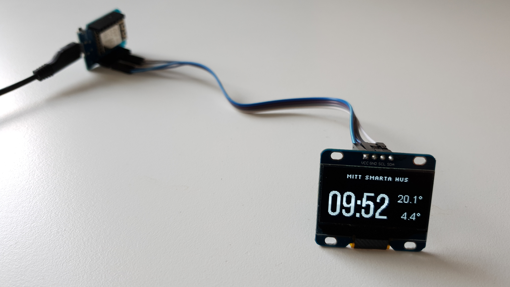

====================================
Display time and temperature
====================================

.. seo::
    :description: Instructions for setting up a display in ESPhome to show sensor values from Home Assistant
    :image: display.jpg
    :keywords: Display

ESPHome has support for several different types of displays. 

In this example I have used a SSD1306 OLED Display over I²C. My display is 1.3" with 128x64 monochrome pixels (``SH1106 128x64``).

**********************
Hardware configuration
**********************

Hardware is easy! Only four connections are needed:

- ``VCC`` - Power (my display could use either 3.3V or 5V)
- ``GND`` - Ground
- ``SDA`` - Serial Data
- ``SCL`` - Serial Clock

.. warning::

Ensure your display handles 5V if you use that.

**********************
Software configuration
**********************

**Time**

Get the time from Home Assistant to sync the onboard real-time-clock.

.. code-block:: yaml

	time:
	  - platform: homeassistant
		id: time

**Temperature**
		
Get two temperature sensors imported from Home Assistant. 

I named them ``inside_temperature`` and ``outside_temperature``. You will use those references later.

By adding ``internal: true`` to the sensors they won't be published back to Home Assistant.

.. code-block:: yaml

	sensor:
	  - platform: homeassistant
		id: inside_temperature
		entity_id: sensor.mellanvaning_temperature 
		internal: true

	  - platform: homeassistant
		id: outside_temperature
		entity_id: sensor.10_00080192969d_temperature
		internal: true

**Define the fonts**

- TrueType fonts are used. If you ever worked with fonts on microcontrollers you will love this!
- Save font files in ``/config/esphome`` folder where your esphome configuration is stored. 
- It seems ``.ttf`` suffix must be lowercase and of course match your filename. 
- Selection of fonts can be a little bit tricky for small sizes to look good. Experiment and share your findings in the comments below!

.. code-block:: yaml

	font:
	  - file: 'slkscr.ttf'
		id: font1
		size: 8

	  - file: 'BebasNeue-Regular.ttf'
		id: font2
		size: 48

	  - file: 'arial.ttf'
		id: font3
		size: 14
		
**Display definition**

Setup the communication to the display and start fill the screen with live data! 

The ``reset_pin`` was not used in my hardware configuration as the display didn't had that pin exposed.

.. code-block:: yaml

	i2c:
	  sda: D1
	  scl: D2

	display:
	  - platform: ssd1306_i2c
		model: "SH1106 128x64"
		reset_pin: D0
		address: 0x3C
		lambda: |-
		  it.printf(64, 0, id(font1), TextAlign::TOP_CENTER, "Mitt Smarta Hus");

		  it.strftime(0, 60, id(font2), TextAlign::BASELINE_LEFT, "%H:%M", id(time).now()); 
		  
		  if (id(inside_temperature).has_state()) { it.printf(127, 23, id(font3), TextAlign::TOP_RIGHT , "%.1f°", id(inside_temperature).state); } 
		  
		  if (id(outside_temperature).has_state()) { it.printf(127, 60, id(font3), TextAlign::BASELINE_RIGHT , "%.1f°", id(outside_temperature).state); } 

Rendering
---------

- Alignment of text can use different reference points, for example ``TOP_RIGHT`` or ``BASELINE_LEFT``, which all are defined in :doc:`/api/display_8h.html <https://esphome.io/api/display_8h.html>`.
- The property ``has_state()`` on a sensor is useful as it can take some seconds to get the data from Home Assistant and you may not want to display ``Nan``
- Refer to the rendering engine :ref:`display-engine` for more features (it can draw lines and circles too!)

See Also
--------

- :ghedit:`Edit`

.. disqus::