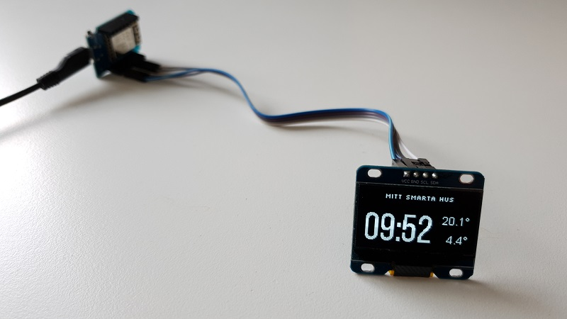

Time & Temperature on OLED Display
==================================

.. seo::
    :description: Instructions for setting up a display in ESPHome to show sensor values from Home Assistant
    :keywords: Display

In this example I have used a :doc:`SSD1306 OLED Display over I²C </components/display/ssd1306>` to
show current time and two different temperature values from Home Assistant.

ESPHome has support for several different types of displays. The display used here is 1.3" with 128x64 monochrome pixels (``SH1106 128x64``).

Hardware configuration
----------------------

Hardware is easy! Only four connections are needed:

- ``VCC`` - Power (my display could use either 3.3V or 5V)
- ``GND`` - Ground
- ``SDA`` - Serial Data
- ``SCL`` - Serial Clock

.. warning::

    Ensure your display handles 5V if you use that.

Software configuration
----------------------

Getting Time
************

Get the time from Home Assistant to sync the onboard real-time clock.

.. code-block:: yaml

    time:
      - platform: homeassistant
        id: esptime

Getting Temperature
*******************

Next, we want to get two temperature sensors imported from Home Assistant.

I named them ``inside_temperature`` and ``outside_temperature``. You will use those references later.

By adding ``internal: true`` to the sensors they won't be published back to Home Assistant.

.. code-block:: yaml

    sensor:
      - platform: homeassistant
        id: inside_temperature
        entity_id: sensor.mellanvaning_temperature
        internal: true

      - platform: homeassistant
        id: outside_temperature
        entity_id: sensor.10_00080192969d_temperature
        internal: true

Define the Fonts
****************

- TrueType fonts are used. If you ever worked with fonts on microcontrollers you will love this!
- Save font files in ``/config/esphome`` folder where your ESPHome configuration is stored.
- The ``.ttf`` suffix must be lowercase and of course match your filename.
- Selection of fonts can be a little bit tricky for small sizes to look good. Experiment and share your findings in the comments below!

.. code-block:: yaml

    font:
      - file: 'slkscr.ttf'
        id: font1
        size: 8

      - file: 'BebasNeue-Regular.ttf'
        id: font2
        size: 48

      - file: 'arial.ttf'
        id: font3
        size: 14

Display Definition
******************

Now setup the communication to the display and start fill the screen with live data!

The ``reset_pin`` was not used in my hardware configuration as the display didn't have that pin exposed.

Note your ``address`` and ``model`` might be different, use the scan option to find the address of your display.

.. code-block:: yaml

    i2c:
      sda: GPIOXX
      scl: GPIOXX
      scan: false

    display:
      - platform: ssd1306_i2c
        model: "SH1106 128x64"
        reset_pin: GPIOXX
        address: 0x3C
        lambda: |-
          // Print "Mitt Smarta Hus" in top center.
          it.printf(64, 0, id(font1), TextAlign::TOP_CENTER, "Mitt Smarta Hus");

          // Print time in HH:MM format
          it.strftime(0, 60, id(font2), TextAlign::BASELINE_LEFT, "%H:%M", id(esptime).now());

          // Print inside temperature (from homeassistant sensor)
          if (id(inside_temperature).has_state()) {
            it.printf(127, 23, id(font3), TextAlign::TOP_RIGHT , "%.1f°", id(inside_temperature).state);
          }

          // Print outside temperature (from homeassistant sensor)
          if (id(outside_temperature).has_state()) {
            it.printf(127, 60, id(font3), TextAlign::BASELINE_RIGHT , "%.1f°", id(outside_temperature).state);
          }

Rendering
---------

- Alignment of text can use different reference points, for example ``TOP_RIGHT`` or ``BASELINE_LEFT``, which all are defined in :apiref:`display/display_buffer.h`.
- The property ``has_state()`` on a sensor is useful as it can take some seconds to get the data from Home Assistant and you may not want to display ``Nan``
- Refer to the rendering engine :ref:`display-engine` for more features (it can draw lines and circles too!)

Add a Text-Based Sensor
-----------------------

Below follows an example that replaces the "Mitt smarta hem" top printout with the alarm status from the alarm component in Home Assistant.

.. code-block:: yaml

    text_sensor:
      - platform: homeassistant
        entity_id: alarm_control_panel.my_alarm_system
        name: "Alarm State"
        id: alarm_state

    display:
      - platform: ssd1306_i2c
        model: "SH1106 128x64"
        reset_pin: GPIOXX
        address: 0x3C
        lambda: |-
          // Print "Alarm State: <state>" in top center
          it.printf(64, 0, id(font1), TextAlign::TOP_CENTER, "Alarm State: %s", id(alarm_state).state.c_str());

See Also
--------

- :doc:`/components/display/ssd1306`
- :doc:`/components/display/index`
- :doc:`/components/sensor/homeassistant`
- :ghedit:`Edit`
