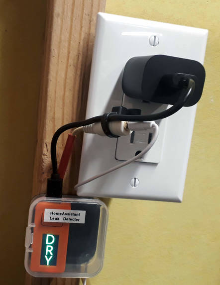

=============================================
ESP-360-Remote
=============================================

.. seo::
    :description: Water leak detector with ESPHome on an M5StickC ESP32
    :keywords: Leak Detector M5StickC M5Stack M5Atom

An all-in-one remote based on the ESP32-WROOM-32E

The project on Hackaday: https://hackaday.io/project/188353-esp-360-remote

This board features 433MHz transmitter and receiver. IR leds are placed in circle to cover all the directions. It includes a temperature & humidity and an ambient light sensor. Furthermore you can power and program it through the USB TYPE-C, ESD protected. This board is based around the ESP32-WROOM-32E, so it's super easy to set everything up with ESPHOME and controlling it from Home Assistant. I think the form factor it's nice. There are two stackable layers. The bottom one includes the power circuitry, the ESP32 and the temperature, humidity and the light sensor.s In the top one there are the IR leds, IR receiver and the RF modules.

Installed Project
*****************

Not shown: Probe is placed on the floor in the corner, out of the way, in the lowest part of the room

------------

ESPHome configuration
=====================

.. code-block:: yaml

    esphome:
  name: esp360remote

  esp32:
    board: esp32doit-devkit-v1
    framework:
      type: arduino

  # Enable logging
  logger:

  # Enable Home Assistant API
  api:
    password: ""

  ota:
    password: ""

  wifi:
    ssid: "nossid"
    password: "nopassword"

    # Enable fallback hotspot (captive portal) in case wifi connection fails
    ap:
      ssid: "Esp-Remote-Def Fallback Hotspot"
      password: "BackupPwd"

  captive_portal:
    

  i2c:
    sda: 21
    scl: 22
    scan: true
    id: bus_a

  sensor:
    - platform: shtcx
      temperature:
        name: "Living Room Temperature"
      humidity:
        name: "Living Room Humidity"
      address: 0x70
      update_interval: 20s
    - platform: bh1750
      name: "BH1750 Illuminance"
      address: 0x23
      update_interval: 20s

  remote_receiver:
    - id: RF_RX
      pin: 
        number: GPIO5
        inverted: True
      dump: 
        - rc_switch
      tolerance: 35%
      filter: 200us
      idle: 4ms
      buffer_size: 10kb
    - id: IR_RX
      pin: 
        number: GPIO19
        inverted: True
      dump: all

  remote_transmitter:
    - id: RF_TX
      pin: GPIO18
      carrier_duty_percent: 100%
    - id: IR_TX
      pin: GPIO13
      carrier_duty_percent: 50%

  web_server:
    port: 80

  switch:
    - platform: gpio
      pin: 12
      name: "Status Led"
      restore_mode: ALWAYS_ON

See Also
========

- :doc:`/components/display/index`
- :doc:`/components/display/st7735`
- :doc:`/components/binary_sensor/esp32_touch`
- :ghedit:`Edit`
