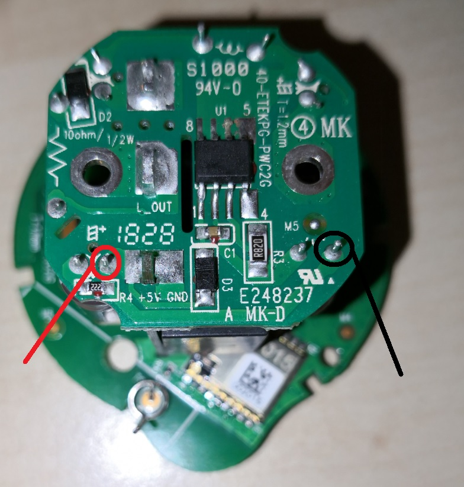
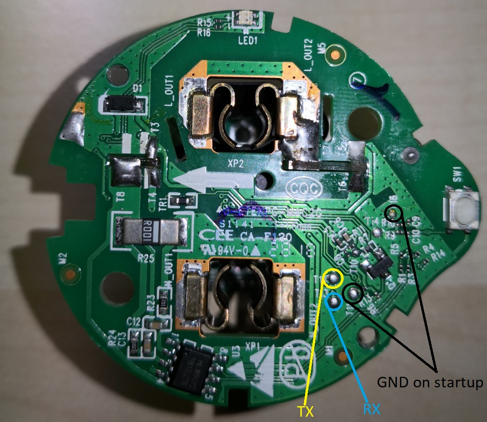

Etekcity Voltson (ESW01-EU)
===========================

.. seo::
    :description: Configure an Etekcity Voltson and calculate the missing current sensor
    :image: esw01-eu.jpg
    :keywords: Etekcity, Voltson, ESW01, ESW01-EU, HLW8012, Home Assistant, ESPHome

The Etekcity Voltson brings a 10A relay, two LEDs (blue and yellow), a push button and a :doc:`/components/sensor/hlw8012`
in a very small package and at a reasonable price.

.. note::

    There are quite a few hardware revisions out there. Also reginal versions like US, UK and EU are different.

Flashing
--------

Opening the case for flashing varies a lot for different hardware revisions. Mine was easy as it had two tiny T5 Torx screws in the front and four Philipps screws inside.
Once you have opened the case, remove the PCB from it and attach your TTL as follows:

5V and GND go to the bottom:

On the opposite side, T12 is TX, T13 is RX. During boot you need to connect T11 and T16 pads to GND. Easiest is to flash with pogo pins.

Configuration
-------------

As the Voltson has its SEL pin permanently pulled high, we are unable to switch from voltage measurement to current measurement.
This will be circumvented by defining the initial mode to be voltage measurement (see :doc:`/components/sensor/hlw8012` documentation)
and calculating the current with `Ohm's law <https://en.wikipedia.org/wiki/Ohm%27s_law>`_: ``P (watts) = V (volts) x I (amps)``

.. code-block:: yaml

    esphome:
      name: voltson
      platform: ESP8266
      board: esp01_1m

    ### you wifi and other settings here ###

    ### pins ###
    # D1 GPIO5  | LED blue    | status_led
    # D0 GPIO16 | LED yellow  | led1
    # D5 GPIO14 | SW1         | button1
    # D2 GPIO4  | REL1        | relay1
    # D6 GPIO12 | HLW8012/CF1 | cf1_pin
    # D7 GPIO13 | HLW8012/CF  | cf_pin

    status_led:
      pin: 
        number: GPIO5

    output:
    - platform: gpio
      id: relay1
      pin: GPIO4
    - platform: gpio
      id: led1
      pin: GPIO16

    switch:
    - platform: output
      name: "Voltson Relay"
      id: switch1
      output: relay1
      on_turn_on:
        - output.turn_on: led1
      on_turn_off:
        - output.turn_off: led1

    binary_sensor:
      - platform: gpio
        id: button1
        pin:
          number: GPIO14
          mode: INPUT_PULLUP
          inverted: true
        on_press:
          - switch.toggle: switch1

    sensor:
      - platform: hlw8012
        sel_pin: 0   # not connected
        cf_pin: GPIO13
        cf1_pin: GPIO12
        voltage:
          id: hlw8012_voltage
          name: "HLW8012 Voltage"
        power:
          id: hlw8012_power
          name: "HLW8012 Power"
          on_value:
            - sensor.template.publish:
                id: hlw8012_current_calculated
                state: !lambda 'return id(hlw8012_power).state / id(hlw8012_voltage).state;'
        update_interval: 10s
        initial_mode: VOLTAGE
        change_mode_every: 4294967295 # basically never
      - platform: template
        id: hlw8012_current_calculated
        name: "HLW8012 Current (calculated)"
        unit_of_measurement: A
        accuracy_decimals: 2

See Also
--------

- :doc:`/components/sensor/hlw8012`
- :ghedit:`Edit`
