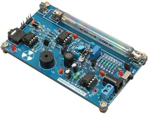

Geiger counter RadiationD v1.1 (CAJOE)
======================================

.. seo::
    :description: Instructions for setting up RadiationD v1.1(CAJOE) sensor in ESPHome and calculate the current radation level.
    :image: radiationD-v1-1-cajoe_small.jpg
    :keywords: Radiation Geiger counter

With the help of :doc:`/components/sensor/pulse_counter` and the RadiationD v1.1(CAJOE) you can make your own Geiger counter, which will give you 
a more or less precise messurement of the current radation level. But it should be good enough to warn you about critical events.  

Assambly:
---------

The first step is to connect the sensor.

You just need to connect the +5V, the ground and a GPIO pin to the ESP.
In my case I used the pin 34 for the signal. (The print on the PCB is wrong VIN is the signal.)
This setup should give you the pulse of each messurement or count. For more information check the Video of `Andreas Spiess <https://www.youtube.com/watch?v=K28Az3-gV7E>`__.

Housing:
*********
I just 3D printed an small housing the avoid touching the high voltage Geiger Mueller tube.
`Counter Tube Case <https://www.thingiverse.com/thing:5425224>`__
(The tube should not be in direct sunlight. So maybe you will need another case.)

Configuartion:
---------------

The block :doc:`/components/sensor/pulse_counter` will count the radation events per minute. 
With the found specs of the tube you will be able to calculate the radiation in μSv/h.

It's just the counts per minute (CPM) times the factor of your Geiger Mueller tube you're using. It should be the J305ß, which comes with the PCB.
(To make sure - check your printing on the tube)

μSv/h = (CPM - Tube noise) * Factor
According to the video of `Andreas Spiess <https://www.youtube.com/watch?v=K28Az3-gV7E>`__ the tube should have about 12 CPM as background noise.

.. note::

    The current version of the pack comes with the J305ß Geiger tube which detectes Beta and Gamma radiation. Specifications:     
    Manufacturer: North Optic     Radiation Detection: β, γ     Length: 111mm     Diameter: 11mm     Recommended Voltage: 350V     Plateau Voltage: 360-440V     
    Sensitivy γ (60Co): 65cps/(μR/s)     
    Sensitivy γ (equivalent Sievert): 108cpm / (μSv/h)     
    Max cpm: 30000     
    cps/mR/h: 18     
    cpm/m/h: 1080     
    cpm/μSv/h: 123.147092360319     
    Factor: 0.00812037037037

`Source: opengeiger.de/LibeliumDoku.pdf <http://www.opengeiger.de/LibeliumDoku.pdf>`__.

.. code-block:: yaml

    sensor:
      - platform: pulse_counter
        pin: 34
        name: "Radiation"
        unit_of_measurement: 'μSv/h'
        count_mode:
         rising_edge: DISABLE
         falling_edge: INCREMENT
        filters:
          - offset: -12.0 # J305ß Geiger Mueller tube background noise 0.2 pulses / sec x 60 sec = 12 CPM (Counts per Minute)
          - multiply: 0.00812037037037 # Factor: 0.00812037037037

See Also
--------

- :doc:`/components/sensor/pulse_counter`
- :ghedit:`Edit`
