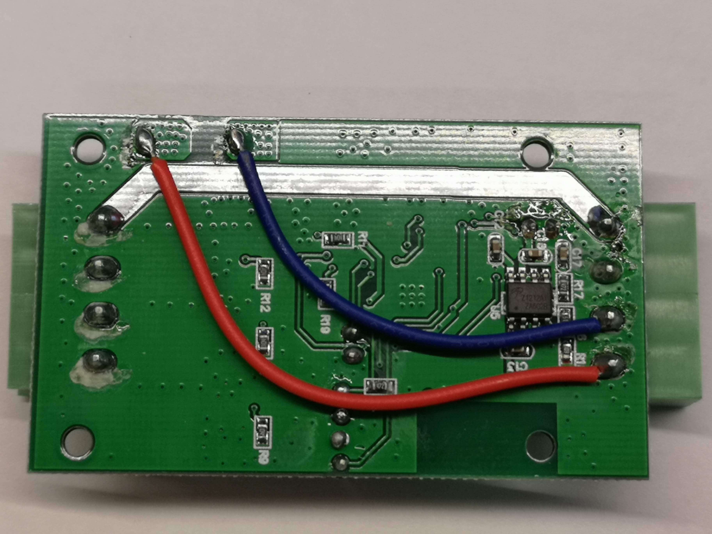

H801 RGBW LED controller
========================

The H801 is pretty affordable and easy to hack and adapt to your needs. It can be found on `AliExpress <https://s.click.aliexpress.com/e/bbnUDBZW>`__
and other sites. The board is based on an `ESP8266EX <https://www.espressif.com/sites/default/files/documentation/0a-esp8266ex_datasheet_en.pdf>`__ chip.

It has 5 seperate PWM outputs (each driven by a `DTU35N06 <http://www.din-tek.jp/Upload/Product%20Doc/Datasheet/DTU35N06.pdf>`__ MOSFET rated
for 106W max power), and can be used as a :doc:`RGB </components/light/rgb>` / :doc:`RGBW </components/light/rgbw>` / 
:doc:`RGBWW </components/light/rgbww>` / :doc:`RGBCT </components/light/rgbct>` controller or configured with any combination of up to
five :doc:`individual monochromatic PWM </components/light/monochromatic>` lights. 
See `A closer look at the H801 LED WiFi Controller <https://tinkerman.cat/post/closer-look-h801-led-wifi-controller>`__ for more details on the hardware.

.. figure:: images/h801.jpg
    :align: center
    :width: 80.0%

Sample configuration
--------------------

You can use the :doc:`RGBWW </components/light/rgbww>` and the :doc:`ESP8266 Software PWM output </components/output/esp8266_pwm>` components using below configuration:

.. code-block:: yaml

    esphome:
      name: h801light

    esp8266:
      board: esp01_1m

    wifi:
      ssid: !secret wifi_ssid
      password: !secret wifi_password

    logger:
    api:
    ota:

    output:
      - platform: esp8266_pwm
        pin: 12
        frequency: 1000 Hz
        id: pwm_b
      - platform: esp8266_pwm
        pin: 13
        frequency: 1000 Hz
        id: pwm_g
      - platform: esp8266_pwm
        pin: 15
        frequency: 1000 Hz
        id: pwm_r
      - platform: esp8266_pwm
        pin: 14
        frequency: 1000 Hz
        id: pwm_w1
      - platform: esp8266_pwm
        pin: 4
        frequency: 1000 Hz
        id: pwm_w2
    light:
      - platform: rgbww
        name: "H801 Light"
        red: pwm_r
        green: pwm_g
        blue: pwm_b
        cold_white: pwm_w1
        warm_white: pwm_w2

For :doc:`RGBW </components/light/rgbw>` lights, the ``pwm_w2`` output is not used (and can be removed):

.. code-block:: yaml

    light:
      - platform: rgbw
        name: "H801 Light"
        red: pwm_r
        green: pwm_g
        blue: pwm_b
        white: pwm_w1

Flashing
--------

Make your node in the ESPHome dashboard and compile/upload it.
(if it fails OTA it must be uploaded manually with your favorite ESP flasher,
e.g. :ref:`esphome-flasher <esphome-flasher>`)

You will need to solder pins to the board inside the H801 (fortunately it's pretty roomy and
not a lot of components or stuff in the way apart from the 2 wires on the back).

3.3V, GND, TX and RX (RX to RX and TX to TX) needs to be connected to your serial adapter, the
two other pins must be shorted throughout the flashing process by a jumper or a breadboard cable.
(Remember to remove it after flashing)

.. figure:: images/h801-board-front.jpg
    :align: center
    :width: 80.0%

Front side of board with pins soldered on

Back side of the board (don't melt the blue and red wire when soldering)

Add A PIR(Motion) Sensor
------------------------

It's possible to use the header that was soldered on for flashing as an input.
The example below uses the TX pin as a PIR motion sensor input:

.. figure:: images/h801-pir_sensor.jpg
    :align: center
    :width: 80.0%

H801 shown with PIR connected to header pins

The following can be appended to the YAML file for your H801 to configure the TX pin as a motion
sensor input.

.. code-block:: yaml

    binary_sensor:
      - platform: gpio
        pin: GPIO3
        name: "GPIO3-TX Motion"
        device_class: motion

Pinout
------

.. list-table::
    :header-rows: 1

    * - Function
      - ESP Pin
    * - R (PWM1)
      - GPIO15
    * - G (PWM2)
      - GPIO13
    * - B (PWM3)
      - GPIO12
    * - W1 (PWM4)
      - GPIO14
    * - W2 (PWM5)
      - GPIO4
    * - Jumper J3
      - GPIO0
    * - RX
      - GPIO2
    * - TX
      - GPIO3
    * - LED D1 (red)
      - GPIO5
    * - LED D2 (green)
      - GPIO1

See Also
--------

- :doc:`/components/light/rgb`
- :doc:`/components/light/rgbw`
- :doc:`/components/light/rgbww`
- :doc:`/components/light/rgbct`
- :doc:`/components/light/monochromatic`
- :doc:`/components/output/esp8266_pwm`
- :ghedit:`Edit`
