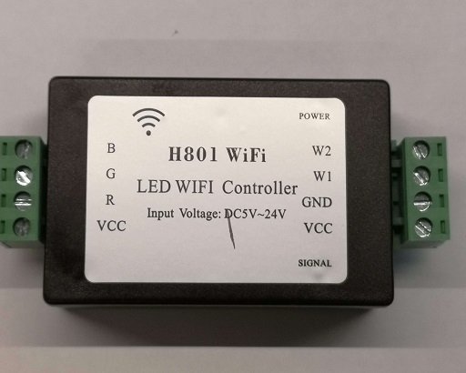
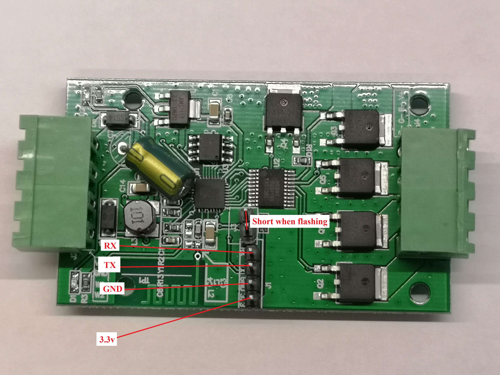
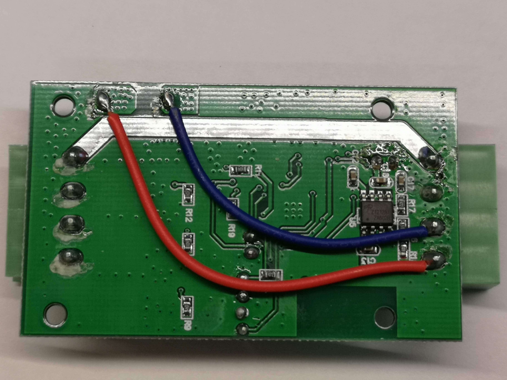
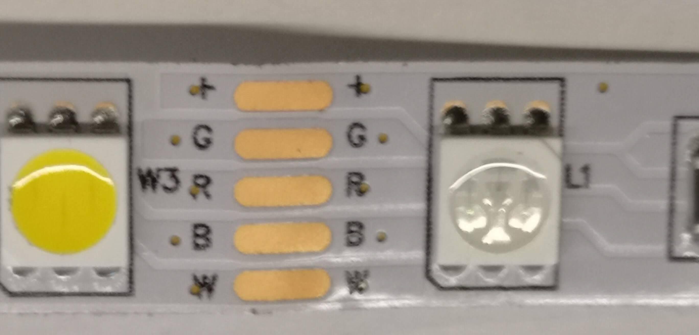
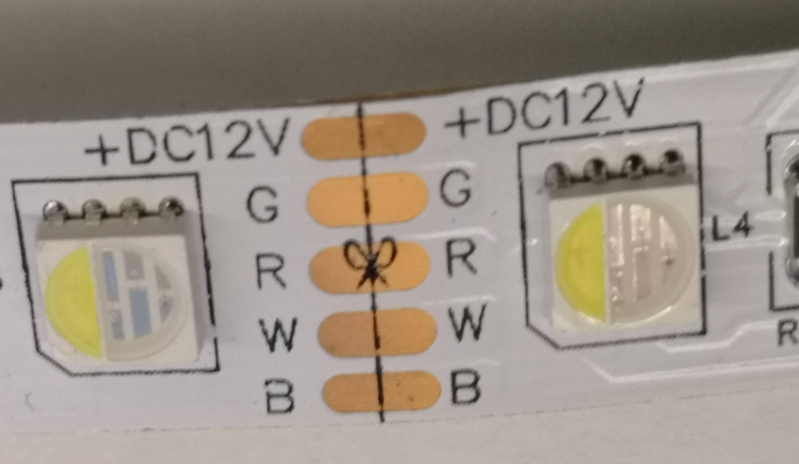
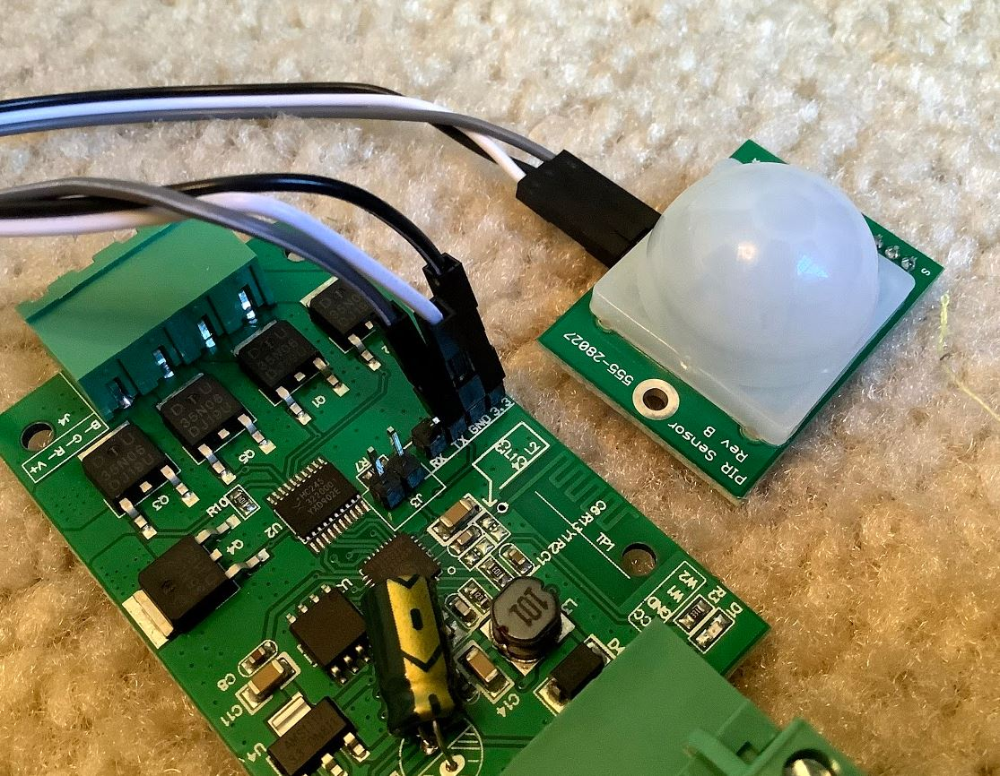

H801 RGBW LED controller
========================

The H801 is pretty affordable and easy to hack and adapt to your needs. It can be found on `AliExpress <https://s.click.aliexpress.com/e/bbnUDBZW>`__
`Here <http://tinkerman.cat/closer-look-h801-led-wifi-controller/>`__ is an article about the
hardware for those who have an interest for more details about the board.
It can be used as a RGB, RGBW, RGB dual white or even control 5 individual monochromatic strips if you want or combinations of these.

For ESPHome, you can then use the :doc:`RGBW </components/light/rgbw>`
and the :doc:`ESP8266 Software PWM output </components/output/esp8266_pwm>` components using below configuration:

.. code-block:: yaml

    esphome:
      name: h801light
      platform: ESP8266
      board: esp01_1m
    wifi:
      ssid: 'WIFI'
      password: 'WIFIPASS'
      manual_ip:
        static_ip: x.x.x.x
        gateway: x.x.x.x
        subnet: 255.255.255.0
    logger:
    api:
    ota:
    sensor:
      - platform: wifi_signal
        name: "WiFi Signal h801light"
        update_interval: 60s
    #RGBWarm
    output:
      - platform: esp8266_pwm
        pin: 12
        frequency: 1000 Hz
        id: pwm_b
      - platform: esp8266_pwm
        pin: 13
        frequency: 1000 Hz
        id: pwm_g
      - platform: esp8266_pwm
        pin: 15
        frequency: 1000 Hz
        id: pwm_r
      - platform: esp8266_pwm
        pin: 14
        frequency: 1000 Hz
        id: pwm_w
    light:
      - platform: rgbw
        name: "H801 Light"
        red: pwm_r
        green: pwm_g
        blue: pwm_b
        white: pwm_w

Make your node in the ESPHome dashboard and compile/upload it.
(if it fails OTA it must be uploaded manually with your favorite ESP flasher,
e.g. :ref:`esphome-flasher <esphome-flasher>`)

Front side of board with pins soldered on

Back side of the board (don't melt the blue and red wire when soldering)

This LED strip can be used with the sketch as-is

For this type of led strip you have to swap the white and blue GPIO numbers in the sketch.

You will need to solder pins to the board inside the H801 (fortunately it's pretty roomy and
not a lot of components or stuff in the way apart from the 2 wires on the back).

3.3V, GND, TX and RX (RX to RX and TX to TX) needs to be connected to your serial adapter, the
two other pins must be shorted throughout the flashing process by a jumper or a breadboard cable.
(Remember to remove it after flashing)

Add A PIR(Motion) Sensor
------------------------

It's possible to use the header that was soldered on for flashing as an input.
The example below uses the TX pin as a PIR motion sensor input:

H801 shown with PIR connected to header pins

The following can be appended to the YAML file for your H801 to configure the TX pin as a motion 
sensor input. 

.. code-block:: yaml

    binary_sensor:
      - platform: gpio
        pin: GPIO3
        name: "GPIO3-TX Motion"
        device_class: motion

See Also
--------

- :doc:`/components/light/rgbw`
- :doc:`/components/output/esp8266_pwm`
- :ghedit:`Edit`
