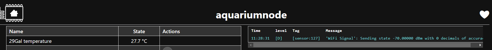
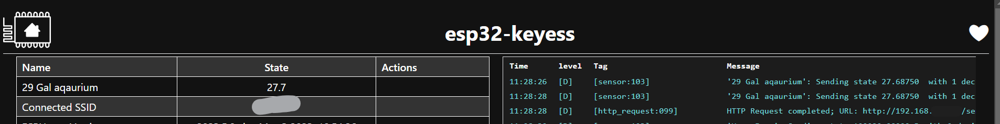

Share data between ESphome node without using Homeassistant.
============================================================
You need two esphome nodes. one will be server and other will be client/s ( can be multiple).
you will need to setup a webserver too on your primary esphome which will be pushing the required sensor data by using the following webserver component.

See :doc:`/components/web_server`

.. code-block:: yaml

    # Webserver configration
    web_server:
      port: 80
  
http_request component
----------------------
Now we need to setup a http_request component on client/s with http_request_data id using the following code

See :doc:`/components/http_request`

.. code-block:: yaml

    http_request:
      useragent: esphome/device
      timeout: 10s
      id: http_request_data

Automation
**********
To automate the request of data we will add a interval component 

and  url is link to the sensor id of the sensor for which the state is required.

See `Rest Api </web-api/index.html#rest-api>`.

it is generated by following rules 

    The domain is the type of the component, for example sensor or light. id refers to the id of the component - this ID is created by taking the name of the component, stripping out all non-alphanumeric characters, making everything lowercase and replacing all spaces by underscores. To confirm the <id> to use, you can set the log level to VERY_VERBOSE and check the object_id: in the logs.

.. code-block:: yaml

    interval:
  - interval: 3s
    then:
      - http_request.get: 
          url: http://ip.or.hostname.of.the.server.node/sensor/id.of.the.sensor.for.which.data.is.required
          on_response:
            then:
              - lambda: |-
                  json::parse_json(id(http_request_data).get_string(),  {
                      id(id_of_the_template_sensor).publish_state(root["value"]);
                  });

Template sensor 
***************

.. code-block:: yaml

sensor:
  - platform: template
    name: "name of the template sensor"
    id: id_of_the_template_sensor
                  

                  
                  
                  
Result
======

Server side actual sensor.

Client side template sensor.
  
