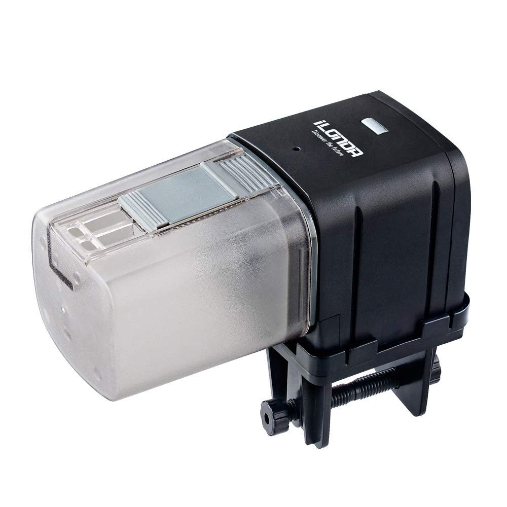

Ilonda Wifi Smart Fish Feeder (L88)
===================================

Ilonda Wifi Smart Fish Feeder (L88) is a Tuya-based device sold by Amazon (not only under Ilonda, but also under other brand names).

Originally intended to be used with its companion app, once flashed using `tuya-convert <https://github.com/ct-Open-Source/tuya-convert>`__, ESPHome generated
firmware can be uploaded allowing you to control the Wifi Smart Fish Feeder via Home Assistant.

Wifi Smart Fish Feeder Configuration
------------------------------------

Thanks to the amazing `Tasmota template <https://templates.blakadder.com/ilonda_L88.html>`__, 
managed to build a fully working esphome configuration. This assumes you have a secret.yaml with ssid and password keys.

.. code-block:: yaml

    esphome:
      name: wifi_smart_fish_feeder
      platform: ESP8266
      board: esp01_1m

    wifi:
      ssid: !secret wifi_ssid
      password: !secret wifi_password

    logger:

    api:

    ota:

    # Binary Sensor to allow relay to be switched when physical button is pressed
    binary_sensor:
      - platform: gpio
        id: button
        pin:
          number: GPIO4
          mode: INPUT_PULLUP
          inverted: True
        name: 'Switch feeder'
        on_press:
          - switch.turn_on: relay

      - platform: status
        name: "Status"

    switch:
    # Switch to turn feeder on for 3 seconds/off and turn on/off LED
      - platform: gpio
        name: 'Relay feeder'
        id: relay
        pin: GPIO14
        on_turn_on:
          - light.turn_on: led
          - delay: 3s
          - switch.turn_off: relay
          - light.turn_off: led
        restore_mode: ALWAYS_OFF

    sensor:
    # Feeder counter
      - platform: pulse_meter
        pin: GPIO12
        name: 'Counter/min'
        unit_of_measurement: 'time(s)'
        internal: true
        total:
          unit_of_measurement: 'time(s)'
          name: 'Counter feeder'

    # To allow led to be controlled via GPIO
    output:
      - platform: esp8266_pwm
        id: blue_led
        pin:
          number: GPIO5
          inverted: true

    # LED control
    light:
      - platform: monochromatic
        output: blue_led
        id: led

You can now add your Wifi Smart Fish Feeder to Home Assistant via the configurations page, look for 'ESPHome' under the Integrations option and click 'Configure'.

See Also
--------

- :doc:`/components/binary_sensor/gpio`
- :doc:`/components/switch/gpio`
- :doc:`/components/sensor/pulse_meter`
- :doc:`/components/output/esp8266_pwm`
- :doc:`/components/light/monochromatic`
- :doc:`/guides/automations`
- `Fish Feeder diagrams and pictures <https://community.openhab.org/t/ilonda-fish-feeder-openhab/99190>`__.
- :ghedit:`Edit`
