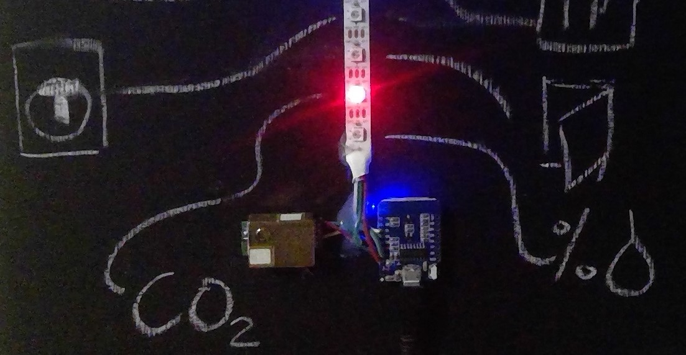
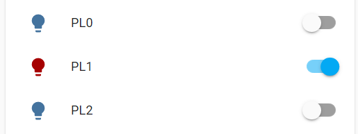

Infostripe
==========

.. seo::
    :description: Simple visualisation of Home Assistant states using a Neopixel stripe
    :image: /cookbook/images/infostrip-detail.jpg
    :keywords: Neopixel

Showing the current status of sensor states using a Neopixel (WS2812B) strip is a simple way to communicate states to the user.
Compared to a dashboard screen the infostrip can only communicate the information like a binary sensor.

- color (e.g., red = error/warning, orange = warning, green = ok, blue = active)
- intensity (off, scaled brightness)
- mode (continuous vs. flashing, flashing or strobe is not recommend)
- light position on stripe

    Wemos D1 mini, Neopixel, CO2 sensor on a blackboard, pixel meanings are described by the chalk drawn icons.

ESPHome configuration
---------------------

.. code-block:: yaml

    uart:
      rx_pin: GPIOXX
      tx_pin: GPIOXX
      baud_rate: 9600

    sensor:
      - platform: mhz19
        co2:
          name: "MH-Z19 CO2 Value"
        temperature:
          name: "MH-Z19 Temperature"
        update_interval: 30s

    # Monitor the Wifi connection status
    binary_sensor:
      - platform: status
        name: "Infostrip Status"

    # Configure each pixel as a single light (attention memory consuming)
    light:
      - platform: fastled_clockless
        chipset: WS2812B
        id: light_fastled
        pin: GPIOXX
        num_leds: 4
        rgb_order: GRB
        name: "Infostrip"
        effects:
          - strobe:
          - random:
      - platform: partition
        name: "PL0"
        segments:
          - id: light_fastled
              from: 0
              to: 0
        effects:
          - strobe:
      - platform: partition
        name: "PL1"
        segments:
          - id: light_fastled
              from: 1
              to: 1
        effects:
          - strobe:
      - platform: partition
        name: "PL2"
        segments:
          - id: light_fastled
              from: 2
              to: 2
        effects:
          - strobe:
      - platform: partition
        name: "PL3"
        segments:
          - id: light_fastled
              from: 3
              to: 3
        effects:
          - strobe:

.. warning::

    Consider the warning in :doc:`/components/light/partition` regarging the increased memory usage.

Home Assistant configuration
----------------------------

The automation to show the CO2 warning light (e.g. red if CO2 > 1000 ppm) is done in Home Assistant, but could also be implemented using ESPHome :ref:`Automations <automation>`.

.. code-block:: yaml

    # Turn on a light with the related color
    automation:
    - id: '1601241280015'
      alias: Light CO2 On
      description: ''
      trigger:
        - platform: numeric_state
          entity_id: sensor.mh_z19_co2_value
          above: 1000
      condition: []
      action:
        - service: light.turn_on
          data:
          color_name: red
          entity_id: light.pl2
      mode: single
    - id: '1601241280016'
      alias: Light CO2 Off
      description: ''
      trigger:
        - platform: numeric_state
          entity_id: sensor.mh_z19_co2_value
          below: 800
      condition: []
      action:
        - service: light.turn_off
          entity_id: light.pl2
          mode: single
    - alias: "State Light Mapping"
      trigger:
      platform: time_pattern
      # You can also match on interval. This will match every 5 minutes
      minutes: "/5"
      action:
        - service: light.turn_on
          data_template:
          entity_id: light.pl1
          brightness_pct: 30
          color_name: >
              
              
              {{ map[state] if state in map else 'white' }}

    Each pixel is used as a light entity.

See Also
--------

- :doc:`/components/light/fastled`
- :doc:`/components/light/partition`
- :doc:`/components/sensor/mhz19`
- :ghedit:`Edit`
