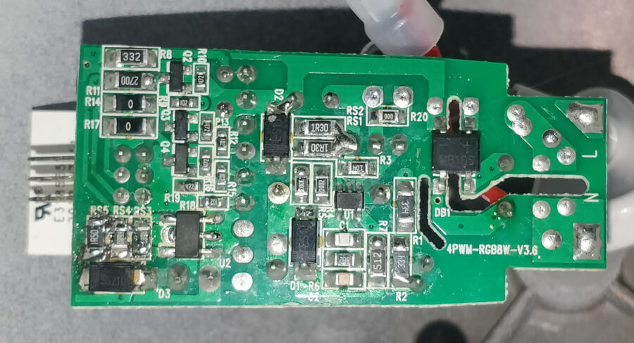
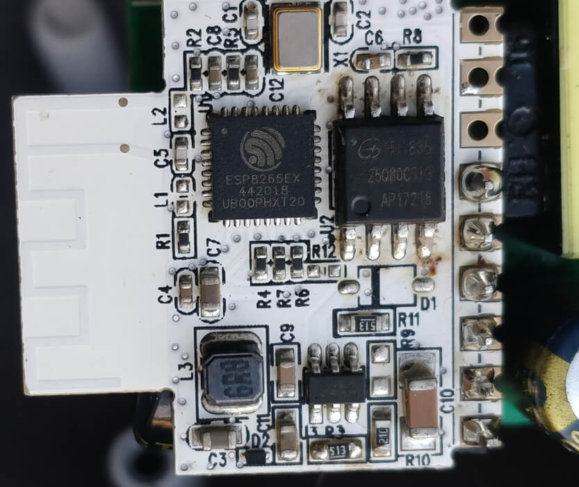
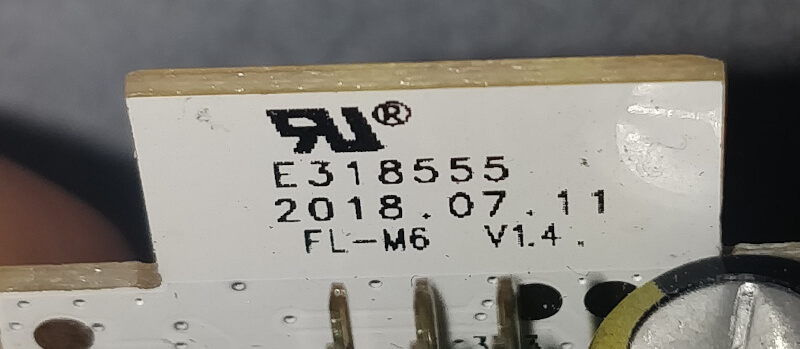
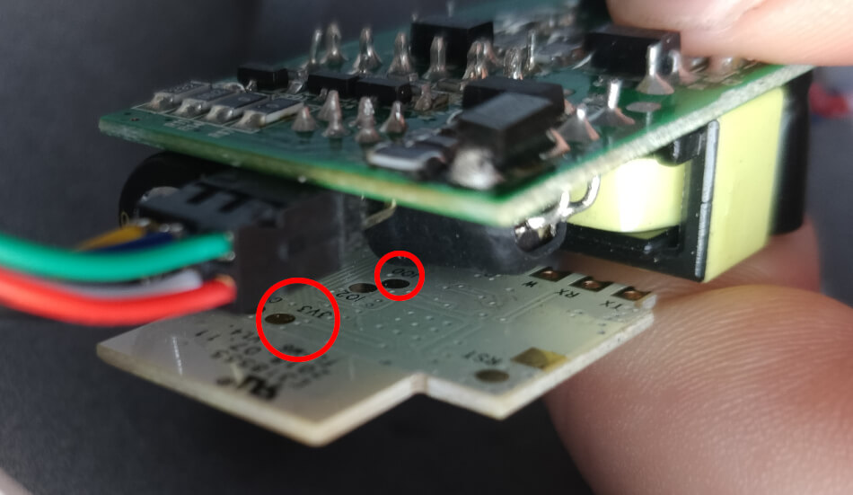
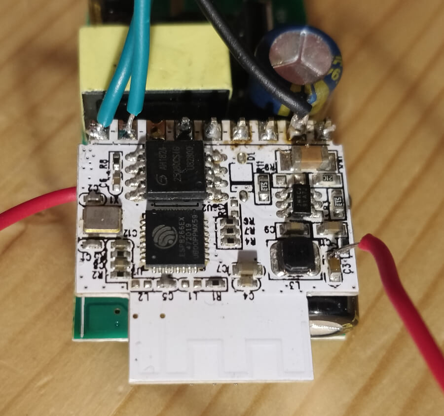
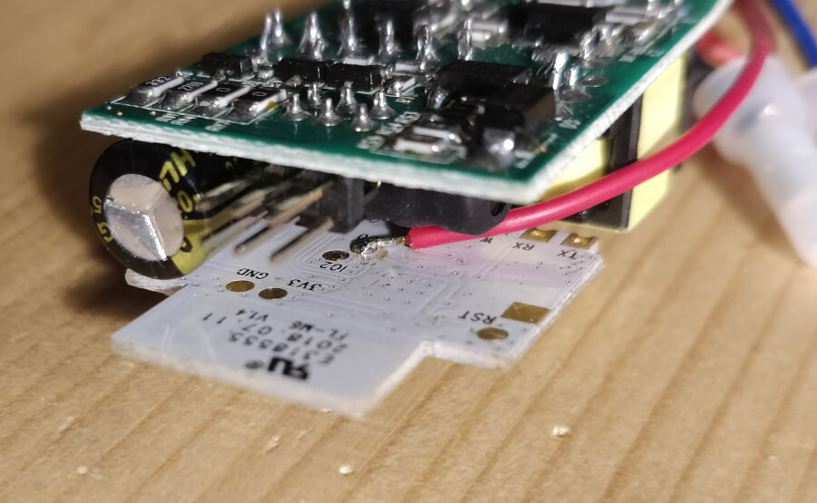

IWOOLE Table Lamp
===================================

.. seo::
    :description: Instructions for flashing and configuring IWOOLE Table Lamps.

The IWOOLE Table Lamp is a RGBW lamp normally configured using the Tuya Smart App.
It is available from various retailers online or directly from `iwoole.com <https://www.iwoole.com/product/category/wifi-smart-table-lamp/>`__.

.. figure:: images/iwoole_rgbw_table_lamp.png
    :align: center
    :width: 50.0%

1. Device overview
==================
.. note::

    The following information relates to the desk model depicted above. A free-standing version and a desk version with a longer arm are available. They are likely to share the same internals and configuration, but I can not be certain. 

My device had no external markings at all.

The device is a basic 4-channel PWM RGBW light in a simple elegant housing.
The LEDs are not individually addressable.
No other sensors, outputs or status LEDs are available.

The MOSFETs for the different color channels are connected as follows:

- GPIO04: White
- GPIO12: Green
- GPIO13: Blue
- GPIO14: Red

1.1 Internal markings
----------------------

2. ESPHome configuration
========================
Since there is only one RGBW light to configure the .yaml file is fairly straightforward.
Alternatively, you could configure each channel as a separate light if desired.
I prefer to use the :ref:`color-interlock <rgbw_color_interlock>` option along with the configuration below. 

2.1 Example configuration
-------------------------
.. code-block:: yaml

    esphome:
      name: "IWOOLE Table Lamp"
      #ESP type is ESP8266EX with 1MB flash
      platform: ESP8266
      board: esp01_1m

    # Insert wifi and api configuration here

    # Configuration for IWOOLE PWM light
    light:
      - platform: rgbw
        name: "Light"
        red: output_red
        green: output_green
        blue: output_blue
        white: output_white

    output:
      - platform: esp8266_pwm
        id: output_red
        pin: GPIO14
      - platform: esp8266_pwm
        id: output_green
        pin: GPIO12
      - platform: esp8266_pwm
        id: output_blue
        pin: GPIO13
      - platform: esp8266_pwm
        id: output_white
        pin: GPIO4

3. Flashing
===========
There are two ways to get ESPHome onto this device.
For both ways you will need to get the binary file with ESPHome's software by compiling your configuration and then downloading the binary.

3.1 Tuya-convert
----------------
.. note::

    According to `blakadder.com <https://templates.blakadder.com/iwoole_table_lamp.html>`__ recent versions of this device can't be flashed via this method anymore.

The first device I bought could be flashed using Tuya-convert. However, I still wanted to try and flash it via serial to see if it was possible. I messed this up and had to buy a new unit. This new unit could not be flashed using Tuya-convert.
Unfortunately it looks like new devices are being shipped with new firmware preloaded. 
If the device has older firmware but is connected to the Tuya Smart app, it might upgrade and lose it's ability to be flashed.

For instructions on how to actually flash using `Tuya-convert <https://github.com/ct-Open-Source/tuya-convert>`__ please see the linked GitHub page.

To get this device into flashing mode, from off, switch it on-off-on-off-on.
Load the Tasmota binary when prompted, and you can upload the ESPHome firmware from there.

3.2 Serial connection
---------------------
.. warning::

    The circuit inside will be exposed to mains voltage. Do not connect your device to the mains when flashing. Flashing this device via a serial connection will involve precarious soldering and cutting through insulating heat-shrink tubing which will have to be replaced. 
    If you are uncomfortable with this, or are not confident around mains voltage, do not attempt to do this! Using the Tuya-convert method is preferred.

1. Disconnect the device from mains voltage!
2. Open the device. The plastic and aluminum halves can be separated by twisting the plastic part counter-clockwise. If you're okay with a few scuffs you can also use a screwdriver (or a spudger) to separate the two halves.
3. Remove the two screws holding the round plate with the LEDs. It is connected to the main PCB with a little cable. Make note of the orientation of this connection to ensure you reconnect it correctly later.
4. Carefully remove the heat-shrink tubing around the two main PCBs.
5. Like any ESP device, to flash this chip using serial you'll need 3V3, GND, RX, TX and GPIO0

.. figure:: images/iwoole_rgbw_table_lamp_connections_top.jpg
    :align: left
    :width: 60.0%

There are pads available for 3V3 and GPIO0 on the back. I have tried to find easier solder points on the front, marked in the image above.
Be aware that the pin labeled VCC does not carry 3V3, but 24V DC. If, for any reason, you wanted to connect any other sensor or component, the exposed pin for GPIO5 can be used, in addition to RX (GPIO3) and TX (GPIO1).

I have made the following connections, I used the pad for GPIO0 because I did not know of the other connection point yet.

6. Flash the chip as you would with any other, using `ESPHome-Flasher <https://github.com/esphome/esphome-flasher>`__ or any other tool of your choosing. While this is not meant as a tutorial on flashing ESP chips, some general hints:

- Always double-check your connections, and don't change any when the ESP is powered. I fried one of these mood lights this way.
- Ensure GPIO0 is connected to ground to get the device into programming mode, but also don't forget to disconnect this when you expect the device to start in normal mode.
- When working with a breadboard, an FTDI adapter and jumper wires, it is very easy for something to become disconnected. Try to use as few wires as possible.

7. Re-apply some heat-shrink tubing or cover the PCBs in electrical tape. Make sure none of the traces or solder joints are exposed anymore. Re-connect the LEDs (see cable orientation in one of the images above).

8. Screw down the plate with LEDs and close the device.

See Also
========

- :doc:`/components/light/index`
- :doc:`/components/light/rgbw`
- :doc:`/components/output/index`
- :doc:`/components/output/esp8266_pwm`
- :ghedit:`Edit`
 
