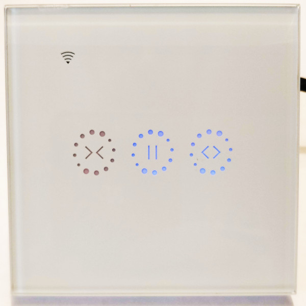
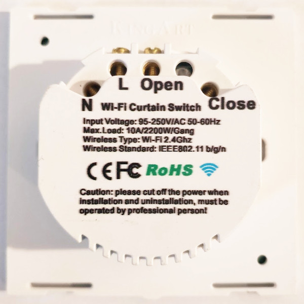
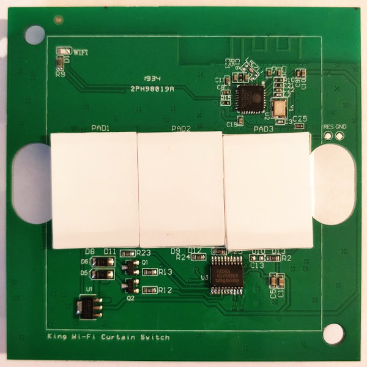
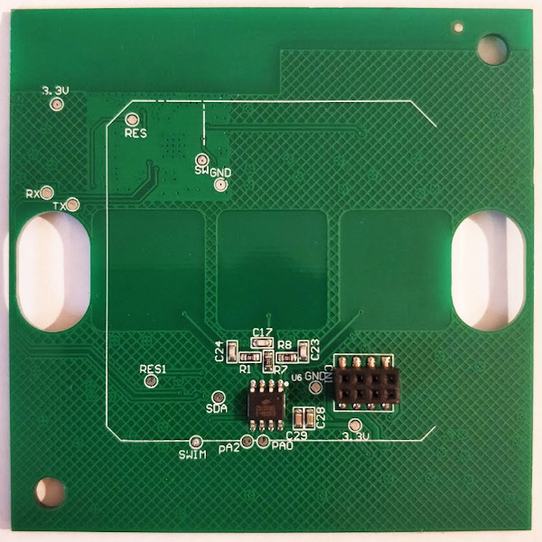

KingArt Wi-Fi Curtain Switch
============================

.. seo::
    :description: Instructions on setting up a KingArt cover switch with a custom cover implementation in ESPhome
    :image: king_art_front.jpg
    :keywords: KingArt WiFi Cover Switch ESPHome

With this sketch you can control curtains or other motor driven covers with a KingArt Wi-Fi Curtain Switch.
This switch does not allow you to control the relais or read the buttons directly, separate microcontrollers ar used to control the relays and touch buttons instead.

The microcontroller which has control of the relais is connected to the ESP via a UART.
The only GPIO which kan be controlled directly from the ESP is the wifi LED.
Another controller which reads the touch buttons is only connected to the relay controller.
The ESPhome firmware will only be running on th ESP8266, the other controllers remain untouched.

Flashing
========

.. warning::

    The switch needs to be opened to initially program the ESP. Make sure that the switch is not connected to mains before opening the housing!

The switch contains two PCBs, one for the high voltage parts and one which contains the ESP and the additional microcontrollers which control the relais and read the touch buttons.

.. figure:: images/king_art_power_pcb.jpg
    :align: center
    :width: 50.0%

In order to program the ESP8622, the logic pcb can easily be removed from the switch.
Testpoints on the back of the pcb are clearly marked RX, TX, 3.3V, GND, RES and SW.
To program the ESP connect power, RX and TX, pull SW down to GND while powering up and start the esp flash tool - as usual.

You can also flash just a minimal ESPhome configuration that only accepty OTA updates now and flash the completed firmware via wifi once the pcb is fitted back into the housing.

Serial Protocol
===============

A simple serial protocol is used to signal events from the relay and button controllers to the ESP and vice versa.
The same RX/TX signal pair that is also used to program the ESP is used at runtime for the UART communication between the ESP and the relay and button controllers.
To understand the serial protocol, both lines have been monitored on an unmodified device.
Some very incomplete descriptions of parts of the protool could be found in various forums.
Finally, the strings within the original firmware (which can be dumped using the esp flash tool before you flash ESPhome) helped reverse engineering the protocol.

The following implementation mimics the behavior of the origina ESP firmware while the other controllers firmware run their original firmwares.
All commands and replies start with an AT+ prefix and end with en ESC character (not a newline as one could expect).

.. code-block:: cpp

    #include "esphome.h"

    static const char *TAG = "king_art_cover";

    class KingArtCover : public Component, public UARTDevice, public Cover
    {
    public:
      KingArtCover(UARTComponent *parent) : UARTDevice(parent) {}

      void setup() override {}

      void loop() override
      {
        const int max_line_length = 80;
        static char buffer[max_line_length];
        if (available() && readline(read(), buffer, max_line_length) > 0)
        {
          ESP_LOGD(TAG, "rx: %s", buffer);
          const std::string s(buffer);
          if (s.find("AT+RESULT=") != std::string::npos)
          {
            write_str("AT+SEND=ok\e");
            ESP_LOGD(TAG, "tx: AT+SEND=ok");
          }
          if (s.find("AT+UPDATE=") >= 0)
          {
            auto setclose = last_setclose;
            if (s.find("\"switch\":\"on\"") != std::string::npos)
            {
              current_operation = COVER_OPERATION_OPENING;
              ESP_LOGD(TAG, "  Reported Operation: OPENING");
            }
            else if (s.find("\"switch\":\"off\"") != std::string::npos)
            {
              current_operation = COVER_OPERATION_CLOSING;
              ESP_LOGD(TAG, "  Reported Operation: CLOSING");
            }
            else if (s.find("\"switch\":\"pause\"") != std::string::npos)
            {
              current_operation = COVER_OPERATION_IDLE;
              ESP_LOGD(TAG, "  Reported Operation: IDLE");
            }
            auto pos = s.find("\"setclose\":");
            if (pos != std::string::npos)
            {
              setclose = atoi(s.substr(pos + 11).c_str());
              if ((last_setclose == setclose) && (last_operation == current_operation))
              {
                current_operation = COVER_OPERATION_IDLE;
                ESP_LOGD(TAG, "  Effective Operation: IDLE (stalled)");
                write_str("AT+SEND=ok\e");
                ESP_LOGD(TAG, "tx: AT+SEND=fail");
              }
              else
              {
                last_setclose = setclose;
                last_operation = current_operation;
              }
              position = 0.01f * (100 - setclose);
              ESP_LOGD(TAG, "  Reported Position: %.0f%%", position * 100.0f);
            }
            if ((published_setclose != setclose) || (published_operation != current_operation))
            {
              publish_state();
              published_setclose = setclose;
              published_operation = current_operation;
            }
          }
        }
      }

      CoverTraits get_traits() override
      {
        auto traits = CoverTraits();
        traits.set_is_assumed_state(false);
        traits.set_supports_position(true);
        traits.set_supports_tilt(false);
        return traits;
      }

      void control(const CoverCall &call) override
      {
        const int max_line_length = 80;
        static char buffer[max_line_length];
        if (call.get_position().has_value())
        {
          const auto pos = *call.get_position();
          const auto setclose = static_cast<int>(100 * (1.0f - pos));
          if (pos > position)
          {
            current_operation = COVER_OPERATION_OPENING;
          }
          else if (pos < position)
          {
            current_operation = COVER_OPERATION_CLOSING;
          }
          if (pos == COVER_OPEN)
          {
            snprintf(buffer, max_line_length, "AT+UPDATE=\"sequence\":\"%li000\",\"switch\":\"on\"", ::time(nullptr));
          }
          else if (pos == COVER_CLOSED)
          {
            snprintf(buffer, max_line_length, "AT+UPDATE=\"sequence\":\"%li000\",\"switch\":\"off\"", ::time(nullptr));
          }
          else
          {
            snprintf(buffer, max_line_length, "AT+UPDATE=\"sequence\":\"%li000\",\"setclose\":%i", ::time(nullptr), setclose);
          }
          write_str(buffer);
          write('\e');
          ESP_LOGD(TAG, "tx: %s", buffer);
        }
        if (call.get_stop())
        {
          current_operation = COVER_OPERATION_IDLE;
          snprintf(buffer, max_line_length, "AT+UPDATE=\"sequence\":\"%li000\",\"switch\":\"pause\"", ::time(nullptr));
          write_str(buffer);
          write('\e');
          ESP_LOGD(TAG, "tx: %s", buffer);
        }
      }

    protected:
      int readline(int readch, char *buffer, int len)
      {
        static int pos = 0;
        int rpos;

        if (readch > 0)
        {
          switch (readch)
          {
          case '\e': // King Art uses ESC to as EOL mark
            rpos = pos;
            pos = 0;
            return rpos;
          default:
            if (pos < len - 1)
            {
              buffer[pos++] = readch;
              buffer[pos] = 0;
            }
          }
        }
        // No end of line has been found, so return -1.
        return -1;
      }

    private:
      int last_setclose{-1};
      int published_setclose{-1};
      CoverOperation last_operation{COVER_OPERATION_IDLE};
      CoverOperation published_operation{COVER_OPERATION_IDLE};
    };

ESPhome Configuration
=====================

.. code-block:: yaml

    esphome:
      name: king_art_cover
      platform: ESP8266
      board: esp8285
      includes:
      - king_art_cover.h

    wifi:
      networks:
      - ssid: "###"
        password: "###"
      ap:
        ssid: "esphome"

    captive_portal:

    # Serial logging must be turned off because the UART is used to control the relays and buttons.
    logger:
      baud_rate: 0

    api:
      password: "###"

    ota:
      password: "###"

    status_led:
      pin:
        number: GPIO13
        inverted: True

    uart:
      id: uart_0
      tx_pin: GPIO1
      rx_pin: GPIO3
      baud_rate: 19200

    time:
      - platform: homeassistant

    cover:
      - platform: custom
        lambda: |-
          auto cover = new KingArtCover(id(uart_0));
          App.register_component(cover);
          return {cover};
        covers:
        - name: "King Art Wi-Fi Curtain Switch"

See Also
--------

- :doc:`/components/cover/custom`
- :ghedit:`Edit`
