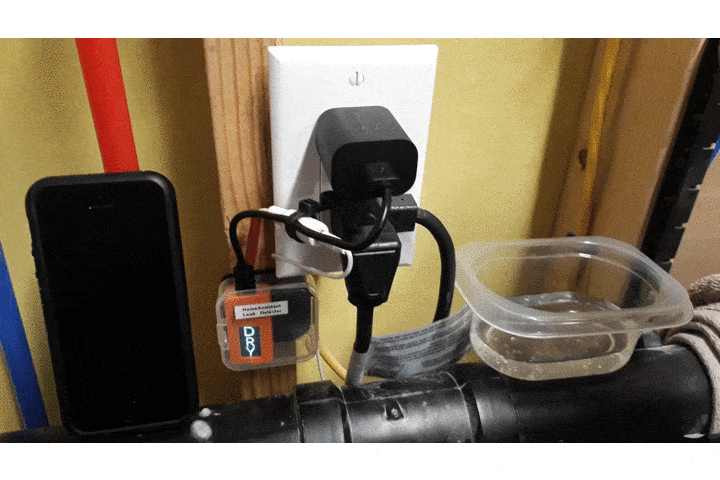
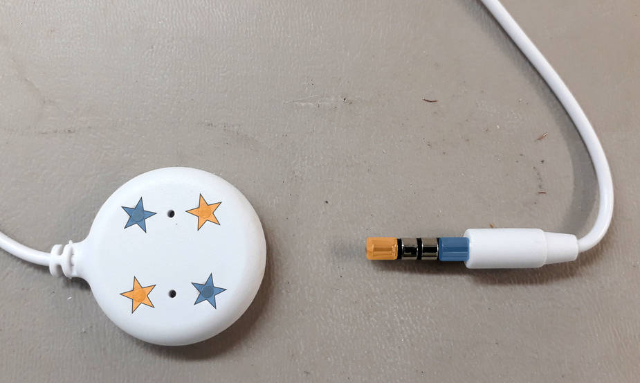
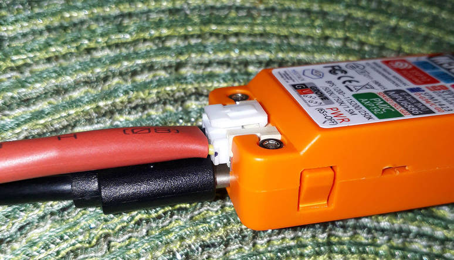
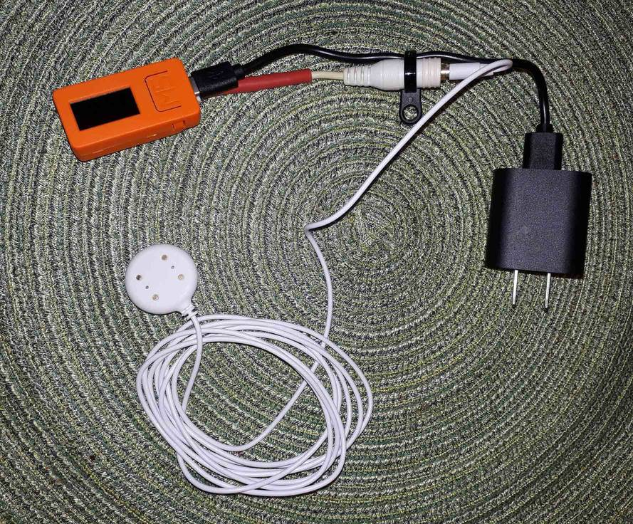
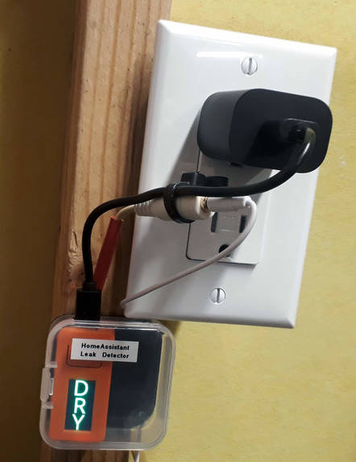

=============================================
ESP32 Water Leak Detector (with notification)
=============================================

.. seo::
    :description: Water leak detector with ESPHome on an M5StickC ESP32
    :keywords: Leak Detector M5StickC M5Stack M5Atom

Using the ESP32's capacitive touch GPIOs, it's relatively easy to build a water leak detector using ESPHome.  M5StickC was chosen as a platform due to the integrated Grove connector for clean connections and the fact it's well housed.  The built-in display is a bonus, but not strictly necessary.  Notifications are performed via HomeAssistant's 'alert' and 'notify' facilities, which send via Pushover to iOS & Android.

Things you'll need
==================

-  `M5Stick axp192 custom component <https://github.com/airy10/esphome-m5stickC>`__
    This is needed to power up the display.  You don't need the st7735 display driver, as it is already included with ESPHome >1.16.0.

- M5StickC ESP32 development kit
   `M5Stack Link <https://m5stack.com/collections/m5-core/products/stick-c>`__

-  Moisture sensor
    This example uses a `Guardian Remote Sensor Probe <https://amazon.com/Guardian-by-Elexa-Remote-Sensor/dp/B07G5BMD7L>`__
    which has a 6' cord.

- Grove connector pigtail
    `Amazon Link <https://www.amazon.com/Cables-Grove-Female-Jumper-Grove-Conversion/dp/B01CNZ9EEC>`__

- USB power supply with USB-C cable
    (the M5StickC comes with the short black USB cable seen in the pictures)

------------

Probe Connection
================

Since the probe comes with an integrated 3.5mm male plug, a 3.5mm female jack has been connected to the Grove port to allow easy probe replacement in the future.  Orange connects to orange, blue connects to blue.  The pads on the opposite side of the probe are internally-connected identically to the front.  The two middle rings on the 3.5mm jack are unused.  There is no polarity -- simply connect one terminal (orange or blue) to Grove GND, and the other to Grove G33.

Assembled Components
====================

.. note::

    Even though the M5StickC has a battery inside (which might be enough to cover short power outages), you'll need to keep
    the unit on USB power 24/7.

Display Font
============

You'll need to place the `OpenSans-Regular <https://fonts.google.com/specimen/Open+Sans>`__ font (or another of your choosing) alongside your ESPHome yaml file.  See - :doc:`/components/display/index`.

Calibration & Testing
=====================

Once everything is hooked up and flashed, enable ``esp32_touch:`` ``setup_mode: true`` and proceed to adjust the threshold setting on the touch-sensitive binary sensor (GPIO33) to find the proper value for your particular moisture sensor and cabling situation.  Grab a glass of water for testing, another for yourself, and dip away while watching the logs.  Your goal is to find a threshold value that is sufficient to trigger the binary sensor in water, but not otherwise.  See :ref:`ESP32 Touch Pad <esp32-touch-binary-sensor>` for more information.

------------

Normal state
************

.. figure:: images/leak-detector-m5stickC_dry.jpg
    :align: center

Wet state
*********

Installed Project
*****************

Not shown: Probe is placed on the floor in the corner, out of the way, in the lowest part of the room

------------

ESPHome configuration
=====================

.. code-block:: yaml

    substitutions:
      devicename: basement_leak_detector
      friendly_name: Basement Leak Detector
      device_description: Leak detector in basement utility room

    esphome:
      name: $devicename
      comment: ${device_description}

    esp32:
      board: m5stick-c

    wifi:
      ssid: !secret wifi_ssid
      password: !secret wifi_password

      # Enable fallback hotspot (captive portal) in case wifi connection fails
      ap:
        password: !secret fallback_ap_password

    captive_portal:

    logger:

    # Enable Home Assistant API & OTA Updates
    api:
    ota:

    status_led:
      pin:
        number: GPIO10
        inverted: true

    spi:
      clk_pin: GPIO13
      mosi_pin: GPIO15

    i2c:
       - id: bus_a
         sda: GPIO21
         scl: GPIO22
         scan: true

    esp32_touch:
      #setup_mode: true
      iir_filter: 10ms

    binary_sensor:
      - platform: gpio
        pin:
          number: GPIO37
          inverted: true
        id: button_a
        on_press:
          then:
            - switch.toggle: led1
      - platform: gpio
        pin:
          number: GPIO39
          inverted: true
        id: button_b
        on_press:
          then:
            - switch.toggle: led1
      - platform: status
        name: "${friendly_name} Status"
      - platform: esp32_touch
        name: "${friendly_name} Sensor"
        device_class: moisture
        id: leak
        pin: GPIO33
        threshold: 30
        on_press:
          - while:
              condition:
                binary_sensor.is_on: leak
              then:
              - switch.turn_on: led1
              - delay: 200ms
              - switch.turn_off: led1
              - delay: 100ms
              - switch.turn_on: led1
              - delay: 200ms
              - switch.turn_off: led1
              - delay: 400ms
        on_release:
          then:
            - switch.turn_off: led1

    sensor:
      - platform: uptime
        name: "${friendly_name} Uptime"

        # AXP192 power management - must be present to initialize TFT power on
      - platform: axp192
        address: 0x34
        i2c_id: bus_a
        update_interval: 30s
        battery_level:
          name: "${friendly_name} Battery Level"
          id: "m5stick_batterylevel"

      - platform: wifi_signal
        name: "${friendly_name} WiFi Signal"
        update_interval: 60s

    text_sensor:
      - platform: version
        name: "${friendly_name} ESPHome version"

    switch:
      - platform: gpio
        pin:
          number: GPIO10
          inverted: true
        id: led1

    font:
      - file: 'OpenSans-Regular.ttf'
        id: font1
        size: 66

    color:
        - id: color_wet
          red: 100%
          green: 0%
          blue: 0%
        - id: color_dry
          red: 0%
          green: 100%
          blue: 0%

    # built-in 80x160 TFT
    display:
      - platform: st7735
        model: "INITR_MINI160X80"
        device_height: 160
        device_width: 82
        col_start: 0
        row_start: 0
        eight_bit_color: false
        cs_pin: GPIO5
        dc_pin: GPIO23
        reset_pin: GPIO18
        invert_colors: true
        use_bgr: true
        lambda: |-
          if (id(leak).state) {
            it.fill(COLOR_OFF);
            it.print(42, -24, id(font1), id(color_wet), TextAlign::TOP_CENTER, "W");
            it.print(42, 32, id(font1), id(color_wet), TextAlign::TOP_CENTER, "E");
            it.print(42, 85, id(font1), id(color_wet), TextAlign::TOP_CENTER, "T");
          } else {
            it.fill(COLOR_OFF);
            it.print(42, -24, id(font1), id(color_dry), TextAlign::TOP_CENTER, "D");
            it.print(42, 32, id(font1), id(color_dry), TextAlign::TOP_CENTER, "R");
            it.print(42, 85, id(font1), id(color_dry), TextAlign::TOP_CENTER, "Y");
          }

HomeAssistant configuration
===========================

There are two sections: one for alert criteria, and another for notification via Pushover.
See HomeAssistant's `Pushover integration docs <https://www.home-assistant.io/integrations/pushover/>`__ for more details.

.. code-block:: yaml

    alert:
      basement_water_leak:
        name: Water detected in the basement
        entity_id: binary_sensor.basement_leak_detector_sensor
        state: 'on'
        repeat: 30
        can_acknowledge: true
        notifiers:
          - water_leak_notification_group

    notify:
      - name: pushover
        platform: pushover
        api_key: !secret pushover_api_key
        user_key: !secret pushover_user_key
      - name: water_leak_notification_group
        platform: group
        services:
          - service: pushover
            data:
              data:
                # Pushover-provided sound effect (https://pushover.net/api#sounds)
                sound: alien

Enjoy your locally-controlled leak detector with push notification!

.. figure:: images/leak-detector-m5stickC-ha_interface.jpg
    :align: center

See Also
========

- :doc:`/components/display/index`
- :doc:`/components/display/st7735`
- :doc:`/components/binary_sensor/esp32_touch`
- :ghedit:`Edit`
