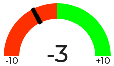

.. _lvgl-cook:

LVGL: Tips and Tricks
=====================

.. seo::
    :description: Recipes for common use cases of LVGL Displays with ESPHome
    :image: /images/lvgl.png

Here are a couple recipes for various interesting things you can do with :ref:`lvgl-main` in ESPHome.

.. note::

    Many of the examples below call services in Home Assistant; however, Home Assistant does not allow such service calls by default. For each ESPHome device which will call services, you must explicitly enable this setting in Home Assistant. This may be done when the device is initially adopted or by using the `Configure` option in the "devices" list of the ESPHome integration.

.. note::

    The examples below assume you've set up LVGL correctly with your display and its input device, and you have the knowledge to set up various components in ESPHome. Some examples use absolute positioning for a screen with dimensions of ``240x320px``; if your display's dimensions differ, you'll need to adjust them in order to obtain the expected results.

.. _lvgl-cook-outbin:

Local GPIO switch
-----------------

.. figure:: /components/images/lvgl_switch.png
    :align: right

The easiest way to integrate a LVGL :ref:`lvgl-wgt-swi` widget and a GPIO output on your display board is with the :ref:`lvgl-swi` component. This will create a Switch, which will toggle your GPIO directly:

.. code-block:: yaml

    output:
      - id: output_display_light
        platform: gpio
        pin: GPIO14 # choose yours

    switch:
      - platform: lvgl
        name: Display lights
        widget: light_switch
        output_id: output_display_light

    lvgl:
        ...
        pages:
          - id: main_page
            widgets:
              - switch:
                  align: center
                  id: light_switch

.. _lvgl-cook-relay:

Local light switch
------------------

.. figure:: /components/images/lvgl_switch.png
    :align: left

In case your local light implements as a different platform than GPIO, you can use :ref:`automations <automation>` to link together triggers and states with the :ref:`lvgl-wgt-swi` widget: 

.. code-block:: yaml

    light:
      - platform: ...
        id: room_light
        name: 'Room light'
        on_state:
            if:
              condition:
                light.is_on: room_light
              then:
                - lvgl.widget.update:
                    id: light_switch
                    state:
                      checked: true
              else:
                - lvgl.widget.update:
                    id: light_switch
                    state:
                      checked: false
    lvgl:
        ...
        pages:
          - id: main_page
            widgets:
              - switch:
                  align: center
                  id: light_switch
                  on_click:
                    light.toggle: room_light

.. _lvgl-cook-binent:

Remote light button
-------------------

.. figure:: images/lvgl_cook_remligbut.png
    :align: right

If you'd like to control a remote light which appears as an entity in Home Assistant from a checkable (toggle) :ref:`lvgl-wgt-btn`, first you need to import the light state into ESPHome, and then control it using a service call:

.. code-block:: yaml

    binary_sensor:
      - platform: homeassistant
        id: remote_light
        entity_id: light.remote_light
        publish_initial_state: true
        on_state:
          then:
            lvgl.widget.update:
              id: light_btn
              state:
                checked: !lambda return x;

    lvgl:
        ...
        pages:
          - id: room_page
            widgets:
              - btn:
                  id: light_btn
                  align: center
                  width: 100
                  height: 70
                  checkable: true
                  widgets:
                    - label:
                        align: center
                        text: 'Remote light'
                  on_click:
                    - homeassistant.service:
                        service: light.toggle
                        data: 
                          entity_id: light.remote_light

.. _lvgl-cook-bright:

Light brightness slider
-----------------------

.. figure:: images/lvgl_cook_volume.png
    :align: left

You can use a :ref:`slider <lvgl-wgt-sli>` or an :ref:`arc <lvgl-wgt-arc>` to control the brightness of a dimmable light.

We can use a sensor to retrieve the current brightness of a light, which is stored in Home Assistant as an attribute of the entity, as an integer value between ``0`` (min) and ``255`` (max). It's convenient to set the slider's ``min_value`` and ``max_value`` accordingly.

.. code-block:: yaml

    sensor:
      - platform: homeassistant
        id: light_brightness
        entity_id: light.your_dimmer
        attribute: brightness
        on_value:
          - lvgl.slider.update: 
              id: dimmer_slider
              value: !lambda return x; 

    lvgl:
        ...
        pages:
          - id: room_page
            widgets:
              - slider:
                  id: dimmer_slider
                  x: 20
                  y: 50
                  width: 30
                  height: 220
                  pad_all: 8
                  min_value: 0
                  max_value: 255
                  on_release:
                    - homeassistant.service:
                        service: light.turn_on
                        data:
                          entity_id: light.your_dimmer
                          brightness: !lambda return int(x);

Note that Home Assistant expects an integer at the ``brightness`` parameter of the ``light.turn_on`` service call, and since ESPHome uses floats, ``x`` needs to be converted.

This is applicable to service calls like ``fan.set_percentage`` or ``valve.set_valve_position``, too; the only difference is that ``max_value`` has to be ``100``.

.. _lvgl-cook-volume:

Media player volume slider
--------------------------

.. figure:: images/lvgl_cook_volume.png
    :align: right

Similarly, you can use a :ref:`slider <lvgl-wgt-sli>` or an :ref:`arc <lvgl-wgt-arc>` to control the volume level of a media player, which uses float values.

With a sensor we retrieve the current volume level of the media player, which is stored in Home Assistant as an attribute of the entity, and is a float value between ``0`` (min) and ``1`` (max). Since LVGL only handles integers, it's convenient to set the slider's possible values to be between ``0`` and ``100``. Thus a conversion is needed back and forth, meaning that when we read the value from Home Assistant we have to multiply it by ``100``, and when we set the volume through the service call, we have to divide it by ``100``:

.. code-block:: yaml

    sensor:
      - platform: homeassistant
        id: media_player_volume
        entity_id: media_player.your_room
        attribute: volume_level
        on_value:
          - lvgl.slider.update: 
              id: slider_media_player
              value: !lambda return (x * 100); 

    lvgl:
        ...
        pages:
          - id: mediaplayer_page
            widgets:
              - slider:
                  id: slider_media_player
                  x: 60
                  y: 50
                  width: 30
                  height: 220
                  pad_all: 8
                  min_value: 0
                  max_value: 100
                  adv_hittest: true
                  on_value:
                    - homeassistant.service:
                        service: media_player.volume_set
                        data:
                          entity_id: media_player.your_room
                          volume_level: !lambda return (x / 100);

The ``adv_hittest`` option ensures that accidental touches to the screen won't cause sudden volume changes (more details in the :ref:`slider doc <lvgl-wgt-sli>`).

.. note::

    Keep in mind that ``on_value`` is triggered *continuously* by the slider while it's being dragged. This generally has a negative effect on performance. For example, you shouldn't use this trigger to set the target temperature of a heat pump via Modbus, or set the position of motorized covers, because it will likely cause malfunctions. To mitigate this, consider using a universal widget trigger like ``on_release`` to get the ``x`` variable once after the interaction has completed.

.. _lvgl-cook-gauge:

Semicircle gauge
----------------

A gauge similar to what Home Assistant shows in the Energy Dashboard can accomplished with :ref:`lvgl-wgt-mtr` and :ref:`lvgl-wgt-lbl` widgets:

The trick here is to have a parent :ref:`lvgl-wgt-obj` which contains the other widgets as children. We place a :ref:`lvgl-wgt-mtr` in the middle, which is made from an indicator ``line`` and two ``arc`` widgets. We use another, smaller :ref:`lvgl-wgt-obj` on top of it to hide the indicator's central parts and place some :ref:`lvgl-wgt-lbl` widgets to display numeric information:

.. code-block:: yaml

    sensor:
      - platform: ...
        id: values_between_-10_and_10
        on_value:
          - lvgl.indicator.update:
              id: val_needle
              value: !lambda return x;
          - lvgl.label.update:
              id: val_text
              text:
                format: "%.0f"
                args: [ 'x' ]
    lvgl:
        ...
        pages:
          - id: gauge_page
            widgets:
              - obj:
                  height: 240 
                  width: 240
                  align: CENTER
                  bg_color: 0xFFFFFF
                  border_width: 0
                  pad_all: 4
                  widgets:
                    - meter:
                        height: 100%
                        width: 100%
                        border_width: 0
                        bg_opa: TRANSP
                        align: center
                        scales:
                          - range_from: -10
                            range_to: 10
                            angle_range: 180 # sets the total angle to 180 = starts mid left and ends mid right
                            ticks:
                              count: 0
                            indicators:
                              - line:
                                  id: val_needle
                                  width: 8
                                  r_mod: 12 # sets line length by this much difference from the scale default radius
                                  value: -2
                              - arc: # first half of the scale background
                                  color: 0xFF3000
                                  r_mod: 10 # radius difference from the scale default radius
                                  width: 31
                                  start_value: -10
                                  end_value: 0
                              - arc: # second half of the scale background
                                  color: 0x00FF00
                                  r_mod: 10
                                  width: 31
                                  start_value: 0
                                  end_value: 10
                    - obj: # to cover the middle part of meter indicator line
                        height: 146
                        width: 146
                        radius: 73
                        align: center
                        border_width: 0
                        bg_color: 0xFFFFFF
                        pad_all: 0
                    - label: # gauge numeric indicator
                        id: val_text
                        text_font: montserrat_48
                        align: center
                        y: -5
                        text: "0"
                    - label: # lower range indicator
                        text_font: montserrat_18
                        align: center
                        y: 8
                        x: -90
                        text: "-10"
                    - label: # higher range indicator
                        text_font: montserrat_18
                        align: center
                        y: 8
                        x: 90
                        text: "+10"

.. tip::

    The ``obj`` used to hide the middle part of the meter indicator line has ``radius`` equal to half of the ``width`` and ``height``. This results in a circle - which is actually a square with extra large rounded corners. 

.. _lvgl-cook-thermometer:

Thermometer
-----------

A thermometer with a precise gauge also made from a :ref:`lvgl-wgt-mtr` widget and a numeric display using :ref:`lvgl-wgt-lbl`:

.. figure:: images/lvgl_cook_thermometer.png
    :align: center

Whenever a new value comes from the sensor, we update the needle indicator as well as the text in the :ref:`lvgl-wgt-lbl`. Since LVGL only handles integer values on the :ref:`lvgl-wgt-mtr` scale, but the sensor's value is a ``float``, we use the same approach as in the examples above; we multiply the sensor's values by ``10`` and feed this value to the :ref:`lvgl-wgt-mtr`. It's essentially two scales on top of each other: one to set the needle based on the multiplied value and the other to show sensor's original value in the :ref:`lvgl-wgt-lbl`.

.. code-block:: yaml

    sensor:
      - platform: ...
        id: outdoor_temperature
        on_value:
          - lvgl.indicator.update:
              id: temperature_needle
              value: !lambda return x * 10; 
          - lvgl.label.update:
              id: temperature_text
              text:
                format: "%.1f°C"
                args: [ 'x' ]
    lvgl:
        ...
        pages:
          - id: meter_page
            widgets:
              - meter:
                  align: CENTER
                  height: 180
                  width: 180
                  scales:
                    - range_from: -100 # scale for the needle value
                      range_to: 400
                      angle_range: 240
                      rotation: 150
                      indicators:
                        - line:
                            id: temperature_needle
                            width: 2
                            color: 0xFF0000
                            r_mod: -4
                        - tick_style:
                            start_value: -10
                            end_value: 40
                            color_start: 0x0000bd
                            color_end: 0xbd0000
                            width: 1
                    - range_from: -10 # scale for the value labels
                      range_to: 40
                      angle_range: 240
                      rotation: 150
                      ticks:
                        width: 1
                        count: 51
                        length: 10
                        color: 0x000000
                        major:
                          stride: 5
                          width: 2
                          length: 10
                          color: 0x404040
                          label_gap: 10
                  widgets:
                    - label:
                        id: temperature_text
                        text: "-.-°C"
                        align: CENTER
                        y: 45
                    - label:
                        text: "Outdoor"
                        align: CENTER
                        y: 65

And here's the same sensor configuration, but instead with a semicircle gauge with a gradient background drawn by a multitude of ticks:

If you change the size of the widget, to obtain a uniform gradient, be sure to increase or decrease the ticks count accordingly.

.. code-block:: yaml

    lvgl:
        ...
        pages:
          - id: meter_page
            widgets:
              - obj: 
                  height: 240
                  width: 240
                  align: CENTER
                  y: -18
                  bg_color: 0xFFFFFF
                  border_width: 0
                  pad_all: 14
                  widgets:
                    - meter:
                        height: 100%
                        width: 100%
                        border_width: 0
                        align: center
                        bg_opa: TRANSP
                        scales:
                          - range_from: -15
                            range_to: 35
                            angle_range: 180
                            ticks:
                              count: 70
                              width: 1
                              length: 31
                            indicators:
                              - tick_style:
                                  start_value: -15
                                  end_value: 35
                                  color_start: 0x3399ff
                                  color_end: 0xffcc66
                          - range_from: -150
                            range_to: 350
                            angle_range: 180
                            ticks:
                              count: 0
                            indicators:
                              - line:
                                  id: temperature_needle
                                  width: 8
                                  r_mod: 2
                                  value: -150
                    - obj: # to cover the middle part of meter indicator line
                        height: 123
                        width: 123
                        radius: 73
                        align: center
                        border_width: 0
                        pad_all: 0
                        bg_color: 0xFFFFFF
                    - label:
                        id: temperature_text
                        text: "--.-°C"
                        align: CENTER
                        y: -26
                    - label:
                        text: "Outdoor"
                        align: CENTER
                        y: -6

.. _lvgl-cook-climate:

Climate control
---------------

:ref:`lvgl-wgt-spb` is the ideal widget to control a thermostat:

First we import from Home Assistant the current target temperature of the climate component, and we update the value of the spinbox with it whenever it changes. We use two buttons labeled with minus and plus to control the spinbox, and whenever we change its value, we just simply call a Home Assistant service to set the new target temperature of the climate.

.. code-block:: yaml

    sensor:
      - platform: homeassistant
        id: room_thermostat
        entity_id: climate.room_thermostat
        attribute: temperature
        on_value:
          - lvgl.spinbox.update:
              id: spinbox_id
              value: !lambda return x; 

    lvgl:
        ...
        pages:
          - id: thermostat_control
            widgets:
              - obj:
                  align: BOTTOM_MID
                  y: -50
                  layout: flex
                  flex_flow: row
                  width: size_content
                  height: size_content
                  widgets:
                    - btn:
                        id: spin_down
                        on_click:
                          - lvgl.spinbox.decrement: spinbox_id
                        widgets:
                          - label:
                               text: "-"
                    - spinbox:
                        id: spinbox_id
                        align: center
                        text_align: center
                        width: 50
                        range_from: 15
                        range_to: 35
                        step: 0.5
                        rollover: false
                        digits: 3
                        decimal_places: 1
                        on_value:
                          then:
                            - homeassistant.service:
                                service: climate.set_temperature
                                data:
                                  temperature: !lambda return x;
                                  entity_id: climate.room_thermostat
                    - btn:
                        id: spin_up
                        on_click:
                          - lvgl.spinbox.increment: spinbox_id
                        widgets:
                          - label:
                              text: "+"

.. _lvgl-cook-cover:

Cover status and control
------------------------

To make a nice user interface for controlling Home Assistant covers you could use 3 buttons, which also display the state. 

.. figure:: images/lvgl_cook_cover.png
    :align: center

Just as in the previous examples, we need to get the state of the cover first. We'll use a numeric sensor to retrieve the current position of the cover and a text sensor to retrieve its current movement. We are particularly interested in the moving (*opening* and *closing*) states, because during these we'd like to change the label in the middle to show *STOP*. Otherwise, this button label will show the actual percentage of the opening. Additionally, we'll change the opacity of the labels on the *UP* and *DOWN* buttons depending on if the cover is fully open or closed.

.. code-block:: yaml

    sensor:
      - platform: homeassistant
        id: cover_myroom_pos
        entity_id: cover.myroom
        attribute: current_position
        on_value:
          - if:
              condition:
                lambda: |-
                  return x == 100;
              then:
                - lvgl.widget.update:
                    id: cov_up_myroom
                    text_opa: 60%
              else:
                - lvgl.widget.update:
                    id: cov_up_myroom
                    text_opa: 100%
          - if:
              condition:
                lambda: |-
                  return x == 0;
              then:
                - lvgl.widget.update:
                    id: cov_down_myroom
                    text_opa: 60%
              else:
                - lvgl.widget.update:
                    id: cov_down_myroom
                    text_opa: 100%

    text_sensor:
      - platform: homeassistant
        id: cover_myroom_state
        entity_id: cover.myroom
        on_value:
          - if:
              condition:
                lambda: |-
                  return ((0 == x.compare(std::string{"opening"})) or (0 == x.compare(std::string{"closing"})));
              then:
                - lvgl.label.update:
                    id: cov_stop_myroom
                    text: "STOP"
              else:
                - lvgl.label.update:
                    id: cov_stop_myroom
                    text:
                      format: "%.0f%%"
                      args: [ 'id(cover_myroom_pos).get_state()' ]

    lvgl:
        ...
        pages:
          - id: room_page
            widgets:
              - label:
                  x: 10
                  y: 6
                  width: 70
                  text: "My room"
                  text_align: center
              - btn:
                  x: 10
                  y: 30
                  width: 70
                  height: 68
                  widgets:
                    - label:
                        id: cov_up_myroom
                        align: center
                        text: "\uF077"
                  on_press:
                    then:
                      - homeassistant.service:
                          service: cover.open
                          data:
                            entity_id: cover.myroom
              - btn:
                  x: 10
                  y: 103
                  width: 70
                  height: 68
                  widgets:
                    - label:
                        id: cov_stop_myroom
                        align: center
                        text: STOP
                  on_press:
                    then:
                      - homeassistant.service:
                          service: cover.stop
                          data:
                            entity_id: cover.myroom
              - btn:
                  x: 10
                  y: 178
                  width: 70
                  height: 68
                  widgets:
                    - label:
                        id: cov_down_myroom
                        align: center
                        text: "\uF078"
                  on_press:
                    then:
                      - homeassistant.service:
                          service: cover.close
                          data:
                            entity_id: cover.myroom

.. _lvgl-cook-theme:

Theme and style definitions
---------------------------

Since LVGL uses inheritance to apply styles across the widgets, it's possible to apply them at the top level, and only make modifications on demand, if necessary. 

.. figure:: images/lvgl_cook_gradient_styles.png
    :align: center

In this example we prepare a set of gradient styles in the *theme*, and make some modifications in a *style_definition* which can be applied in a batch to the desired widgets. Theme is applied automatically, and can be overridden manually with style definitions (read further to see how).

.. code-block:: yaml

    lvgl:
      ...
      theme:
        label:
          text_font: my_font # set all your labels to use your custom defined font
        btn:
          bg_color: 0x2F8CD8
          bg_grad_color: 0x005782
          bg_grad_dir: VER
          bg_opa: COVER
          border_color: 0x0077b3
          border_width: 1
          text_color: 0xFFFFFF
          pressed: # set some btn colors to be different in pressed state
            bg_color: 0x006699
            bg_grad_color: 0x00334d
          checked: # set some btn colors to be different in checked state
            bg_color: 0x1d5f96
            bg_grad_color: 0x03324A
            text_color: 0xfff300
        btnmatrix:
          bg_opa: TRANSP
          border_color: 0x0077b3
          border_width: 0
          text_color: 0xFFFFFF
          pad_all: 0
          items: # set all your btnmatrix buttons to use your custom defined styles and font
            bg_color: 0x2F8CD8
            bg_grad_color: 0x005782
            bg_grad_dir: VER
            bg_opa: COVER
            border_color: 0x0077b3
            border_width: 1
            text_color: 0xFFFFFF
            text_font: my_font 
            pressed:
              bg_color: 0x006699
              bg_grad_color: 0x00334d
            checked:
              bg_color: 0x1d5f96
              bg_grad_color: 0x03324A
              text_color: 0x005580
        switch:
          bg_color: 0xC0C0C0
          bg_grad_color: 0xb0b0b0
          bg_grad_dir: VER
          bg_opa: COVER
          checked:
            bg_color: 0x1d5f96
            bg_grad_color: 0x03324A
            bg_grad_dir: VER
            bg_opa: COVER
          knob:
            bg_color: 0xFFFFFF
            bg_grad_color: 0xC0C0C0
            bg_grad_dir: VER
            bg_opa: COVER
        slider:
          border_width: 1
          border_opa: 15%
          bg_color: 0xcccaca
          bg_opa: 15%
          indicator:
            bg_color: 0x1d5f96
            bg_grad_color: 0x03324A
            bg_grad_dir: VER
            bg_opa: COVER
          knob:
            bg_color: 0x2F8CD8
            bg_grad_color: 0x005782
            bg_grad_dir: VER
            bg_opa: COVER
            border_color: 0x0077b3
            border_width: 1
            text_color: 0xFFFFFF
      style_definitions:
        - id: header_footer
          bg_color: 0x2F8CD8
          bg_grad_color: 0x005782
          bg_grad_dir: VER
          bg_opa: COVER
          border_width: 0
          radius: 0
          pad_all: 0
          pad_row: 0
          pad_column: 0
          border_color: 0x0077b3
          text_color: 0xFFFFFF
          width: 100%
          height: 30

Note that style definitions can contain common properties too, like positioning and sizing.

.. _lvgl-cook-navigator:

Page navigation footer
----------------------

If using multiple pages, a navigation bar can be useful at the bottom of the screen:

.. figure:: images/lvgl_cook_pagenav.png
    :align: center

To save from repeating the same widgets on each page, there's the *top_layer* which is the *Always on Top* transparent page above all the pages. Everything you put on this page will be on top of all the others. 

For the navigation bar we can use a :ref:`lvgl-wgt-bmx`. Note how the *header_footer* style definition is being applied to the widget and its children objects, and how a few more styles are configured manually at the main widget:

.. code-block:: yaml

    lvgl:
      ...
      top_layer:
        widgets:
          - btnmatrix:
              align: bottom_mid
              styles: header_footer
              pad_all: 0
              outline_width: 0
              id: top_layer
              items:
                styles: header_footer
              rows:
                - buttons:
                  - id: page_prev
                    text: "\uF053"
                    on_press:
                      then:
                        lvgl.page.previous:
                  - id: page_home
                    text: "\uF015"
                    on_press:
                      then:
                        lvgl.page.show: main_page
                  - id: page_next
                    text: "\uF054"
                    on_press:
                      then:
                        lvgl.page.next:

For this example to appear correctly, use the theme and style options from :ref:`above <lvgl-cook-theme>` and LVGL's own library :ref:`fonts <lvgl-fonts>`.

.. _lvgl-cook-statico:

API connection status icon
--------------------------

The top layer is useful to show status icons visible on all pages:

.. figure:: images/lvgl_cook_statico.png
    :align: center

In the example below, we only show the icon when the connection with Home Assistant is established:

.. code-block:: yaml

    api:
      on_client_connected:
        - if:
            condition:
              lambda: 'return (0 == client_info.find("Home Assistant "));' 
            then:
              - lvgl.widget.show: lbl_hastatus
      on_client_disconnected:
        - if:
            condition:
              lambda: 'return (0 == client_info.find("Home Assistant "));' 
            then:
              - lvgl.widget.hide: lbl_hastatus

    lvgl:
      ...
      top_layer:
        widgets:
          - label:
              text: "\uF1EB"
              id: lbl_hastatus
              hidden: true
              align: top_right
              x: -2
              y: 7
              text_align: right
              text_color: 0xFFFFFF

Of note:

- The widget starts *hidden* at boot and it's only shown when triggered by connection with the API.
- Alignment of the widget: since the *align* option is given, the *x* and *y* options are used to position the widget relative to the calculated position.

.. _lvgl-cook-titlebar:

Title bar for each page
-----------------------

Each page can have its own title bar:

To put a title bar behind the status icon, we need to add it to each page, also containing the label with a unique title:

.. code-block:: yaml

    lvgl:
      ...
      pages:
        - id: main_page
          widgets:
            - obj:
                align: TOP_MID
                styles: header_footer
                widgets:
                  - label:
                      text: "ESPHome LVGL Display"
                      align: center
                      text_align: center
                      text_color: 0xFFFFFF
            ...
        - id: second_page
          widgets:
            - obj:
                align: TOP_MID
                styles: header_footer
                widgets:
                  - label:
                      text: "A second page"
                      align: center
                      text_align: center
                      text_color: 0xFFFFFF
            ...

For this example to work, use the theme and style options from :ref:`above <lvgl-cook-theme>`.

.. _lvgl-cook-flex:

Flex layout positioning
-----------------------

:ref:`lvgl-layouts` aim to position widgets automatically, eliminating the need to specify coordinates to position each widget. This is a great way to simplify your configuration containing many widgets as it allows you to even omit alignment options.

.. figure:: images/lvgl_cook_flex_layout.png
    :align: center

This example illustrates a control panel for three covers, made up of labels and discrete buttons. Although a button matrix could also be suitable for this, you might still prefer fully-featured individual buttons, as they offer a wider range of customization possibilities as seen in the :ref:`lvgl-cook-cover` example. Here we use the **Flex** layout:

.. code-block:: yaml

    lvgl:
        ...
        pages:
          - id: room_page
            widgets:
              - obj: # a properly placed coontainer object for all these controls
                  align: CENTER
                  width: 240
                  height: 260
                  x: 4
                  y: 4
                  pad_all: 3
                  pad_row: 6
                  pad_column: 8
                  bg_opa: transp
                  border_width: 0
                  layout: # enable the FLEX layout for the children widgets
                    type: FLEX
                    flex_flow: COLUMN_WRAP # the order of the widgets starts top left
                    flex_align_cross: CENTER # they sould be centered
                  widgets:
                    - label:
                        text: "East"
                    - btn:
                        id: but_cov_up_east
                        width: 70 # choose the button dimensions so 
                        height: 68 # they fill the columns nincely as they flow
                        widgets:
                          - label:
                              id: cov_up_east
                              align: center
                              text: "\U000F005D" # mdi:arrow-up
                    - btn:
                        id: but_cov_stop_east
                        width: 70
                        height: 68
                        widgets:
                          - label:
                              id: cov_stop_east
                              align: center
                              text: "\U000F04DB" # mdi:stop
                    - btn:
                        id: but_cov_down_east
                        width: 70
                        height: 68
                        widgets:
                          - label:
                              id: cov_down_east
                              align: center
                              text: "\U000F0045" # mdi:arrow-down

                    - label:
                        text: "South"
                    - btn:
                        id: but_cov_up_south
                        width: 70
                        height: 68
                        widgets:
                          - label:
                              id: cov_up_south
                              align: center
                              text: "\U000F005D"
                    - btn:
                        id: but_cov_stop_south
                        width: 70
                        height: 68
                        widgets:
                          - label:
                              id: cov_stop_south
                              align: center
                              text: "\U000F04DB"
                    - btn:
                        id: but_cov_down_south
                        width: 70
                        height: 68
                        widgets:
                          - label:
                              id: cov_down_south
                              align: center
                              text: "\U000F0045"

                    - label:
                        text: "West"
                    - btn:
                        id: but_cov_up_west
                        width: 70
                        height: 68
                        widgets:
                          - label:
                              id: cov_up_west
                              align: center
                              text: "\U000F005D"
                    - btn:
                        id: but_cov_stop_west
                        width: 70
                        height: 68
                        widgets:
                          - label:
                              id: cov_stop_west
                              align: center
                              text: "\U000F04DB"
                    - btn:
                        id: but_cov_down_west
                        width: 70
                        height: 68
                        widgets:
                          - label:
                              id: cov_down_west
                              align: center
                              text: "\U000F0045"

This saved you from a considerable amount of manual calculation of widget positioning which would otherwise be required to place them manually with ``x`` and ``y``! You only need to determine a common width and height for your widgets to distribute them on the page as you prefer. (:ref:`lvgl-cook-icontext` below shows how to use custom icons.)

.. _lvgl-cook-grid:

Grid layout positioning
-----------------------

But there's even more! With **Grid** layout, you don't even need to give specific widths and height to your widgets. All you have to do is split the space in proportional rows and columns, and drop the widgets in the cells, all stretched to the cell sizes. The same task from above, in a fully automated grid, looks like this:

.. code-block:: yaml

    lvgl:
        ...
        pages:
          - id: room_page
            widgets:
              - obj: # a properly placed coontainer object for all these controls
                  align: CENTER
                  width: 240
                  height: 260
                  pad_all: 6
                  pad_row: 6
                  pad_column: 8
                  bg_opa: transp
                  border_width: 0
                  layout: # enable the GRID layout for the children widgets
                    type: GRID # split the rows and the columns in proportional areas
                    grid_columns: [FR(1), FR(1), FR(1) ] # equal
                    grid_rows: [FR(10), FR(30), FR(30), FR(30)] # like percents
                  widgets:
                    - label:
                        text: "East"
                        grid_cell_row_pos: 0 # place the widget in
                        grid_cell_column_pos: 0 # the corresponding cell
                        grid_cell_x_align: stretch
                        grid_cell_y_align: stretch
                    - btn:
                        id: but_cov_up_east
                        grid_cell_row_pos: 1
                        grid_cell_column_pos: 0
                        grid_cell_x_align: stretch
                        grid_cell_y_align: stretch
                        widgets:
                          - label:
                              id: cov_up_east
                              align: center
                              text: "\U000F005D"
                    - btn:
                        id: but_cov_stop_east
                        grid_cell_row_pos: 2
                        grid_cell_column_pos: 0
                        grid_cell_x_align: stretch
                        grid_cell_y_align: stretch
                        widgets:
                          - label:
                              id: cov_stop_east
                              align: center
                              text: "\U000F04DB"
                    - btn:
                        id: but_cov_down_east
                        grid_cell_row_pos: 3
                        grid_cell_column_pos: 0
                        grid_cell_x_align: stretch
                        grid_cell_y_align: stretch
                        widgets:
                          - label:
                              id: cov_down_east
                              align: center
                              text: "\U000F0045"

                    - label:
                        text: "South"
                        grid_cell_row_pos: 0
                        grid_cell_column_pos: 1
                        grid_cell_x_align: stretch
                        grid_cell_y_align: stretch
                    - btn:
                        id: but_cov_up_south
                        grid_cell_row_pos: 1
                        grid_cell_column_pos: 1
                        grid_cell_x_align: stretch
                        grid_cell_y_align: stretch
                        widgets:
                          - label:
                              id: cov_up_south
                              align: center
                              text: "\U000F005D"
                    - btn:
                        id: but_cov_stop_south
                        grid_cell_row_pos: 2
                        grid_cell_column_pos: 1
                        grid_cell_x_align: stretch
                        grid_cell_y_align: stretch
                        widgets:
                          - label:
                              id: cov_stop_south
                              align: center
                              text: "\U000F04DB"
                    - btn:
                        id: but_cov_down_south
                        grid_cell_row_pos: 3
                        grid_cell_column_pos: 1
                        grid_cell_x_align: stretch
                        grid_cell_y_align: stretch
                        widgets:
                          - label:
                              id: cov_down_south
                              align: center
                              text: "\U000F0045"

                    - label:
                        text: "West"
                        grid_cell_row_pos: 0
                        grid_cell_column_pos: 2
                        grid_cell_x_align: stretch
                        grid_cell_y_align: stretch
                    - btn:
                        id: but_cov_up_west
                        grid_cell_row_pos: 1
                        grid_cell_column_pos: 2
                        grid_cell_x_align: stretch
                        grid_cell_y_align: stretch
                        widgets:
                          - label:
                              id: cov_up_west
                              align: center
                              text: "\U000F005D"
                    - btn:
                        id: but_cov_stop_west
                        grid_cell_row_pos: 2
                        grid_cell_column_pos: 2
                        grid_cell_x_align: stretch
                        grid_cell_y_align: stretch
                        widgets:
                          - label:
                              id: cov_stop_west
                              align: center
                              text: "\U000F04DB"
                    - btn:
                        id: but_cov_down_west
                        grid_cell_row_pos: 3
                        grid_cell_column_pos: 2
                        grid_cell_x_align: stretch
                        grid_cell_y_align: stretch
                        widgets:
                          - label:
                              id: cov_down_west
                              align: center
                              text: "\U000F0045"

The big advantage here is that whenever you need to add, for example, an extra columns of buttons for a new cover, you just simply append it to the ``grid_columns`` variable, and add the corresponding widgets as above. Their sizes and positions will automatically be calculated to fit in.

.. _lvgl-cook-btlg:

ESPHome boot screen
-------------------

To display a boot image with a spinner animation which disappears automatically after a few moments or on touch of the screen you can use the *top layer*. The trick is to put a base :ref:`lvgl-wgt-obj` full screen and child :ref:`lvgl-wgt-img` widget in its middle as the last item of the widgets list, so they draw on top of all the others. To make it automatically disappear afer boot, you use ESPHome's ``on_boot`` trigger:

.. code-block:: yaml

    esphome:
      ...
      on_boot:
        - delay: 5s
        - lvgl.widget.hide: boot_screen

    image:
      - file: https://esphome.io/_images/logo.png
        id: boot_logo
        resize: 200x200
        type: RGB565

    lvgl:
      ...
      top_layer:
        widgets:
          ... # make sure it's the last one in this list:
          - obj:
              id: boot_screen
              x: 0
              y: 0
              width: 100%
              height: 100%
              bg_color: 0xFFFFFF
              bg_opa: cover
              radius: 0
              pad_all: 0
              border_width: 0
              widgets:
                - img:
                    align: center
                    src: boot_logo
                    y: -40
                - spinner:
                    align: center
                    y: 95
                    height: 50
                    width: 50
                    spin_time: 1s
                    arc_length: 60deg
                    arc_width: 8
                    indicator:
                      arc_color: 0x404040
                      arc_width: 8
              on_press:
                - lvgl.widget.hide: boot_screen

.. _lvgl-cook-icontext:

MDI icons in text
-----------------

ESPHome's :ref:`font renderer <display-fonts>` allows you to use any OpenType/TrueType font file for your text. This is very flexible because you can prepare various sets of fonts at different sizes each with a different number of glyphs; this is important as it may help to conserve flash memory space.

One example is when you'd like some MDI icons to be used in line with the text (similar to how LVGL's internal fonts and symbols coexist). You can use a font of your choice; choose the symbols you want and mix them in a single sized set with icons from MDI.

.. figure:: images/lvgl_cook_font_roboto_mdi.png
    :align: center

In the example below, we use the default set of glyphs from RobotoCondensed-Regular and append some extra symbols to it from MDI. Then we display these inline with the text by escaping their codepoints:

.. code-block:: yaml

    font:
      - file: "fonts/RobotoCondensed-Regular.ttf"
        id: roboto_icons_42
        size: 42
        bpp: 4
        extras:
          - file: "fonts/materialdesignicons-webfont.ttf"
            glyphs: [
              "\U000F02D1", # mdi-heart
              "\U000F05D4", # mdi-airplane-landing
              ]

    lvgl:
        ...
        pages:
          - id: main_page
            widgets:
              - label:
                  text: "Just\U000f05d4here. Already\U000F02D1this."
                  align: CENTER
                  text_align: center
                  text_font: roboto_icons_42

.. tip::

    Follow these steps to choose your MDI icons:
    
    - To lookup your icons, use the `Pictogrammers <https://pictogrammers.com/library/mdi/>`_ site. Click on the desired icon and note its codepoint (it's the hexadecimal number near the download options).
    - To get the TrueType font with all the icons in it, head on to the `Pictogrammers GitHub repository <https://github.com/Pictogrammers/pictogrammers.github.io/tree/main/%40mdi/font/>`_ and from a recent version folder, download the ``materialdesignicons-webfont.ttf`` file and place it in your ESPHome config directory under a folder named ``fonts`` (to match the example above).
    - To use the desired icon, prepend the copied codepoint with ``\U000``. The Unicode character escape sequence has to start with capital ``\U`` and have exactly 8 hexadecimal digits.
    - To translate the escape sequence into the real glyph, make sure you enclose your strings in double quotes.    

.. _lvgl-cook-iconstat:

Toggle state icon button
------------------------

.. figure:: images/lvgl_cook_font_binstat.png
    :align: left

A common use case for icons is a status display. For example, a checkable (toggle) button will display different icons based on the status of a light or switch. To put an icon on a button you use a :ref:`lvgl-wgt-lbl` widget as the child of the :ref:`lvgl-wgt-btn`. The coloring can already be different thanks to the :ref:`lvgl-cook-theme` where you can set a different color for the ``checked`` state. Additionally, by using a ``text_sensor`` to import the state from Home Assistant, we can not only track the ``on`` state, but also the ``unavailable`` or ``unknown`` states to apply *disabled styles* for these cases.

If we take our previous :ref:`lvgl-cook-binent` example, we can modify it like this:

.. code-block:: yaml

    font:
      - file: "custom/materialdesignicons-webfont.ttf"
        id: mdi_42
        size: 42
        bpp: 4
        glyphs: [
          "\U000F0335", # mdi-lightbulb
          "\U000F0336", # mdi-lightbulb-outline
          ]

    text_sensor:
      - platform: homeassistant
        id: ts_remote_light
        entity_id: light.remote_light
        on_value:
          then:
            - lvgl.widget.update:
                id: btn_lightbulb
                state:
                  checked: !lambda return (0 == x.compare(std::string{"on"}));
                  disabled: !lambda return ((0 == x.compare(std::string{"unavailable"})) or (0 == x.compare(std::string{"unknown"})));
            - lvgl.label.update:
                id: lbl_lightbulb
                text: !lambda |-
                  static char buf[10];
                  std::string icon;
                  if (0 == x.compare(std::string{"on"})) {
                      icon = "\U000F0335";
                  } else {
                      icon = "\U000F0336";
                  }
                  snprintf(buf, sizeof(buf), "%s", icon.c_str());
                  return buf;

    lvgl:
        ...
        pages:
          - id: room_page
            widgets:
              - btn:
                  x: 110
                  y: 40
                  width: 90
                  height: 50
                  checkable: true
                  id: btn_lightbulb
                  widgets:
                    - label:
                        id: lbl_lightbulb
                        align: center
                        text_font: mdi_42
                        text: "\U000F0336" # mdi-lightbulb-outline
                  on_short_click:
                    - homeassistant.service:
                        service: light.toggle
                        data: 
                          entity_id: light.remote_light

.. _lvgl-cook-iconbatt:

Battery status icon
-------------------

Another example for using MDI icons is to display battery percentage in 10 steps. We need to have a font containing the glyphs corresponding to the different battery percentage levels, and we need a sensor to import the battery status from Home Assistant into a numeric value. We use a :ref:`lambda <config-lambda>` to return the codepoint of the corresponding glyph based on the sensor value:

.. code-block:: yaml

    font:
      - file: "fonts/materialdesignicons-webfont.ttf"
        id: battery_icons_20
        size: 20
        bpp: 4
        glyphs: [
          "\U000F007A", # mdi-battery-10
          "\U000F007B", # mdi-battery-20
          "\U000F007C", # mdi-battery-30
          "\U000F007D", # mdi-battery-40
          "\U000F007E", # mdi-battery-50
          "\U000F007F", # mdi-battery-60
          "\U000F0080", # mdi-battery-70
          "\U000F0081", # mdi-battery-80
          "\U000F0082", # mdi-battery-90
          "\U000F0079", # mdi-battery (full)
          "\U000F008E", # mdi-battery-outline
          "\U000F0091", # mdi-battery-unknown
          ]

    sensor:
      - platform: homeassistant
        id: sns_battery_percentage
        entity_id: sensor.device_battery
        on_value:
          - lvgl.label.update:
              id: lbl_battery_status
              text: !lambda |-
                static char buf[10];
                std::string icon;
                if (x == 100.0) {
                    icon = "\U000F0079"; // mdi-battery (full)
                } else if (x > 90) {
                    icon = "\U000F0082"; // mdi-battery-90
                } else if (x > 80) {
                    icon = "\U000F0081"; // mdi-battery-80
                } else if (x > 70) {
                    icon = "\U000F0080"; // mdi-battery-70
                } else if (x > 60) {
                    icon = "\U000F007F"; // mdi-battery-60
                } else if (x > 50) {
                    icon = "\U000F007E"; // mdi-battery-50
                } else if (x > 40) {
                    icon = "\U000F007D"; // mdi-battery-40
                } else if (x > 30) {
                    icon = "\U000F007C"; // mdi-battery-30
                } else if (x > 20) {
                    icon = "\U000F007B"; // mdi-battery-20
                } else if (x > 10) {
                    icon = "\U000F007A"; // mdi-battery-10
                } else if (x > 0) {
                    icon = "\U000F008E"; // mdi-battery-outline
                } else {
                    icon = "\U000F0091"; // mdi-battery-unknown
                }
                snprintf(buf, sizeof(buf), "%s", icon.c_str());
                return buf;

    lvgl:
        ...
        pages:
          - id: battery_page
            widgets:
              - label:
                  id: lbl_battery_status
                  align: TOP_RIGHT
                  y: 40
                  x: -10
                  text_font: battery_icons_20
                  text: "\U000F0091" # start with mdi-battery-unknown

.. _lvgl-cook-animbatt:

Battery charging animation
--------------------------

.. figure:: images/lvgl_cook_animimg_batt.gif
    :align: left

To have an animation illustrating a battery charging, you can use :ref:`lvgl-wgt-aim` with a set of :ref:`images rendered from MDI <display-image>` showing battery levels:

.. code-block:: yaml

    image:
      - file: mdi:battery-10
        id: batt_10
        resize: 20x20
      - file: mdi:battery-20
        id: batt_20
        resize: 20x20
      - file: mdi:battery-30
        id: batt_30
        resize: 20x20
      - file: mdi:battery-40
        id: batt_40
        resize: 20x20
      - file: mdi:battery-50
        id: batt_50
        resize: 20x20
      - file: mdi:battery-60
        id: batt_60
        resize: 20x20
      - file: mdi:battery-70
        id: batt_70
        resize: 20x20
      - file: mdi:battery-80
        id: batt_80
        resize: 20x20
      - file: mdi:battery-90
        id: batt_90
        resize: 20x20
      - file: mdi:battery
        id: batt_full
        resize: 20x20
      - file: mdi:battery-outline
        id: batt_empty
        resize: 20x20

    lvgl:
        ...
        pages:
          - id: battery_page
            widgets:
              - animimg:
                  align: TOP_RIGHT
                  y: 41
                  x: -10
                  id: ani_battery_charging
                  src: [ 
                    batt_empty, 
                    batt_10, 
                    batt_20, 
                    batt_30, 
                    batt_40, 
                    batt_50, 
                    batt_60, 
                    batt_70, 
                    batt_80, 
                    batt_90, 
                    batt_full
                    ]
                  duration: 2200ms

.. tip::

    You can use both battery examples above placed on top of each other, and switch their ``hidden`` flag depending if the charger is connected or not:

    .. code-block:: yaml

        binary_sensor:
          - platform: ...
            id: charger_connected
            on_press:
              then:
                - lvgl.widget.show: ani_battery_charging
                - lvgl.widget.hide: lbl_battery_status
            on_release:
              then:
                - lvgl.widget.show: lbl_battery_status
                - lvgl.widget.hide: ani_battery_charging

    Use ``x``, ``y``, ``align`` widget properties for precise positioning.

.. _lvgl-cook-clock:

An analog clock
---------------

Using the :ref:`lvgl-wgt-mtr` and :ref:`lvgl-wgt-lbl` widgets, we can create an analog clock which shows the date too.

.. figure:: images/lvgl_cook_clock.png
    :align: center

The :ref:`lvgl-wgt-mtr` has three scales: one for minutes ticks and hand, ranged between ``0`` and ``60``; one for the hour ticks and the labels as majors, ranged between ``1`` and ``12``; and a higher resolution scale for the hour hand, ranged between ``0`` and ``720``, to be able to naturally position the hand in between the hours. The second scale doesn't have an indicator, while the third scale doesn't have ticks nor labels.

The script runs at the beginning of every minute to update the line positions for each hand as well as the respective text.

.. code-block:: yaml

    lvgl:
      ...
      pages:
        - id: clock_page
          widgets:
            - obj: # clock container
                height: size_content
                width: 240
                align: CENTER
                pad_all: 0
                border_width: 0
                bg_color: 0xFFFFFF
                widgets:
                  - meter: # clock face
                      height: 220
                      width: 220
                      align: center
                      bg_opa: TRANSP
                      border_width: 0
                      text_color: 0x000000
                      scales:
                        - range_from: 0 # minutes scale
                          range_to: 60
                          angle_range: 360
                          rotation: 270
                          ticks:
                            width: 1
                            count: 61
                            length: 10
                            color: 0x000000
                          indicators:
                            - line:
                                id: minute_hand
                                width: 3
                                color: 0xa6a6a6
                                r_mod: -4
                                value: 0
                        - range_from: 1 # hours scale for labels
                          range_to: 12
                          angle_range: 330
                          rotation: 300
                          ticks: 
                            width: 1
                            count: 12
                            length: 1
                            major:
                              stride: 1
                              width: 4
                              length: 10
                              color: 0xC0C0C0
                              label_gap: 12
                        - range_from: 0 # hi-res hours scale for hand
                          range_to: 720
                          angle_range: 360
                          rotation: 270
                          ticks: 
                            count: 0
                          indicators:
                            - line:
                                id: hour_hand
                                width: 5
                                color: 0xa6a6a6
                                r_mod: -30
                                value: 0
                  - label:
                      styles: date_style
                      id: day_label
                      y: -30
                  - label:
                      id: date_label
                      styles: date_style
                      y: 30

    time:
      - platform: homeassistant
        id: time_comp
        on_time_sync:
          - script.execute: time_update
        on_time:
          - minutes: '*'
            seconds: 0
            then:
              - script.execute: time_update

    script:
      - id: time_update
        then:
          - lvgl.indicator.update:
              id: minute_hand
              value: !lambda |-
                return id(time_comp).now().minute;
          - lvgl.indicator.update:
              id: hour_hand
              value: !lambda |-
                auto now = id(time_comp).now();
                return std::fmod(now.hour, 12) * 60 + now.minute;
          - lvgl.label.update:
              id: date_label
              text: !lambda |-
                static const char * const mon_names[] = {"JAN", "FEB", "MAR", "APR", "MAY", "JUN", "JUL", "AUG", "SEP", "OCT", "NOV", "DEC"};
                static char date_buf[8];
                auto now = id(time_comp).now();
                snprintf(date_buf, sizeof(date_buf), "%s %2d", mon_names[now.month-1], now.day_of_month);
                return date_buf;
          - lvgl.label.update:
              id: day_label
              text: !lambda |-
                static const char * const day_names[] = {"SUN", "MON", "TUE", "WED", "THU", "FRI", "SAT"};
                return day_names[id(time_comp).now().day_of_week - 1];

.. _lvgl-cook-keypad:

A numeric input keypad
----------------------

The :ref:`lvgl-wgt-bmx` widget can work together with the :ref:`key_collector` to collect the button presses as key press sequences. It sends the ``text`` of the buttons (or ``key_code`` where configured) to the key collector.

.. figure:: images/lvgl_cook_keypad.png
    :align: center

If you key in the correct sequence, the :ref:`lvgl-wgt-led` widget will change color accordingly:

.. code-block:: yaml

    lvgl:
      ...
      pages:
        - id: keypad_page
          widgets:
            - led:
                id: lvgl_led
                x: 30
                y: 47
                color: 0xFF0000
                brightness: 70%
            - obj:
                width: 140
                height: 25
                align_to:
                  id: lvgl_led
                  align: OUT_RIGHT_MID
                  x: 17
                border_width: 1
                border_color: 0
                border_opa: 50%
                pad_all: 0
                bg_opa: 80%
                bg_color: 0xFFFFFF
                shadow_color: 0
                shadow_opa: 50%
                shadow_width: 10
                shadow_spread: 3
                radius: 5
                widgets:
                  - label:
                      id: lvgl_label
                      align: CENTER
                      text: "Enter code and \uF00C"
                      text_align: center
            - btnmatrix:
                id: lvgl_keypad
                x: 20
                y: 85
                width: 200
                height: 190
                items:
                  pressed:
                    bg_color: 0xFFFF00
                rows:
                  - buttons:
                      - text: 1
                        control:
                          no_repeat: true
                      - text: 2
                        control:
                          no_repeat: true
                      - text: 3
                        control:
                          no_repeat: true
                  - buttons:
                      - text: 4
                        control:
                          no_repeat: true
                      - text: 5
                        control:
                          no_repeat: true
                      - text: 6
                        control:
                          no_repeat: true
                  - buttons:
                      - text: 7
                        control:
                          no_repeat: true
                      - text: 8
                        control:
                          no_repeat: true
                      - text: 9
                        control:
                          no_repeat: true
                  - buttons:
                      - text: "\uF55A"
                        key_code: "*"
                        control:
                          no_repeat: true
                      - text: 0
                        control:
                          no_repeat: true
                      - text: "\uF00C"
                        key_code: "#"
                        control:
                          no_repeat: true

    key_collector:
      - source_id: lvgl_keypad
        min_length: 4
        max_length: 4
        end_keys: "#"
        end_key_required: true
        back_keys: "*"
        allowed_keys: "0123456789*#"
        timeout: 5s
        on_progress:
          - if:
              condition:
                lambda: return (0 != x.compare(std::string{""}));
              then:
                - lvgl.label.update:
                    id: lvgl_label
                    text: !lambda 'return x.c_str();'
              else:
                - lvgl.label.update:
                    id: lvgl_label
                    text: "Enter code and \uF00C"
        on_result:
          - if:
              condition:
                lambda: return (0 == x.compare(std::string{"1234"}));
              then:
                - lvgl.led.update:
                    id: lvgl_led
                    color: 0x00FF00
              else:
                - lvgl.led.update:
                    id: lvgl_led
                    color: 0xFF0000

Of note:

- A base object ``obj`` is used as a parent for the label; this allows proper centering of the label as well as emphasizing it with shadows independently of the label's dimensions.
- ``align_to`` is used to align the label to the ``led`` vertically.
- Changing the background color of the buttons in ``pressed`` state.
- Use of the ``key_code`` configuration to send a different character to ``key_collector`` instead of the displayed symbol.

.. _lvgl-cook-idlescreen:

Turn off screen when idle
-------------------------

LVGL has a notion of screen inactivity -- in other words, the time since the last user interaction with the screen is tracked. This can be used to dim the display backlight or turn it off after a moment of inactivity (like a screen saver). Every use of an input device (touchscreen, rotary encoder) counts as an activity and resets the inactivity counter. Note that it's important to use the ``on_release`` trigger to accomplish this task. With a template number you can make the timeout adjustable by the users.

.. code-block:: yaml

    lvgl:
      ...
      on_idle:
        timeout: !lambda "return (id(display_timeout).state * 1000);"
        then:
          - logger.log: "LVGL is idle"
          - light.turn_off: display_backlight
          - lvgl.pause:

    touchscreen:
      - platform: ...
        on_release:
          - if:
              condition: lvgl.is_paused
              then:
                - logger.log: "LVGL resuming"
                - lvgl.resume:
                - lvgl.widget.redraw:
                - light.turn_on: display_backlight

    light:
      - platform: ...
        id: display_backlight

    number:
      - platform: template
        name: LVGL Screen timeout
        optimistic: true
        id: display_timeout
        unit_of_measurement: "s"
        initial_value: 45
        restore_value: true
        min_value: 10
        max_value: 180
        step: 5
        mode: box

.. _lvgl-cook-antiburn:

Prevent burn-in of LCD
----------------------

You can use this to protect and prolong the lifetime of the LCD screens, thus being more green and generating less hazardous waste.

A common problem with wall-mounted LCD screens is that they display the same picture 99.999% of the time. Even if somebody turns off the backlight during the night or dark periods, the LCD screen keeps showing the same picture, but seen by nobody. This scenario is likely to lead to burn-in after a few years of operation.

One way to mitigate this is to *exercise* the pixels periodically by displaying different content. ``show_snow`` option during LVGL paused state was developed with this in mind; it displays randomly colored pixels across the entire screen in order to minimize screen burn-in by exercising each individual pixel.

In the example below, pixel training is done four times for a half an hour every night; it can be stopped by touching the screen.

.. code-block:: yaml

    time:
      - platform: ...
        on_time:
          - hours: 2,3,4,5
            minutes: 5
            seconds: 0
            then:
              - switch.turn_on: switch_antiburn
          - hours: 2,3,4,5
            minutes: 35
            seconds: 0
            then:
              - switch.turn_off: switch_antiburn

    switch:
      - platform: template
        name: Antiburn
        id: switch_antiburn
        icon: mdi:television-shimmer
        optimistic: true
        entity_category: "config"
        turn_on_action:
          - logger.log: "Starting Antiburn"
          - if:
              condition: lvgl.is_paused
              then:
                - lvgl.resume:
                - lvgl.widget.redraw:
                - delay: 1s
          - lvgl.pause:
              show_snow: true
        turn_off_action:
          - logger.log: "Stopping Antiburn"
          - if:
              condition: lvgl.is_paused
              then:
                - lvgl.resume:
                - lvgl.widget.redraw:
                - delay: 1s
                - lvgl.pause:

    touchscreen:
      - platform: ...
        on_release:
          then:
            - if:
                condition: lvgl.is_paused
                then:
                  - lvgl.resume:
                  - lvgl.widget.redraw:

You can combine it with the previous example to turn off the backlight, so the users don't actually notice this.

See Also
--------

- :ref:`lvgl-main`
- :ref:`config-lambda`
- :ref:`automation`
- :ref:`key_collector`
- `What is Image Sticking, Image Burn-in, an After Image, or a Ghost Image on an LCD? <https://www.philips.ca/c-f/XC000007486/what-is-image-sticking,-image-burn-in,-an-after-image,-or-a-ghost-image-on-an-lcd>`__
- `Image persistence <https://en.wikipedia.org/wiki/Image_persistence>`__

- :ghedit:`Edit`
