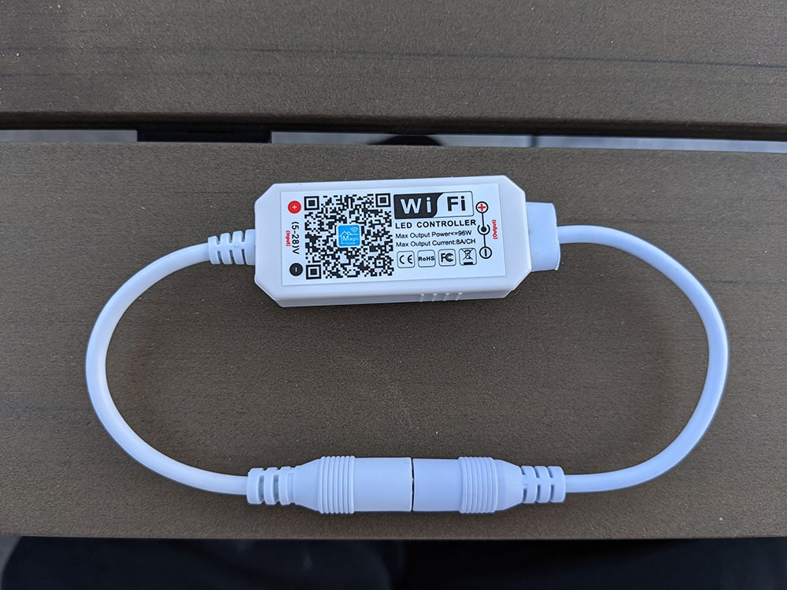
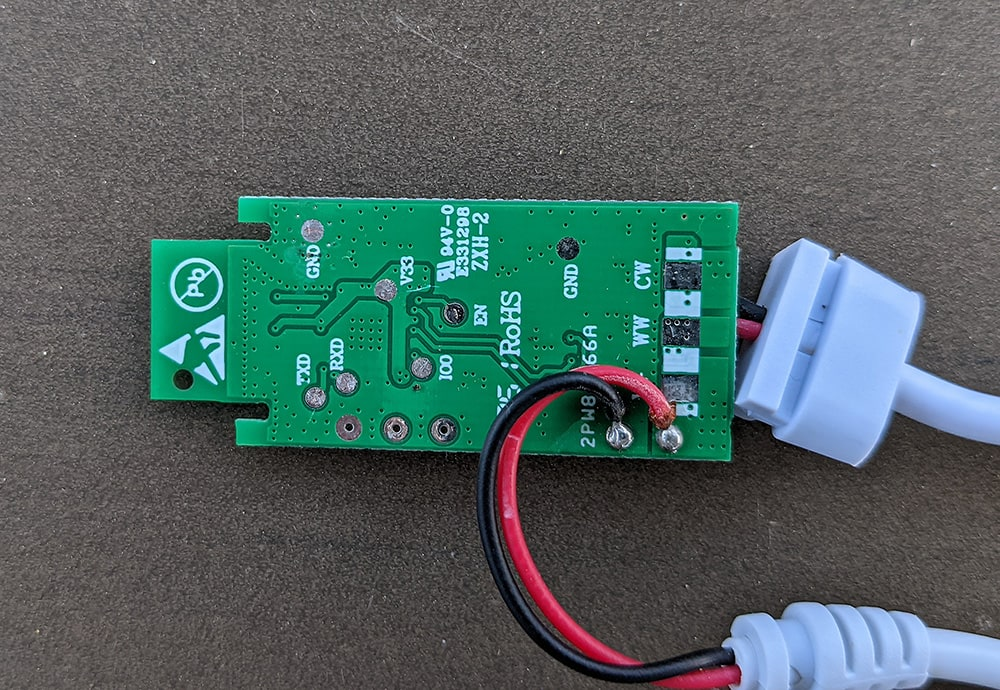

Magic Home LED WiFi Controller Monochromatic
============================================

.. seo::
    :description: Magic Home LED WiFi 1 channel / monochromatic Controller configuration with esphome
    :image: magic-home-led-controller-monochromatic.jpg
    :keywords: Magic Home, LED controller monochromatic, Home Assistant, ESPHome

The Magic Home LED WiFi Controller Monochromatic is a very cheap device for controlling a 1CH LED strip or wire which are often used for christmas trees.

Flashing
--------

After opening the case, you could see all the pins used for flashing. During boot you need to connect the pin 000 (GPIO000) to GND:

Configuration
-------------

.. code-block:: yaml

    esphome:
      name: magic-home-led-dimmer
      platform: ESP8266
      board: esp01_1m

    ### wifi and additional settings  ###

    light:
      - platform: monochromatic
        name: "Dimmer"
        output: pwm_1

    output:
      - platform: esp8266_pwm
        id: pwm_1
        pin: GPIO12

See Also
--------

- :ghedit:`Edit`
