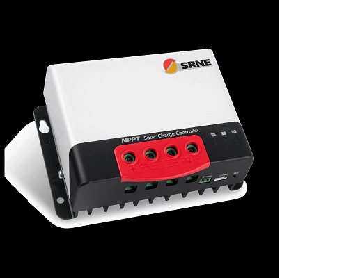

MPPT Solar Charge Controller MC2420/30/40/50N10
===============================================
.. seo::
    :description: MPPT Solar Charge Controller MC2420/30/40/50N10
    :image: images/images/mc24xx.png
    :keywords: MC2420 MC2430 MC2440 MC2450 MPPT Solar

Read MPPT Solar Charge Controller MC2420/30/40/50N10 data using Modbus

This device can be connected directly to TX/RX pins of the MCU without RS232/RS485 adapter when using the RS232 or the TTL interface. Signal level is 3.3V

Below is the ESPHome configuration file that will get you up and running. This assumes you have a ``secret.yaml`` with ssid, password, api_password and ota_password keys.
Tested with MC2420

.. code-block:: yaml

    substitutions:
      updates: 60s
      unique_id: solarstation

    esphome:
      name: ${unique_id}
      platform: ESP32
      board: esp32dev

    wifi:
      ssid: !secret wifi_sid
      password: !secret wifi_password

    time:
      - platform: sntp
        id: sntp_time
        timezone: "CET-1CEST,M3.5.0,M10.5.0/3"
        servers: "de.pool.ntp.org"

    # Enable logging
    logger:
      level: INFO

    # Enable Home Assistant API
    api:
      password: !secret api_password
      reboot_timeout: 0s

    ota:
      password: !secret ota_password

    uart:
      id: mod_bus
      tx_pin: 17
      rx_pin: 16
      baud_rate: 9600
      stop_bits: 1

    modbus:
      #flow_control_pin: 23
      send_wait_time: 200ms
      id: mod_bus_mcp2420

    modbus_controller:
      - id: mcp2420
        ## the Modbus device addr
        address: 0x1
        modbus_id: mod_bus_mcp2420
        command_throttle: 200ms
        setup_priority: -10
        update_interval: ${updates}

    sensor:
      - platform: modbus_controller
        modbus_controller_id: mcp2420
        name: "Maximum Voltage"
        address: 0xA
        bitmask: 0xFF00
        unit_of_measurement: "V"
        register_type: holding
        value_type: U_WORD
        accuracy_decimals: 0

      - platform: modbus_controller
        modbus_controller_id: mcp2420
        name: "Rated charging current"
        address: 0xA
        bitmask: 0x00FF
        unit_of_measurement: "A"
        register_type: holding
        value_type: U_WORD
        accuracy_decimals: 0

      - platform: modbus_controller
        modbus_controller_id: mcp2420
        name: "Rated Discharge current"
        address: 0xB
        bitmask: 0xFF00
        unit_of_measurement: "A"
        register_type: holding
        value_type: U_WORD
        accuracy_decimals: 0

      - platform: modbus_controller
        modbus_controller_id: mcp2420
        name: "Battery SOC"
        address: 0x100
        bitmask: 0x00FF
        unit_of_measurement: "%"
        register_type: holding
        value_type: U_WORD
        accuracy_decimals: 0

      - platform: modbus_controller
        modbus_controller_id: mcp2420
        name: "Battery Voltage"
        id: battery_voltage
        address: 0x101
        unit_of_measurement: "V"
        register_type: holding
        value_type: U_WORD
        accuracy_decimals: 1
        filters:
          - multiply: 0.1

      - platform: modbus_controller
        modbus_controller_id: mcp2420
        name: "recharging current"
        id: charging_current
        address: 0x102
        unit_of_measurement: "A"
        register_type: holding
        value_type: U_WORD
        accuracy_decimals: 1
        filters:
          - multiply: 0.01

      - platform: modbus_controller
        modbus_controller_id: mcp2420
        name: "Controller Temp"
        address: 0x103
        bitmask: 0xFF00
        unit_of_measurement: "°C"
        register_type: holding
        value_type: U_WORD
        accuracy_decimals: 1

      - platform: modbus_controller
        modbus_controller_id: mcp2420
        name: "Surface Temp"
        address: 0x103
        bitmask: 0x00FF
        unit_of_measurement: "°C"
        register_type: holding
        value_type: U_WORD
        accuracy_decimals: 1

      - platform: modbus_controller
        modbus_controller_id: mcp2420
        name: "Load Voltage"
        address: 0x104
        unit_of_measurement: "V"
        register_type: holding
        value_type: U_WORD
        accuracy_decimals: 1
        filters:
          - multiply: 0.1

      - platform: modbus_controller
        modbus_controller_id: mcp2420
        name: "Load Current"
        address: 0x105
        unit_of_measurement: "A"
        register_type: holding
        value_type: U_WORD
        accuracy_decimals: 1
        filters:
          - multiply: 0.01

      - platform: modbus_controller
        modbus_controller_id: mcp2420
        name: "Load Power"
        address: 0x106
        unit_of_measurement: "W"
        register_type: holding
        value_type: U_WORD
        accuracy_decimals: 0

      - platform: modbus_controller
        modbus_controller_id: mcp2420
        name: "Solar Voltage"
        address: 0x107
        unit_of_measurement: "V"
        register_type: holding
        value_type: U_WORD
        accuracy_decimals: 1
        filters:
          - multiply: 0.1

      - platform: modbus_controller
        modbus_controller_id: mcp2420
        name: "Solar Current"
        address: 0x108
        unit_of_measurement: "A"
        register_type: holding
        value_type: U_WORD
        accuracy_decimals: 1
        filters:
          - multiply: 0.01

      - platform: modbus_controller
        modbus_controller_id: mcp2420
        name: "Solar Power"
        id: solar_power
        address: 0x109
        unit_of_measurement: "W"
        register_type: holding
        value_type: U_WORD
        accuracy_decimals: 0

      - platform: modbus_controller
        modbus_controller_id: mcp2420
        name: "Lowest Battery Voltage today"
        address: 0x10B
        unit_of_measurement: "V"
        register_type: holding
        value_type: U_WORD
        accuracy_decimals: 1
        filters:
          - multiply: 0.1

      - platform: modbus_controller
        modbus_controller_id: mcp2420
        name: "Highest Battery Voltage today"
        address: 0x10C
        unit_of_measurement: "V"
        register_type: holding
        value_type: U_WORD
        accuracy_decimals: 1
        filters:
          - multiply: 0.1

      - platform: modbus_controller
        modbus_controller_id: mcp2420
        name: "Maximum charge current today"
        address: 0x10D
        unit_of_measurement: "A"
        register_type: holding
        value_type: U_WORD
        accuracy_decimals: 1
        filters:
          - multiply: 0.01

      - platform: modbus_controller
        modbus_controller_id: mcp2420
        name: "Maximum discharge current today"
        address: 0x10E
        unit_of_measurement: "A"
        register_type: holding
        value_type: U_WORD
        accuracy_decimals: 1
        filters:
          - multiply: 0.01

      - platform: modbus_controller
        modbus_controller_id: mcp2420
        name: "Maximum charge power today"
        address: 0x10F
        unit_of_measurement: "W"
        register_type: holding
        value_type: U_WORD
        accuracy_decimals: 0

      - platform: modbus_controller
        modbus_controller_id: mcp2420
        name: "Maximum discharge power today"
        address: 0x110
        unit_of_measurement: "W"
        register_type: holding
        value_type: U_WORD
        accuracy_decimals: 0

      - platform: modbus_controller
        modbus_controller_id: mcp2420
        name: "Total charge ampere hours today"
        address: 0x111
        unit_of_measurement: "AH"
        register_type: holding
        value_type: U_WORD
        accuracy_decimals: 0

      - platform: modbus_controller
        modbus_controller_id: mcp2420
        name: "Total discharge ampere hours today"
        address: 0x112
        unit_of_measurement: "AH"
        register_type: holding
        value_type: U_WORD
        accuracy_decimals: 0

      - platform: modbus_controller
        modbus_controller_id: mcp2420
        name: "Total power created today"
        address: 0x113
        unit_of_measurement: "W"
        register_type: holding
        value_type: U_WORD
        accuracy_decimals: 0

      - platform: modbus_controller
        modbus_controller_id: mcp2420
        name: "Total power consumed today"
        address: 0x114
        unit_of_measurement: "W"
        register_type: holding
        value_type: U_WORD
        accuracy_decimals: 0

      - platform: modbus_controller
        modbus_controller_id: mcp2420
        name: "Total operating days"
        address: 0x115
        register_type: holding
        value_type: U_WORD
        accuracy_decimals: 0

      - platform: modbus_controller
        modbus_controller_id: mcp2420
        name: "Total battery over-discharge times"
        address: 0x116
        register_type: holding
        value_type: U_WORD
        accuracy_decimals: 0

      - platform: modbus_controller
        modbus_controller_id: mcp2420
        name: "Total battery charge times"
        address: 0x117
        register_type: holding
        value_type: U_WORD
        accuracy_decimals: 0

      - platform: modbus_controller
        modbus_controller_id: mcp2420
        name: "Total battery charging ampere hours"
        address: 0x118
        register_type: holding
        value_type: U_DWORD
        accuracy_decimals: 0
        unit_of_measurement: "AH"

      - platform: modbus_controller
        modbus_controller_id: mcp2420
        name: "Total battery discharge ampere hours"
        address: 0x11A
        register_type: holding
        value_type: U_DWORD
        accuracy_decimals: 0
        unit_of_measurement: "AH"

      - platform: modbus_controller
        modbus_controller_id: mcp2420
        name: "Cumulative power"
        address: 0x11C
        register_type: holding
        value_type: U_DWORD
        accuracy_decimals: 0
        unit_of_measurement: "W"

      - platform: modbus_controller
        modbus_controller_id: mcp2420
        name: "Cumulative power consumption"
        address: 0x11E
        register_type: holding
        value_type: U_DWORD
        accuracy_decimals: 0
        unit_of_measurement: "W"

      ## Calculate Conversion efficeny
      - platform: template
        name: "Conversion efficiency"
        lambda: "return  100.0f * id(solar_power).state /  (id(battery_voltage).state * id(charging_current).state);"
        unit_of_measurement: "%"
        update_interval: ${updates}

See Also
--------

- :doc:`/components/modbus_controller`
- `MC2420 Product information <https://www.srnesolar.com/product/mppt-solar-charge-controller-ml4860-2>`__
- :ghedit:`Edit`
