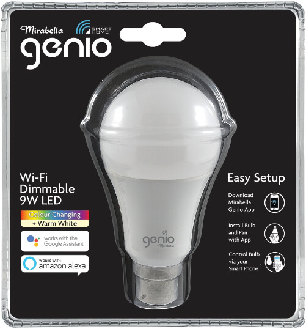
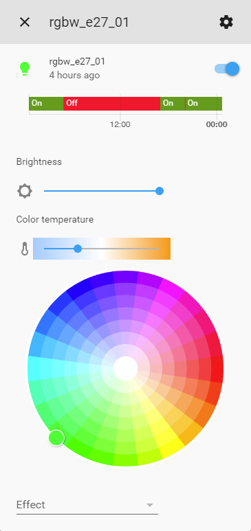

Mirabella Genio Bulbs
=====================

The Mirabella Genio is a Tuya-based smart bulb sold by Kmart in Australia.

Originally intended to be used with their companion app once flashed using `tuya-convert <https://github.com/ct-Open-Source/tuya-convert>`__ ESPHome generated
firmware can be uploaded allowing you to control the bulbs via Home Assistant.

.. note::

    Please note that the new version of this bulb that comes in a cardboard box are using the TYLC5 module which does not work via tuya-convert.
    These bulbs are also using the SM2135 chipset and not PWM anymore.

1. Create the ESPHome Firmware
------------------------------

#. Refer to either :doc:`/guides/getting_started_command_line` or :doc:`/guides/getting_started_hassio` before moving onto the next step.
#. Select a bulb configuration below based on the bulb/s you have and copy all of the text in the code block and paste into your
   ``name_of_esphome_configuration.yaml`` file.
#. Compile the firmware, again depending on your chosen setup refer to the guides in the first point.

2. Flashing
-----------

2.1 Prerequisites
*****************

#. Before you begin you'll need one of the following Linux machines running the latest copy of `Raspbian Stretch Lite
   <https://www.raspberrypi.org/downloads/raspbian/>`__

  a. Raspberry Pi 2B/B+ with `USB WiFi Dongle <https://www.raspberrypi.org/products/raspberry-pi-usb-wifi-dongle/>`__.
  b. Raspberry Pi 3B/B+.

.. note::

    As per the `tuya-convert documentation <https://github.com/ct-Open-Source/tuya-convert/blob/master/README.md#requirements>`__:

    Any Linux with a Wifi adapter which can act as an Access Point should also work. Please note that we have tested the Raspberry Pi with clean installations
    only. If you use your Raspberry Pi for anything else, we recommend using another SD card with a clean installation.

#. A microSD card (minimum 2GB, 8GB+ recommended).
#. Any WiFi device which can connect to the SSID generated by the Raspberry Pi and eventually the flashed Tuya device. **This cannot be an iOS / Apple device.
   Android devices will work.**

2.2 Installing the OS
*********************

#. It's recommended to read the documentation provided by the Raspberry Pi Foundation on the best way to flash the OS to the microSD card depending on your
   platform - `Installing operating system images <https://www.raspberrypi.org/documentation/installation/installing-images/>`__.
#. After you've flashed the microSD card browse to the "boot" partition and add a blank file called "ssh" **(without any extension)** which will enable the
   SSH server upon first boot, extended information on this step can be found `here
   <https://www.raspberrypi.org/documentation/remote-access/ssh/README.md#3-enable-ssh-on-a-headless-raspberry-pi-add-file-to-sd-card-on-another-machine>`__.
#. Plug the microSD card into the Raspberry Pi, connect network cable and power, the Raspberry Pi will start to boot.

2.3 Connecting to the Pi via SSH
********************************

#. Download and install `Putty <https://www.chiark.greenend.org.uk/~sgtatham/putty/latest.html>`__.
#. Open Putty.
#. Enter the IP of Raspberry Pi in the box that says "Host Name", leaving the port set to 22 (default for SSH). A list of recommended ways can be found `here
   <https://www.raspberrypi.org/documentation/remote-access/ip-address.md>`__, but the easiest is to download and use `Fing <https://www.fing.com/>`__
   (`Android <https://play.google.com/store/apps/details?id=com.overlook.android.fing&hl=en_GB>`__ / `iOS
   <https://itunes.apple.com/us/app/fing-network-scanner/id430921107?mt=8>`__).
#. In the "Saved Sessions" input box, name the Raspberry Pi connection and then press "Save".
#. Select your new saved session from the list.
#. Press "Open".

2.4 Configuring the Pi
**********************

#. In the putty window login with the **pi** as the user and **raspberry** for the password.
#. Type ``sudo apt-get update && sudo apt-get dist-upgrade -y`` and wait for the upgrades to install.
#. Type ``sudo apt-get install git`` and wait for it to install.

2.5 Setup and Install tuya-convert
**********************************

#. In the putty window type ``git clone https://github.com/ct-Open-Source/tuya-convert`` press enter and wait while the repository is cloned.
#. Type ``cd tuya-convert`` and press enter.
#. Type ``./install_prereq.sh`` press enter and wait as the script gathers all the required components needed to function.

2.6 Upload ESPHome Firmware using SFTP
**************************************

#. Download `FileZilla <https://filezilla-project.org/download.php?type=client>`__ or `WinSCP <https://winscp.net/eng/index.php>`__ or use your preferred FTP
   client.
#. Depending on the program you need to connect to the Pi using the IP address as the hostname and the username and password the same as you used to connect
   via SSH and ensure your connection type is set to **SFTP**
#. Browse to ``/root/tuya-convert/files``.
#. Upload your compiled ``firmware.bin`` file to this directory. For command line based installs you can access the file under
   ``<CONFIG_DIR>/<NODE_NAME>/.pioenvs/<NODE_NAME>/firmware.bin`` alternatively Home Assistant add-on users can download the file directly from the web ui.

2.7 Use tuya-convert to install ESPHome Firmware
************************************************

#. Type ``./start_flash.sh``
#. Type ``yes`` to accept the warning.
#. Connect your alternative WiFi device (non iOS / Apple based) to the ``vtrust-flash`` SSID using ``flashmeifyoucan`` as the password. This is the network
   being broadcast by the Pi from the tuya flash script.
#. If you haven't already install your bulb and flip the switch. It should automatically enter pairing mode represented by the bulb flashing on and off. If it
   doesn't, switch your bulb, on-off-on-off-on as per the instructions `here
   <https://img1.wsimg.com/blobby/go/67cdd3b9-3600-4104-b097-603c05201237/downloads/1cq3j1sq1_277630.pdf>`__.
#. Press enter on your putty window to start the flash process and wait. The bulb will stop flashing followed by a large amount of scrolling text, this is the
   script backing up the factory shipped firmware.
#. Once the process is complete you can type ``curl http://10.42.42.42/flashURL?url=http://10.42.42.1/files/firmware.bin``
#. The bulb will restart and if everything is working correctly after a few seconds the light should be on.

3. Bulb Configurations
----------------------

Thanks to the `existing work <https://github.com/arendst/Sonoff-tasmota/wiki/Mirabella-Genio-Bulb>`__ by
`@so3n <https://github.com/arendst/Sonoff-tasmota/wiki/Mirabella-Genio-Bulb>`__ which these adaptions created by `@cryptelli
<https://community.home-assistant.io/u/cryptelli>`__ and `@bircoe <https://community.home-assistant.io/u/bircoe>`__ are based on.

3.1 Monochromatic Bulbs
***********************

The brightness of the bulb can be controlled using the ``esp8266_pwm`` output component connected to the light component using the id configuration
variable ``output_component1``.

.. code-block:: yaml

    esphome:
      name: mirabella_genio_cw_1

    esp8266:
      board: esp01_1m

    wifi:
      ssid: !secret wifi_ssid
      password: !secret wifi_password

    logger:

    api:

    ota:

    light:
      - platform: monochromatic
        name: "Mirabella Genio Smart Bulb"
        id: light
        output: output_component1

        # Ensure the light turns on by default if the physical switch is actuated.
        restore_mode: ALWAYS_ON

    output:
      - platform: esp8266_pwm
        id: output_component1
        # May need to use GPIO14 instead for certain globes
        pin: GPIO13

3.2 Cold + Warm White Bulbs
***************************

.. code-block:: yaml

    esphome:
      name: mirabella_genio_cwww_1

    esp8266:
      board: esp01_1m

    wifi:
      ssid: !secret wifi_ssid
      password: !secret wifi_password

    logger:

    api:

    ota:

    output:
      - platform: esp8266_pwm
        id: output_warm_white
        pin: GPIO13
      - platform: esp8266_pwm
        id: output_daylight
        pin: GPIO5

    light:
      - platform: cwww
        name: "Mirabella Genio Smart Bulb"
        id: light
        cold_white: output_daylight
        warm_white: output_warm_white
        cold_white_color_temperature: 6500 K
        warm_white_color_temperature: 2700 K

        # Ensure the light turns on by default if the physical switch is actuated.
        restore_mode: ALWAYS_ON

3.3 RGBW Color Bulbs
********************

.. code-block:: yaml

    esphome:
      name: rgbw_e27_01

    esp8266:
      board: esp01_1m

    wifi:
      ssid: !secret wifi_ssid
      password: !secret wifi_password

    logger:

    api:

    ota:

    output:
      - platform: esp8266_pwm
        id: output_red
        pin: GPIO4
      - platform: esp8266_pwm
        id: output_green
        pin: GPIO12
      - platform: esp8266_pwm
        id: output_blue
        pin: GPIO14
      - platform: esp8266_pwm
        id: output_white
        pin: GPIO5

    light:
      - platform: rgbw
        name: "rgbw_e27_01"
        id: light
        red: output_red
        green: output_green
        blue: output_blue
        white: output_white

        # Ensure the light turns on by default if the physical switch is actuated.
        restore_mode: ALWAYS_ON

3.4 CWWW Mirabella Genio Downlights
***********************************

.. code-block:: yaml

    esphome:
      name: rgbw_e27_01

    esp8266:
      board: esp01_1m

    wifi:
      ssid: !secret wifi_ssid
      password: !secret wifi_password

    logger:

    api:

    ota:

    output:
      - platform: esp8266_pwm
        id: output1
        pin: GPIO14
      - platform: esp8266_pwm
        id: output2
        pin: GPIO12

    light:
      - platform: cwww2
        id: LED
        name: "Downlight"
        color_temperature: output2
        brightness: output1
        cold_white_color_temperature: 6500 K
        warm_white_color_temperature: 2700 K

        # Ensure the light turns on by default if the physical switch is actuated.
        restore_mode: ALWAYS_ON

4. Adding to Home Assistant
---------------------------

You can now add your bulb to home assistant via the configurations page, look for 'ESPHome' under the Integrations option and click 'Configure'.

See Also
--------

- :doc:`/components/light/index`
- :doc:`/components/light/monochromatic`
- :doc:`/components/light/cwww`
- :doc:`/components/light/rgbw`
- :doc:`/components/output/index`
- :doc:`/components/output/esp8266_pwm`
- :doc:`/guides/automations`
- :ghedit:`Edit`
