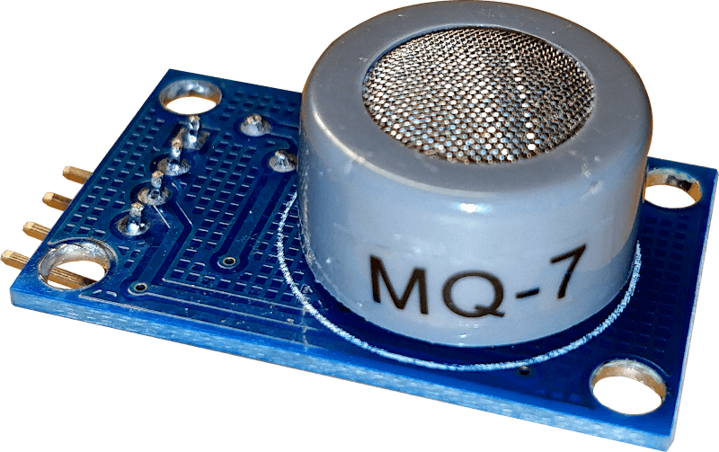
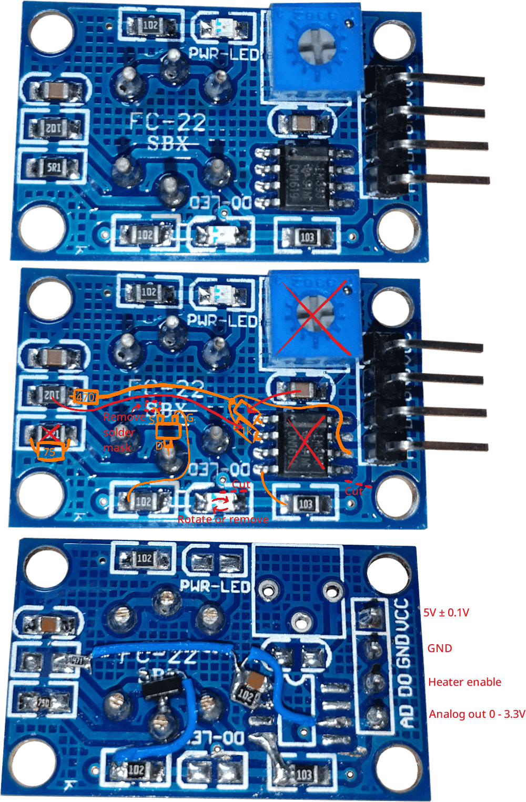
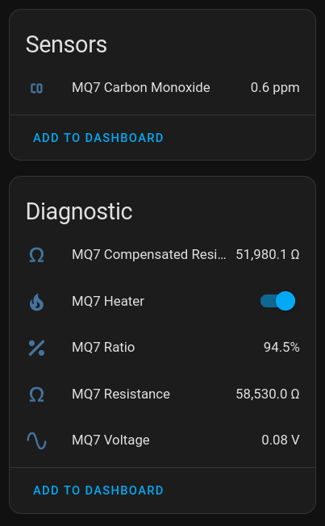
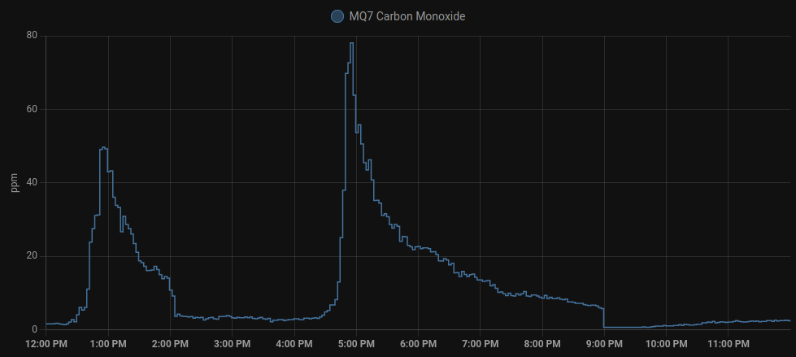

MQ-7 Carbon Monoxide Sensor
===========================

.. seo::
    :description: Instructions for setting up MQ-7 carbon monoxide sensors in ESPHome and adding circuitry to control the sensor's internal heater.
    :image: mq-7.png
    :keywords: MQ-7 MQ7 carbon monoxide sensor CO ppm heater

The MQ-7 sensor can be used for detecting carbon monoxide (CO) gas. This is done by cycling the sensor's internal heater between 5V for 60 seconds and 1.5V for 90 seconds. Most MQ-7 boards don't include a circuit to control the heater and need to be modified.

Heater Mod
----------

This will remove the digital output of the sensor and replace it with a digital input to control the heater of the MQ-7

What you need:

    - MQ-7 sensor board
    - Soldering iron / hot air station
    - 75Ω Resistor (>160mW)
    - 470Ω Resistor
    - N-channel MOSFET (`example <https://www.lcsc.com/product-detail/MOSFETs_Slkor-SLKORMICRO-Elec-SL2310_C400798.html>`__)
    - Wires

Steps:

    - De-solder the potentiometer and the dual op-amp
    - De-solder the D0-LED (bottom)
    - Cut the PCB traces in 2 locations (see picture below)
    - Scratch off the solder mask in the marked location to provide a path to ground for the MOSFET
    - Replace the 5Ω resistor on the left with a 75Ω resistor. This will provide 1.5V to the heater when the MOSFET is turned off
    - Remove the 1kΩ resistor on the left and move it to its new position
    - Remove the capacitor above the dual op-amp and move it to its new position
    - Solder the MOSFET to the bottom center pin of the sensor and the ground pad you created
    - Add the 470Ω resistor and the wires (see picture below)
    - Optional: Add the D0-LED you removed earlier, but with reversed polarity. It will show the status of the heater
    - Check the resistance between VCC and GND. It should be ~100Ω

ESPHome Config
--------------

This config includes calibration and temperature / humidity compensation

.. note::

    The full heating cycle of the sensor takes 150 seconds. It can take a while until the first carbon monoxide reading appears after booting the ESP

.. code-block:: yaml

    substitutions:
      mq7_name: "MQ7"
      mq7_id: "mq7"
      # Both pins are 3.3V compatible and can be directly connected to the ESP if you followed the heater mod tutorial
      mq7_heater_pin: "25"
      mq7_analog_pin: "33"
      # Voltage divider values
      mq7_low_side_resistor: "1000"
      mq7_high_side_resistor: "470"
      mq7_supply_voltage: "5.0V"
      # Temperature / Humidity Compensation
      # replace "temperature" with the id of your temperature sensor (celsius) and "humidity" with the id of your humidity sensor
      temperature_sensor_id: "temperature"
      humidity_sensor_id: "humidity"
      # Calibration: place the sensor in clean air (outdoor) for a few hours and use the value of mq7_compensated_resistance
      mq7_clean_air_compensated_resistance: "55000"

    esphome:
      name: esp32-mq7

    esp32:
      board: esp32dev
      framework:
        type: arduino
        
    wifi:
      ...

    logger:
      baud_rate: 115200

    api:
      ...

    ota:
      ...

    output:
      - platform: gpio
        pin: ${mq7_heater_pin}
        id: ${mq7_id}_heater_pin

    switch:
      - platform: output
        name: "${mq7_name} Heater"
        icon: mdi:fire
        entity_category: diagnostic
        disabled_by_default: True
        id: ${mq7_id}_heater
        output: ${mq7_id}_heater_pin

    interval:
      - interval: 150s
        then:
          - switch.turn_on: ${mq7_id}_heater
          - logger.log: "${mq7_name}: The sensor is heating!"
          - delay: 55s
          - switch.turn_off: ${mq7_id}_heater
          - logger.log: "${mq7_name}: The sensor is measuring!"
          - delay: 90s
          - if:
              condition:
                - switch.is_off: ${mq7_id}_heater
              then:
                - component.update: ${mq7_id}_raw
                - logger.log: "${mq7_name}: Done"
                - switch.turn_on: ${mq7_id}_heater
                - delay: 5s

    sensor:
      # Replace with your own temperature / humidity sensor, located near the MQ-7
      - platform: homeassistant
        id: ${temperature_sensor_id}
        entity_id: sensor.temperature
      - platform: homeassistant
        id: ${humidity_sensor_id}
        entity_id: sensor.humidity

      - platform: adc
        id: ${mq7_id}_raw
        name: "${mq7_name} Voltage"
        entity_category: diagnostic
        disabled_by_default: True
        pin: ${mq7_analog_pin}
        attenuation: auto
        update_interval: never
      - platform: resistance
        id: ${mq7_id}_resistance
        name: "${mq7_name} Resistance"
        icon: mdi:omega
        entity_category: diagnostic
        disabled_by_default: True
        sensor: ${mq7_id}_raw
        configuration: UPSTREAM
        resistor: ${mq7_low_side_resistor}
        reference_voltage: ${mq7_supply_voltage}
        filters:
          - lambda: return (x - ${mq7_high_side_resistor});
        on_value:
          then:
            - component.update: ${mq7_id}_compensated_resistance
      - platform: template
        id: ${mq7_id}_compensated_resistance
        name: "${mq7_name} Compensated Resistance"
        icon: mdi:omega
        entity_category: diagnostic
        unit_of_measurement: Ω
        lambda: |-
          return (id(${mq7_id}_resistance).state / ( -0.01223333 * id(${temperature_sensor_id}).state -0.00609615 * id(${humidity_sensor_id}).state + 1.70860897));
        update_interval: never
        on_value:
          then:
            - component.update: ${mq7_id}_ratio
      - platform: template
        id: ${mq7_id}_ratio
        name: "${mq7_name} Ratio"
        icon: mdi:percent
        entity_category: diagnostic
        disabled_by_default: True
        unit_of_measurement: "%"
        lambda: |-
            return 100.0 * (id(${mq7_id}_compensated_resistance).state / ${mq7_clean_air_compensated_resistance});
        update_interval: never
        on_value:
          then:
            - component.update: ${mq7_id}_co
      - platform: template
        id: ${mq7_id}_co
        name: "${mq7_name} Carbon Monoxide"
        unit_of_measurement: "ppm"
        device_class: carbon_monoxide
        lambda: |-
          auto ratio_ln = log(id(${mq7_id}_ratio).state / 100.0);
          return exp(-0.685204 - 2.67936 * ratio_ln - 0.488075 * ratio_ln * ratio_ln - 0.07818 * ratio_ln * ratio_ln * ratio_ln);
        update_interval: never

Calibration
-----------
.. note::

    After long-time storage the manufacturer recommends running the sensor for 48-168h to let the readings stabilize

Then it can be calibrated by placing it in clean air (outdoors) to determine the highest possible resistance. This resistance value can be added to the ESPHome config

See Also
--------

- :ghedit:`Edit`
