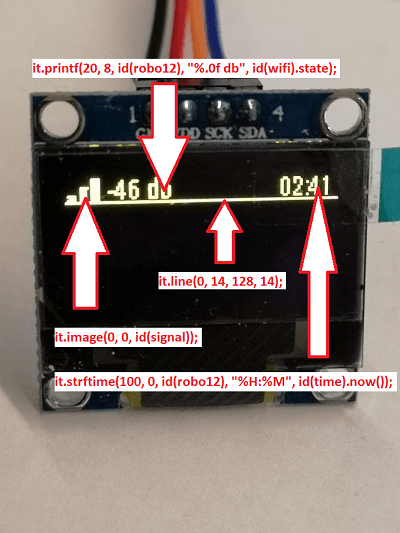
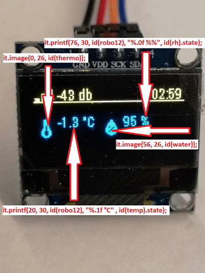

A guide to using SSD1306 OLED display
=====================================

All the info in this guide can be found in the documentation :doc:`ssd1306_i2c </components/display/ssd1306_i2c>`
and :doc:`Display </components/display/>`.
This article will show some practical examples on how to use it, and maybe it can help beginners getting started
using this display. The documentation will have more in depth info on all the options available.
These displays are pretty cheap on
`AliExpress <https://www.aliexpress.com/item/10pcs-0-96-yellow-blue-0-96-inch-OLED-module-New-128X64-OLED-LCD-LED-Display/32638669209.html>`__ 
and they are quite bright.
There is also a 1.3" version with same resolution that should work with the same config as this one, however I have not tested them personally yet.

.. note::

    The display used in the example pictures is a dual color display. X 0-127 through Y 0-15 are yellow pixels, the rest are blue.
    There are different versions of the display.

The display itself is a 0.96” OLED unit that connects to your ESP via ``i2c``, you will need to add ``i2c`` configuration to your node.
It has 4 pins that needs to be connected: ``GND``, ``VCC`` (3.3v), ``SCL`` and ``SDA`` (some of them have a misprint and the SCL pin says SCK for some reason)

.. figure:: images/oled-xy.png
    :align: center
    :width: 80.0%

The XY orientation of the display.

Configuration
_____________
i2c:
****

If you don't know the i2c address for your display:

.. code-block:: yaml

    i2c:
      sda: D5
      scl: D6
      scan: true

Set ``scan: true`` if you don’t know the address of your display and check the log for the node:

.. code-block::

    [11:54:53][C][i2c:043]: I2C Bus:
    [11:54:53][C][i2c:044]:   SDA Pin: GPIO14
    [11:54:53][C][i2c:045]:   SCL Pin: GPIO12
    [11:54:53][C][i2c:046]:   Frequency: 50000 Hz
    [11:54:53][I][i2c:048]: Scanning i2c bus for active devices...
    [11:54:53][I][i2c:055]: Found i2c device at address 0x3C

Take note of the address and set ``scan: false`` again.
(The board used in this example is a Wemos D1 mini, so adapt pins to the board you are using)

Node config:
************

The configuration for your node should look something like this:
(your basic node configuration, e.g. network and such is not discussed in this guide):

.. code-block:: yaml

    sensor:
      - platform: wifi_signal
        name: "WiFi Signal oledtest"
        update_interval: 60s
        id: wifi
      - platform: homeassistant
        entity_id: sensor.outside_temp
        id: temp
      - platform: homeassistant
        entity_id: sensor.outside_rh
        id: rh
    time:
      - platform: homeassistant
        id: time
    i2c:
      sda: D5
      scl: D6
      scan: false
    font:
      - file: "roboto.ttf"
        id: robo12
        size: 12
    image:
      - file: "signal.png"
        id: signal
        resize: 18x18
      - file: "thermo.png"
        id: thermo
        resize: 20x20
      - file: "water.png"
        id: water
        resize: 20x20
    display:
      - platform: ssd1306_i2c
        model: "SSD1306 128x64"
        reset_pin: D0
        address: 0x3C
        lambda: |-
          // Wifi signal
          it.printf(20, 8, id(robo12), "%.0f db", id(wifi).state);
          // signal bars, signal.png
          it.image(0, 0, id(signal));
          // Time
          it.strftime(100, 0, id(robo12), "%H:%M", id(time).now());
          // LINE, draw a line from X start, Y start, X stop, Y stop
          it.line(0, 14, 128, 14);
          // temperature
          it.printf(20, 30, id(robo12), "%.1f °C" , id(temp).state);
          // Humidity (%% = litteral % sign)
          it.printf(76, 30, id(robo12), "%.0f %%", id(rh).state);
          // waterdrop image, water.png
          it.image(56, 26, id(water));
          // thermometer image, thermo.png
          it.image(0, 26, id(thermo));

In detail:
__________

Sensors:
********

.. code-block:: yaml

    sensor:
      - platform: wifi_signal
        name: "WiFi Signal oledtest"
        update_interval: 60s
        id: wifi
      - platform: homeassistant
        entity_id: sensor.outside_temp
        id: temp
      - platform: homeassistant
        entity_id: sensor.outside_rh
        id: rh

This will set up your sensors, first one is internal from the node, the two next are imported from Home Assistant.
Don't give names to sensors you wish to hide from Home Assistant (no point duplicating sensors).
The wifi sensor can be used in Home Assistant to monitor your node's wifi signal strength.

Clock(Time):
************

.. code-block:: yaml

    time:
      - platform: homeassistant
        id: time

This imports the current time from Home Assistant since ESPs can't really tell what time it is themselves.

Font:
*****

.. code-block:: yaml

    font:
      - file: "roboto.ttf"
        id: robo12
        size: 12

Embeds the roboto font into your sketch,
for more sizes make more of the same font with different sizes.
You can have multiple fonts and sizes in your sketch. The font used in this example is `Roboto Condensed light <http://allfont.net/download/roboto-condensed-light/>`__
The .ttf file is put in the same folder as your node config .yaml file.

Graphics:
*********

.. code-block:: yaml

    image:
      - file: "signal.png"
        id: signal
        resize: 18x18
      - file: "thermo.png"
        id: thermo
        resize: 20x20
      - file: "water.png"
        id: water
        resize: 20x20

Icons used in this sketch are imported from `MaterialDesigns <https://materialdesignicons.com/>`__ and are the same as are used in
Home Assistant.
The 3 icons used are ``mdi:signal`` ``mdi:water-percent`` and ``mdi:thermometer``
You will need to download the icons from `MaterialDesigns <https://materialdesignicons.com/>`__ and put them in
the same folder as your node config .yaml file is stored.

.. note::

    The icons from MaterialDesigns can come with a transparent background so you may have to fire up your favorite
    image editor and give them a white background if they aren't displayed correctly

The Display Config:
*******************

.. code-block:: yaml

    display:
      - platform: ssd1306_i2c
        model: "SSD1306 128x64"
        reset_pin: D0
        address: 0x3C
        lambda: |-
          // Wifi signal
          it.printf(20, 8, id(robo12), "%.0f db", id(wifi).state);
          // signal bars, signal.png
          it.image(0, 0, id(signal));
          // Time
          it.strftime(100, 0, id(robo12), "%H:%M", id(time).now());
          // LINE, draw a line from X start, Y start, X stop, Y stop
          it.line(0, 14, 128, 14);
          // temperature
          it.printf(20, 30, id(robo12), "%.1f °C" , id(temp).state);
          // Humidity (%% = litteral % sign)
          it.printf(76, 30, id(robo12), "%.0f %%", id(rh).state);
          // waterdrop image, water.png
          it.image(56, 26, id(water));
          // thermometer image, thermo.png
          it.image(0, 26, id(thermo));

This where the drawing API does all its magic:

- ``it.printf(20, 8, id(robo12), "%.0f db", id(wifi).state);``
- This prints out the WiFi signal strengt of the node (in -db) at Y=8 X=20 position of the display. The "%.0f" means that we want 0 decimals for this number

- ``it.image(0, 0, id(signal));``
- The signal bars graphic next to the wifi signal, at X=0 Y=0

- ``it.strftime(100, 0, id(robo12), "%H:%M", id(time).now());``
- The clock in the upper right corner. Time from home assistant. You can add date, day and lots of other options.

- ``it.line(0, 14, 128, 14);``
- The line drawn under the wifi signal and clock. From X=0 Y=14 to X=128 Y=14.

- ``it.printf(20, 30, id(robo12), "%.1f °C" , id(temp).state);``
- Temperature reading from your chosen Home Assistant sensor. We want 1 decimal so we use "%.1f" process the sensor data
(if you want 2 decimals replace 1f with 2f)

- ``it.printf(76, 30, id(robo12), "%.0f %%", id(rh).state);``
- Humidity from your chosen Home Assistant sensor. You need the double % sign to print a litteral % sign,
decimals on humidity is probably not desirable "%.0f %%"

- ``it.image(0, 26, id(thermo));``
- The thermometer image next to the temperature sensor reading

- ``it.image(56, 26, id(water));``
- The waterdrop with a % sign inside it next to humidity sensor reading

Images:
_______
Some images to illustrate the article:

See Also
__________
:doc:`Display </components/display>`
:doc:`ssd1306_i2c </components/display/ssd1306_i2c>`
:doc:`Time </components/time>`
:doc:`Images </components/display>`

:ghedit:`Edit`
