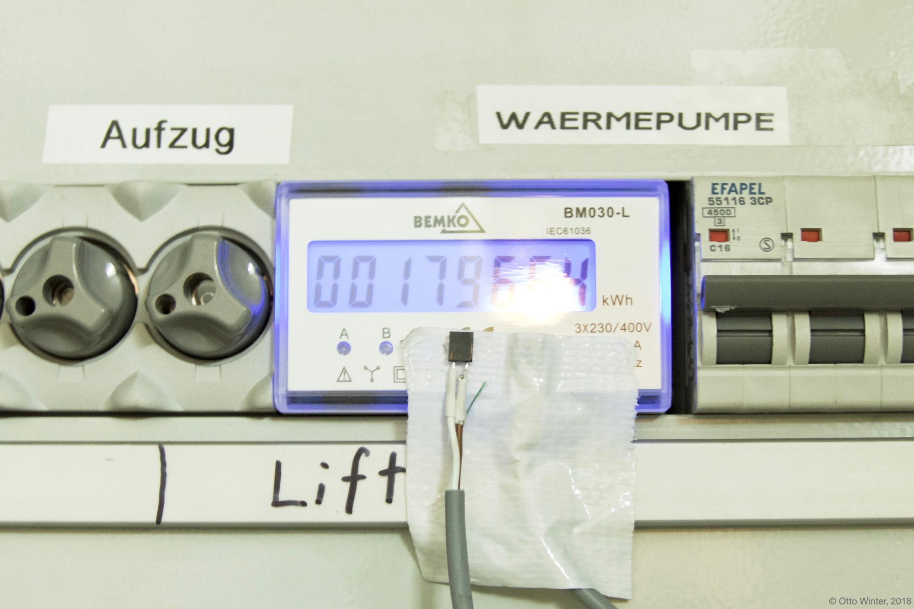

Non-Invasive Power Meter
========================

.. seo::
    :description: Instructions for hacking your power meter at home to measure your power usage.
    :image: power_meter.jpg

So an essential part of making your home smart is knowing how much power it uses over
the day. Tracking this can be difficult, often you need to install a completely new
power meter which can often cost a bunch of money. However, quite a few power meters
have a red LED on the front that blinks every time that one Wh has been used.

The simple idea therefore is: Why don't we just abuse that functionality to make the power-meter
IoT enabled? We just have to hook up a simple photoresistor in front of that aforementioned
LED and track the amount of pulses we receive. Then using ESPHome we can instantly have
the power meter show up in Home Assistant 🎉

Hooking it all up is quite easy: Just buy a suitable photoresistor (make sure the wave length
approximately matches the one from your power meter). Then connect it using a simple variable
resistor divider (see `this article <https://blog.udemy.com/arduino-ldr/>`__ for inspiration).
And... that should already be it :)

.. note::

    Some energy meters have an exposed `S0 port <https://en.wikipedia.org/wiki/S_interface/>`__ (which essentially just is a switch that closes), if
    that is the case the photodiode can be replaced with the following connection.

    .. code-block::

        S0 ------------ VCC
        S0 --+-- 10k -- GND
        .    |
        .    +--------- GPIO12

For ESPHome, you can then use the
:doc:`pulse meter sensor </components/sensor/pulse_meter>` using below configuration:

.. code-block:: yaml

    sensor:
      - platform: pulse_meter
        name: 'Power'
        id: sensor_pulse_meter # Optional ID, necessary if you want to calculate the total daily energy
        unit_of_measurement: 'W'
        device_class: power
        state_class: measurement
        accuracy_decimals: 0
        pin: GPIO12
        filters:
          - multiply: 6 # (60s / impulse constant) * (1000W / 1kW)

Adjust ``GPIO12`` to match your set up of course. The output from the pulse counter sensor is in
``pulses/min`` and we also know that 10000 pulses from the LED should equal 1kWh of power usage.
Thus, rearranging the expression yields a proportional factor of ``6`` from ``pulses/min`` to
``W``.

And if a technician shows up and he looks confused about what the heck you have done to your
power meter, tell them about ESPHome 😉

To accurately convert the power value ``W`` to energy ``kWh``, you can use the :doc:`Total Daily Energy </components/sensor/total_daily_energy>` using below configuration:

.. code-block:: yaml

    sensor:
     #(...)
      - platform: total_daily_energy
        name: 'Total Daily Energy'
        id: sensor_total_daily_energy
        power_id: sensor_energy_pulse_meter
        unit_of_measurement: 'kWh'
        state_class: total_increasing
        device_class: energy
        accuracy_decimals: 3
        filters:
          # Multiplication factor from W to kW is 0.001
          - multiply: 0.001
    
    time:
      - platform: homeassistant
        id: homeassistant_time

While you can in theory also do this with the home assistant `integration <https://www.home-assistant.io/integrations/integration/>`__ integration, the benefit of this is that it continues to integrate the power during times home assistant is unable to work with values, i.e. during updates, restarts and so on.

.. note::

    Photoresistors often have a bit of noise during their switching phases. So in certain situations,
    a single power meter tick can result in many pulses being counted. This effect is especially big on
    ESP8266s. If you're experiencing this, try enabling the ``internal_filter:`` filter option:

    .. code-block:: yaml

        sensor:
          - platform: pulse_meter
            # ...
            internal_filter: 10us

See :doc:`/components/sensor/total_daily_energy` for counting up the total daily energy usage
with these ``pulse_meter`` power meters.

See Also
--------

- :doc:`/components/sensor/pulse_counter`
- :doc:`/components/sensor/pulse_meter`
- :doc:`/components/sensor/total_daily_energy`
- :doc:`/components/time/homeassistant`
- `Home Assistant Glow 🌟 <https://github.com/klaasnicolaas/home-assistant-glow/>`__.
- :ghedit:`Edit`
