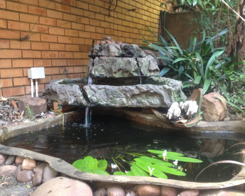
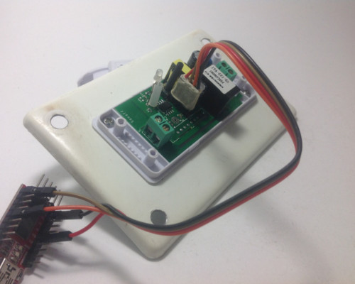
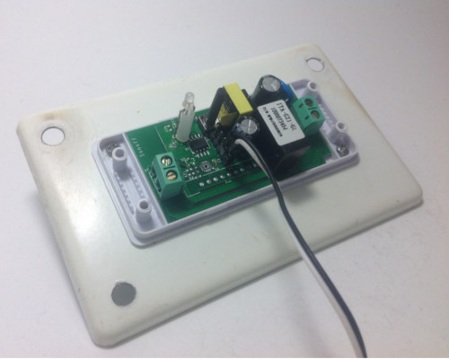
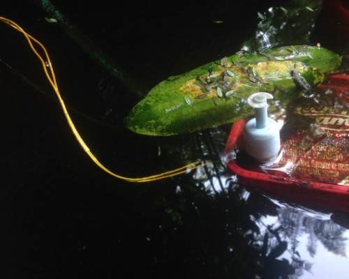
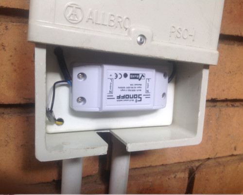

Sonoff Fish Pond Pump
=====================

.. seo::
    :description: Making an automated fish pond pump with timing and auto stop safety with Sonoff Basic ESP8266 chip
    :image: cookbook-sonoff-fishpond-pump.jpg
    :keywords: sonoff, esp8266, home automation, ESPHome, hass, home assistant

The Sonoff range of products containing the ESP chips from Espressif has a myriad of uses and best of all, you can customize it, aka hackable.
This quick cookbook aims to provide a clear, simple working example.

This example is very basic in its operation.

* Start the pump every hour and run it for 10 minutes.
* Manually start and stop the pump with the toggle button on the Sonoff Basic.
* Use a water float sensor and stop the pump if water level is too low.

*Some of the later Sonoff Basics does not have GPIO pin available, check your board first*

This example is using ESPHome 1.10.1 and Home Assistant 0.85.1

Assumptions
-----------

As many of the details on here a predicated on existing installations and knowledge the following is assumed:

* You have installed the relevant environment and it is functional (Home Assistant, ESPHome).
* You need to create your own secrets.yaml file.
* You are proficient in reading instructions and capable of using a search engine.
* You will look at the documentation on this website (we may have missed something in this example).
* This serves only as a guide and errors and outlets are excluded.

.. warning::

    Do NOT connect your device to electricity when programming it.
    Take care working with electricity at all times

1. Configuration
----------------

Here is the configuration with the basic operations outlined above.

.. code-block:: yaml

    ## Fish pond sonoff
    ## filename: fishpond.yaml
    # Sonoff Basic
    # Button toggles pump on/off
    # Float sensor stops pump
    # Cron'd to run every hour, on the hour for 10 minutes
    esphome:
      name: fishpond

    esp8266:
      board: esp01_1m

    wifi:
      ssid: !secret wifi_ssid
      password: !secret wifi_password

    # Enable logging
    logger:

    ota:

    api:

    status_led:
      pin: GPIO13

    sensor:
      - platform: uptime
        name: "ESP Fish Pond System Uptime"

      - platform: wifi_signal
        name: "ESP Fish Pond WiFi Signal"
        update_interval: 15s

    switch:
      ## restart
      - platform: restart
        name: "ESP Fish Pond Restart"

      ## relay / pump
      - platform: gpio
        pin: GPIO12
        name: "ESP Fish Pond Pump"
        id: esp_fishpond_pump

    binary_sensor:
      - platform: status
        name: "ESP Fish Pond System Status"

      ## button - toggle relay
      - platform: gpio
        name: "ESP Fish Pond Button"
        pin:
          number: GPIO0
          inverted: true
        # Toggle pump when user presses the Sonoff Button
        on_press:
          - switch.toggle: esp_fishpond_pump

      # onboard header pin - sensor
      # when threshold is reached, turn off
      - platform: gpio
        name: "esp_fishpond_gpio14"
        pin:
          number: 14
          mode:
            input: true
            pullup: true
        on_press:
          - switch.turn_off: esp_fishpond_pump

    ## Use time
    time:
      - platform: homeassistant
        ## Set your timezone
        timezone: Africa/Johannesburg
        on_time:
          # Switch on on the hour
          - seconds: 0
            minutes: 0
            hours: '*'
            then:
              - switch.turn_on: esp_fishpond_pump
              # Switch off 10 minutes later
              - delay: 10min
              - switch.turn_off: esp_fishpond_pump

2. Programming
**************

Follow the standard way of uploading to your Sonoff Basic.

For USB uploads this generally includes:

* Modifications (soldering) made on the PCB for USB UART / FTDI uploads.
* The relevant USB UART / FTDI uploads device connected to you PC and to your Sonoff.
* Start Sonoff in programming mode.
* Compile and upload the firmware via USB using ``esphome <some-yaml-file> run``.

For OTA the generally includes:

* Ensure device is on.
* Compile and upload the firmware via USB using ``esphome <some-yaml-file> run``.

Both options USB and OTA are done by running the command:

.. code-block:: bash

    esphome <some-yaml-file> run

3. Prepping and installing
**************************

* Ensure power is switched off.
* You can now add your water level sensor wiring to the PCB and have it extrude, SAFELY, next to your connector block.
* Here it will be the further most pin (GPIO14) you soldered from the toggle button and then pin (Ground) next to it.
* You can now easily connect and disconnect your liquid level sensor.

Connecting it

* Connect your water level sensor.
* Connect your pump to the Sonoff output.
* Connect your input electrical wiring.
* Test all connections are securely fastened.
* You can toggle the on/off of the pump by pressing the toggle button.

Once the pump is running changing the position of the float in the float sensor will cause the Sonoff to stop the pump.

Wires connected for easier access to connect and disconnect water level sensor

This needs to be submersed, pump (bio filter) and sensor connected in single housing (icecream tub).

In this PVC housing the plates are secured using cabinet door magnets for easier access and maintenance.

* Ensure you are using a proper and compliant waterproof box to house your electrical equipment (Sonoff Basic) in.
* Ensure you plan to be able to remove the unit with minimal effort should you need to manually USB reflash it again in future.

2.6. Home Assistant
*******************

You can now add your device to home assistant via the configurations page and under the Integrations option

See Also
--------

- `Flashing Sonoff Basic <https://randomnerdtutorials.com/how-to-flash-a-custom-firmware-to-sonoff/>`__.
- `Adding ESPHome to Home Assistant <https://www.home-assistant.io/components/esphome/>`__.
