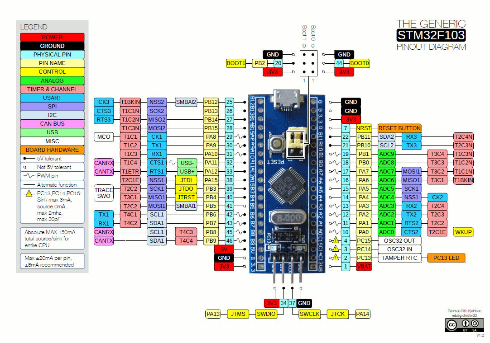

Stm32 Port Expander
=====================

.. seo::
    :description: Instructions on using an STM32F103 board, like the BluePill for expanding ports of an ESPHome node
    :image: stm32_logo.svg
    :keywords: STM32 port expander extender ESPHome

With this sketch you can control pins of a remote STM32 board through ESPHome. The STM32 acts as a port
expander, allowing you to use more pins than a standard ESP8266/ESP32 has.

The STM32 is connected to the ESP via I²C.

Currently it is supported:

    - reading digital inputs (0/1)
    - reading analog inputs (0/255)
    - writing digital outputs (0/1)
    - writing analog outputs (0/255)

The STM32 project can be retrieved from `here <https://github.com/eugenscobich/stm32-port-expander>`__.
You will need STM32CubeIDE to change and build it. 
The project if made to extand 10 ports for AC dimmable output, 15 digiat inputs, 2 analog outputs and one anolog input to configure temperature treshhold.

You need to download `stm32_port_expander.h <https://github.com/eugenscobich/stm32-port-expander/blob/main/esp_home/stm32_port_expander.h>`__
and include the stm32_port_expander.h in the ESPHome configuration.

Schematics and PCB can be found `here <https://oshwlab.com/eugenscobich/esphome-8-channel-dimmer>`__.

.. code-block:: yaml

    esphome:
      # ...
      includes:
          - stm32_port_expander.h

Setup your :ref:`I²C Bus <i2c>` and assign it an ``id``:

.. code-block:: yaml

    i2c:
      id: i2c_component
      frequency: 400kHz

By default ESP8266 uses ``SDA`` pin ``GPIO4`` which you need to connect to STM32F103's ``PB7`` and the ``SCL``
is ``GPIO5`` which goes to Arduino's ``PB6``.

STM32F103 can operate at maximum 400kHz and the framework was optimized to work on this speed.

Then create a ``custom_component``, this will be the main component we will be referencing later when creating
individual IOs.

.. code-block:: yaml

    custom_component:
      - id: stm32_port_expander_1
        lambda: |-
          auto expander = new Stm32PortExpander(i2c_component, 0x08, 40);
          return {expander};

By default the I²C address is ``0x08`` but you can change it on the STM32 Cube so you can have more devices
on the same bus.

Now it is time to add the ports.

Binary Sensor
-------------

This project is inspired by Arduino Port Expander and configuration are pretty much the same.
Pin numbers must be in sync between ESPHome config and STM32 frameware.

To setup binary sensors, create a custom platform as below, list in braces all the sensors you want,
in the example below two binary sensors are declared on pin 11 and 12, that correspond to PB15 and PA12 respectively.

Then declare the ESPHome reference of the binary sensor in the same order as declared in the lambda:

.. code-block:: yaml
 
    - platform: custom
    lambda: |-
      return {stm32_port_expander_binary_sensor(stm32_port_expander_1, 11),
              stm32_port_expander_binary_sensor(stm32_port_expander_1, 12)};
    binary_sensors:
      - id: binary_sensor_pin_11
        name: Binary Sensor Pin 11
        filters:
          - invert:
      - id: binary_sensor_pin_12
        name: Binary Sensor Pin 12
        filters:
          - invert:

The listed ``binary_sensors`` supports all options from :ref:`Binary Sensor <config-binary_sensor>` like
automations and filters.

Sensor
------

Sensors allows for reading the analog value of an analog pin. In this example an internal temperauture sensor is used via DMA.

Then declare the ESPHome reference of the sensor in the same order as declared in the lambda:

.. code-block:: yaml

    - platform: custom
      lambda: |-
        return {stm32_port_expander_analog_sensor(stm32_port_expander_1, 0)};
      sensors:
        - id: analog_sensor_pin_0
          name: Dimmer module temperature
          filters:
            - throttle: 10s
          unit_of_measurement: "°C"
          device_class : temperature
          state_class: measurement

The listed ``sensors`` supports all options from :ref:`Sensor <config-sensor>` like
automations and filters.

.. note::

    Sensors are polled by default every loop cycle so it is recommended to use the ``throttle`` filter
    to not flood the network.

Binary Output
------

To setup outputs, create a custom platform as below, list in braces all the outputs you want,
in the example below two outputs are declared on pin ``1`` and ``28``.

.. code-block:: yaml

    - platform: custom
      type: float
      lambda: |-
        return {stm32_port_expander_binary_output(stm32_port_expander_1, 29),
                stm32_port_expander_binary_output(stm32_port_expander_1, 30)};
      outputs:
        - id: binary_output_pin_29
          inverted: true
        - id: binary_output_pin_30

Float Output
------

To setup outputs, create a custom platform as below, list in braces all the outputs you want,
in the example below two outputs are declared on pin ``1`` and ``28``. ``28`` is not an real 
output pin and it is used to set the temperature treshold when epander must go in error state and reset all outputs.

.. code-block:: yaml

    - platform: custom
      type: float
      lambda: |-
        return {stm32_port_expander_float_output(stm32_port_expander_1, 1),
                stm32_port_expander_float_output(stm32_port_expander_1, 28)};
      outputs:
        - id: float_output_pin_1
        - id: float_output_pin_28
          min_power: 0.25
          max_power: 0.60
    light:
      - id: dimmerized_light_1
        platform: monochromatic
        output: float_output_pin_1
        name: Dimmerized Light Pin 1
        gamma_correct: 0
      - id: dimmerized_light_28
        platform: monochromatic
        output: float_output_pin_28
        name: Dimmer module temperature limit
        gamma_correct: 0 

See Also
--------

- :doc:`/cookbook/arduino_port_extender`
- :ghedit:`Edit`
