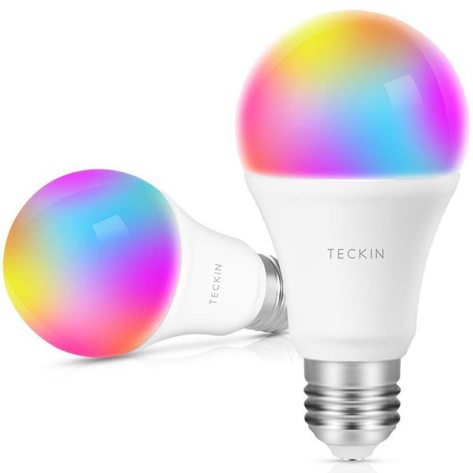

TECKIN SB50 LED Bulb
====================

.. seo::
    :description: ESPHome configuration for Teckin SB50 LED Bulb.
    :image: teckin_sb50.jpg
    :keywords: Teckin SB50

.. warning::

    It is not currently possible to flash these bulbs with ``tuya-convert`` due to shipping with an updated/patched firmware.
    Please check `this issue <https://github.com/ct-Open-Source/tuya-convert/issues/483>`__ for details and progress on a workaround.

The Teckin SB50 Bulb's are a great option for lighting that could previously be flashed with tuya-convert. More details can be found at tuya-convert `github page <https://github.com/ct-Open-Source/tuya-convert>`__.
Below is the ESPHome configuration file that will get you up and running. This assumes you have a ``secret.yaml`` with ssid, password, api_password and ota_password keys.

.. code-block:: yaml

    substitutions:
      devicename: <Enter a name for your light here>

    esphome:
      name: $devicename
      platform: ESP8266
      board: esp01_1m

    wifi:
      ssid: !secret wifi_ssid
      password: !secret wifi_password

    # Enable logging to ESPHome
    logger:
      # Disable logging to serial
      baud_rate: 0

    # Enable Home Assistant API
    api:
      password: !secret api_password

    # Setup OTA password
    ota:
      password: !secret ota_password

    # Define output pins
    output:
      - platform: esp8266_pwm
        id: output_red
        pin: GPIO4
      - platform: esp8266_pwm
        id: output_green
        pin: GPIO12
      - platform: esp8266_pwm
        id: output_blue
        pin: GPIO14
      - platform: esp8266_pwm
        id: output_warm_white
        pin: GPIO13
      - platform: esp8266_pwm
        id: output_cold_white
        pin: GPIO5

    # Define a light entity
    light:
      - platform: rgbww
        name: $devicename
        id: $devicename
        red: output_red
        green: output_green
        blue: output_blue
        warm_white: output_warm_white
        cold_white: output_cold_white
        cold_white_color_temperature: 6200 K
        warm_white_color_temperature: 2800 K
        color_interlock: true # avoids simultaneous RGB and W/W

See Also
--------

- :doc:`/devices/nodemcu_esp8266`
- :doc:`/cookbook/mirabella-genio-bulb`
- :doc:`/components/light/rgb`
- :doc:`/components/output/esp8266_pwm`
- :doc:`/components/binary_sensor/gpio`
- :ghedit:`Edit`
