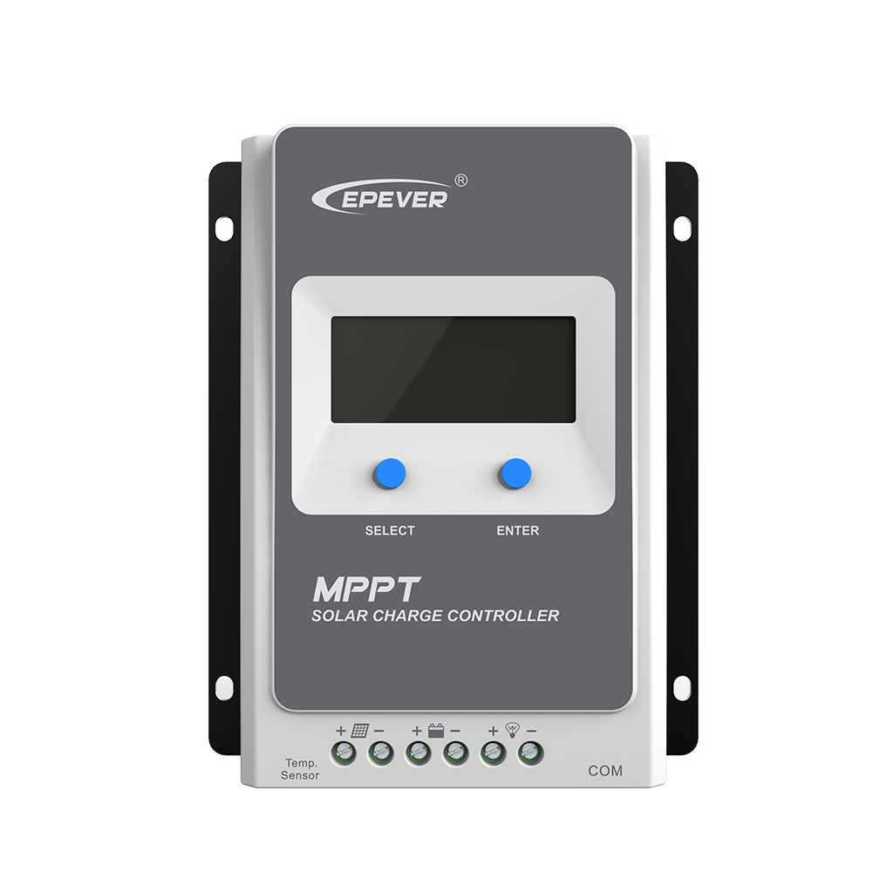

EPEVER® MPPT Solar Charge Controller Tracer-AN Series
=====================================================
.. seo::
    :description: ESPHome configuration for EPEVER® MPPT Solar Charge Controller Tracer-AN Series
    :image: images/mages/tracer-an.jpg
    :keywords: EPEVER Tracer

.. warning::

    Enabling all modbus registers will probably cause a stack overflow in main

Tested with Tracer-AN Series 10A/20A/30A/40A and XTRA Series 10A/20A/30A/40A.
Probably works for other EPEver MPPT controllers as well.

Below is the ESPHome configuration file that will get you up and running. This assumes you have a ``secret.yaml`` with ssid, password, api_password and ota_password keys.

.. code-block:: yaml

    substitutions:
      updates: 30s
      unique_id: solarstation-x

    esphome:
      name: ${unique_id}
      platform: ESP32
      board: pico32
      arduino_version: latest
      platformio_options:
        ## larger stack size required with all registers enable_load_test
        ## reduce registers or wait for integration of 2.0.0 arduinoespressif32 
        ## not yet working needs 2.0
        build_flags:
          - -DCONFIG_ARDUINO_LOOP_STACK_SIZE=32768

      on_boot:
        ## configure controller settings at setup
        ## make sure priority is lower than setup_priority of modbus_controller
        priority: -100
        then:
          - lambda: |-
              // get local time and sync to controller
              time_t now = ::time(nullptr);
              struct tm *time_info = ::localtime(&now);
              int seconds = time_info->tm_sec;
              int minutes = time_info->tm_min;
              int hour = time_info->tm_hour;
              int day = time_info->tm_mday;
              int month = time_info->tm_mon + 1;
              int year = time_info->tm_year % 100;
              esphome::modbus_controller::ModbusController *controller = id(epever);
              // if there is no internet connection localtime returns year 70
              if (year != 70) {
                // create the payload
                std::vector<uint16_t> rtc_data = {uint16_t((minutes << 8) | seconds), uint16_t((day << 8) | hour),
                                                  uint16_t((year << 8) | month)};
                // Create a modbus command item with the time information as the payload
                esphome::modbus_controller::ModbusCommandItem set_rtc_command =
                    esphome::modbus_controller::ModbusCommandItem::create_write_multiple_command(controller, 0x9013, 3, rtc_data);
                // Submit the command to the send queue
                epever->queue_command(set_rtc_command);
                ESP_LOGI("ModbusLambda", "EPSOLAR RTC set to %02d:%02d:%02d %02d.%02d.%04d", hour, minutes, seconds, day, month,
                        year + 2000);
              }
              // Battery settings
              // Note: these values are examples only and apply my AGM Battery
              std::vector<uint16_t> battery_settings1 = {
                  0,       // 9000 Battery Type 0 =  User
                  0x0073,  // 9001 Battery Cap 0x55 == 115AH
                  0x012C,  // 9002 Temp compensation -3V /°C/2V
                  0x05DC,  // 9003 0x5DC == 1500 Over Voltage Disconnect Voltage 15,0
                  0x058C,  // 9004 0x58C == 1480 Charging Limit Voltage 14,8
                  0x058C,  // 9005 Over Voltage Reconnect Voltage 14,8
                  0x05BF,  // 9006 Equalize Charging Voltage 14,6
                  0x05BE,  // 9007 Boost Charging Voltage 14,7
                  0x0550,  // 9008 Float Charging Voltage 13,6
                  0x0528,   // 9009 Boost Reconnect Charging Voltage 13,2
                  0x04C4,  // 900A Low Voltage Reconnect Voltage 12,2
                  0x04B0,  // 900B Under Voltage Warning Reconnect Voltage 12,0
                  0x04BA,  // 900c Under Volt. Warning Volt 12,1
                  0x04BA,  // 900d Low Volt. Disconnect Volt. 11.8
                  0x04BA   // 900E Discharging Limit Voltage 11.8
              };

              // Boost and equalization periods
              std::vector<uint16_t> battery_settings3 = {
                  0x0000,  // 906B Equalize Duration (min.) 0
                  0x0075   // 906C Boost Duration (aka absorb) 117 mins
              };
              esphome::modbus_controller::ModbusCommandItem set_battery1_command =
                  esphome::modbus_controller::ModbusCommandItem::create_write_multiple_command(controller, 0x9000, battery_settings1.size() ,
                                                                                              battery_settings1);
              //   esphome::modbus_controller::ModbusCommandItem set_battery2_command =
              //   esphome::modbus_controller::ModbusCommandItem::create_write_multiple_command(controller, 0x900A, battery_settings2.size() ,
              //                                                                              battery_settings2);

              esphome::modbus_controller::ModbusCommandItem set_battery3_command =
                  esphome::modbus_controller::ModbusCommandItem::create_write_multiple_command(controller, 0x906B, battery_settings3.size(),
                                                                                              battery_settings3);
              delay(200) ;
              controller->queue_command(set_battery1_command);
              delay(200) ;
              // controller->queue_command(set_battery2_command);
              // delay(200) ;
              controller->queue_command(set_battery3_command);
              ESP_LOGI("ModbusLambda", "EPSOLAR Battery set");

    wifi:
      ssid: !secret wifi_sid
      password: !secret wifi_password

    time:
      - platform: sntp
        id: sntp_time
        timezone: "CET-1CEST,M3.5.0,M10.5.0/3"
        servers: "de.pool.ntp.org"

    # Enable logging
    logger:
      level: INFO

    # Enable Home Assistant API
    api:
      password: !secret api_password
      reboot_timeout: 0s

    ota:
      password: !secret ota_password

    mqtt:
      id: mqtt_client
    
    uart:
      id: mod_bus
      tx_pin: 19
      rx_pin: 18
      baud_rate: 115200
      stop_bits: 1

    modbus:
      #flow_control_pin: 23
      send_wait_time: 200ms
      id: mod_bus_epever

    modbus_controller:
      - id: epever
        ## the Modbus device addr
        address: 0x1
        modbus_id: mod_bus_epever
        command_throttle: 200ms
        setup_priority: -10
        update_interval: ${updates}

    packages:
      tracer-rated-datum: !include tracer-rated-datum.yaml
      tracer-real-time: !include tracer-real-time.yaml
      tracer-stats: !include tracer-stats.yaml
      #tracer-settings: !include tracer-settings.yaml
      
    sensor:
      - platform: template
        accuracy_decimals: 0
        name: "Generated Charge today"
        id: generated_charge_today
        unit_of_measurement: "Ah"

      - platform: wifi_signal
        name: "WiFi Signal"
        update_interval: ${updates}

    binary_sensor:
      - platform: modbus_controller
        modbus_controller_id: epever
        id: charging_input_volt_failure
        name: "Charging Input Volt Failure"
        modbus_functioncode: read_input_registers
        address: 0x3201
        bitmask: 0xC000

    switch:
      - platform: modbus_controller
        modbus_controller_id: epever
        id: manual_control_load
        modbus_functioncode: read_coils
        address: 2
        name: "manual control the load"
        bitmask: 1

      - platform: modbus_controller
        modbus_controller_id: epever
        id: default_control_the_load
        modbus_functioncode: read_coils
        address: 3
        name: "default control the load"
        bitmask: 1

      - platform: modbus_controller
        modbus_controller_id: epever
        id: enable_load_test
        modbus_functioncode: read_coils
        address: 5
        name: "enable load test mode"
        bitmask: 1

      - platform: modbus_controller
        modbus_controller_id: epever
        id: force_load
        modbus_functioncode: read_coils
        address: 6
        name: "Force Load on/off"
        bitmask: 1

      # - platform: modbus_controller
      #   modbus_controller_id: epever
      #   id: clear_energy_stats
      #   modbus_functioncode: read_coils
      #   address: 0x14
      #   name: "Clear generating  electricity statistic"
      #   bitmask: 1

    #  - platform: modbus_controller
    #    modbus_controller_id: epever
    #    id: reset_to_fabric_default
    #    name: "Reset to Factory Default"
    #    modbus_functioncode: write_single_coil
    #    address: 0x15
    #    bitmask: 1

    text_sensor:
      - platform: modbus_controller
        modbus_controller_id: epever
        name: "rtc_clock"
        id: rtc_clock
        internal: true
        modbus_functioncode: read_holding_registers
        address: 0x9013
        register_count: 3
        raw_encode: HEXBYTES
        response_size: 6
        #                /*
        #                E20 Real time clock 9013 D7-0 Sec, D15-8 Min
        #                E21 Real time clock 9014 D7-0 Hour, D15-8 Day
        #                E22 Real time clock 9015 D7-0 Month, D15-8 Year
        #                */
        on_value:
          then:
            - lambda: |-
                ESP_LOGV("main", "decoding rtc hex encoded raw data: %s", x.c_str());
                uint8_t h=0,m=0,s=0,d=0,month_=0,y = 0 ;
                m = esphome::modbus_controller::byte_from_hex_str(x,0);
                s = esphome::modbus_controller::byte_from_hex_str(x,1);
                d = esphome::modbus_controller::byte_from_hex_str(x,2);
                h = esphome::modbus_controller::byte_from_hex_str(x,3);
                y = esphome::modbus_controller::byte_from_hex_str(x,4);
                month_ = esphome::modbus_controller::byte_from_hex_str(x,5);
                // Now check if the rtc time of the controller is ok and correct it
                time_t now = ::time(nullptr);
                struct tm *time_info = ::localtime(&now);
                int seconds = time_info->tm_sec;
                int minutes = time_info->tm_min;
                int hour = time_info->tm_hour;
                int day = time_info->tm_mday;
                int month = time_info->tm_mon + 1;
                int year = time_info->tm_year % 100;
                // correct time if needed (ignore seconds)
                if (d != day || month_ != month || y != year || h != hour || m != minutes) {
                  // create the payload
                  std::vector<uint16_t> rtc_data = {uint16_t((minutes << 8) | seconds), uint16_t((day << 8) | hour),
                                                    uint16_t((year << 8) | month)};
                  // Create a modbus command item with the time information as the payload
                  esphome::modbus_controller::ModbusCommandItem set_rtc_command = esphome::modbus_controller::ModbusCommandItem::create_write_multiple_command(epever, 0x9013, 3, rtc_data);
                  // Submit the command to the send queue
                  epever->queue_command(set_rtc_command);
                  ESP_LOGI("ModbusLambda", "EPSOLAR RTC set to %02d:%02d:%02d %02d.%02d.%04d", hour, minutes, seconds, day, month, year + 2000);
                }
                char buffer[20];
                // format time as YYYY-mm-dd hh:mm:ss
                sprintf(buffer,"%04d-%02d-%02d %02d:%02d:%02d",y+2000,month_,d,h,m,s);
                id(template_rtc).publish_state(buffer);

      - platform: template
        name: "RTC Time Sensor"
        id: template_rtc

      - platform: modbus_controller
        modbus_controller_id: epever
        name: "rtc clock test 2"
        id: rtc_clock_test2
        internal: true
        modbus_functioncode: read_holding_registers
        address: 0x9013
        register_count: 3
        raw_encode: HEXBYTES
        response_size: 6

    web_server:
      port: 80

The definitions for most sensors is included using Packages

Rated Datum registers 

tracer-rated-datum.yaml

.. code-block:: yaml

    sensor:
      - platform: modbus_controller
        modbus_controller_id: epever
        id: array_rated_voltage
        name: "array_rated_voltage"
        address: 0x3000
        skip_updates: 60
        unit_of_measurement: "V"
        modbus_functioncode: "read_input_registers"
        value_type: U_WORD
        accuracy_decimals: 1
        filters:
            - multiply: 0.01

      - platform: modbus_controller
        modbus_controller_id: epever
        id: array_rated_current
        name: "array_rated_current"
        address: 0x3001
        unit_of_measurement: "A"
        modbus_functioncode: "read_input_registers"
        value_type: U_WORD
        accuracy_decimals: 2
        filters:
            - multiply: 0.01

      - platform: modbus_controller
        modbus_controller_id: epever
        id: array_rated_power
        name: "array_rated_power"
        address: 0x3002
        register_count: 2
        unit_of_measurement: "W"
        modbus_functioncode: "read_input_registers"
        value_type: U_DWORD_R
        accuracy_decimals: 1
        filters:
          - multiply: 0.01

      - platform: modbus_controller
        modbus_controller_id: epever
        id: battery_rated_voltage
        name: "battery_rated_voltage"
        address: 0x3004
        unit_of_measurement: "V"
        modbus_functioncode: "read_input_registers"
        value_type: U_WORD
        accuracy_decimals: 1
        filters:
          - multiply: 0.01

      - platform: modbus_controller
        modbus_controller_id: epever
        id: battery_rated_current
        name: "battery_rated_current"
        address: 0x3005
        unit_of_measurement: "A"
        modbus_functioncode: "read_input_registers"
        value_type: U_WORD
        accuracy_decimals: 1
        filters:
          - multiply: 0.01

      - platform: modbus_controller
        modbus_controller_id: epever
        id: battery_rated_power
        name: "battery_rated_power"
        address: 0x3006
        unit_of_measurement: "W"
        modbus_functioncode: "read_input_registers"
        value_type: U_DWORD_R
        accuracy_decimals: 1
        filters:
          - multiply: 0.01

      - platform: modbus_controller
        modbus_controller_id: epever
        id: charging_mode
        name: "charging_mode"
        address: 0x3008
        unit_of_measurement: ""
        modbus_functioncode: "read_input_registers"
        value_type: U_WORD
        accuracy_decimals: 0

      - platform: modbus_controller
        modbus_controller_id: epever
        id: rated_current_of_load
        name: "rated_current_of_load"
        address: 0x300E
        skip_updates: 60
        unit_of_measurement: "A"
        modbus_functioncode: "read_input_registers"
        value_type: U_WORD
        accuracy_decimals: 1
        filters:
          - multiply: 0.01

Real TimeDatum registers
tracer-real-time.yaml

.. code-block:: yaml

    sensor:
      - platform: modbus_controller
        modbus_controller_id: epever
        id: pv_input_voltage
        name: "PV array input voltage"
        address: 0x3100
        unit_of_measurement: "V" ## for any other unit the value is returned in minutes
        modbus_functioncode: "read_input_registers"
        value_type: U_WORD
        accuracy_decimals: 1
        filters:
          - multiply: 0.01

      - platform: modbus_controller
        modbus_controller_id: epever
        id: pv_input_current
        name: "PV array input current"
        address: 0x3101
        unit_of_measurement: "A" ## for any other unit the value is returned in minutes
        modbus_functioncode: "read_input_registers"
        value_type: U_WORD
        accuracy_decimals: 2
        filters:
          - multiply: 0.01

      - platform: modbus_controller
        modbus_controller_id: epever
        id: pv_input_power
        name: "PV array input power"
        address: 0x3102
        unit_of_measurement: "W" ## for any other unit the value is returned in minutes
        modbus_functioncode: "read_input_registers"
        value_type: U_DWORD_R
        accuracy_decimals: 1
        filters:
          - multiply: 0.01

      - platform: modbus_controller
        modbus_controller_id: epever
        id: charging_voltage
        name: "Charging voltage"
        address: 0x3104
        unit_of_measurement: "V"
        modbus_functioncode: "read_input_registers"
        value_type: U_WORD
        accuracy_decimals: 1
        filters:
          - multiply: 0.01

      - platform: modbus_controller
        modbus_controller_id: epever
        id: charging_current
        name: "Charging current"
        address: 0x3105
        unit_of_measurement: "A"
        modbus_functioncode: "read_input_registers"
        value_type: U_WORD
        accuracy_decimals: 1
        filters:
          - multiply: 0.01

      - platform: modbus_controller
        modbus_controller_id: epever
        id: charging_power
        name: "Charging power"
        address: 0x3106
        unit_of_measurement: "W"
        modbus_functioncode: "read_input_registers"
        value_type: U_DWORD_R
        accuracy_decimals: 1
        filters:
          - multiply: 0.01

      - platform: modbus_controller
        modbus_controller_id: epever
        id: load_voltage
        name: "Load voltage"
        address: 0x310C
        unit_of_measurement: "V"
        modbus_functioncode: "read_input_registers"
        value_type: U_WORD
        accuracy_decimals: 1
        filters:
          - multiply: 0.01

      - platform: modbus_controller
        modbus_controller_id: epever
        id: load_current
        name: "Load Current"
        address: 0x310D
        unit_of_measurement: "A"
        modbus_functioncode: "read_input_registers"
        value_type: U_WORD
        accuracy_decimals: 2
        filters:
          - multiply: 0.01

      - platform: modbus_controller
        modbus_controller_id: epever
        id: load_power
        name: "Load power"
        address: 0x310E
        unit_of_measurement: "W"
        modbus_functioncode: "read_input_registers"
        value_type: U_DWORD_R
        accuracy_decimals: 1
        filters:
          - multiply: 0.01

      - platform: modbus_controller
        modbus_controller_id: epever
        id: battery_temperature
        name: "Battery temperature"
        address: 0x3110
        unit_of_measurement: °C
        modbus_functioncode: "read_input_registers"
        value_type: U_WORD
        accuracy_decimals: 1
        filters:
          - multiply: 0.01

      - platform: modbus_controller
        modbus_controller_id: epever
        id: device_temperature
        name: "Device temperature"
        address: 0x3111
        unit_of_measurement: °C
        modbus_functioncode: "read_input_registers"
        value_type: U_WORD
        accuracy_decimals: 1
        filters:
          - multiply: 0.01

      - platform: modbus_controller
        modbus_controller_id: epever
        id: power_components_temperature
        name: "Power components temperature"
        address: 0x3112
        unit_of_measurement: °C
        modbus_functioncode: "read_input_registers"
        value_type: U_WORD
        accuracy_decimals: 1
        filters:
          - multiply: 0.01

      - platform: modbus_controller
        modbus_controller_id: epever
        id: battery_soc
        name: "Battery SOC"
        address: 0x311A
        unit_of_measurement: "%"
        modbus_functioncode: "read_input_registers"
        value_type: U_WORD
        accuracy_decimals: 0

      - platform: modbus_controller
        modbus_controller_id: epever
        id: remote_battery_temperature
        name: "Remote battery temperature"
        address: 0x311B
        unit_of_measurement: °C
        modbus_functioncode: "read_input_registers"
        value_type: U_WORD
        accuracy_decimals: 1
        filters:
          - multiply: 0.01
      - platform: modbus_controller
        modbus_controller_id: epever
        id: battery_volt_settings
        name: "Remote real voltage"
        address: 0x311D
        unit_of_measurement: "°C"
        modbus_functioncode: "read_input_registers"
        value_type: U_WORD
        accuracy_decimals: 1
        filters:
          - multiply: 0.01

      - platform: modbus_controller
        modbus_controller_id: epever
        id: Battery_status_volt
        name: "Battery status voltage"
        address: 0x3200
        modbus_functioncode: "read_input_registers"
        value_type: U_WORD
        bitmask: 7  #(Bits 0-3)
        accuracy_decimals: 0

      - platform: modbus_controller
        modbus_controller_id: epever
        id: Battery_status_temp
        name: "Battery status temeratur"
        address: 0x3200
        modbus_functioncode: "read_input_registers"
        value_type: U_WORD
        bitmask: 0x38  #(Bits 4-7)
        accuracy_decimals: 0

      - platform: modbus_controller
        modbus_controller_id: epever
        id: Charger_status
        name: "Charger status"
        address: 0x3201
        modbus_functioncode: "read_input_registers"
        value_type: U_WORD
        accuracy_decimals: 0

    Statistic registers
    tracer-stats.yaml
    
    .. code-block:: yaml

    sensor:
      - platform: modbus_controller
        modbus_controller_id: epever
        id: max_pv_voltage_today
        name: "Maximum PV voltage today"
        address: 0x3300
        modbus_functioncode: "read_input_registers"
        value_type: U_WORD
        accuracy_decimals: 1
        unit_of_measurement: "V"
        filters:
          - multiply: 0.01

      - platform: modbus_controller
        modbus_controller_id: epever
        id: min_pv_voltage_today
        name: "Minimum PV voltage today"
        address: 0x3301
        modbus_functioncode: "read_input_registers"
        value_type: U_WORD
        accuracy_decimals: 1
        unit_of_measurement: "V"
        filters:
          - multiply: 0.01

      - platform: modbus_controller
        modbus_controller_id: epever
        id: max_battery_voltage_today
        name: "Maximum battery voltage today"
        address: 0x3302
        modbus_functioncode: "read_input_registers"
        value_type: U_WORD
        accuracy_decimals: 1
        unit_of_measurement: "V"
        filters:
          - multiply: 0.01

      - platform: modbus_controller
        modbus_controller_id: epever
        id: min_battery_today
        name: "Minimum battery voltage today"
        address: 0x3303
        modbus_functioncode: "read_input_registers"
        value_type: U_WORD
        accuracy_decimals: 1
        unit_of_measurement: "V"
        filters:
          - multiply: 0.01

      - platform: modbus_controller
        modbus_controller_id: epever
        id: consumed_energy_today
        name: "Consumed energy today"
        address: 0x3304
        modbus_functioncode: "read_input_registers"
        value_type: U_DWORD_R
        accuracy_decimals: 0
        unit_of_measurement: "Wh"
        filters:
          - multiply: 10.0

      - platform: modbus_controller
        modbus_controller_id: epever
        id: consumed_energy_month
        name: "Consumed Energy Month"
        address: 0x3306
        modbus_functioncode: "read_input_registers"
        value_type: U_DWORD_R
        accuracy_decimals: 0
        unit_of_measurement: "Wh"
        filters:
          - multiply: 10.0

      - platform: modbus_controller
        modbus_controller_id: epever
        id: consumed_energy_year
        name: "Consumed energy year"
        address: 0x3308
        modbus_functioncode: "read_input_registers"
        value_type: U_DWORD_R
        accuracy_decimals: 1
        unit_of_measurement: "kWh"
        filters:
          - multiply: 0.01

      - platform: modbus_controller
        modbus_controller_id: epever
        id: consumed_energy_total
        name: "Consumed energy total"
        address: 0x330A
        modbus_functioncode: "read_input_registers"
        value_type: U_DWORD_R
        accuracy_decimals: 1
        unit_of_measurement: "kWh"
        filters:
          - multiply: 0.01

      - platform: modbus_controller
        modbus_controller_id: epever
        id: generated_energy_today
        name: "Generated energy today"
        address: 0x330C
        modbus_functioncode: "read_input_registers"
        value_type: U_DWORD_R
        accuracy_decimals: 0
        unit_of_measurement: "Wh"
        on_value:
          then:
            - sensor.template.publish:
                id: generated_charge_today
                state: !lambda "return x/12.0;"
        filters:
          - multiply: 10.0

      - platform: modbus_controller
        modbus_controller_id: epever
        id: generated_energy_month
        name: "Generated energy month"
        address: 0x330E
        modbus_functioncode: "read_input_registers"
        value_type: U_DWORD_R
        accuracy_decimals: 0
        unit_of_measurement: "Wh"
        filters:
          - multiply: 10.0

      - platform: modbus_controller
        modbus_controller_id: epever
        id: generated_energy_year
        name: "Generated energy year"
        address: 0x3310
        modbus_functioncode: "read_input_registers"
        value_type: U_DWORD_R
        accuracy_decimals: 1
        unit_of_measurement: "kWh"
        filters:
          - multiply: 0.01

      - platform: modbus_controller
        modbus_controller_id: epever
        id: generated_energy_total
        name: "Generated energy total"
        address: 0x3312
        modbus_functioncode: "read_input_registers"
        value_type: U_DWORD_R
        accuracy_decimals: 1
        filters:
          - multiply: 0.01

      - platform: modbus_controller
        modbus_controller_id: epever
        id: co2_reduction
        name: "CO2 reduction"
        address: 0x3314
        modbus_functioncode: "read_input_registers"
        value_type: U_DWORD_R
        accuracy_decimals: 1
        unit_of_measurement: "kg"
        filters:
          - multiply: 1.0

      - platform: modbus_controller
        modbus_controller_id: epever
        id: battery_voltage
        name: "Battery voltage"
        address: 0x331A
        modbus_functioncode: "read_input_registers"
        value_type: U_WORD
        accuracy_decimals: 1
        unit_of_measurement: "V"
        filters:
          - multiply: 0.01

      - platform: modbus_controller
        modbus_controller_id: epever
        id: battery_current
        name: "Battery current"
        address: 0x331B
        modbus_functioncode: "read_input_registers"
        value_type: S_DWORD_R
        register_count: 2
        accuracy_decimals: 2
        unit_of_measurement: "A"
        filters:
          - multiply: 0.01

Setting registers (commented out to save stack space)
tracer-settings.yaml

.. code-block:: yaml

    sensor:
      - platform: modbus_controller
        modbus_controller_id: epever
        id: battery_type
        address: 0x9000
        name: "Battery Type"
        modbus_functioncode: read_holding_registers
        value_type: U_WORD
        skip_updates: 50

      - platform: modbus_controller
        modbus_controller_id: epever
        id: battery_capacity
        address: 0x9001
        name: "Battery Capacity"
        modbus_functioncode: read_holding_registers
        value_type: U_WORD

      - platform: modbus_controller
        modbus_controller_id: epever
        id: temperature_compensation_coefficient
        address: 0x9002
        name: "Temperature compensation coefficient"
        unit_of_measurement: "mV/°C/2V"
        modbus_functioncode: read_holding_registers
        value_type: U_WORD
        filters:
          - multiply: 0.01

      - platform: modbus_controller
        modbus_controller_id: epever
        id: high_voltage_disconnect
        address: 0x9003
        name: "High Voltage disconnect"
        unit_of_measurement: "V"
        modbus_functioncode: read_holding_registers
        value_type: U_WORD
        filters:
          - multiply: 0.01

      - platform: modbus_controller
        modbus_controller_id: epever
        id: charging_limit_voltage
        address: 0x9004
        name: "Charging limit voltage"
        unit_of_measurement: "V"
        modbus_functioncode: read_holding_registers
        value_type: U_WORD
        filters:
          - multiply: 0.01

      - platform: modbus_controller
        modbus_controller_id: epever
        id: over_voltage_reconnect
        address: 0x9005
        name: "Over voltage reconnect"
        unit_of_measurement: "V"
        modbus_functioncode: read_holding_registers
        value_type: U_WORD
        filters:
          - multiply: 0.01

      - platform: modbus_controller
        modbus_controller_id: epever
        id: equalization_voltage
        address: 0x9006
        name: "Equalization voltage"
        unit_of_measurement: "V"
        modbus_functioncode: read_holding_registers
        value_type: U_WORD
        filters:
          - multiply: 0.01

      - platform: modbus_controller
        modbus_controller_id: epever
        id: boost_voltage
        address: 0x9007
        name: "Boost voltage"
        unit_of_measurement: "V"
        modbus_functioncode: read_holding_registers
        value_type: U_WORD
        filters:
          - multiply: 0.01

      - platform: modbus_controller
        modbus_controller_id: epever
        id: float_voltage
        address: 0x9008
        name: "Float voltage"
        unit_of_measurement: "V"
        modbus_functioncode: read_holding_registers
        value_type: U_WORD
        filters:
          - multiply: 0.01

      - platform: modbus_controller
        modbus_controller_id: epever
        id: boost_reconnect_voltage
        address: 0x9009
        name: "Boost reconnect voltage"
        unit_of_measurement: "V"
        modbus_functioncode: read_holding_registers
        value_type: U_WORD
        filters:
          - multiply: 0.01

      - platform: modbus_controller
        modbus_controller_id: epever
        id: low_voltage_reconnect
        address: 0x900A
        name: "Low voltage reconnect"
        unit_of_measurement: "V"
        modbus_functioncode: read_holding_registers
        value_type: U_WORD
        filters:
          - multiply: 0.01

      - platform: modbus_controller
        modbus_controller_id: epever
        id: under_voltage_recover
        address: 0x900B
        name: "Under voltage recover"
        unit_of_measurement: "V"
        modbus_functioncode: read_holding_registers
        value_type: U_WORD
        filters:
          - multiply: 0.01

      - platform: modbus_controller
        modbus_controller_id: epever
        id: under_voltage_warning
        address: 0x900C
        name: "Under voltage warning"
        unit_of_measurement: "V"
        modbus_functioncode: read_holding_registers
        value_type: U_WORD
        filters:
          - multiply: 0.01

      - platform: modbus_controller
        modbus_controller_id: epever
        id: low_voltage_disconnect
        address: 0x900D
        name: "Low voltage disconnect"
        unit_of_measurement: "V"
        modbus_functioncode: read_holding_registers
        value_type: U_WORD
        filters:
          - multiply: 0.01

      - platform: modbus_controller
        modbus_controller_id: epever
        id: discharging_limit_voltage
        address: 0x900E
        name: "Discharging limit voltage"
        unit_of_measurement: "V"
        modbus_functioncode: read_holding_registers
        value_type: U_WORD
        filters:
          - multiply: 0.01

      - platform: modbus_controller
        modbus_controller_id: epever
        id: battery_temperature_warning_upper_limit
        address: 0x9017
        name: "Battery temperature warning upper limit"
        unit_of_measurement: "°C"
        modbus_functioncode: read_holding_registers
        value_type: U_WORD
        # new range add 'skip_updates' again
        skip_updates: 50
        filters:
          - multiply: 0.01

      - platform: modbus_controller
        modbus_controller_id: epever
        id: battery_temperature_warning_lower_limit
        address: 0x9018
        name: "Battery temperature warning lower limit"
        unit_of_measurement: "°C"
        modbus_functioncode: read_holding_registers
        value_type: U_WORD
        filters:
          - multiply: 0.01

      - platform: modbus_controller
        modbus_controller_id: epever
        id: controller_inner_temperature_upper_limit
        address: 0x9019
        name: "Controller inner temperature upper limit"
        unit_of_measurement: "°C"
        modbus_functioncode: read_holding_registers
        value_type: U_WORD
        filters:
          - multiply: 0.01

      - platform: modbus_controller
        modbus_controller_id: epever
        id: controller_inner_temperature_upper_limit_recover
        address: 0x901A
        name: "Controller inner temperature upper limit recover"
        unit_of_measurement: "°C"
        modbus_functioncode: read_holding_registers
        value_type: U_WORD
        filters:
          - multiply: 0.01

      - platform: modbus_controller
        modbus_controller_id: epever
        id: power_component_temperature_upper_limit
        address: 0x901B
        name: "Power component temperature upper limit"
        unit_of_measurement: "°C"
        modbus_functioncode: read_holding_registers
        value_type: U_WORD
        filters:
          - multiply: 0.01

      - platform: modbus_controller
        modbus_controller_id: epever
        id: power_component_temperature_upper_limit_recover
        address: 0x901C
        name: "Power component temperature upper limit recover"
        unit_of_measurement: "°C"
        modbus_functioncode: read_holding_registers
        value_type: U_WORD
        filters:
          - multiply: 0.01

      - platform: modbus_controller
        modbus_controller_id: epever
        id: line_impedance
        address: 0x901D
        name: "Line Impedance"
        unit_of_measurement: "mOhm"
        modbus_functioncode: read_holding_registers
        value_type: U_WORD
        filters:
          - multiply: 0.01

      - platform: modbus_controller
        modbus_controller_id: epever
        id: dttv
        address: 0x901E
        name: "Day Time Threshold Voltage"
        unit_of_measurement: "V"
        modbus_functioncode: read_holding_registers
        value_type: U_WORD
        filters:
          - multiply: 0.01

      - platform: modbus_controller
        modbus_controller_id: epever
        id: light_signal_startup_delay_time
        address: 0x901F
        name: "Light signal startup delay time"
        unit_of_measurement: "mins"
        modbus_functioncode: read_holding_registers
        value_type: U_WORD
        filters:
          - multiply: 0.01

      - platform: modbus_controller
        modbus_controller_id: epever
        id: nttv
        address: 0x9020
        name: "Light Time Threshold Voltage"
        unit_of_measurement: "mins"
        modbus_functioncode: read_holding_registers
        value_type: U_WORD
        filters:
          - multiply: 0.01

      - platform: modbus_controller
        modbus_controller_id: epever
        id: light_signal_close_delay_time
        address: 0x9021
        name: "Light signal close delay time"
        unit_of_measurement: "mins"
        modbus_functioncode: read_holding_registers
        value_type: U_WORD
        filters:
          - multiply: 0.01

      - platform: modbus_controller
        modbus_controller_id: epever
        id:
          load_controlling_modes
          # 0000H Manual Control
          # 0001H Light ON/OFF
          # 0002H Light ON+ Timer/
          # 0003H Time Control
        address: 0x903D
        name: "Load controlling modes"
        modbus_functioncode: read_holding_registers
        accuracy_decimals: 0
        value_type: U_WORD
        skip_updates: 50

      - platform: modbus_controller
        modbus_controller_id: epever
        id: working_time_length_1
        # The length of load output timer1,
        # D15-D8,hour, D7-D0, minute
        address: 0x903E
        name: "Working_time length 1"
        modbus_functioncode: read_holding_registers
        accuracy_decimals: 0
        value_type: U_WORD

      - platform: modbus_controller
        modbus_controller_id: epever
        id: working_time_length_2
        address: 0x903F
        name: "Working_time length 1"
        modbus_functioncode: read_holding_registers
        accuracy_decimals: 0
        value_type: U_WORD

      - platform: modbus_controller
        modbus_controller_id: epever
        id: turn_on_timing_1_seconds
        address: 0x9042
        name: "Turn on timing 1 seconds"
        modbus_functioncode: read_holding_registers
        accuracy_decimals: 0
        value_type: U_WORD
        skip_updates: 50

      - platform: modbus_controller
        modbus_controller_id: epever
        id: turn_on_timing_1_minutes
        address: 0x9043
        name: "Turn on timing 1 minutes"
        modbus_functioncode: read_holding_registers
        accuracy_decimals: 0
        value_type: U_WORD

      - platform: modbus_controller
        modbus_controller_id: epever
        id: turn_on_timing_1_hours
        address: 0x9044
        name: "Turn on timing 1 hours"
        modbus_functioncode: read_holding_registers
        accuracy_decimals: 0
        value_type: U_WORD

      - platform: modbus_controller
        modbus_controller_id: epever
        id: turn_off_timing_1_seconds
        address: 0x9045
        name: "Turn off timing 1 seconds"
        modbus_functioncode: read_holding_registers
        accuracy_decimals: 0
        value_type: U_WORD

      - platform: modbus_controller
        modbus_controller_id: epever
        id: turn_off_timing_1_minutes
        address: 0x9046
        name: "Turn off timing 1 minutes"
        modbus_functioncode: read_holding_registers
        accuracy_decimals: 0
        value_type: U_WORD

      - platform: modbus_controller
        modbus_controller_id: epever
        id: turn_off_timing_1_hours
        address: 0x9047
        name: "Turn off timing 1 hours"
        modbus_functioncode: read_holding_registers
        accuracy_decimals: 0
        value_type: U_WORD

      - platform: modbus_controller
        modbus_controller_id: epever
        id: turn_on_timing_2_seconds
        address: 0x9048
        name: "Turn on timing 2 seconds"
        modbus_functioncode: read_holding_registers
        accuracy_decimals: 0
        value_type: U_WORD

      - platform: modbus_controller
        modbus_controller_id: epever
        id: turn_on_timing_2_minutes
        address: 0x9049
        name: "Turn on timing 2 minutes"
        modbus_functioncode: read_holding_registers
        accuracy_decimals: 0
        value_type: U_WORD

      - platform: modbus_controller
        modbus_controller_id: epever
        id: turn_on_timing_2_hours
        address: 0x904A
        name: "Turn on timing 2 hours"
        modbus_functioncode: read_holding_registers
        accuracy_decimals: 0
        value_type: U_WORD

      - platform: modbus_controller
        modbus_controller_id: epever
        id: turn_off_timing_2_seconds
        address: 0x904B
        name: "Turn off timing 2 seconds"
        modbus_functioncode: read_holding_registers
        accuracy_decimals: 0
        value_type: U_WORD

      - platform: modbus_controller
        modbus_controller_id: epever
        id: turn_off_timing_2_minutes
        address: 0x904C
        name: "Turn off timing 2 minutes"
        modbus_functioncode: read_holding_registers
        accuracy_decimals: 0
        value_type: U_WORD

      - platform: modbus_controller
        modbus_controller_id: epever
        id: turn_off_timing_2_hours
        address: 0x904D
        name: "Turn off timing 2 hours"
        modbus_functioncode: read_holding_registers
        accuracy_decimals: 0
        value_type: U_WORD

      - platform: modbus_controller
        modbus_controller_id: epever
        id: backlight_time
        address: 0x9063
        name: "Backlight time"
        modbus_functioncode: read_holding_registers
        accuracy_decimals: 0
        unit_of_measurement: "s"
        value_type: U_WORD

      - platform: modbus_controller
        modbus_controller_id: epever
        id: length_of_night_minutes
        address: 0x9065
        internal: true
        bitmask: 0xFF
        unit_of_measurement: "m"
        name: "Length of night-mins"
        modbus_functioncode: read_holding_registers
        value_type: U_WORD

      - platform: modbus_controller
        modbus_controller_id: epever
        id: length_of_night
        address: 0x9065
        bitmask: 0xFF00
        unit_of_measurement: "m"
        name: "Length of night"
        modbus_functioncode: read_holding_registers
        value_type: U_WORD
        skip_updates: 50
        filters:
          - lambda: return id(length_of_night_minutes).state  + ( 60 * x);

See Also
--------

- :doc:`/components/modbus_controller`
- `EPEVER Tracer Modbus Registers <http://www.solar-elektro.cz/data/dokumenty/1733_modbus_protocol.pdf>`__
- :ghedit:`Edit`
