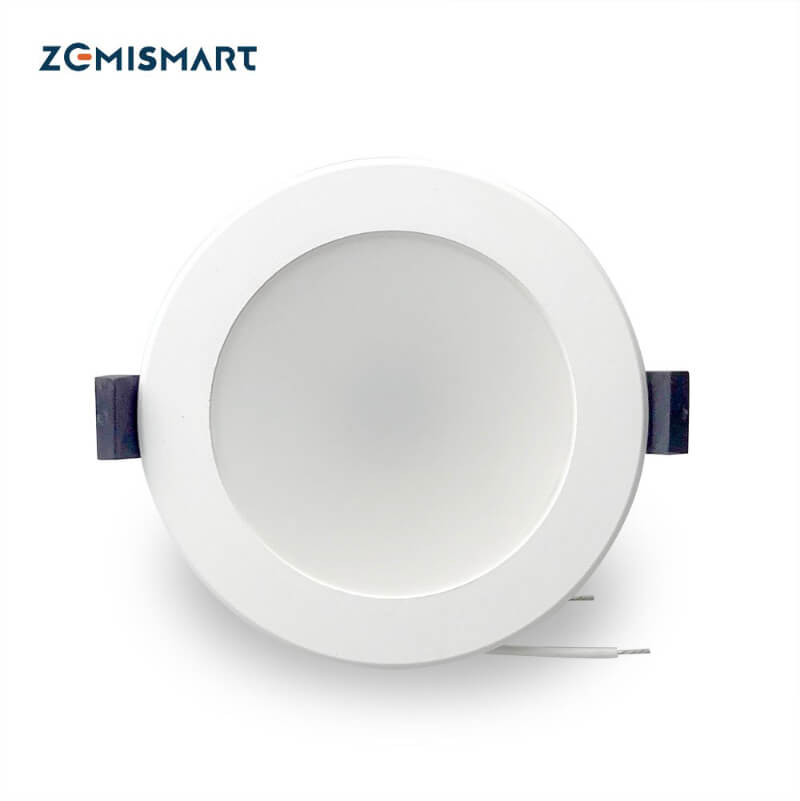
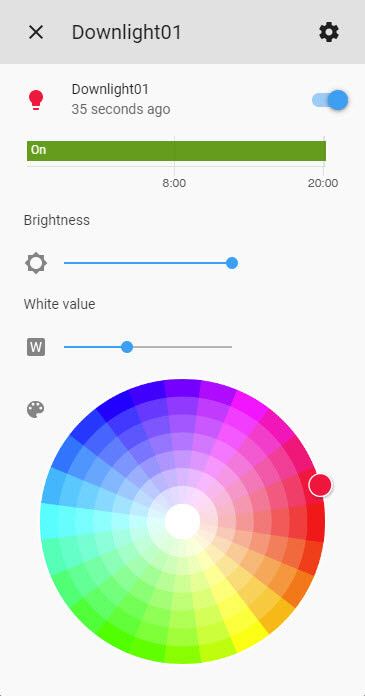

Zemismart LED RGBW/RGBWW Downlights
===================================

The Zemismart LED RGBW Downlight is a Tuya-based downlight available from various retailers online or from `zemismart.com <https://www.zemismart.com>`__ direct.

Originally intended to be used with their companion app once flashed using `tuya-convert <https://github.com/ct-Open-Source/tuya-convert>`__ ESPHome generated
firmware can be uploaded allowing you to control the smart plugs via Home Assistant.

1. Create the ESPHome Firmware
------------------------------

#. Refer to either :doc:`/guides/getting_started_command_line` or :doc:`/guides/getting_started_hassio` before moving onto the next step.
#. Select a plug configuration below based on the plug/s you have and copy all of the text in the code block and paste into your
   ``name_of_esphome_configuration.yaml`` file.
#. Compile the firmware, again depending on your chosen setup refer to the guides in the first point.

2. Flashing
-----------

2.1 Prerequisites
*****************

#. Before you begin you'll need one of the following Linux machines running the latest copy of `Raspbian Stretch Lite
   <https://www.raspberrypi.org/downloads/raspbian/>`__

  a. Raspberry Pi 2B/B+ with `USB WiFi Dongle <https://www.raspberrypi.org/products/raspberry-pi-usb-wifi-dongle/>`__.
  b. Raspberry Pi 3B/B+.

.. note::

    As per the `tuya-convert documentation <https://github.com/ct-Open-Source/tuya-convert/blob/master/README.md#requirements>`__:

    Any Linux with a Wifi adapter which can act as an Access Point should also work. Please note that we have tested the Raspberry Pi with clean installations
    only. If you use your Raspberry Pi for anything else, we recommend using another SD card with a clean installation.

#. A microSD card (minimum 2GB, 8GB+ recommended).
#. Any WiFi device which can connect to the SSID generated by the Raspberry Pi and eventually the flashed Tuya device. **This cannot be an iOS / Apple device.
   Android devices will work.**

2.2 Installing the OS
*********************

#. It's recommended to read the documentation provided by the Raspberry Pi Foundation on the best way to flash the OS to the microSD card depending on your
   platform - `Installing operating system images <https://www.raspberrypi.org/documentation/installation/installing-images/>`__.
#. After you've flashed the microSD card browse to the "boot" partition and add a blank file called "ssh" **(without any extension)** which will enable the
   SSH server upon first boot, extended information on this step can be found `here
   <https://www.raspberrypi.org/documentation/remote-access/ssh/README.md#3-enable-ssh-on-a-headless-raspberry-pi-add-file-to-sd-card-on-another-machine>`__.
#. Plug the microSD card into the Raspberry Pi, connect network cable and power, the Raspberry Pi will start to boot.

2.3 Connecting to the Pi via SSH
********************************

#. Download and install `Putty <https://www.chiark.greenend.org.uk/~sgtatham/putty/latest.html>`__.
#. Open Putty.
#. Enter the IP of Raspberry Pi in the box that says "Host Name", leaving the port set to 22 (default for SSH). A list of recommended ways can be found `here
   <https://www.raspberrypi.org/documentation/remote-access/ip-address.md>`__, but the easiest is to download and use `Fing <https://www.fing.com/>`__
   (`Android <https://play.google.com/store/apps/details?id=com.overlook.android.fing&hl=en_GB>`__ / `iOS
   <https://itunes.apple.com/us/app/fing-network-scanner/id430921107?mt=8>`__).
#. In the "Saved Sessions" input box, name the Raspberry Pi connection and then press "Save".
#. Select your new saved session from the list.
#. Press "Open".

2.4 Configuring the Pi
**********************

#. In the putty window login with the **pi** as the user and **raspberry** for the password.
#. Type ``sudo apt-get update && sudo apt-get dist-upgrade -y`` and wait for the upgrades to install.
#. Type ``sudo apt-get install git`` and wait for it to install.

2.5 Setup and Install tuya-convert
**********************************

#. In the putty window type ``git clone https://github.com/ct-Open-Source/tuya-convert`` press enter and wait while the repository is cloned.
#. Type ``cd tuya-convert`` and press enter.
#. Type ``./install_prereq.sh`` press enter and wait as the script gathers all the required components needed to function.

2.6 Upload ESPHome Firmware using SFTP
**************************************

#. Download `FileZilla <https://filezilla-project.org/download.php?type=client>`__ or `WinSCP <https://winscp.net/eng/index.php>`__ or use your preferred FTP
   client.
#. Depending on the program you need to connect to the Pi using the IP address as the hostname and the username and password the same as you used to connect
   via SSH and ensure your connection type is set to **SFTP**
#. Browse to ``/root/tuya-convert/files``.
#. Upload your compiled ``firmware.bin`` file to this directory. For command line based installs you can access the file under
   ``<CONFIG_DIR>/<NODE_NAME>/.pioenvs/<NODE_NAME>/firmware.bin`` alternatively Home Assistant add-on users can download the file directly from the web UI.

2.7 Use tuya-convert to install ESPHome Firmware
************************************************

#. Type ``./start_flash.sh``
#. Type ``yes`` to accept the warning.
#. Connect your alternative WiFi device (non iOS / Apple based) to the ``vtrust-flash`` SSID using ``flashmeifyoucan`` as the password. This is the network
   being broadcast by the Pi from the Tuya flash script.
#. If you haven't already plug your downlight into a power point and turn it on and follow the instructions below:

   #. Once turned on a stable white light will be emitted.
   #. Switch off, then back on **3** times ensuring each off-on cycle is no longer 10 seconds apart and between each the light visibly turns off.
   #. The light should have entered into a fast flashing state, if this is the case continue onto **Step 5** below. *Otherwise please turn the downlight off-on
      within 3 minutes which will restore it back to a stable white light.*

#. Press enter on your putty window to start the flash process and wait. If the connection is successful you should see a large amount of scrolling text, this
   is the script backing up the factory shipped firmware.
#. Once the process is complete you can type ``curl http://10.42.42.42/flashURL?url=http://10.42.42.1/files/firmware.bin``
#. The plug will restart and if everything is working correctly after a few seconds you should be able to press the button triggering the relay and turning the
   blue led on.

3. Downlight Configuration
--------------------------

Thanks to `@1972rx2 <https://community.home-assistant.io/u/1972rx2>`__ for creating the below ESPHome configuration
which this cookbook article by `@cryptelli <https://community.home-assistant.io/u/cryptelli>`__ is based on.

Depending on the type of your light you either need a config using my9231 driver (RGBW) or 5 PWM channels (RGBWW).

3.1 Zemismart LED RGBW Downlight YAML
*************************************

.. code-block:: yaml

    esphome:
      name: downlight01

    esp8266:
      board: esp01_1m

    wifi:
      ssid: !secret wifi_ssid
      password: !secret wifi_password

    # Enable logging
    logger:

    # Enable Home Assistant API
    api:

    ota:

    my9231:
      data_pin: GPIO13
      clock_pin: GPIO15
      num_channels: 4
      num_chips: 1

    output:
      - platform: my9231
        id: output_blue
        channel: 1
      - platform: my9231
        id: output_red
        channel: 3
      - platform: my9231
        id: output_green
        channel: 2
      - platform: my9231
        id: output_white
        channel: 0

    light:
      - platform: rgbw
        name: Downlight01
        red: output_red
        green: output_green
        blue: output_blue
        white: output_white

3.2. Zemismart LED RGBWw Downlight YAML
***************************************

Known devices: *Zemismart 2,5 zoll WiFi RGBW Led Downlight 7w*

.. code-block:: yaml

    output:
      - platform: esp8266_pwm
        pin: 14
        id: output_blue
      - platform: esp8266_pwm
        pin: 12
        id: output_green
      - platform: esp8266_pwm
        pin: 4
        id: output_red
      - platform: esp8266_pwm
        pin: 5
        id: output_coldwhite
      - platform: esp8266_pwm
        pin: 13
        id: output_warmwhite

    light:
      - platform: rgbww
        name: '${device_name} Light'
        default_transition_length: 0s
        red: output_red
        green: output_green
        blue: output_blue
        cold_white: output_coldwhite
        warm_white: output_warmwhite
        cold_white_color_temperature: 6500 K
        warm_white_color_temperature: 2700 K

4. Adding to Home Assistant
---------------------------

You can now add your downlight to Home Assistant using the below instructions:

#. In the left hand sidebar, select **Configuration**.
#. Select **Integrations**
#. Click the **Orange** plus button *(lower right hand corner)* and look for **ESPHome** in the list of available integrations and select.
#. Type the host of the downlight, in most cases this is simply the IP address.
#. Leave the port set to the default of ``6053``.
#. Click **Submit**

If you've gotten this far, congratulations! Below is the card you should see inside Home Assistant which allows you to control the downlight.

See Also
--------

- :doc:`/components/light/index`
- :doc:`/components/light/rgbw`
- :doc:`/components/output/index`
- :doc:`/components/output/my9231`
- :ghedit:`Edit`
