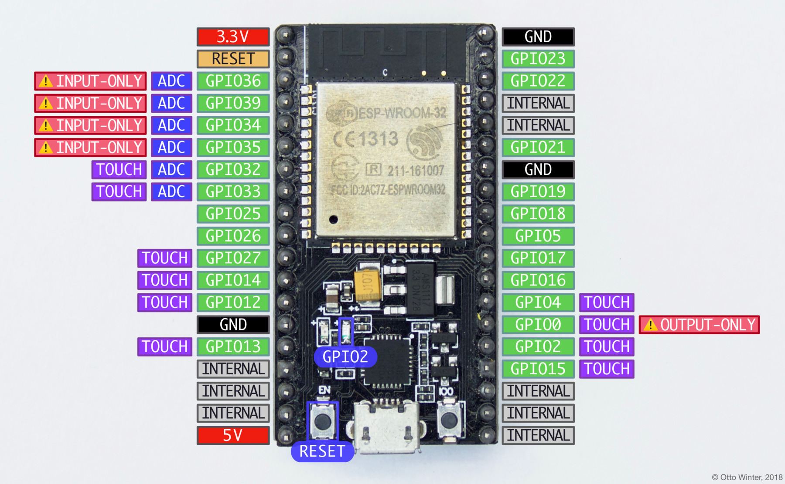

NodeMCU ESP32
=============

.. seo::
    :description: Instructions for using NodeMCU ESP32 boards in ESPHome and a description of all their pins and uses.
    :image: nodemcu_esp32.jpg

The NodeMCU ESP32 board (in some cases also known as ESP32-DevkitC)
is fully supported by ESPHome. Simply select ``ESP32`` when
the ESPHome wizard asks you for your platform and |nodemcu-32s|_ as the board type.

.. |nodemcu-32s| replace:: ``nodemcu-32s``
.. _nodemcu-32s: http://docs.platformio.org/en/latest/platforms/espressif32.html#nodemcu

.. code-block:: yaml

    # Example configuration entry
    esphome:
      name: livingroom

    esp32:
      board: nodemcu-32s

The ESP32 boards often use the internal GPIO pin numbering on the board, this means that
you don't have to worry about other kinds of pin numberings, yay!

    Pins on the NodeMCU ESP32 development board.

Note that in certain conditions you *can* use the pins marked as ``INTERNAL`` in the above image.

- ``GPIO0`` is used to determine the boot mode on startup. It should therefore not be pulled LOW
  on startup to avoid booting into flash mode. You can, however, still use this as an output pin.
- ``GPIO34``-``GPIO39`` can not be used as outputs (even though GPIO stands for "general purpose input
  **output**"...).
- ``GPIO32``-``GPIO39``: These pins can be used with the :doc:`/components/sensor/adc` to measure
  voltages.
- ``GPIO2``: This pin is connected to the blue LED on the board as seen in the picture above. It also supports
  the :doc:`touch pad binary sensor </components/binary_sensor/esp32_touch>` as do the other
  pins marked ``touch`` in the above image.
- ``5V`` is connected to the 5V rail from the USB bus and can be used to power the board. Note that
  the UART chip is directly connected to this rail and you therefore **cannot** supply other voltages
  into this pin.

.. code-block:: yaml

    # Example configuration entry
    esphome:
      name: livingroom

    esp32:
      board: nodemcu-32s

    binary_sensor:
      - platform: gpio
        name: "Pin GPIO23"
        pin: GPIO23

See Also
--------

- :doc:`/components/esp32`
- :doc:`nodemcu_esp8266`
- :ghedit:`Edit`
