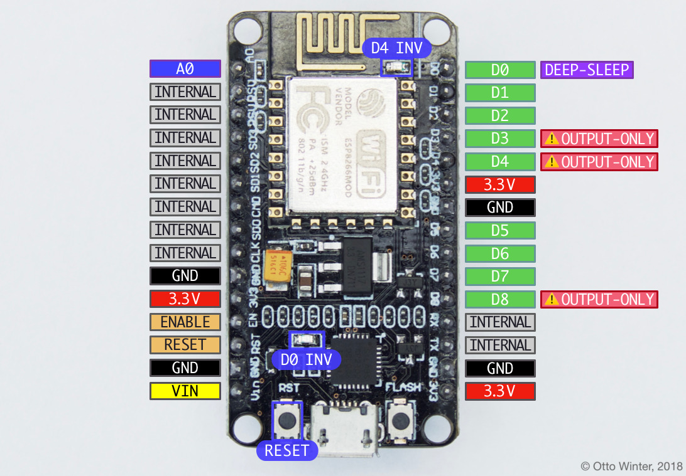

NodeMCU ESP8266
===============

.. seo::
    :description: Instructions for using nodemcu ESP8266 boards in ESPHome together with a description of their pins and uses.
    :image: nodemcu_esp8266.jpg
    :keywords: NodeMCU, ESP8266

The NodeMCU board is fully supported by ESPHome. Simply select ``ESP8266`` when
the ESPHome wizard asks you for your platform and |nodemcuv2|_ as the board type.

.. note::

    Most NodeMCU that can be purchased now are version 2 or upwards. If you're using an
    original v1 board, set the board type to |nodemcu|_.

.. |nodemcuv2| replace:: ``nodemcuv2``
.. _nodemcuv2: http://docs.platformio.org/en/latest/platforms/espressif8266.html#nodemcu
.. |nodemcu| replace:: ``nodemcu``
.. _nodemcu: http://docs.platformio.org/en/latest/platforms/espressif8266.html#nodemcu

.. code-block:: yaml

    # Example configuration entry
    esphome:
      name: livingroom

    esp8266:
      board: nodemcuv2

The NodeMCU's pin numbering as seen on the board (the ``D0`` etc pins) is different from
the internal pin numbering. For example, the ``D3`` pin number maps to the internal
``GPIO0`` pin. Fortunately ESPHome knows the mapping from the on-board pin numbers
to the internal pin numbering, but you need to prefix the pin numbers with ``D`` as in
the image below in order for this automatic mapping to occur.

In general, it is best to just use the ``D0``, ``D1``, ... pin numbering to avoid confusion

    Pins on the NodeMCU ESP8266 development board.

Note that in certain conditions you *can* use the pins marked as ``INTERNAL`` in above image.

- ``D0`` also can be used to wake the device up from :doc:`deep sleep </components/deep_sleep>` if
  the pin is connected to the ``RESET`` pin. On some boards ``D0`` is additionally connected to the LED
  next to the UART chip, but in an inverted mode.
- ``D3``, ``D4`` and ``D8`` are used on startup to determine the boot mode, therefore these pins should
  not be pulled low on startup. You can, however, still use them as output pins.
- ``D4`` additionally is connected to the blue LED next to the antenna, but in an inverted mode.
- ``A0``: This pin can be used as a normal GPIO pin (like ``D1`` etc) but additionally can measure
  voltages from 0 to 1.0V using the :doc:`/components/sensor/adc`.
- ``VIN``: This board can be powered by an external power supply by using this pin. Supply a voltage depends on the board you use. Some boards support up to 12V, some up to 5V.
- ``ENABLE``/``RESET``: When these pins are triggered, the board resets. The difference between the pins
  is how they can handle voltages above 3.3V.

.. code-block:: yaml

    # Example configuration entry
    esphome:
      name: livingroom

    esp8266:
      board: nodemcuv2

    binary_sensor:
      - platform: gpio
        name: "Pin D0"
        pin: D0

See Also
--------

- :doc:`/components/esp8266`
- :doc:`nodemcu_esp32`
- :ghedit:`Edit`
