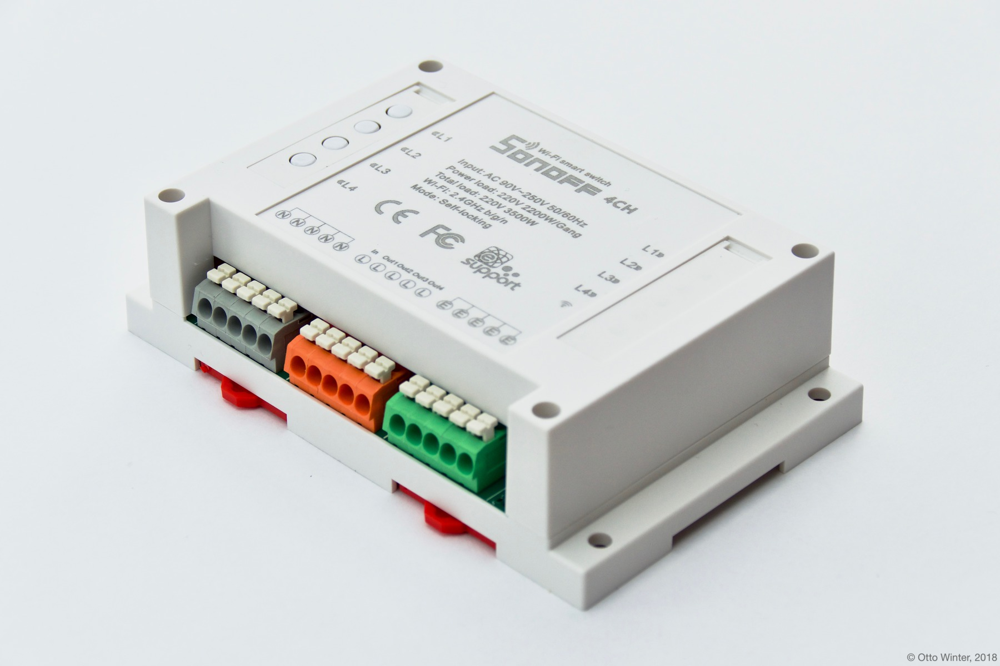
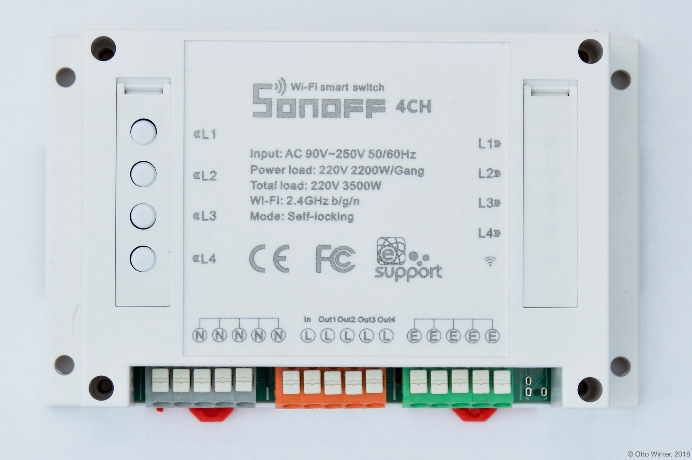
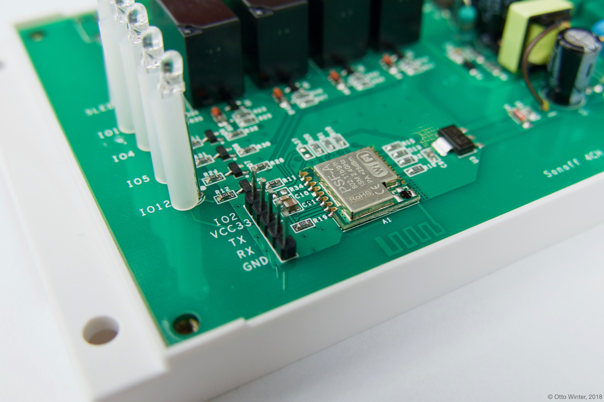
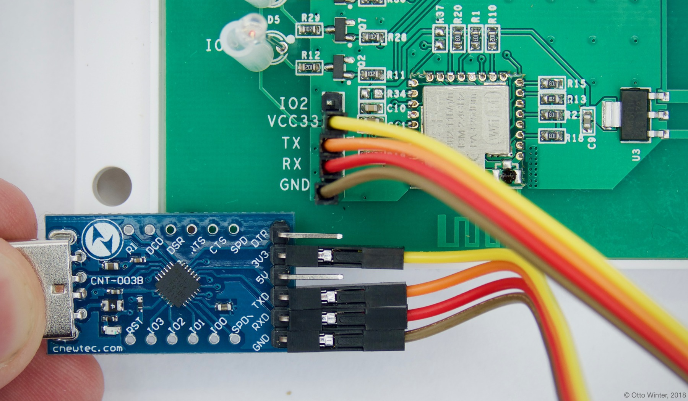
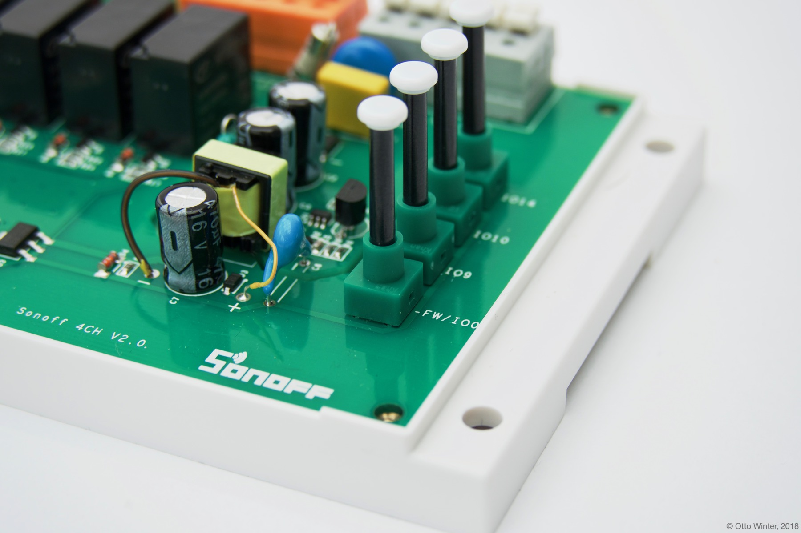

Using With Sonoff 4CH
=====================

.. seo::
    :description: Instructions for putting Sonoff 4CH devices into flash mode and installing ESPHome on them.
    :image: sonoff_4ch.jpg

ESPHome can also be used with Sonoff 4CH wireless switches. These devices are
basically just an ESP8266 chip with 4 relays to control power output, a few buttons on the
top and a few status LEDs.

    Sonoff 4CH WiFi switch.

This guide will step you through setting up your Sonoff 4CH and flashing the first ESPHome firmware
with the serial interface. After that, you will be able to upload all future firmwares with the remote
Over-The-Air update process.

.. note::

    If you've previously installed Sonoff-Tasmota on your Sonoff 4CH, you're in luck 😀.
    ESPHome can generate a firmware binary which you can then upload via the
    Tasmota web interface. To see how to create this binary, skip to :ref:`sonoff_4ch-creating_firmware`.

Since firmware version 1.6.0, iTead (the creator of this device) has removed the ability to upload
a custom firmware through their own upload process. Unfortunately, that means that the only way to
flash the initial ESPHome firmware is by physically opening the device up and using the UART
interface.

.. warning::

    Opening up this device can be very dangerous if not done correctly. While the device is open,
    you will be a single touch away from being electrocuted if the device is plugged in or connected to a high voltage 'mains' power supply.

    So, during this *entire* guide **never ever** plug the device in or have it connected to mains power. Also, you should only do this
    if you know what you're doing. If you, at any step, feel something is wrong or are uncomfortable
    with continuing, it's best to just stop for your own safety.

    It's your own responsibility to make sure everything you do during this setup process is safe.

For this guide you will need:

- Sonoff 4CH 😉.
- A USB to UART Bridge for flashing the device. These can be bought on Amazon (or other online stores) for less than 5 dollars.
  Note that the bridge *must* be 3.3V compatible. Otherwise you will destroy your Sonoff.
- Jumper wires to connect the UART bridge to the header pins.
- A computer running Home Assistant with the ESPHome Home Assistant add-on.
- A screwdriver to open up the Sonoff 4CH.

Have everything? Great! Then you can start.

Step 1: Opening up the Sonoff 4CH
---------------------------------

The first step is to open up the Sonoff 4CH. Note that you do not have to run the original firmware
supplied with the Sonoff 4CH before doing this step.

.. warning::

    Just to repeat this: Make **absolutely sure** the device is not connected to any appliance or
    connected to mains power before doing this step.

While the device is not plugged in, turn the device so you are viewing it from the top,
then unscrew the long screws in the four corners of the top cover.

    There are four screws on the front of the Sonoff 4CH.

After that, you should be able to remove the front cover and should be greeted by the main board.
The chip we're interested in here is the "big" one encased in an aluminium cover.

    The main chip of the Sonoff 4CH and the header pins we're going to use to flash our custom
    firmware.

Step 2: Connecting UART
-----------------------

Now we need our computer to somehow establish a data connection to the board. For this we will
have to connect the four wires on the UART to USB bridge to the UART pins of the Sonoff 4Ch.

Fortunately for us, exactly these pins come pre-populated with a few header pins. You can identify
these by the ``VCC33``, ``RX``, ``TX`` and ``GND`` markings on the silk-screen.

Now go ahead and connect these pins to your UART to USB bridge as seen in the below image. Make sure
that you connect these correctly, especially the ``VCC33`` and ``GND`` parts as you can otherwise
destroy the chip.

``VCC33`` should be connected to the ``3V3`` (**not** 5V) pin of the UART bridge, ``GND`` to ``GND``
and the same with ``RX``/``TX``.

When you're done, it should look something like this:

.. note::

    On some older 4CHs, the ``RX`` and ``TX`` pins are swapped (sometimes even the written silkscreen is
    wrong). If your upload fails with an ``error: espcomm_upload_mem failed`` message it's most likely due
    to the pins being swapped. In that case, just swap ``RX`` and ``TX`` and try again - you won't break
    anything if they're swapped.

.. _sonoff_4ch-creating_firmware:

Step 3: Creating Firmware
-------------------------

The Sonoff 4CH is based on the ``ESP8266`` platform (technically it's the ``ESP8285``, but for our purposes
they're the same) and is a subtype of the ``esp01_1m`` board.
With this information, you can step through the ESPHome wizard (``esphome sonoff_4ch.yaml wizard``),
or alternatively, you can just take the below configuration file and modify it to your needs.

.. code-block:: yaml

    esphome:
      name: <NAME_OF_NODE>

    esp8266:
      board: esp8285

    wifi:
      ssid: !secret wifi_ssid
      password: !secret wifi_password

    api:

    logger:

    ota:

Now run ``esphome sonoff_4ch.yaml compile`` to validate the configuration and
pre-compile the firmware.

.. note::

    After this step, you will be able to find the compiled binary under
    ``<NAME_OF_NODE>/.pioenvs/<NAME_OF_NODE>/firmware.bin``. If you're having trouble with
    uploading, you can also try uploading this file directly with other tools.

Step 4: Uploading Firmware
--------------------------

In order to upload the firmware, you're first going to need to get the chip into a flash mode, otherwise
the device will start up without accepting any firmware flash attempts. To do this, while the UART
bridge is not connected to your USB port, press and hold the bottom-left push button labelled ``FW/IO0``
and continue to do so while plugging in the UART bridge into your computer. Keep holding the button for
another 2-4 seconds. The 4CH should now be in a flash mode and should not blink any LED.

    You need to press the button labelled ``FW/IO0`` during startup.

Now you can finally run the upload command:

.. code-block:: bash

    esphome sonoff_4ch.yaml run

If successful, you should see something like this:

.. figure:: images/sonoff_4ch_upload.png
    :align: center

Hooray 🎉! You've now successfully uploaded the first ESPHome firmware to your Sonoff 4CH. And in a moment,
you will be able to use all of ESPHome's great features with your Sonoff 4CH.

If above step don't work, however, here are some steps that can help:

-  Sometimes the UART bridge cannot supply enough current to the chip to operate, in this
   case use a 3.3V supply you have lying around. A nice hack is to use the power supply of
   NodeMCU boards. Simply connect the NodeMCU's 3.3V to VCC and GND to GND. **Do not connect mains
   power to the device in an attempt to overcome this problem while troubleshooting.**
-  In other cases the ``TX`` and ``RX`` pin are reversed. Simple disconnect the device, swap
   the two pins and put it into flash mode again.

Step 5: Adding the Button, Relay and LEDs
-----------------------------------------

Now we would like the 4CH to actually do something, not just connect to WiFi and pretty much sit idle.

Below you will find a table of all usable GPIO pins of the Sonoff 4CH and a configuration file that exposes all
of the basic functions.

======================================== =========================================
``GPIO0``                                Button #1 (inverted)
---------------------------------------- -----------------------------------------
``GPIO9``                                Button #2 (inverted)
---------------------------------------- -----------------------------------------
``GPIO10``                               Button #3 (inverted)
---------------------------------------- -----------------------------------------
``GPIO14``                               Button #4 (inverted)
---------------------------------------- -----------------------------------------
``GPIO12``                               Relay #1 and red LED
---------------------------------------- -----------------------------------------
``GPIO5``                                Relay #2 and red LED
---------------------------------------- -----------------------------------------
``GPIO4``                                Relay #3 and red LED
---------------------------------------- -----------------------------------------
``GPIO15``                               Relay #4 and red LED
---------------------------------------- -----------------------------------------
``GPIO13``                               Blue LED (inverted)
---------------------------------------- -----------------------------------------
``GPIO1``                                ``TX`` pin (for external sensors)
---------------------------------------- -----------------------------------------
``GPIO3``                                ``RX`` pin (for external sensors)
---------------------------------------- -----------------------------------------
``GPIO2``                                ``IO2`` pin (for external sensors)
======================================== =========================================

.. note::

    The ESP8266 will be prevented from booting if the following pins are pulled LOW (connected to GND) on cold startup: ``GPIO0``, ``GPIO1``, ``GPIO2``. Be prepared if you want to use them for input sensors.

.. code-block:: yaml

    esphome:
      name: <NAME_OF_NODE>

    esp8266:
      board: esp8285

    wifi:
      ssid: !secret wifi_ssid
      password: !secret wifi_password

    api:

    logger:

    ota:

    binary_sensor:
      - platform: gpio
        pin:
          number: GPIO0
          mode:
            input: true
            pullup: true
          inverted: true
        name: "Sonoff 4CH Button 1"
      - platform: gpio
        pin:
          number: GPIO9
          mode:
            input: true
            pullup: true
          inverted: true
        name: "Sonoff 4CH Button 2"
      - platform: gpio
        pin:
          number: GPIO10
          mode:
            input: true
            pullup: true
          inverted: true
        name: "Sonoff 4CH Button 3"
      - platform: gpio
        pin:
          number: GPIO14
          mode:
            input: true
            pullup: true
          inverted: true
        name: "Sonoff 4CH Button 4"
      - platform: status
        name: "Sonoff 4CH Status"

    switch:
      - platform: gpio
        name: "Sonoff 4CH Relay 1"
        pin: GPIO12
      - platform: gpio
        name: "Sonoff 4CH Relay 2"
        pin: GPIO5
      - platform: gpio
        name: "Sonoff 4CH Relay 3"
        pin: GPIO4
      - platform: gpio
        name: "Sonoff 4CH Relay 4"
        pin: GPIO15

    output:
      # Register the blue LED as a dimmable output ....
      - platform: esp8266_pwm
        id: blue_led
        pin: GPIO13
        inverted: true

    light:
      # ... and then make a light out of it.
      - platform: monochromatic
        name: "Sonoff 4CH Blue LED"
        output: blue_led

Above example also showcases an important concept of ESPHome: IDs and linking. In order
to make all components in ESPHome as "plug and play" as possible, you can use IDs to define
them in one area, and simply pass that ID later on. For example, above you can see a PWM (dimmer)
output being created with the ID ``blue_led`` for the blue LED. Later on it is then transformed
into a :doc:`monochromatic light </components/light/monochromatic>`.
If you additionally want the buttons to control the relays, look at `the complete Sonoff 4CH
with automation example <https://github.com/esphome/esphome-docs/blob/current/devices/sonoff_4ch.yaml>`__.

.. figure:: images/sonoff_4ch_result.png
    :align: center
    :width: 75.0%

Step 6: Finishing Up
--------------------

If you're sure everything is done with the 4CH and have double checked there's nothing that could cause a short
in the case, you can put the front cover back on and screw everything together.

Now triple- or even quadruple-check the UART bridge is not connected to the 4CH, then comes the time when you can
connect it.

Happy hacking!

See Also
--------

- :doc:`sonoff`
- :doc:`sonoff_s20`
- :ghedit:`Edit`
