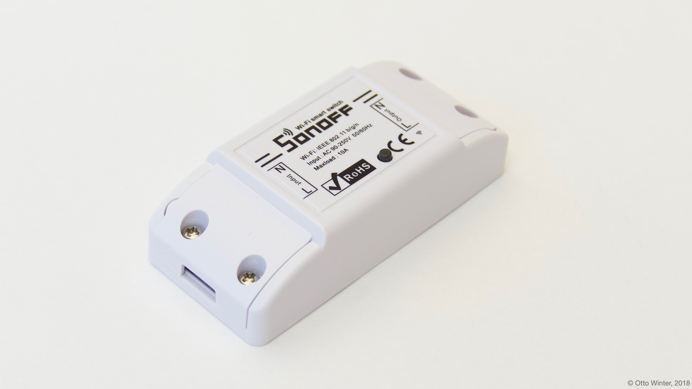

Using With Sonoff Basic
=======================

.. seo::
    :description: Instructions for putting Sonoff basic devices into flash mode and installing ESPHome on them.
    :image: sonoff_basic.jpg

ESPHome can be used with Sonoff Basic. These devices are basically just
an ESP8266 chip with a relay to control the connection, a small button on the
front and a green LED light.

    Sonoff Basic

This guide will not guide you through setting up your Sonoff Basic step-by-step. It just provide
a sample configuration. For detailed instructions, see :doc:`sonoff_s20`, as those devices are
pretty similar.

.. note::

    If you've previously installed Sonoff-Tasmota or ESPurna on your Sonoff Basic, you're in luck 😀
    ESPHome can generate a firmware binary which you can then upload via the
    web interface.

Sample configuration
--------------------

The Sonoff Basic is based on the ``ESP8266`` platform and is a subtype of the ``esp01_1m`` board.
With this information, you can also step through the ESPHome wizard (``esphome sonoff_basic.yaml wizard``)
if you don't want to use the sample configuration file from below.

Below you will find a table of all usable GPIO pins of the Sonoff Basic and a configuration file that
exposes all of the basic functions.

================================================== ==================================================
``GPIO0``                                          Button (inverted)
-------------------------------------------------- --------------------------------------------------
``GPIO1``                                          ``TX`` pin (C1 Pin 2)
-------------------------------------------------- --------------------------------------------------
``GPIO3``                                          ``RX`` pin (C1 Pin 3)
-------------------------------------------------- --------------------------------------------------
``GPIO12``                                         Relay
-------------------------------------------------- --------------------------------------------------
``GPIO13``                                         Green LED (inverted)
-------------------------------------------------- --------------------------------------------------
``GPIO14``                                         Optional Sensor (C1 Pin 5)
================================================== ==================================================

.. code-block:: yaml

    esphome:
      name: <NAME_OF_NODE>

    esp8266:
      board: esp8285

    wifi:
      ssid: !secret wifi_ssid
      password: !secret wifi_password

    api:

    logger:

    ota:

    binary_sensor:
      - platform: gpio
        pin:
          number: GPIO0
          mode:
            input: true
            pullup: true
          inverted: true
        name: "Sonoff Basic Button"
        on_press:
          - switch.toggle: relay

    switch:
      - platform: gpio
        name: "Sonoff Basic Relay"
        pin: GPIO12
        id: relay

    status_led:
      pin:
        number: GPIO13
        inverted: yes

Now run ``esphome sonoff_basic.yaml compile`` to validate the configuration and
pre-compile the firmware.

.. note::

    After this step, you will be able to find the compiled binary under
    ``<NAME_OF_NODE>/.pioenvs/<NAME_OF_NODE>/firmware.bin``. If you're having trouble with
    uploading, you can also try uploading this file directly with other tools.

Or run the upload command if your device is connected to the serial interface:

.. code-block:: bash

    esphome sonoff_basic.yaml run

More detailed breakdown
-----------------------

1. Programming
**************

Ensure you have soldered on the additional header pins to the PCB and connect your USB FTDI programmer.
See https://randomnerdtutorials.com/how-to-flash-a-custom-firmware-to-sonoff/ for more details on the pinout and FTDI.

1.1. Put Sonoff into programming mode.
**************************************

* Press and hold the toggle pin (long black pin next to LED and custom soldered pins).
* Supply USB power to Sonoff via FTDI (e.g. plug in USB to the FTDI, or use a power switch as explained in link above).
* Keep holding the toggle pin for approx 3-5 seconds now you should be ready to program.
  If you get a message unable to communicate when trying flash, check your TX/RX pin or retry entering boot mode again.

Quick notes:

* 3.3V setting on FTDI, 5V will cause damage.
* Ensure the connections on the PCB starts at  the closed to the toggle pin, it uses 4 pins, but 5 pins are soldered on.
* TX and RX should be swapped - RX on Sonoff goes to TX on FTDI.

1.2. Upload the firmware
************************

Run this command from the same directory where your <my-awesome>.yaml file is located

.. code-block:: bash

    esphome <my-awesome>.yaml run

Or if you're using the dashboard, just click the "UPLOAD" button.

You should get an output starting like this

.. code-block:: text

    INFO Reading configuration...
    INFO Detected timezone 'SAST' with UTC offset 2
    INFO Generating C++ source...
    INFO Compiling app...
    INFO Running:  platformio run -d fishpond
    ********************************************************************************************************
    Obsolete PIO Core v3.6.3 is used (previous was 3.6.4b1)
    Please remove multiple PIO Cores from a system:
    https://docs.platformio.org/page/faq.html#multiple-pio-cores-in-a-system
    ...
    lots of compile stuff
    ...
    Memory Usage -> http://bit.ly/pio-memory-usage
    DATA:    [======    ]  55.6% (used 45512 bytes from 81920 bytes)
    PROGRAM: [====      ]  38.1% (used 390576 bytes from 1023984 bytes)
    ===================================== [SUCCESS] Took 4.70 seconds =====================================
    INFO Successfully compiled program.
    Found multiple options, please choose one:
    [1] /dev/ttyUSB0 (FT232R USB UART)
    [2] Over The Air (fishpond.device)
    (number): 1
    ...
    esptool.py v2.6
    Serial port /dev/ttyUSB0
    Connecting....
    Chip is ESP8266EX
    Features: WiFi
    MAC: xx:xx:xx:xx:xx:xx
    Uploading stub...
    Running stub...
    Stub running...
    Configuring flash size...
    Auto-detected Flash size: 1MB
    Compressed 394720 bytes to 267991...
    Wrote 394720 bytes (267991 compressed) at 0x00000000 in 23.8 seconds (effective 132.7 kbit/s)...
    Hash of data verified.

    Leaving...
    Hard resetting via RTS pin...
    INFO Successfully uploaded program.
    INFO Starting log output from /dev/ttyUSB0 with baud rate 115200

1.3. And then nothing will happen
*********************************

Once you have flashed the device, nothing will happen. You need to power cycle the device.
You will notice the LED will start to flash and then becomes solid once connected to the WiFi network.

You can follow the logs produced by the running module by running the command

.. code-block:: bash

    esphome <my-awesome>.yaml logs

Your output will possibly look like this

.. code-block:: text

    INFO Reading configuration...
    INFO Detected timezone 'SAST' with UTC offset 2
    INFO Starting log output from fishpond.device using ESPHome API
    INFO Connecting to fishpond.device:6053 (192.168.13.15)
    INFO Successfully connected to fishpond.device
    [11:13:27][D][time.homeassistant:029]: Synchronized time: Wed Jan 16 11:13:27 2019
    [11:13:27][I][application:097]: You're running ESPHome v1.10.1 compiled on Jan 16 2019, 08:12:59
    [11:13:27][C][status_led:023]: Status LED:
    [11:13:27][C][status_led:024]:   Pin: GPIO13 (Mode: OUTPUT)
    [11:13:27][C][wifi:341]: WiFi:
    [11:13:27][C][wifi:240]:   SSID: 'some-ssid'
    [11:13:27][C][wifi:241]:   IP Address: 192.168.13.15
    [11:13:27][C][wifi:243]:   BSSID: xx:xx:xx:xx:xx:xx
    [11:13:27][C][wifi:245]:   Hostname: 'fishpond'
    [11:13:27][C][wifi:250]:   Signal strength: -91 dB ▂▄▆█
    [11:13:27][C][wifi:251]:   Channel: 1
    [11:13:27][C][wifi:252]:   Subnet: 255.255.255.0
    [11:13:27][C][wifi:253]:   Gateway: 192.168.13.1
    [11:13:27][C][wifi:254]:   DNS1: 192.168.13.1
    [11:13:27][C][wifi:255]:   DNS2: 0.0.0.0
    [11:13:27][C][binary_sensor.status:046]: Status Binary Sensor 'esp_fishpond_system_status'
    [11:13:27][C][binary_sensor.status:046]:   Device Class: 'connectivity'
    [11:13:28][C][switch.gpio:049]: GPIO Switch 'esp_fishpond_gpio12'
    [11:13:28][C][switch.gpio:050]:   Pin: GPIO12 (Mode: OUTPUT)
    [11:13:28][C][switch.gpio:066]:   Restore Mode: Restore (Default to OFF)
    [11:13:28][C][binary_sensor.gpio:023]: GPIO Binary Sensor 'esp_fishpond_gpio0'
    [11:13:28][C][binary_sensor.gpio:024]:   Pin: GPIO0 (Mode: INPUT, INVERTED)
    [11:13:28][C][binary_sensor.gpio:023]: GPIO Binary Sensor 'esp_fishpond_gpio14'
    [11:13:28][C][binary_sensor.gpio:024]:   Pin: GPIO14 (Mode: INPUT_PULLUP)
    [11:13:28][C][output.esp8266_pwm:028]: ESP8266 PWM:
    [11:13:28][C][output.esp8266_pwm:029]:   Pin: GPIO13 (Mode: OUTPUT)
    [11:13:28][C][output.esp8266_pwm:030]:   Frequency: 1000.0 Hz
    [11:13:28][C][logger:099]: Logger:
    [11:13:28][C][logger:100]:   Level: DEBUG
    [11:13:28][C][logger:101]:   Log Baud Rate: 115200
    [11:13:28][C][light.state:266]: Light 'esp_fishpond_gpio13'
    [11:13:28][C][light.state:268]:   Default Transition Length: 1000 ms
    [11:13:28][C][light.state:269]:   Gamma Correct: 2.80
    [11:13:28][C][switch.restart:034]: Restart Switch 'esp_fishpond_system_restart'
    [11:13:28][C][switch.restart:034]:   Icon: 'mdi:restart'
    [11:13:28][C][time.homeassistant:032]: Home Assistant Time:
    [11:13:28][C][time.homeassistant:033]:   Timezone: 'SAST-2'
    [11:13:28][C][sensor.wifi_signal:042]: WiFi Signal 'esp_fishpond_system_wifi_signal'
    [11:13:28][C][sensor.wifi_signal:042]:   Unit of Measurement: 'dB'
    [11:13:28](Message skipped because it was too big to fit in TCP buffer - This is only cosmetic)
    [11:13:28](Message skipped because it was too big to fit in TCP buffer - This is only cosmetic)
    [11:13:28][C][api:072]: API Server:
    [11:13:28][C][api:073]:   Address: 192.168.13.15:6053
    [11:13:28][C][ota:129]: Over-The-Air Updates:
    [11:13:28][C][ota:130]:   Address: 192.168.13.15:8266

1.4. Test now with OTA flashing
*******************************

Before installing the Sonoff, do a final OTA test, and this time selecting the OTA option and NOT the USB option when reflashing.

.. code-block:: bash

    esphome <my-awesome>.yaml run

Once these actions succeeded you are pretty much in the clear and can be sure your device is ready.

See Also
--------

- :doc:`sonoff`
- :doc:`sonoff_4ch`
- :doc:`sonoff_s20`
- `GPIO locations <https://github.com/arendst/Sonoff-Tasmota/wiki/GPIO-Locations>`__
- `Edit this page on GitHub <https://github.com/OttoWinter/esphomedocs/blob/current/devices/sonoff_basic.rst>`__
