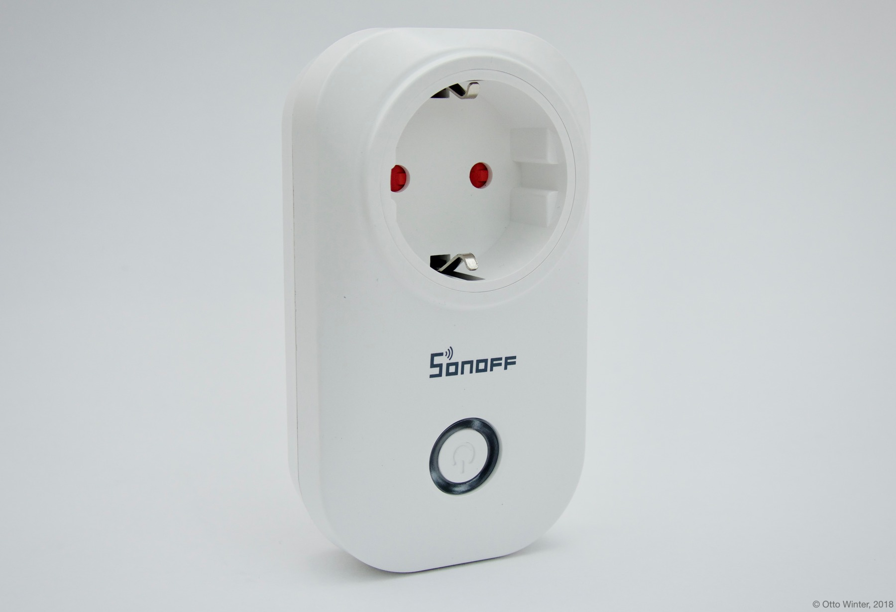
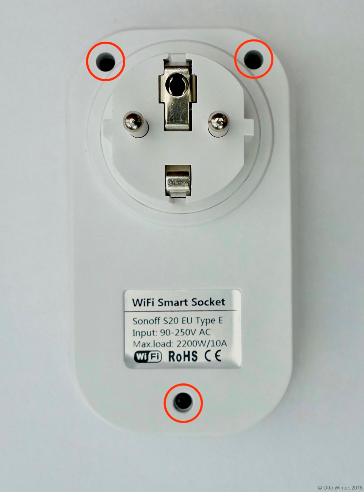
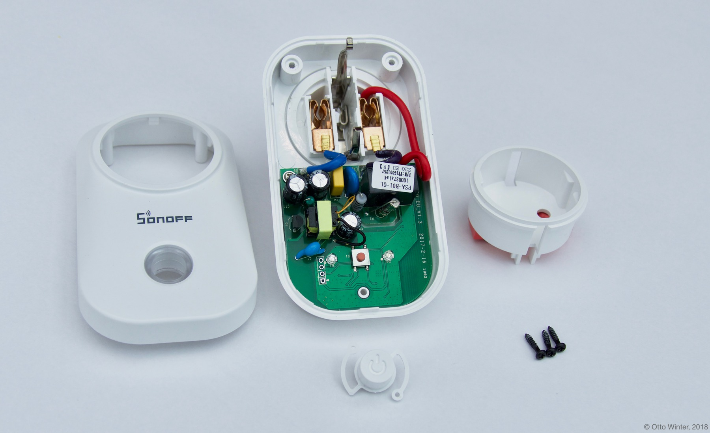
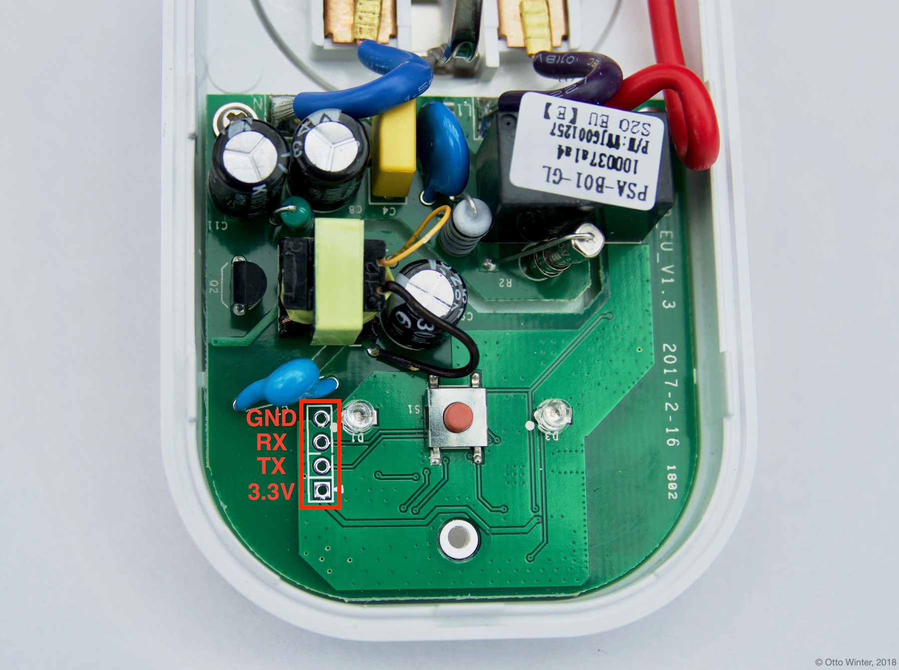
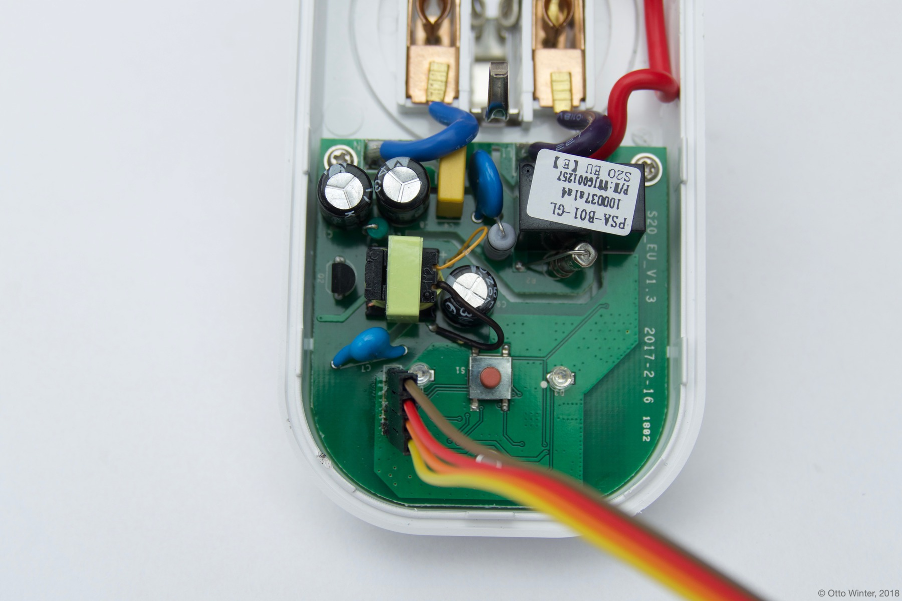
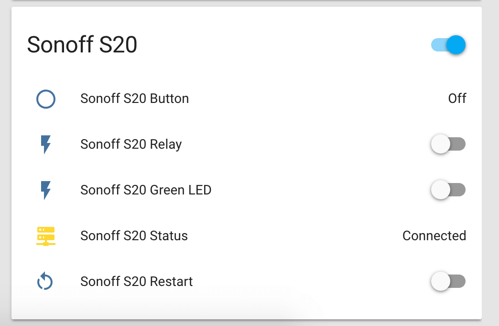

Using With Sonoff S20
=====================

.. seo::
    :description: Instructions for putting Sonoff S20 devices into flash mode and installing ESPHome on them.
    :image: sonoff_s20.jpg

ESPHome can also be used with Sonoff S20 smart sockets. These devices are
basically just an ESP8266 chip with a relay to control the socket, a small button on the
front and a blue and green LED light.

    Sonoff S20 Smart Socket.

This guide will step you through setting up your Sonoff S20 and flashing the first ESPHome firmware
with the serial interface. After that, you will be able to upload all future firmware with the remote
Over-The-Air update process.

.. note::

    If you've previously installed Sonoff-Tasmota on your Sonoff S20, you're in luck 😀.
    ESPHome can generate a firmware binary which you can then upload via the
    Tasmota web interface. To see how to create this binary, skip to :ref:`sonoff_s20-creating-firmware`.

Since firmware version 1.6.0, iTead (the creator of this device) has removed the ability to upload
a custom firmware through their own upload process. Unfortunately, that means that the only way to
flash the initial ESPHome firmware is by physically opening the device up and using the UART
interface.

.. warning::

    Opening up this device can be very dangerous if not done correctly. While the device is open,
    you will be a single touch away from being electrocuted if the device is plugged in.

    So, during this *entire* guide **never ever** plug the device in. Also, you should only do this
    if you know what you're doing. If you, at any step, feel something is wrong or are uncomfortable
    with continuing, it's best to just stop for your own safety.

    It's your own responsibility to make sure everything you do during this setup process is safe.

For this guide you will need:

-  Sonoff S20 😉.
-  A USB to UART Bridge for flashing the device. These can be bought on Amazon (or other online stores) for less than 5 dollars.
   Note that the bridge *must* be 3.3V compatible. Otherwise you will destroy your S20.
-  A computer running Home Assistant with the ESPHome Home Assistant add-on.
-  A screwdriver to open up the S20.
-  A soldering iron and a few header pins to connect the UART interface.

Have everything? Great! Then you can start.

Step 1: Opening up the Sonoff S20
---------------------------------

The first step is to open up the Sonoff S20. Note that you do not have to run the original firmware
supplied with the Sonoff S20 before doing this step.

.. warning::

    Just to repeat this: Make **absolutely sure** the device is not connected to any appliance or
    plugged in before doing this step.

While the device is not plugged in, turn the back side so it's facing you and unscrew the three
black screws that hold the case together.

    There are three screws on the back of the Sonoff S20.

After that, you should be able to remove the front cover and should be greeted by a bunch of parts.

Step 2: Connecting UART
-----------------------

We're interested in the main part of the S20 with the green PCB. On the bottom of the PCB, you will
find four unpopulated holes. These pins expose the UART interface used to flash firmware onto the device
and debug issues.

    The UART interface of the Sonoff S20.

So, in order to flash our own custom firmware, we're going to need to somehow connect the UART to USB
bridge to these pins. The only way to make a good connection here is by using a soldering iron and soldering
on some pin headers. On older models of the Sonoff S20, you were able to get the whole PCB out. Newer versions,
however, glue the PCB onto the case to avoid people flashing custom firmware. If the latter is the case,
you will just need to solder the pin headers from above - it's a bit difficult, but possible.

When you're done, it should look something like this:

Now go ahead and connect the pins to your UART bridge, making sure the S20 is not plugged in as before.
Also beware that some UART to USB bridges supply 5V on the VCC pin if it's not explicitly labelled 3.3V.
It's best to just use a multimeter and double check if it's unclear.

.. note::

    On some older S20s, the ``RX`` and ``TX`` pins are swapped (sometimes even the written silkscreen is
    wrong). If your upload fails with an ``error: espcomm_upload_mem failed`` message it's most likely due
    to the pins being swapped. In that case, just swap ``RX`` and ``TX`` and try again - you won't break
    anything if they're swapped.

.. _sonoff_s20-creating-firmware:

Step 3: Creating Firmware
-------------------------

The Sonoff S20 is based on the ``ESP8266`` platform and is a subtype of the ``esp01_1m`` board.
With this information, you can step through the ESPHome wizard (``esphome sonoff_s20.yaml wizard``),
or alternatively, you can just take the below configuration file and modify it to your needs.

.. code-block:: yaml

    esphome:
      name: <NAME_OF_NODE>

    esp8266:
      board: esp8285

    wifi:
      ssid: !secret wifi_ssid
      password: !secret wifi_password

    api:

    logger:

    ota:

Now run ``esphome sonoff_s20.yaml compile`` to validate the configuration and
pre-compile the firmware.

.. note::

    After this step, you will be able to find the compiled binary under
    ``.esphome/builds/<NAME_OF_NODE>/.pioenvs/<NAME_OF_NODE>/firmware.bin``. If you're having trouble with
    uploading, you can also try uploading this file directly with other tools.

Step 4: Uploading Firmware
--------------------------

In order to upload the firmware, you're first going to need to get the chip into a flash mode, otherwise
the device will start up without accepting any firmware flash attempts. To do this, while the UART
bridge is not connected to your USB port, press and hold the small push button in the middle of the PCB.
Then plug the UART bridge into your computer and keep holding the button for 2-4 seconds.
The S20 should now be in a flash mode and should not blink any LED.

Now you can finally run the upload command:

.. code-block:: bash

    esphome sonoff_s20.yaml run

If successful, you should see something like this:

.. figure:: images/sonoff_s20_upload.png
    :align: center

Hooray 🎉! You've now successfully uploaded the first ESPHome firmware to your Sonoff S20. And, in a moment,
you will be able to use all of ESPHome's great features with your Sonoff S20.

If above step don't work, however, here are some steps that can help:

-  Sometimes the UART bridge cannot supply enough current to the chip to operate. In this
   case use a 3.3V supply you have lying around. A nice hack is to use the power supply of
   NodeMCU boards. Simply connect 3.3V to VCC and GND to GND on the pins. **Do not attempt
   to plug the device into a socket to overcome this problem while troubleshooting.**
-  In other cases the ``TX`` and ``RX`` pin are reversed. Simple disconnect the device, swap
   the two pins and put it into flash mode again.

Step 5: Adding the Button, Relay and LEDs
-----------------------------------------

Now we would like the S20 to actually do something, not just connect to WiFi and pretty much sit idle.

Below you will find a table of all usable GPIO pins of the S20 and a configuration file that exposes all
of the basic functions.

======================================== ========================================
``GPIO0``                                Push Button (HIGH = off, LOW = on)
---------------------------------------- ----------------------------------------
``GPIO12``                               Relay and its status LED
---------------------------------------- ----------------------------------------
``GPIO13``                               Green LED (HIGH = off, LOW = on)
---------------------------------------- ----------------------------------------
``GPIO1``                                ``RX`` pin (for external sensors)
---------------------------------------- ----------------------------------------
``GPIO3``                                ``TX`` pin (for external sensors)
---------------------------------------- ----------------------------------------
``GPIO2``                                ``E-LOG`` pin (From PCB V2.1; for external sensors)
======================================== ========================================

.. code-block:: yaml

    esphome:
      name: <NAME_OF_NODE>

    esp8266:
      board: esp01_1m

    wifi:
      ssid: !secret wifi_ssid
      password: !secret wifi_password

    api:

    logger:

    ota:

    binary_sensor:
      - platform: gpio
        pin:
          number: GPIO0
          mode:
            input: true
            pullup: true
          inverted: true
        name: "Sonoff S20 Button"
      - platform: status
        name: "Sonoff S20 Status"
      - platform: gpio
        pin: GPIO2
        name: "Sonoff S20 Sensor"

    switch:
      - platform: gpio
        name: "Sonoff S20 Relay"
        pin: GPIO12

    output:
      # Register the green LED as a dimmable output ....
      - platform: esp8266_pwm
        id: s20_green_led
        pin:
          number: GPIO13
          inverted: true

    light:
      # ... and then make a light out of it.
      - platform: monochromatic
        name: "Sonoff S20 Green LED"
        output: s20_green_led

The above example also showcases an important concept of ESPHome: IDs and linking. In order
to make all components in ESPHome as "plug and play" as possible, you can use IDs to define
them in one area, and simply pass that ID later on. For example, above you can see a PWM (dimmer)
output being created with the ID ``s20_green_led`` for the green LED. Later on it is then transformed
into a :doc:`monochromatic light </components/light/monochromatic>`.

And if you want the thing that's connected through the output of the S20 to appear as a light
in Home Assistant, replace the last part with this:

.. code-block:: yaml

    switch:
      - platform: restart
        name: "Sonoff S20 Restart"

    output:
      - platform: esp8266_pwm
        id: s20_green_led
        pin:
          number: GPIO13
          inverted: true
      # Note: do *not* make the relay a dimmable (PWM) signal, relays cannot handle that
      - platform: gpio
        id: s20_relay
        pin: GPIO12

    light:
      - platform: monochromatic
        name: "Sonoff S20 Green LED"
        output: s20_green_led
      - platform: binary
        name: "Sonoff S20 Relay"
        output: s20_relay

To make pressing the button on the front toggle the relay, have a look at the `the complete Sonoff S20
with automation example <https://github.com/OttoWinter/esphomedocs/blob/current/devices/sonoff_s20.yaml>`__.

Step 6: Finishing Up
--------------------

Now you're pretty much done with setting up the Sonoff S20. The only steps left are to
remove any cables that you added within the housing and make sure everything in there is clean. If, for
example, you used wires to connect the UART console, you should definitely remove them to avoid
a short with mains.

Sometimes the soldered-on header pins can also interfere with the button. It's best to remove the
header pins again, as you will hopefully not need to use them again because of ESPHome's Over-The-Air
Update features (+ the OTA safe mode; if your node reboots more than 10 times in a row, it will automatically
enter an OTA-only safe mode).

If you're sure everything is done with the S20 and have double checked there's nothing that could cause a short
in the case, you can put the front cover with the button on the base again and screw everything together.

Now triple- or even quadruple-check the UART bridge is not connected to the S20, then comes the time when you can
plug it into the socket.

Happy hacking!

See Also
--------

- :doc:`sonoff`
- :doc:`sonoff_4ch`
- :ghedit:`Edit`
